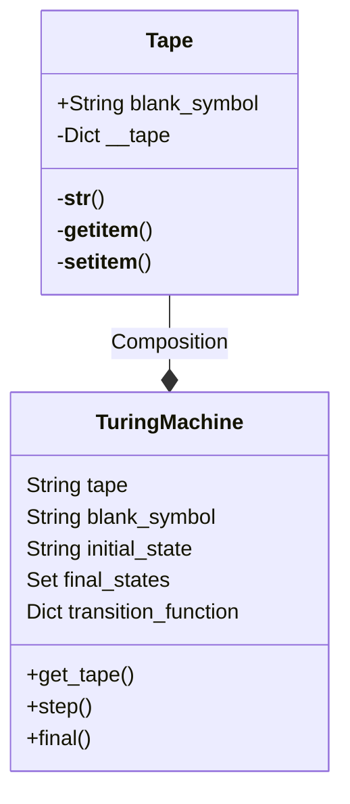
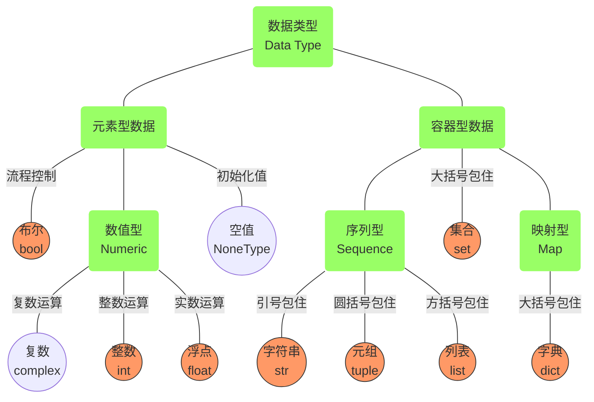

# 20241126-Week12 OOP, dp and searching

Updated 2214 GMT+8 Nov 26, 2024

2024 fall, Complied by Hongfei Yan


## 1 面向对象编程

前文说过，Python是一门面向对象的编程语言。到目前为止，我们已经使用了一些內建的类来展示数据和控制结构的例子。面向对象编程语言最强大的一项特性是允许程序员（问题求解者）创建全新的类来对求解问题所需的数据进行建模。

### Fraction类

要展示如何实现用户定义的类，一个常用的例子是构建实现抽象数据类型Fraction的类。我们已经看到，Python提供了很多数值类。但是在有些时候，需要创建“看上去很像”分数的数据对象。

像 $\frac {3}{5}$​ 这样的分数由两部分组成。上面的值称作分子，可以是任意整数。下面的值称作分母，可以是任意大于0的整数（负的分数带有负的分子）。尽管可以用浮点数来近似表示分数，但我们在此希望能精确表示分数的值。

Fraction对象的表现应与其他数值类型一样。我们可以针对分数进行加、减、乘、除等运算，也能够使用标准的斜线形式来显示分数，比如3/5。此外，所有的分数方法都应该返回结果的最简形式。这样一来，不论进行何种运算，最后的结果都是最简分数。

在Python中定义新类的做法是，提供一个类名以及一整套与函数定义语法类似的方法定义。以下是一个方法定义框架。

> 在 Python 中，新创建的类默认继承自 `object` 类。`object` 是所有类的基类，也称为顶级基类或根类。这意味着在 Python 中，如果没有显式指定一个类的基类，它将自动成为 `object` 类的子类。
>
> 在类中定义的方法（包括 `__str__` 方法）的第一个参数应该是 self，它表示对当前对象的引用。这样，Python 在调用方法时会自动将该对象作为第一个参数传递给方法。
>
> 当我们在多个类中定义了 `__str__` 方法时，通过 self 参数，Python 可以确定应该执行哪个类的 `__str__` 方法。

```python
class Fraction

		#the methods go here
```

所有类都应该首先提供构造方法。构造方法定义了数据对象的创建方式。要创建一个Fraction对象，需要提供分子和分母两部分数据。在Python中，构造方法总是命名为`__init__`（即在init的前后分别有两个下划线），如代码清单1-2所示。

代码清单1-2 Fraction类及其构造方法

```python
def __init__(self, top, bottom):
    
    self.num = top
    self.den = bottom
```


注意，形式参数列表包含3项。self是一个总是指向对象本身的特殊参数，它必须是第一个形式参数。然而，在调用方法时，从来不需要提供相应的实际参数。如前所述，分数需要分子与分母两部分状态数据。构造方法中的self.num定义了Fraction对象有一个叫作num的内部数据对象作为其状态的一部分。同理，self.den定义了分母。这两个实际参数的值在初始时赋给了状态，使得新创建的Fraction对象能够知道其初始值。

要创建Fraction类的实例，必须调用构造方法。使用类名并且传入状态的实际值就能完成调用（注意，不要直接调用`__init__`）。


```python
myfraction = Fraction(3,5)
```

以上代码创建了一个对象，名为myfraction，值为3/5。图1-5展示了这个对象。


图1-5 Fraction类的一个实例


接下来实现这一抽象数据类型所需要的行为。考虑一下，如果试图打印Fraction对象，会发生什么呢？

```python
>>> myf = Fraction(3,5)
>>> print(myf)
<__main__.Fraction instance at 0x409b1acc>
```


Fraction对象myf并不知道如何响应打印请求。print函数要求对象将自己转换成一个可以被写到输出端的字符串。myf唯一能做的就是显示存储在变量中的实际引用（地址本身）。这不是我们想要的结果。

有两种办法可以解决这个问题。一种是定义一个show方法，使得Fraction对象能够将自己作为字符串来打印。代码清单1-3展示了该方法的实现细节。如果像之前那样创建一个Fraction对象，可以要求它显示自己（或者说，用合适的格式将自己打印出来）。不幸的是，这种方法并不通用。为了能正确打印，我们需要告诉Fraction类如何将自己转换成字符串。要完成任务，这是print函数所必需的。

代码清单1-3 show方法

```python
def show(self):
     print(self.num,"/",self.den)
    
>>> myf = Fraction(3,5)
>>> myf.show()
3 / 5
>>> print(myf)
<__main__.Fraction instance at 0x40bce9ac>
>>>
```


Python的所有类都提供了一套标准方法，但是可能没有正常工作。其中之一就是将对象转换成字符串的方法`__str__`。这个方法的默认实现是像我们之前所见的那样返回实例的地址字符串。我们需要做的是为这个方法提供一个“更好”的实现，即重写默认实现，或者说重新定义该方法的行为。

为了达到这一目标，仅需定义一个名为`__str__`的方法，并且提供新的实现，如代码清单1-4所示。除了特殊参数self之外，该方法定义不需要其他信息。新的方法通过将两部分内部状态数据转换成字符串并在它们之间插入字符/来将分数对象转换成字符串。一旦要求Fraction对象转换成字符串，就会返回结果。注意该方法的各种用法。

代码清单1-4 `__str__`方法

```python
def __str__(self):
    return str(self.num)+"/"+str(self.den)
>>> myf = Fraction(3,5)
>>> print(myf)
3/5
>>> print("I ate", myf, "of the pizza")
I ate 3/5 of the pizza
>>> myf.__str__()
'3/5'
>>> str(myf)
'3/5'
>>>
```


可以重写Fraction类中的很多其他方法，其中最重要的一些是基本的数学运算。我们想创建两个Fraction对象，然后将它们相加。目前，如果试图将两个分数相加，会得到下面的结果。

```python
>>> f1 = Fraction(1,4)
>>> f2 = Fraction(1,2)
f1+f2

Traceback (most recent call last):
  File "<pyshell#173>", line 1, in -toplevel-
    f1+f2
TypeError: unsupported operand type(s) for +:
          'instance' and 'instance'
>>>
```


如果仔细研究这个错误，会发现加号+无法处理Fraction的操作数。
可以通过重写Fraction类的`__add__`方法来修正这个错误。该方法需要两个参数。第一个仍然是self，第二个代表了表达式中的另一个操作数。

```python
f1.__add__(f2)
```

以上代码会要求Fraction对象f1将Fraction对象f2加到自己的值上。可以将其写成标准表达式：f1 + f2。
两个分数需要有相同的分母才能相加。确保分母相同最简单的方法是使用两个分母的乘积作为分母。


$\frac {a}{b} + \frac {c}{d} = \frac {ad}{bd} + \frac {cb}{bd} = \frac{ad+cb}{bd}$


代码清单1-5展示了具体实现。`__add__`方法返回一个包含分子和分母的新Fraction对象。可以利用这一方法来编写标准的分数数学表达式，将加法结果赋给变量，并且打印结果。值得注意的是，第3行中的\称作续行符。当一条Python语句被分成多行时，需要用到续行符。

代码清单1-5 `__add__`方法

```python
def __add__(self,otherfraction):

     newnum = self.num*otherfraction.den + \
    						self.den*otherfraction.num
     newden = self.den * otherfraction.den

     return Fraction(newnum,newden)
>>> f1=Fraction(1,4)
>>> f2=Fraction(1,2)
>>> f3=f1+f2
>>> print(f3)
6/8
>>>
```

虽然这一方法能够与我们预想的一样执行加法运算，但是还有一处可以改进。1/4+1/2的确等于6/8，但它并不是最简分数。最好的表达应该是3/4。为了保证结果总是最简分数，需要一个知道如何化简分数的辅助方法。该方法需要寻找分子和分母的最大公因数（greatest common divisor, GCD），然后将分子和分母分别除以最大公因数，最后的结果就是最简分数。

要寻找最大公因数，最著名的方法就是欧几里得算法，第8章将详细讨论。欧几里得算法指出，对于整数m和n，如果m能被n整除，那么它们的最大公因数就是n。然而，如果m不能被n整除，那么结果是n与m除以n的余数的最大公因数。代码清单1-6提供了一个迭代实现。注意，这种实现只有在分母为正的时候才有效。对于Fraction类，这是可以接受的，因为之前已经定义过，负的分数带有负的分子，其分母为正。

代码清单1-6 gcd函数

```python
def gcd(m,n):
    while m%n != 0:
        oldm = m
        oldn = n

        m = oldn
        n = oldm%oldn
    return n

print(gcd(20,10))
```

> import math
>
> print(math.gcd(16,12))

现在可以利用这个函数来化简分数。为了将一个分数转化成最简形式，需要将分子和分母都除以它们的最大公因数。对于分数6/8，最大公因数是2。因此，将分子和分母都除以2，便得到3/4。代码清单1-7展示了实现细节。

代码清单1-7 改良版`__add__`方法

```python
def __add__(self,otherfraction):
    newnum = self.num*otherfraction.den + self.den*otherfraction.num
    newden = self.den * otherfraction.den
    common = gcd(newnum,newden)
    return Fraction(newnum//common,newden//common)
  
>>> f1=Fraction(1,4)
>>> f2=Fraction(1,2)
>>> f3=f1+f2
>>> print(f3)
3/4
>>>
```

Fraction对象现在有两个非常有用的方法，如图1-6所示。为了允许两个分数互相比较，还需要添加一些方法。假设有两个Fraction对象，f1和f2。只有在它们是同一个对象的引用时，f1 == f2才为True。这被称为浅相等，如图1-7所示。在当前实现中，分子和分母相同的两个不同的对象是不相等的。


图1-6 包含两个方法的Fraction实例


图1-7 浅相等与深相等

通过重写`__eq__`方法，可以建立深相等——根据值来判断相等，而不是根据引用。`__eq__`是又一个在任意类中都有的标准方法。它比较两个对象，并且在它们的值相等时返回True，否则返回False。
在Fraction类中，可以通过统一两个分数的分母并比较分子来实现`__eq__`方法，如代码清单1-8所示。需要注意的是，其他的关系运算符也可以被重写。例如，`__le__`方法提供判断小于等于的功能。

代码清单1-8 `__eq__`方法

```python
def __eq__(self, other):
    firstnum = self.num * other.den
    secondnum = other.num * self.den

    return firstnum == secondnum
```

代码清单1-9提供了到目前为止Fraction类的完整实现。剩余的算术方法及关系方法留作练习。

代码清单1-9 Fraction类的完整实现

```python
def gcd(m,n):
    while m%n != 0:
        oldm = m
        oldn = n

        m = oldn
        n = oldm%oldn
    return n

class Fraction:
     def __init__(self,top,bottom):
         self.num = top
         self.den = bottom

     def __str__(self):
         return str(self.num)+"/"+str(self.den)

     def show(self):
         print(self.num,"/",self.den)

     def __add__(self,otherfraction):
         newnum = self.num*otherfraction.den + \
                      self.den*otherfraction.num
         newden = self.den * otherfraction.den
         common = gcd(newnum,newden)
         return Fraction(newnum//common,newden//common)

     def __eq__(self, other):
         firstnum = self.num * other.den
         secondnum = other.num * self.den

         return firstnum == secondnum

x = Fraction(1,2)
y = Fraction(2,3)
print(x+y)
print(x == y)
```


### 示例LeetCode3079.求出加密整数的和

https://leetcode.cn/problems/find-the-sum-of-encrypted-integers/

给你一个整数数组 `nums` ，数组中的元素都是 **正** 整数。定义一个加密函数 `encrypt` ，`encrypt(x)` 将一个整数 `x` 中 **每一个** 数位都用 `x` 中的 **最大** 数位替换。比方说 `encrypt(523) = 555` 且 `encrypt(213) = 333` 。

请你返回数组中所有元素加密后的 **和** 。

**示例 1：**

**输入：**nums = [1,2,3]

**输出：**6

**解释：**加密后的元素位 `[1,2,3]` 。加密元素的和为 `1 + 2 + 3 == 6` 。

**示例 2：**

**输入：**nums = [10,21,31]

**输出：**66

**解释：**加密后的元素为 `[11,22,33]` 。加密元素的和为 `11 + 22 + 33 == 66` 。

 

**提示：**

- `1 <= nums.length <= 50`
- `1 <= nums[i] <= 1000`


```python
from typing import List
class Solution:
    def sumOfEncryptedInt(self, nums: List[int]) -> int:
        sumv = 0
        for i in nums:
            a = list(str(i))
            a_len = len(str(i))
            max_i = max([int(i) for i in a])
            max_i = str(max_i)* a_len
            sumv += int(max_i)

        return sumv

if __name__ == "__main__":
    sol = Solution()
    print(sol.sumOfEncryptedInt([123, 456, 789])) 
```


### 示例LeetCode62.不同路径

dp, math, https://leetcode.cn/problems/unique-paths/

一个机器人位于一个 `m x n` 网格的左上角 （起始点在下图中标记为 “Start” ）。

机器人每次只能向下或者向右移动一步。机器人试图达到网格的右下角（在下图中标记为 “Finish” ）。

问总共有多少条不同的路径？

 

**示例 1：**


```
输入：m = 3, n = 7
输出：28
```

**示例 2：**

```
输入：m = 3, n = 2
输出：3
解释：
从左上角开始，总共有 3 条路径可以到达右下角。
1. 向右 -> 向下 -> 向下
2. 向下 -> 向下 -> 向右
3. 向下 -> 向右 -> 向下
```

**示例 3：**

```
输入：m = 7, n = 3
输出：28
```

**示例 4：**

```
输入：m = 3, n = 3
输出：6
```

 

**提示：**

- `1 <= m, n <= 100`
- 题目数据保证答案小于等于 `2 * 10^9`


dfs, dp都可以实现，但是dfs在`m=23,n=12`超时，dp数组初始化需要想明白。

将 cnt 作为类的属性来管理，或者将 cnt 作为参数传递给 dfs 函数。这里我们选择将 cnt 作为类的属性来管理，这样可以保持代码的清晰和简洁。 `self.cnt = 0` 不需要写在 `uniquePaths` 函数的内部，可以在类的初始化方法 `__init__` 中进行初始化。这样做可以确保每次创建新的 `Solution` 实例时，`cnt` 都会被重置为 0。

```python
# dfs 超时
class Solution:
    def __init__(self):
        self.cnt = 0

    def uniquePaths(self, m: int, n: int) -> int:
        dx = [0, 1]
        dy = [1, 0]
        visited = [[False] * n for _ in range(m)]

        def dfs(x, y):
            if x == m - 1 and y == n - 1:
                self.cnt += 1
                return
            visited[x][y] = True
            for i in range(2):
                nx = x + dx[i]
                ny = y + dy[i]
                if 0 <= nx < m and 0 <= ny < n and not visited[nx][ny]:
                    dfs(nx, ny)
            visited[x][y] = False

        dfs(0, 0)
        return self.cnt

# 示例用法
if __name__ == "__main__":
    sol = Solution()
    m = 3
    n = 7
    print(sol.uniquePaths(m, n))  
```


因为纯dfs超时，考虑使用lru_cache。

> 使用 `lru_cache` 时需要注意一些细节，特别是当涉及到类方法和状态共享时。在上面的代码中，`lru_cache` 缓存的是 `dfs` 函数的结果，但是 `dfs` 函数内部修改了类的状态（即 `self.cnt`），这会导致缓存的行为不符合预期。
>
> 具体来说，`lru_cache` 会缓存 `dfs` 函数的返回值，而不是函数执行过程中的副作用（如修改 `self.cnt`）。因此，当 `dfs` 函数被多次调用时，`self.cnt` 的值可能不会按预期增加。
>
> 为了解决这个问题，可以考虑以下方法：使用 `lru_cache` 但不依赖类状态
>
> 通过将 `cnt` 作为返回值传递，避免了类状态的影响，同时利用 `lru_cache` 提高了性能。

```python
from functools import lru_cache

class Solution:
    def uniquePaths(self, m: int, n: int) -> int:
        dx = [0, 1]
        dy = [1, 0]

        @lru_cache(maxsize=None)
        def dfs(x, y):
            if x == m - 1 and y == n - 1:
                return 1
            cnt = 0
            for i in range(2):
                nx = x + dx[i]
                ny = y + dy[i]
                if 0 <= nx < m and 0 <= ny < n:
                    cnt += dfs(nx, ny)
            return cnt

        return dfs(0, 0)

# 示例用法
if __name__ == "__main__":
    sol = Solution()
    m = 3
    n = 7
    print(sol.uniquePaths(m, n))
```


### 1.4 图灵机

​	艾伦·麦席森·图灵（Alan Mathison Turing，又译阿兰·图灵，1912 年 6 月 23 日－1954 年 6 月 7 日）。阿兰·图灵在 1937 年首次提出一个通用计算设备的设想。设想所有的计算都可能在一种特殊的机器上执行，这就图灵机（Turning Machine）。他将模型建立在人们进行计算过程的行为上，并将这些行为抽象到用于计算的机器的模型中。图灵机由两部分构成，如图1-13所示。

- 一条存储带（tape）：双向无限延长，上有一个个方格（field），每个方格可以包含一个有限字母的字符。在一个真正的机器中，磁带必须足够大，以包含算法的所有数据。

- 一个控制器：包含一个可以双向移动的读写头（head），可以在所处方格中读写一个字符；图灵机每时每刻都处于某种状态（current state），是有限数量的状态中的一种；可以接受设定好的图灵程序 （program），该程序是一个转换列表，它决定了一个给定的 State 和 head 下字符的新状态，一个必须写入 head 下方格的字符和  head 的运动方向，即左、右或静止不动。

> 看见 状态，想起dp
>
> 对于一个子串而言，如果它是回文串（Palindrome string），并且长度大于 2，那么将它首尾的两个字母去除之后，它仍然是个回文串。
>
> 状态：`dp[i][j]`表示子串`s[i:j+1]`是否为回文子串
>
> 状态转移方程：`dp[i][j] = dp[i+1][j-1] ∧ (S[i] == s[j])`
>
> 动态规划中的边界条件，即子串的长度为 1 或 2。对于长度为 1 的子串，它显然是个回文串；对于长度为 2 的子串，只要它的两个字母相同，它就是一个回文串。


<center>图1-13 由一条存储带和一个控制器构成的图灵机（注：图片来源为 baike.sogou.com，2023年1月)</center>


​	aturingmachine.com 上面展示了 Mike Davey 建造一台机器，如图1-14所示，体现图灵论文中提出的机器的经典外观和感觉。这台图灵机是由微控制器控制的，但它在运行时的操作只基于从 SD 卡加载的一组状态转换，以及从磁带上写入和读取的内容。虽然看起来磁带只是机器的输入和输出，但事实并非如此！磁带也不仅仅是机器的存储器。在某种程度上，磁带就是计算机。当磁带上的符号被简单的规则所操纵时，计算就发生了。图灵机的核心是读写头，传送磁带，并将磁带上的单元格适当地定位。它可以读取一个单元，确定那里写了什么，如果有的话，是什么符号。这台机器一次只工作在一个单元上，并且知道一个单元的情况。机器中的磁带是一卷1000英尺长的白色35毫米胶片带。字符1和0，是由机器用黑色笔写的。


<center>图1-14  体现图灵机模型的机器（注：图片来源为aturingmachine.com，2022年5月）</center>


​	附录1A 是软件实现图灵机，https://github.com/GMyhf/2019fall-cs101/tree/master/TuringMachine 。参考：https://www.python-course.eu/turing_machine.php ，增加了加法操作，实现下面14分钟视频中的加法。软件实现是用 Python 语言面向对象的编程（Object Orientation Programming，OOP）方式实现的。Python的 OOP 语法，可以参考 https://www.runoob.com/python3/python3-class.html 。

​	图灵机的构成，6分钟视频讲解在 https://www.bilibili.com/video/BV12B4y1X7QV/?spm_id_from=333.788

​	图灵机运作原理及示例，14分钟视频讲解在 https://www.bilibili.com/video/BV13v4y1w7yM/?spm_id_from=333.788


### 1.5 Python 的命名规范

Python 的命名规范主要遵循 PEP 8 -- Style Guide for Python Code，这是 Python 社区广泛接受的编码风格指南。以下是一些常见的命名约定：

1. **变量名**:
   - 使用小写字母，多个单词之间用下划线分隔（snake_case），例如 `my_variable`。
   - 避免使用单个字符作为变量名，除非是在非常简短的作用域内，比如循环索引 `i` 或 `j`。

2. **函数名**:
   - 同样使用小写字母和下划线（snake_case），例如 `def my_function()`。

3. **类名**:
   - 使用驼峰式大小写（CamelCase），即每个单词首字母大写，没有下划线，例如 `MyClass`。

4. **常量**:
   - 使用全大写字母，单词之间用下划线分隔，例如 `MAX_CONNECTIONS`。

5. **模块名**:
   - 模块文件名应简洁明了，全部使用小写字母，可以包含下划线，例如 `my_module.py`。

6. **包名**:
   - 包名也应全部使用小写字母，尽量简短，不需要下划线，例如 `mypackage`。

7. **私有成员**:
   - 类的私有属性和方法前加单个下划线 `_`，表示这是一个内部使用的成员，例如 `_private_method`。
   - 如果确实需要避免子类覆盖某个属性或方法，可以使用双下划线 `__` 进行名称重整，例如 `__really_private_method`。

8. **特殊方法/属性**:
   - 特殊方法或属性使用双下划线包围的方法名，如 `__init__` 和 `__str__`。

9. **类型提示**:
   - 当使用类型提示时，类型名应首字母大写，例如 `List`, `Dict`。

10. **行长度**:
    - 每行不超过 79 个字符，对于注释和文档字符串，建议每行不超过 72 个字符。

11. **空格**:
    - 在操作符两边和逗号后面加空格，但在括号内的参数列表中不加。
    - 函数调用时，实参之间用逗号分隔并各带一个空格。

12. **导入语句**:
    - 导入语句应该总是放在文件的顶部，在模块注释和文档字符串之后，模块全局变量之前。
    - 每个导入应该单独一行。
    - 导入可以按标准库、第三方库、本地应用/库的顺序分组，每个组之间空一行。

遵守这些命名约定可以使你的代码更清晰、更易于维护，并且与其他 Python 开发者的工作保持一致。


### 附录1A 软件实现图灵机

​	如图附录1A-1所示，先给出两个类图（类图相当于是 OOP 编程实现前的蓝图设计），Tape 类 和 TuringMachine 类，然后给出 Python 实现代码，下载网址 https://github.com/GMyhf/2019fall-cs101/tree/master/TuringMachine ，参考了  https://www.python-course.eu/turing_machine.php。	

​	图灵机是一个数学模型，是一个简单的计算机模型，但它具有通用计算机的完整计算能力。

​	图灵机定义为 $M = （Q, \Sigma, \Gamma, \delta, b, q_0, q_f）$

​	\- $Q$ 表示控制器有限状态集 (the set of states)

​	- $\Sigma$ 表示输入的字母表 (the input alphabet)

​	\- $\Gamma$ 表示磁带上的字母表 (the tape alphabet)，$\Sigma \subseteq \Gamma$

​	\- $\delta: Q \times \Gamma \rightarrow Q \times \Gamma \times \{L, R, N\}$ 是状态转移函数 (the transition function)，即程序。L、R、N分别表示左移一格，右移一格或停机

​	\- $b$ 是空白字符 (the blank symbol)，$b \in \Gamma \backslash \Sigma$ 

​	\- $q_0$ 是开始状态，$q_0 \in Q$

​	\- $q_f$ 是接收或终止状态，$q_f \in Q$




图附录1A-1 图灵机类图


​	三个源码：turing_machine.py, binary_complement, TM_adding.py。前两个取自 https://www.python-course.eu/turing_machine.php，实现了二进制补0到1，1到0的代码。我们增加了第三个做加法的代码。

```python
# ref: https://www.python-course.eu/turing_machine.php
# turing_machine.py
class Tape:
    
    blank_symbol = " "
    
    def __init__(self, tape_string = ""):
        self.__tape = dict((enumerate(tape_string)))
        # last line is equivalent to the following three lines:
        #self.__tape = {}
        #for i in range(len(tape_string)):
        #    self.__tape[i] = input[i]
        
    def __str__(self):
        s = ""
        min_used_index = min(self.__tape.keys()) 
        max_used_index = max(self.__tape.keys())
        for i in range(min_used_index, max_used_index + 1):
            s += self.__tape[i]
        return s    
   
    def __getitem__(self,index):
        if index in self.__tape:
            return self.__tape[index]
        else:
            return Tape.blank_symbol

    def __setitem__(self, pos, char):
        self.__tape[pos] = char 

        
class TuringMachine:
    
    def __init__(self, 
                 tape = "", 
                 blank_symbol = " ",
                 initial_state = "",
                 final_states = None,
                 transition_function = None):
        self.__tape = Tape(tape)
        self.__head_position = 0
        self.__blank_symbol = blank_symbol
        self.__current_state = initial_state
        if transition_function == None:
            self.__transition_function = {}
        else:
            self.__transition_function = transition_function
        if final_states == None:
            self.__final_states = set()
        else:
            self.__final_states = set(final_states)
        
    def get_tape(self): 
        return str(self.__tape)
    
    def step(self):
        char_under_head = self.__tape[self.__head_position]
        x = (self.__current_state, char_under_head)
        if x in self.__transition_function:
            y = self.__transition_function[x]
            self.__tape[self.__head_position] = y[1]
            if y[2] == "R":
                self.__head_position += 1
            elif y[2] == "L":
                self.__head_position -= 1
            self.__current_state = y[0]

    def final(self):
        if self.__current_state in self.__final_states:
            return True
        else:
            return False
```


​	如果对上面类图的写法不熟悉，可以直接看下面两个 二进制补、加法的 程序，把TuringMachine理解为提供的图灵机工具。


> ## Example: Binary Complement function
>
> https://python-course.eu/applications-python/turing-machine.php
>
> Let's define a Turing machine, which complements a binary input on the tape, i.e. an input "1100111" e.g. will be turned into "0011000".
> Σ = {0, 1}
> Q = {init, final}
> $q_0$ = init
> $q_f$ = final
>
> | Function Definition       | Description                                                  |
> | ------------------------- | ------------------------------------------------------------ |
> | δ(init,0) = (init, 1, R)  | If the machine is in state "init" and a 0 is read by the head, a 1 will be written, the state will change to "init" (so actually, it will not change) and the head will be moved one field to the right. |
> | δ(init,1) = (init, 0, R)  | If the machine is in state "init" and a 1 is read by the head, a 0 will be written, the state will change to "init" (so actually, it will not change) and the head will be moved one field to the right. |
> | δ(init,b) = (final, b, N) | If a blank ("b"), defining the end of the input string, is read, the TM reaches the final state "final" and halts. |
>
>  


```python
# binary_complement.py
from turing_machine import TuringMachine

initial_state = "init",
accepting_states = ["final"],
transition_function = {("init","0"):("init", "1", "R"),
                       ("init","1"):("init", "0", "R"),
                       ("init"," "):("final"," ", "N"),
                       }
final_states = {"final"}

t = TuringMachine(tape = "010011001",
                  initial_state = "init",
                  final_states = final_states,
                  transition_function = transition_function)

print("Input on Tape:\n" + t.get_tape())

while not t.final():
    t.step()

print("Result of the Turing machine calculation:")
print(t.get_tape())
```

​	运行输出

```
Input on Tape:
010011001
Result of the Turing machine calculation:
101100110
```


​	我们实现了“图灵机运作原理及示例” 视频中讲到的加法， https://www.bilibili.com/video/BV13v4y1w7yM/?spm_id_from=333.788。注意该视频讲解，缺少终止状态，会死循环，所以程序中加了终止状态final_states。


```python
# TM_adding.py
#ref: https://www.python-course.eu/turing_machine.php

from turing_machine import TuringMachine

initial_state = "q1",
accepting_states = ["q3"],
transition_function = {("q1","1"):("q1", "1", "R"),
                       ("q1"," "):("q2", "1", "R"),
                       ("q2","1"):("q2", "1", "R"),
                       ("q2"," "):("q3", "b", "L"),
                       ("q3","1"):("q3", "b", "H"),
                       ("q3"," "):("q3", "b", "H")
                       }
final_states = {"q3"}

t = TuringMachine(tape = "1111 111 ", 
                  initial_state = "q1",
                  final_states = final_states,
                  transition_function = transition_function)

print("Input on Tape:\n" + t.get_tape())

while not t.final():
    t.step()
    #print(t.get_tape())

print("Result of the Turing machine calculation:")    
print(t.get_tape())
```

​	运行输出

```
Input on Tape:
1111 111
Result of the Turing machine calculation:
1111111b
```


## 2 动态规划

### 示例LuoguP1255 数楼梯

dp, bfs, https://www.luogu.com.cn/problem/P1255

楼梯有 $N$ 阶，上楼可以一步上一阶，也可以一步上二阶。

编一个程序，计算共有多少种不同的走法。

**输入**

一个数字，楼梯数。

**输出**

输出走的方式总数。


样例输入 #1

```
4
```

样例输出 #1

```
5
```

提示

- 对于 $60\%$ 的数据，$N \leq 50$；   
- 对于 $100\%$ 的数据，$1 \le N \leq 5000$。


Dp

```python
n = int(input())
dp = [0] * (n + 1)
dp[0] = 1
for i in range(1, n+1):
    if i >= 2:
        dp [i] = dp[i-1] + dp[i-2]
    else:
        dp[i] = 1

print(dp[n])
```


Bfs

```python
from collections import deque


def count_ways(n):
    if n == 0:
        return 0
    if n == 1:
        return 1
    if n == 2:
        return 2

    # 使用队列来存储当前可以到达的台阶
    queue = deque([0])
    # 记录已经访问过的台阶
    visited = set()
    # 记录到达每一个台阶的方法数量
    ways = [0] * (n + 1)
    ways[0] = 1  # 初始位置有1种方式到达

    while queue:
        current = queue.popleft()

        # 如果当前位置已经在访问集合中，跳过
        if current in visited:
            continue

        visited.add(current)

        # 对于每一步可以走1阶或者2阶
        for step in [1, 2]:
            next_pos = current + step
            if next_pos <= n:
                ways[next_pos] += ways[current]
                if next_pos not in visited:
                    queue.append(next_pos)

    return ways[n]


# 读取输入
n = int(input())
# 输出结果
print(count_ways(n))
```


#### 练习273528: 跳台阶

dp, http://cs101.openjudge.cn/practice/27528/

理科教学楼总共有N级台阶，狄贵同学每一步可以走的台阶数目可以是1、2、3、... 、N-1、N中的任意一个。 请问狄贵可以有多少种不同的走法走上这N级台阶。

输入

总共一行输入，输入台阶的阶数N。 其中，1 <= N <= 25。

输出

多少种不同的走法走上N级台阶。


#### 练习474D. Flowers

dp, *1700, https://codeforces.com/contest/474/problem/D

We saw the little game Marmot made for Mole's lunch. Now it's Marmot's dinner time and, as we all know, Marmot eats flowers. At every dinner he eats some red and white flowers. Therefore a dinner can be represented as a sequence of several flowers, some of them white and some of them red.

But, for a dinner to be tasty, there is a rule: Marmot wants to eat white flowers only in groups of size *k*.

Now Marmot wonders in how many ways he can eat between *a* and *b* flowers. As the number of ways could be very large, print it modulo $1000000007 (10^9 + 7)$.

**Input**

Input contains several test cases.

The first line contains two integers *t* and *k* ($1 ≤ t, k ≤ 10^5$), where *t* represents the number of test cases.

The next *t* lines contain two integers $a_i$ and $b_i$ ($1 ≤ a_i ≤ b_i ≤ 10^5$), describing the *i*-th test.

**Output**

Print *t* lines to the standard output. The *i*-th line should contain the number of ways in which Marmot can eat between $a_i$ and $b_i$ flowers at dinner modulo $1000000007 (10^9 + 7)$.

Examples

Input

```
3 2
1 3
2 3
4 4
```

Output

```
6
5
5
```

Note

- For *K* = 2 and length 1 Marmot can eat (*R*).
- For *K* = 2 and length 2 Marmot can eat (*RR*) and (*WW*).
- For *K* = 2 and length 3 Marmot can eat (*RRR*), (*RWW*) and (*WWR*).
- For *K* = 2 and length 4 Marmot can eat, for example, (*WWWW*) or (*RWWR*), but for example he can't eat (*WWWR*).


### 示例09267: 核电站

dfs, dp, http://cs101.openjudge.cn/practice/09267/

一个核电站有 N 个放核物质的坑，坑排列在一条直线上。如果连续 M 个坑中放入核物质，则会发生爆炸，于是，在某些坑中可能不放核物质。

任务：对于给定的 N 和 M ，求不发生爆炸的放置核物质的方案总数。

输入

只有一行，两个正整数 N，M (1 < N < 50, 2 <= M <= 5)。

输出

一个正整数 S，表示方案总数。

样例输入

```
4 3
```

样例输出

```
13
```


```python
from functools import lru_cache

@lru_cache(maxsize=None)
def dfs(i, j, n, m):
    if j == m:
        return 0  # 如果有连续的m个坑都有物质，此方案不可行
    if i == n:
        return 1  # 如果能到n，说明之前没有连续的m个坑都有物质，此方案可行
    
    # 不在第i个坑放置物质
    no_place = dfs(i + 1, 0, n, m)
    # 在第i个坑放置物质
    place = dfs(i + 1, j + 1, n, m)
    
    # 计算总数
    return no_place + place

if __name__ == "__main__":
    n, m = map(int, input().split())
    result = dfs(0, 0, n, m)
    print(result)
```


参考：https://blog.csdn.net/weixin_50624971/article/details/117337552

这题和放苹果挺类似的，都是要分情况讨论i和m的大小关系
case1：如果i<m
这说明在这段区间里怎么放都不会炸，那么状态转移方程就是：a[i]=2\*a[i-1].（乘2是因为每个坑有放和不放两种情况）
case2：如果i==m
情况同case1，只是要减去区间全放（会炸）的情况，那么状态转移方程就是：a[i]=2\*a[i-1]-1.
case3：如果i>m
这是就要考虑会炸的情况了。我们采用减法的方式——即从总情况里减去会炸的情况。
如果第i位是不能放的，那么说明i-m这段区间肯定全放了，而且i-m-1这一位一定是0，因为如果该位是1的话就会在之前被处理掉，所以如果i为不能放，那么i-m-1这段区间的所有可能都需要从答案里减掉。那么状态转移方程就是：a[i]=2*a[i-1]-a[i-1-m]

```python
# 23n1900014516
n, m = map(int, input().split())
DP = [0] * 60
DP[0] = 1 #DP[i]是第i个位置的方案数。

for i in range(1, n + 1):
    if i < m: #达不到连续放置m个的情况
        DP[i] = DP[i - 1] * 2  # 从第1个到第m-1个，方案都可以选择放/不放
    elif i == m: #第m个要小心了
        DP[i] = DP[i - 1] * 2 - 1
    else:#i>m
        DP[i] = DP[i - 1] * 2 - DP[i - m - 1]
print(DP[n])
```


### 示例431C. k-Tree

dp, implementation, trees, *1600

https://codeforces.com/problemset/problem/431/C

Quite recently a creative student Lesha had a lecture on trees. After the lecture Lesha was inspired and came up with the tree of his own which he called a *k*-tree.

A *k*-tree is an infinite rooted tree where:

- each vertex has exactly *k* children;
- each edge has some weight;
- if we look at the edges that goes from some vertex to its children (exactly *k* edges), then their weights will equal 1, 2, 3, ..., *k*.

The picture below shows a part of a 3-tree.


As soon as Dima, a good friend of Lesha, found out about the tree, he immediately wondered: "How many paths of total weight *n* (the sum of all weights of the edges in the path) are there, starting from the root of a *k*-tree and also containing at least one edge of weight at least *d*?".

Help Dima find an answer to his question. As the number of ways can be rather large, print it modulo 1000000007 (10^9^ + 7).

**Input**

A single line contains three space-separated integers: *n*, *k* and *d* (1 ≤ *n*, *k* ≤ 100; 1 ≤ *d* ≤ *k*).

**Output**

Print a single integer — the answer to the problem modulo 1000000007 (10^9^ + 7).

Examples

input

```
3 3 2
```

output

```
3
```

input

```
3 3 3
```

output

```
1
```

input

```
4 3 2
```

output

```
6
```

input

```
4 5 2
```

output

```
7
```


分类讨论，记忆化搜索。

```python
MOD = 1000000007
from functools import lru_cache
 
@lru_cache(maxsize=None)
def dfs(n, b):
    if n == 0 and b >= d:
        return 1
    if n < 0:
        return 0
 
    ans = 0
    for i in range(1, k+1):
        ans = (ans + dfs(n-i, max(i, b))) % MOD
 
    return ans
 
 
n, k, d = map(int, input().split())
print(dfs(n, 0))
```


```python
# 23工学院 蒋子轩
n,k,d=map(int,input().split())
mod = 10**9 + 7
# A[i]：总权重为i的路径数 ； B[i]：总权重为i且所有边权重小于d的路径数
A = [1] + [0] * n
B = [1] + [0] * n
# 路径数本质上就是整数划分问题
# 本题即求用不大于k的正整数划分i，用小于d的正整数划分i的方法数之差
for i in range(1, n + 1):
    for j in range(1, min(i,k)+1):
        A[i] = (A[i] + A[i - j]) % mod
    for j in range(1, min(d, i + 1)):
        B[i] = (B[i] + B[i - j]) % mod
print((A[n] - B[n]) % mod)

```


```python
# 23数院，胡睿诚
# 这题其实有点核电站的味道感觉
# 09267: 核电站
# http://cs101.openjudge.cn/practice/09267/

m = 10**9+7

def compute(n, k):
    if k == 0:
        return 0
    ans = [1]
    for i in range(k):
        ans.append((1 << i) % m)

    for i in range(k+1, n+1):
        ans.append((2*ans[i-1]-ans[i-k-1]) % m)

    return ans[n]


n, k, d = map(int, input().split())
print((compute(n, min(n, k))-compute(n, d-1)) % m)
```


### 概念04067: 回文数字（Palindrome Number）

two pointers: http://cs101.openjudge.cn/2024sp_routine/04067/

给出一系列非负整数，判断是否是一个回文数。回文数指的是正着写和倒着写相等的数。

输入

若干行，每行是一个非负整数（不超过99999999）

输出

对每行输入，如果其是一个回文数，输出YES。否则输出NO。

样例输入

```
11
123
0
14277241
67945497
```

样例输出

```
YES
NO
YES
YES
NO
```


```python
def isPalindrome(s):
    if len(s) < 1:
        return False
    if len(s) == 1:
        return True

    front = 0
    back = len(s) - 1
    while front < back:
        if s[front] != s[back]:
            return False
        else:
            front += 1
            back -= 1

    return True

while True:
    try:
        s = input()
        print('YES' if isPalindrome(s) else 'NO')
    except:
        break
```


#### 练习LeetCode5.最长回文子串

dp, two pointers, string, https://leetcode.cn/problems/longest-palindromic-substring/

给你一个字符串 `s`，找到 `s` 中最长的 

回文子串。

**示例 1：**

```
输入：s = "babad"
输出："bab"
解释："aba" 同样是符合题意的答案。
```

**示例 2：**

```
输入：s = "cbbd"
输出："bb"
```

 

**提示：**

- `1 <= s.length <= 1000`
- `s` 仅由数字和英文字母组成


**Plan**

1. Initialize a 2D list `dp` where `dp[i][j]` will be `True` if the substring `s[i:j+1]` is a palindrome.
2. Iterate through the string in reverse order to fill the `dp` table.
3. For each character, check if the substring is a palindrome by comparing the characters at the ends and using the previously computed values in `dp`.
4. Keep track of the start and end indices of the longest palindromic substring found.
5. Return the substring defined by the start and end indices.

对于一个子串而言，如果它是回文串，并且长度大于 2，那么将它首尾的两个字母去除之后，它仍然是个回文串。

状态：`dp[i][j]`表示子串`s[i:j+1]`是否为回文子串

状态转移方程：`dp[i][j] = dp[i+1][j-1] ∧ (S[i] == s[j])`

动态规划中的边界条件，即子串的长度为 1 或 2。对于长度为 1 的子串，它显然是个回文串；对于长度为 2 的子串，只要它的两个字母相同，它就是一个回文串。

```python
class Solution:
    def longestPalindrome(self, s: str) -> str:
        n = len(s)
        if n == 0:
            return ""

        # Initialize the dp table
        dp = [[False] * n for _ in range(n)]
        start, max_length = 0, 1

        # Every single character is a palindrome
        for i in range(n):
            dp[i][i] = True

        # Check for palindromes of length 2
        for i in range(n - 1):
            if s[i] == s[i + 1]:
                dp[i][i + 1] = True
                start = i
                max_length = 2

        # Check for palindromes of length greater than 2
        for length in range(3, n + 1):
            for i in range(n - length + 1):
                j = i + length - 1
                if s[i] == s[j] and dp[i + 1][j - 1]:
                    dp[i][j] = True
                    start = i
                    max_length = length

        return s[start:start + max_length]

if __name__ == "__main__":
    sol = Solution()
    print(sol.longestPalindrome("babad"))  # Output: "bab" or "aba"
    print(sol.longestPalindrome("cbbd"))   # Output: "bb"
```


思想：中心扩散。将子串分为单核和双核的情况，单核即指子串长度为奇数，双核则为偶数。

**Plan**

1. Initialize variables to store the start and end indices of the longest palindromic substring.
2. Iterate through each character in the string, treating each character and each pair of consecutive characters as potential centers of palindromes.
3. For each center, expand outwards while the characters on both sides are equal.
4. Update the start and end indices if a longer palindrome is found.
5. Return the substring defined by the start and end indices.

```python
class Solution:
    def longestPalindrome(self, s: str) -> str:
        if not s:
            return ""
        
        start, end = 0, 0
        
        for i in range(len(s)):
            odd_len = self.expandAroundCenter(s, i, i)
            even_len = self.expandAroundCenter(s, i, i + 1)
            max_len = max(odd_len, even_len)
            if max_len > end - start:
                start = i - (max_len - 1) // 2
                end = i + max_len // 2
        
        return s[start:end + 1]
    
    def expandAroundCenter(self, s: str, left: int, right: int) -> int:
        while left >= 0 and right < len(s) and s[left] == s[right]:
            left -= 1
            right += 1
        return right - left - 1

if __name__ == "__main__":
    sol = Solution()
    print(sol.longestPalindrome("babad"))  # Output: "bab" or "aba"
    print(sol.longestPalindrome("cbbd"))   # Output: "bb"
```

这个双指针是从中间往两边跑。


#### 练习25815: 回文字符串

http://cs101.openjudge.cn/practice/25815/

给定一个字符串 S ，最少需要几次增删改操作可以把 S 变成一个回文字符串？

一次操作可以在任意位置插入一个字符，或者删除任意一个字符，或者把任意一个字符修改成任意其他字符。

输入

字符串 S。S 的长度不超过100, 只包含'A'-'Z'。

输出

最少的修改次数。

样例输入

```
ABAD
```

样例输出

```
1
```

来源

hihoCoder


这是一个经典的动态规划问题，可以使用动态规划来解决这个问题。定义一个二维数组 dp，其中 `dp[i][j]` 表示将字符串 S 的子串 S[i...j] 变成回文串所需要的最小操作次数。

使用状态转移方程来填充 dp 数组：

- 如果 S[i] == S[j]，那么 `dp[i][j] = dp[i+1][j-1]`，因为两端的字符已经相等，不需要进行任何操作。
- 如果 S[i] != S[j]，那么 `dp[i][j] = min(dp[i+1][j], dp[i][j-1], dp[i+1][j-1]) + 1`，可以选择删除 S[i] 或 S[j]，或者将 S[i] 或 S[j] 修改为另一个字符。

最后，`dp[0][n-1]` 就是答案，其中 n 是字符串 S 的长度。


### 练习01384: Piggy-Bank

http://cs101.openjudge.cn/practice/01384/


### 练习27401: 最佳凑单

dp, sparse bucket, http://cs101.openjudge.cn/practice/27401/


### 练习04102: 宠物小精灵之收服

dp, http://cs101.openjudge.cn/practice/04102/


## 3 dfs 注意事项

### 3.1 编译错误Compile Error


#### 示例18160: 最大连通域面积

matrix/dfs similar, http://cs101.openjudge.cn/practice/18160

一个棋盘上有棋子的地方用（'W'）表示，没有的地方用点来表示，现在要找出其中的最大连通区域，一个格子被视作和它周围八个格子都相邻。

现在需要 找出最大的连通区域的面积是多少，一个格子代表面积为1。

**输入**

输入的第一行是一个整数，表示一共有 T 组数据。
每组第一行包含两个整数N和M。
接下来的N行，每行有M个字符('W'或者'.')，表示格子的当前状态。字符之间没有空格。

**输出**

每组数据对应一行，输出最大的连通域的面积，不包含任何空格。

样例输入

```
2
2 2
W.
.W
10 12
W........WW.
.WWW.....WWW
....WW...WW.
.........WW.
.........W..
..W......W..
.W.W.....WW.
W.W.W.....W.
.W.W......W.
..W.......W.
```

样例输出

```
2
16
```

来源：cs101-2017 期末机考备选


核心思想是对每一个点找其连通域面积，再从中找出最大者。主要运用函数的自我调用达到深度优先搜索。

> OJ的pylint是静态检查，有时候报的编译错误Compile Error不对。解决方法有两种，如下：
> 1）第一行加# pylint: skip-file
> 2）方法二：如果函数内使用全局变量（变量类型是immutable，如int），则需要在程序最开始声明一下。如果是全局变量是list类型，则不受影响。

```python
# pylint: skip-file
dire = [[-1,-1],[-1,0],[-1,1],[0,-1],[0,1],[1,-1],[1,0],[1,1]]

def dfs(x,y):
    global area
    if matrix[x][y] == '.':return
    matrix[x][y] = '.'
    area += 1
    for i in range(len(dire)):
        dfs(x+dire[i][0], y+dire[i][1])


for _ in range(int(input())):
    n,m = map(int,input().split())

    matrix = [['.' for _ in range(m+2)] for _ in range(n+2)]
    for i in range(1,n+1):
        matrix[i][1:-1] = input()

    sur = 0
    for i in range(1, n+1):
        for j in range(1, m+1):
            if matrix[i][j] == 'W':
                area = 0 
                dfs(i, j)
                sur = max(sur, area)
    print(sur)
```


### 3.2 浅拷贝和深拷贝


#### 3.2.1 基本数据类型

​	在编程语言中，变量（variable）用于存储信息，以便被引用或操作。在 Python 中，每个变量都是一个对象（ object），基于变量的数据类型（data type，也称为 类 class），解释器会为变量分配内存。变量可以通过变量名访问， 变量命名规定，必须是大小写英文，数字和下划线的组合，并且不能用数字开头。

​	Python 的基本数据类型如表所示。如果一个类的每个对象在实例化时有一个固定的值（immutable），并且随后不能被改变，那么这个类就是不可变的。例如，float 类是不可变的。


表 Python语言基本数据类型

| Class     | Description                        | Immutable |
| --------- | ---------------------------------- | --------- |
| bool      | Boolean value                      | &check;   |
| int       | integer (arbitrary magnitude)      | &check;   |
| float     | floating-point number              | &check;   |
| list      | mutable sequence of objects        |           |
| tuple     | immutable sequence of objects      | &check;   |
| str       | character string                   | &check;   |
| set       | unordered set of distinct objects  |           |
| frozenset | immutable form of set class        | &check;   |
| dict      | Associate mapping (aka dictionary) |           |

​	把基本数据类型结构化表示出来，如图所示。



图 Python语言基本数据类型


可变属数据类型问题。在 Python 中，将一个可变对象（如列表）传递给函数时，为了提高效率，不会完整复制，而是传递了该对象的引用，这意味着在函数内部对这个对象的任何修改都会反映到原始对象上。一维列表的切片操作[:]，相当于创建一个新的列表副本。 shallow and deep copy在下面书的101-102页有讲到。


2013-book-DataStructuresAndAlgorithmsInPython.pdf


#### 示例sy316: 矩阵最大权值路径 中等

https://sunnywhy.com/sfbj/8/1/316

现有一个 n*m 大小的矩阵，矩阵中的每个元素表示该位置的权值。现需要从矩阵左上角出发到达右下角，每次移动只能向上下左右移动一格（不允许移动到曾经经过的位置）。假设左上角坐标是(1,1)，行数增加的方向为增长的方向，列数增加的方向为增长的方向。求最后到达右下角时路径上所有位置的权值之和最大的路径。

**输入**

第一行两个整数 $n、m \hspace{1em} (2 \le n \le5, 2 \le m \le 5)$，分别表示矩阵的行数和列数；

接下来 n 行，每行 m 个整数（$-100 \le 整数 \le 100$），表示矩阵每个位置的权值。

**输出**

从左上角的坐标开始，输出若干行（每行两个整数，表示一个坐标），直到右下角的坐标。

数据保证权值之和最大的路径存在且唯一。

样例1

输入

```
2 2
1 2
3 4
```

输出

```
1 1
2 1
2 2
```

解释

显然当路径是(1,1)=>(2,1)=>(2,2)时，权值之和最大，即 1+3+4 = 8。


样例2

输入

```
4 5
59 -62 -71 91 -12
-36 42 -32 -36 43
-68 -88 -94 -43 -39
48 -38 53 31 -92
```

输出

```
1 1
2 1
2 2
2 3
2 4
1 4
1 5
2 5
3 5
4 5
```


样例3

输入

```
3 4
-36 -10 -84 -28
12 94 95 22
61 -13 26 29
```

输出

```
1 1
1 2
2 2
2 1
3 1
3 2
3 3
2 3
2 4
3 4
```


**DFS辅助visited空间**

需要注意的地方是 current_path[:]那里，如果不用切片拷贝的话， max_path 会随着后续 current_path 改变，就会 WA。

max_path也需要global

理解为什么“回溯”这一步要把visited状态重新改回`False`，因为回溯顾名思义，实际上就是用另一种方法重走这一步，看看有没有其他的情况

```python
# 读取输入
n, m = map(int, input().split())
maze = [list(map(int, input().split())) for _ in range(n)]

# 定义方向
directions = [(0, 1), (1, 0), (0, -1), (-1, 0)]  # 右、下、左、上
visited = [[False] * m for _ in range(n)]  # 标记访问
max_path = []
max_sum = -float('inf')  # 最大权值初始化为负无穷

# 深度优先搜索
def dfs(x, y, current_path, current_sum):
    global max_path, max_sum

    # 到达终点，更新结果
    if (x, y) == (n - 1, m - 1):
        if current_sum > max_sum:
            max_sum = current_sum
            max_path = current_path[:]
        return

    # 遍历四个方向
    for dx, dy in directions:
        nx, ny = x + dx, y + dy

        # 检查边界和是否访问过
        if 0 <= nx < n and 0 <= ny < m and not visited[nx][ny]:
            # 标记访问
            visited[nx][ny] = True
            current_path.append((nx, ny))

            # 递归搜索
            dfs(nx, ny, current_path, current_sum + maze[nx][ny])

            # 回溯
            current_path.pop()
            visited[nx][ny] = False

# 初始化起点
visited[0][0] = True
dfs(0, 0, [(0, 0)], maze[0][0])

# 输出结果
for x, y in max_path:
    print(x + 1, y + 1)

```


### 3.3 递归边界

递归的边界问题，有时候需要写出来，有时候是隐式的，但是不能少。

#### 示例18160: 最大连通域面积

matrix/dfs similar, http://cs101.openjudge.cn/practice/18160


#### 示例sy538: 受到祝福的平方 中等

https://sunnywhy.com/sfbj/8/3/539

在小元的世界里，任何人出生后会被世界分配一个随机`ID`，如果在被切割后，即`ID`满足按照从左至右顺序分割，且分割出来的数字都是某一个`正整数`的平方，分割时可以包括前导`0`，那么他就被这个世界祝福，最后获得快乐的数量和质量都比不满足这样的的人多的多。

令`ID`为`A`，且`A`是一个正整数，取值范围为$1 \le A \le 10^9$，问是否是一个被受到祝福的。

比如`A=8194`时，它是一个被受到祝福的`ID`，因为他可以被分割为$\{81,9,4\}=\{9^2,3^2,2^2\}$；

比如`A=1001`时，它是一个被受到祝福的`ID`，因为他可以被分割为$\{1,001\}=\{1^2,1^2\}$，或者$\{100,1\}=\{10^2,1^2\}$。注意$\{1,00,1\}=\{1^2,0^2,1^2\}$不是一个合法切割，因为分割出来的数字必须为正整数的平方；

比如`A=36`时，`36`已经是一个平方数了，所以它同样满足条件；

比如`A=54`，它不是一个被受到祝福的`ID`，因为他无法被切割为满足条件的集合。

**输入描述**

一个正整数A，无前导0。

其中$1 \le A \le 10^9$

**输出描述**

如果是一个满足题意的数字则输出`Yes`，否则`No`。

样例1

输入

```
8194
```

输出

```
Yes
```

样例2

输入

```
3
```

输出

```
No
```

样例3

输入

```
10
```

输出

```
No
```


dfs，先定义一个集合，存储所有小$10^9$的平方数。然后将数据按照位数生成列表，便于提取数据。定义dfs函数，将数字列表从高位开始分割，对于每次分割，检查前面的数字是否为平方数，以及后面的数字是否可以继续分割为平方数，如果可以，返回True，不可以，返回False。

是一道典型的dfs问题，先初始化变量，然后再把所有平方数生成列表，再套用dfs模版（最终状态，即idx=len(each_number)），中间状态（巧妙之处就在于它很好表示了拆分后再将数字给组合起来），再写出dfs从哪里开始（0）。

```python
# 李天笑，24物理学院
squares = set()
i = 1
while i ** 2 < 10 ** 9:
    squares.add(i ** 2)
    i += 1
def dfs(idx):
    if idx == len(digits):
        return True

    num = 0
    for i in range(idx, len(digits)):
        num = num * 10 + digits[i]
        if num in squares:
            if dfs(i + 1):
                return True
    return False

A = int(input())
digits = list(map(int, str(A)))
if dfs(0):
    print('Yes')
else:
    print('No')
```


## 4 bfs/dfs 模版题目变形

### 练习12029: 水淹七军

bfs, dfs, http://cs101.openjudge.cn/practice/12029/

根据样例，可以这样理解：如果司令部与周围水等高，不算淹没。

不用visited的原因，有的点在某些情况下也需要重新遍历。比如之前淹没的高度为h，之后放水的高度H>h，此时就需要重新淹没。即可以不用visited，直接用water_height矩阵（每次洪泛更新），只要扩展点的高度小于当前water_height_value。


### 练习02802: 小游戏

bfs, http://cs101.openjudge.cn/practice/02802/


### 练习04129: 变换的迷宫

bfs, http://cs101.openjudge.cn/practice/04129


## 5 单调栈Monotonic Stack

### 示例LeetCode42.接雨水

monotonic stack, https://leetcode.cn/problems/trapping-rain-water/

给定 `n` 个非负整数表示每个宽度为 `1` 的柱子的高度图，计算按此排列的柱子，下雨之后能接多少雨水。

 

**示例 1：**


```
输入：height = [0,1,0,2,1,0,1,3,2,1,2,1]
输出：6
解释：上面是由数组 [0,1,0,2,1,0,1,3,2,1,2,1] 表示的高度图，在这种情况下，可以接 6 个单位的雨水（蓝色部分表示雨水）。 
```

**示例 2：**

```
输入：height = [4,2,0,3,2,5]
输出：9
```

 

**提示：**

- `n == height.length`
- `1 <= n <= 2 * 10^4`
- `0 <= height[i] <= 10^5`


**单调栈其实就是在栈的基础上，维持一个栈内元素单调。**

> https://github.com/SharingSource/LogicStack-LeetCode
>
> 在这道题，由于需要找某个位置两侧比其高的柱子（只有两侧有比当前位置高的柱子，当前位置才能接下雨水），我们可以维持栈内元素的单调递减。
>
> **PS.找某侧最近一个比其大的值，使用单调栈维持栈内元素递减；找某侧最近一个比其小的值使用单调栈维持栈内元素递增 ….**
>
> 当某个位置的元素弹出栈时，例如位置 a ，我们自然可以得到 a 位置两侧比 a 高的柱子：
>
> - 一个是导致 a位置元素弹出的柱子( a右侧比 a高的柱子)
> - 一个是 a弹栈后的栈顶元素(a 左侧比 a 高的柱子)
>
> 当有了 a 左右两侧比 a 高的柱子后，便可计算 a 位置可接下的雨水量。


```python
class Solution:
    def trap(self, height: List[int]) -> int:
        stack = []
        water = 0
        for i in range(len(height)):
            while stack and height[i] > height[stack[-1]]:
                top = stack.pop()
                if not stack:
                    break
                distance = i - stack[-1] - 1
                bounded_height = min(height[i], height[stack[-1]]) - height[top]
                water += distance * bounded_height
            stack.append(i)
        return water
```


> 这段代码实现了一个算法，用于计算给定高度数组 `height` 中可以 trapping 的雨水总量。这个算法使用了栈来高效地解决这个问题。
>
> **代码解读**
>
> **处理栈中的元素**
>
> ```python
>      while stack and height[i] > height[stack[-1]]:
> ```
>
> - 当栈不为空且当前高度 `height[i]` 大于栈顶元素对应的高度 `height[stack[-1]]` 时，进入循环。
>
> **弹出栈顶元素**
>
> ```python
>             top = stack.pop()
> ```
>
> - 弹出栈顶元素 `top`，`top` 是当前高度较低的柱子的索引。
>
> **检查栈是否为空**
>
> ```python
>             if not stack:
>                 break
> ```
>
> - 如果栈为空，说明没有更高的柱子可以形成积水区域，跳出循环。
>
> **计算积水区域**
>
> ```python
>             distance = i - stack[-1] - 1
>             bounded_height = min(height[i], height[stack[-1]]) - height[top]
>             water += distance * bounded_height
> ```
>
> - `distance`：计算当前柱子 `i` 和栈顶柱子 `stack[-1]` 之间的距离，减去 1 是因为不包括两端的柱子。
> - `bounded_height`：计算当前柱子 `i` 和栈顶柱子 `stack[-1]` 之间的最小高度，减去弹出的柱子 `top` 的高度，得到积水的高度。
> - `water += distance * bounded_height`：计算当前积水区域的水量，并累加到 `water` 中。


双指针

```python
class Solution:
    def trap(self, height: List[int]) -> int:
        ans = left = pre_max = suf_max = 0
        right = len(height) - 1
        while left < right:
            pre_max = max(pre_max, height[left])
            suf_max = max(suf_max, height[right])
            if pre_max < suf_max:
                ans += pre_max - height[left]
                left += 1
            else:
                ans += suf_max - height[right]
                right -= 1
        return ans

```


> 单调栈相当于按行接雨水，双指针相当于按列接雨水？
>
> 确实，单调栈和双指针方法在处理“接雨水”问题时采用了不同的思路，但最终都能正确计算出能够接住的雨水总量。下面简要分析这两种方法的工作原理：
>
> **单调栈（按行接雨水）**
>
> 单调栈方法通过维护一个递减栈来找到每个位置左侧和右侧的第一个更高柱子，进而计算该位置上方能接住的雨水量。这种方法可以看作是逐行计算雨水量，因为每次从栈中弹出一个元素时，实际上是在计算该元素上方的水平层（即一行）的雨水量。具体来说，当遇到一个比栈顶元素高的柱子时，就找到了一个可以蓄水的区域，然后根据左右边界的高度差和距离计算出该行的雨水量。
>
> **双指针（按列接雨水）**
>
> 双指针方法则是通过两个指针从数组的两端向中间移动，同时记录左右两边的最大高度。在每一步中，选择较短的一边进行处理，因为水位总是由较短的一边决定的。如果左边高度小于右边高度，那么左边当前柱子上方能接住的雨水量就是左边最大高度减去当前高度；反之亦然。这种方法可以看作是逐列计算雨水量，因为每次移动指针时，实际上是在计算当前指针所指向柱子上方的雨水量。
>
> **比较**
>
> - **单调栈** 更适合理解为按照行来计算雨水量，因为它关注的是每个局部凹陷处（即两根较高柱子之间的一根或几根较低柱子）的雨水量，这些凹陷处可以想象成一个个水平的水层。
> - **双指针** 则更适合理解为按照列来计算雨水量，因为它直接计算每个柱子上方能接住的雨水量，而不需要显式地找出每个凹陷处。
>
> 两种方法虽然计算方式不同，但是都能有效地解决问题，并且时间复杂度都是 O(n)，其中 n 是高度数组的长度。空间复杂度方面，单调栈方法需要额外的空间来存储栈，而双指针方法只需要常数级别的额外空间。


