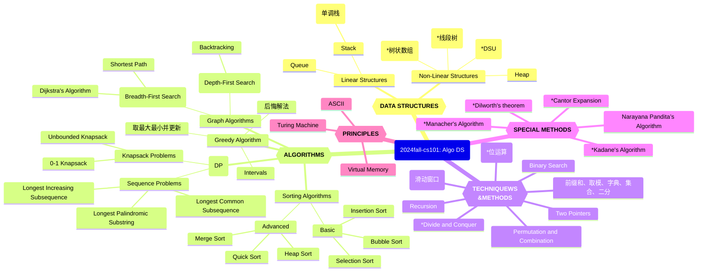

# 20241202-Week13 计概知识图谱

Updated 0223 GMT+8 Dec 03, 2024

2024 fall, Complied by Hongfei Yan


Logs:

> 查看：https://github.com/GMyhf/2023fall-cs101/blob/main/cheatsheet/review_and_thoughts-202312-HURuicheng.md  
> https://github.com/GMyhf/2023fall-cs101/blob/main/cheatsheet/cheatsheet-20231226-JIANGZixuan.md  
> https://github.com/GMyhf/2023fall-cs101/blob/main/cheatsheet/DailyOption-202312-DENGJinwen.md




<center>Knowledge Graph of 2024fall-cs101: Algo DS</center>


# Recap


## 作业示例474D. Flowers

dp, *1700, https://codeforces.com/contest/474/problem/D

We saw the little game Marmot made for Mole's lunch. Now it's Marmot's dinner time and, as we all know, Marmot eats flowers. At every dinner he eats some red and white flowers. Therefore a dinner can be represented as a sequence of several flowers, some of them white and some of them red.

But, for a dinner to be tasty, there is a rule: Marmot wants to eat white flowers only in groups of size *k*.

Now Marmot wonders in how many ways he can eat between *a* and *b* flowers. As the number of ways could be very large, print it modulo $1000000007 (10^9 + 7)$.

**Input**

Input contains several test cases.

The first line contains two integers *t* and *k* ($1 ≤ t, k ≤ 10^5$), where *t* represents the number of test cases.

The next *t* lines contain two integers $a_i$ and $b_i$ ($1 ≤ a_i ≤ b_i ≤ 10^5$), describing the *i*-th test.

**Output**

Print *t* lines to the standard output. The *i*-th line should contain the number of ways in which Marmot can eat between $a_i$ and $b_i$ flowers at dinner modulo $1000000007 (10^9 + 7)$.

Examples

Input

```
3 2
1 3
2 3
4 4
```

Output

```
6
5
5
```

Note

- For *K* = 2 and length 1 Marmot can eat (*R*).
- For *K* = 2 and length 2 Marmot can eat (*RR*) and (*WW*).
- For *K* = 2 and length 3 Marmot can eat (*RRR*), (*RWW*) and (*WWR*).
- For *K* = 2 and length 4 Marmot can eat, for example, (*WWWW*) or (*RWWR*), but for example he can't eat (*WWWR*).


思路：题目本身就是一个普通的“上楼梯”，但是这里不用前缀和来查询会超时

```python
MAX = 1000000007
t, k = map(int, input().split())
MOD = int(1e9+7)
MAXN = 100001
dp = [0]*MAXN
s = [0]*MAXN
dp[0] = 1
s[0] = 1
for i in range(1, MAXN):
    if i >= k:
        dp[i] = (dp[i-1]+dp[i-k]) % MOD
    else:
        dp[i] = dp[i-1] % MOD
    s[i] = (s[i-1]+dp[i]) % MOD

for _ in range(t):
    a, b = map(int, input().split())
    print((s[b]-s[a-1]+MOD) % MOD)

```


## 作业示例12029: 水淹七军

bfs, dfs, http://cs101.openjudge.cn/practice/12029/

随着最后通牒的递出，C国的总攻也开始了，由于C国在地形上的优势，C国总司令下令采用水攻，剿灭A国最后的有生力量。 
地形图是一个M*N的矩阵，矩阵上每一个点都对应着当前点的高度。C国总司令将选择若干个点进行放水。根据水往低处流的特性，水可以往四个方向的流动，被淹的地方的水面高度便和放水点的高度一样。然而，A国不是一马平川的，所以总会有地方是淹没不到的。你的任务很简单，判断一下A国司令部会不会被淹没掉。 
我们将给你完整的地形图，然后给出A国司令部所在位置，给出C国将在哪几个点进行放水操作。你所需要的，就是给出A国司令部会不会被水淹。

**输入**

第一行：一个整数K，代表数据组数。 
对于每一组数据： 
第1行：符合题目描述的两个整数，M(0 < M <= 200)、N(0 < N <= 200)。 
第2行至M+1行：每行N个数，以空格分开，代表这个矩阵上的各点的高度值H(0 <= H <= 1000)。 
第M+2行：两个整数I(0 < I <= M)、J(0 < J <= N)，代表司令部所在位置。 
第M+3行：一个整数P(0 < P <= M * N)，代表放水点个数。 
第M+4行至M+P+4行：每行两个整数X(0 < X <= M)、Y(0 < Y <= N)，代表放水点。

**输出**

对于每组数据，输出一行，如果被淹则输出Yes，没有则输出No。

样例输入

```
1
5 5
1 1 1 1 1
1 0 0 0 1
1 0 1 0 1
1 0 0 0 1
1 1 1 1 1
3 3
2
1 1
2 2
```

样例输出

```
No
```

提示

样例中左上角的位置是(1, 1),右上角的位置是(1, 5), 右下角的位置是(5, 5)


根据样例，可以这样理解：如果司令部与周围水等高，不算淹没。

不用visited的原因，有的点在某些情况下也需要重新遍历。比如之前淹没的高度为h，之后放水的高度H>h，此时就需要重新淹没。即可以不用visited，直接用water_height矩阵（每次洪泛更新），只要扩展点的高度小于当前water_height_value。


bfs实现

```python
from collections import deque
import sys
input = sys.stdin.read

# 判断坐标是否有效
def is_valid(x, y, m, n):
    return 0 <= x < m and 0 <= y < n

# 广度优先搜索模拟水流
def bfs(start_x, start_y, start_height, m, n, h, water_height):
    dx = [-1, 1, 0, 0]
    dy = [0, 0, -1, 1]
    q = deque([(start_x, start_y, start_height)])
    water_height[start_x][start_y] = start_height

    while q:
        x, y, height = q.popleft()
        for i in range(4):
            nx, ny = x + dx[i], y + dy[i]
            if is_valid(nx, ny, m, n) and h[nx][ny] < height:
                if water_height[nx][ny] < height:
                    water_height[nx][ny] = height
                    q.append((nx, ny, height))

# 主函数
def main():
    data = input().split()  # 快速读取所有输入数据
    idx = 0
    k = int(data[idx])
    idx += 1
    results = []

    for _ in range(k):
        m, n = map(int, data[idx:idx + 2])
        idx += 2
        h = []
        for i in range(m):
            h.append(list(map(int, data[idx:idx + n])))
            idx += n
        water_height = [[0] * n for _ in range(m)]

        i, j = map(int, data[idx:idx + 2])
        idx += 2
        i, j = i - 1, j - 1

        p = int(data[idx])
        idx += 1

        for _ in range(p):
            x, y = map(int, data[idx:idx + 2])
            idx += 2
            x, y = x - 1, y - 1
            if h[x][y] <= h[i][j]:
                continue
            bfs(x, y, h[x][y], m, n, h, water_height)

        results.append("Yes" if water_height[i][j] > 0 else "No")

    sys.stdout.write("\n".join(results) + "\n")

if __name__ == "__main__":
    main()
```


## 作业示例5.最长回文子串

dp, two pointers, string, https://leetcode.cn/problems/longest-palindromic-substring/

给你一个字符串 `s`，找到 `s` 中最长的 

回文子串。

**示例 1：**

```
输入：s = "babad"
输出："bab"
解释："aba" 同样是符合题意的答案。
```

**示例 2：**

```
输入：s = "cbbd"
输出："bb"
```

 

**提示：**

- `1 <= s.length <= 1000`
- `s` 仅由数字和英文字母组成


**Plan**

1. Initialize a 2D list `dp` where `dp[i][j]` will be `True` if the substring `s[i:j+1]` is a palindrome.
2. Iterate through the string in reverse order to fill the `dp` table.
3. For each character, check if the substring is a palindrome by comparing the characters at the ends and using the previously computed values in `dp`.
4. Keep track of the start and end indices of the longest palindromic substring found.
5. Return the substring defined by the start and end indices.

对于一个子串而言，如果它是回文串，并且长度大于 2，那么将它首尾的两个字母去除之后，它仍然是个回文串。

状态：`dp[i][j]`表示子串`s[i:j+1]`是否为回文子串

状态转移方程：`dp[i][j] = dp[i+1][j-1] ∧ (S[i] == s[j])`

动态规划中的边界条件，即子串的长度为 1 或 2。对于长度为 1 的子串，它显然是个回文串；对于长度为 2 的子串，只要它的两个字母相同，它就是一个回文串。

```python
class Solution:
    def longestPalindrome(self, s: str) -> str:
        n = len(s)
        if n == 0:
            return ""

        # Initialize the dp table
        dp = [[False] * n for _ in range(n)]
        start, max_length = 0, 1

        # Every single character is a palindrome
        for i in range(n):
            dp[i][i] = True

        # Check for palindromes of length 2
        for i in range(n - 1):
            if s[i] == s[i + 1]:
                dp[i][i + 1] = True
                start = i
                max_length = 2

        # Check for palindromes of length greater than 2
        for length in range(3, n + 1):
            for i in range(n - length + 1):
                j = i + length - 1
                if s[i] == s[j] and dp[i + 1][j - 1]:
                    dp[i][j] = True
                    start = i
                    max_length = length

        return s[start:start + max_length]

if __name__ == "__main__":
    sol = Solution()
    print(sol.longestPalindrome("babad"))  # Output: "bab" or "aba"
    print(sol.longestPalindrome("cbbd"))   # Output: "bb"
```


**Plan**

1. Initialize variables to store the start and end indices of the longest palindromic substring.
2. Iterate through each character in the string, treating each character and each pair of consecutive characters as potential centers of palindromes.
3. For each center, expand outwards while the characters on both sides are equal.
4. Update the start and end indices if a longer palindrome is found.
5. Return the substring defined by the start and end indices.

```python
class Solution:
    def longestPalindrome(self, s: str) -> str:
        if not s:
            return ""
        
        start, end = 0, 0
        
        for i in range(len(s)):
            odd_len = self.expandAroundCenter(s, i, i)
            even_len = self.expandAroundCenter(s, i, i + 1)
            max_len = max(odd_len, even_len)
            if max_len > end - start:
                start = i - (max_len - 1) // 2
                end = i + max_len // 2
        
        return s[start:end + 1]
    
    def expandAroundCenter(self, s: str, left: int, right: int) -> int:
        while left >= 0 and right < len(s) and s[left] == s[right]:
            left -= 1
            right += 1
        return right - left - 1

if __name__ == "__main__":
    sol = Solution()
    print(sol.longestPalindrome("babad"))  # Output: "bab" or "aba"
    print(sol.longestPalindrome("cbbd"))   # Output: "bb"
```


这个双指针是从中间往两边跑。


Manacher算法

https://leetcode.cn/problems/longest-palindromic-substring/solutions/255195/zui-chang-hui-wen-zi-chuan-by-leetcode-solution/

```python
class Solution:
    def expand(self, s, left, right):
        while left >= 0 and right < len(s) and s[left] == s[right]:
            left -= 1
            right += 1
        return (right - left - 2) // 2

    def longestPalindrome(self, s: str) -> str:
        end, start = -1, 0
        s = '#' + '#'.join(list(s)) + '#'
        arm_len = []
        right = -1
        j = -1
        for i in range(len(s)):
            if right >= i:
                i_sym = 2 * j - i
                min_arm_len = min(arm_len[i_sym], right - i)
                cur_arm_len = self.expand(s, i - min_arm_len, i + min_arm_len)
            else:
                cur_arm_len = self.expand(s, i, i)
            arm_len.append(cur_arm_len)
            if i + cur_arm_len > right:
                j = i
                right = i + cur_arm_len
            if 2 * cur_arm_len + 1 > end - start:
                start = i - cur_arm_len
                end = i + cur_arm_len
        return s[start+1:end+1:2]

```


> 这段代码是用于解决“最长回文子串”问题的一个Python实现。它使用了Manacher算法的变种，通过在每个字符间插入特殊字符（这里是`#`）来处理奇数和偶数长度的回文字符串。让我们逐段解析这个解决方案：
>
> 扩展函数 `expand`
>
> - 此函数尝试从给定的中心点向两边扩展，以找到以该中心点为中心的最大回文半径。
> - 如果左右指针指向的字符相等且都在字符串范围内，则继续向外扩展。
> - 返回值为最大回文半径，即`(right - left - 2) // 2`。
>
> 主函数 `longestPalindrome`
>
> - 首先，将原始字符串`s`转换成一个新字符串，其中每个字符之间都插入了一个`#`，这样可以确保所有可能的回文子串都是奇数长度，便于处理。
> - `end` 和 `start` 变量用于记录最长回文子串的边界。
> - `arm_len` 列表存储每个位置的回文臂长。
> - `right` 和 `j` 分别表示当前已知最右端的回文子串的右边界及其对应的中心点。
> - 在遍历新字符串时，如果当前索引`i`位于`right`内，那么利用对称性，计算出`i`关于`j`的对称点`i_sym`，并确定最小臂长。
> - 使用`expand`函数计算当前位置的实际臂长，并更新`arm_len`列表。
> - 如果当前臂长加上`i`超过了`right`，则更新`right`和`j`。
> - 如果当前找到的回文子串比之前记录的更长，则更新`start`和`end`。
> - 最后，返回原始字符串中对应最长回文子串的部分，注意去掉添加的`#`符号。
>
> 整个算法的核心思想是利用已经计算过的回文信息来减少重复计算，从而提高效率。这种方法的时间复杂度接近O(n)，空间复杂度为O(n)。


min_arm_len = min(arm_len[i_sym], right - i)	 如何理解？

> `min_arm_len = min(arm_len[i_sym], right - i)` 这一行代码是用来确定从当前位置 `i` 开始进行中心扩展时，可以跳过的最小臂长。这里有两个关键点需要理解：
>
> 1. **`arm_len[i_sym]`**:
>    - `i_sym` 是位置 `i` 关于当前已知最右边回文子串中心 `j` 的对称点，计算方式为 `2 * j - i`。
>    - `arm_len[i_sym]` 表示的是对称点 `i_sym` 处的回文臂长。如果 `i_sym` 位置的回文臂长足够大，那么根据对称性，我们可以在 `i` 位置直接获得至少相同的臂长，因为这两个位置关于 `j` 对称。
>
> 2. **`right - i`**:
>    - `right` 是当前已知最右端回文子串的边界。
>    - `right - i` 表示从位置 `i` 到当前已知最右端的距离。由于我们已经知道在 `right` 之前的字符都是回文的一部分，因此在 `i` 位置进行扩展时，我们至少可以达到 `right` 位置，而不需要重新验证这些字符。
>
> 综合以上两点，`min_arm_len` 取两者中的较小值，确保了以下几点：
>
> - 如果 `i_sym` 位置的臂长小于或等于 `right - i`，我们可以直接使用 `i_sym` 位置的臂长，因为它不会超出已知的回文区域。
> - 如果 `i_sym` 位置的臂长大于 `right - i`，则我们只能保证到 `right` 位置是回文，所以取 `right - i` 作为最小臂长。
>
> 这样做的目的是为了减少不必要的重复计算，通过利用之前计算的结果（即 `arm_len` 中的信息）来加速找到当前位置的最长回文臂长的过程。这实际上是Manacher算法中的一种优化手段，它允许我们在某些情况下快速跳过已经确认的部分，从而提高算法的整体效率。


## 作业示例02802: 小游戏

bfs, http://cs101.openjudge.cn/practice/02802/ 

一天早上，你起床的时候想：“我编程序这么牛，为什么不能靠这个赚点小钱呢？”因此你决定编写一个小游戏。

游戏在一个分割成w * h个正方格子的矩形板上进行。如图所示，每个正方格子上可以有一张游戏卡片，当然也可以没有。

当下面的情况满足时，我们认为两个游戏卡片之间有一条路径相连：

路径只包含水平或者竖直的直线段。路径不能穿过别的游戏卡片。但是允许路径临时的离开矩形板。下面是一个例子： 


这里在 (1, 3)和 (4, 4)处的游戏卡片是可以相连的。而在 (2, 3) 和 (3, 4) 处的游戏卡是不相连的，因为连接他们的每条路径都必须要穿过别的游戏卡片。

你现在要在小游戏里面判断是否存在一条满足题意的路径能连接给定的两个游戏卡片。

**输入**

输入包括多组数据。一个矩形板对应一组数据。每组数据包括的第一行包括两个整数w和h (1 <= w, h <= 75)，分别表示矩形板的宽度和长度。下面的h行，每行包括w个字符，表示矩形板上的游戏卡片分布情况。使用‘X’表示这个地方有一个游戏卡片；使用空格表示这个地方没有游戏卡片。

之后的若干行上每行上包括4个整数x1, y1, x2, y2 (1 <= x1, x2 <= w, 1 <= y1, y2 <= h)。给出两个卡片在矩形板上的位置（注意：矩形板左上角的坐标是(1, 1)）。输入保证这两个游戏卡片所处的位置是不相同的。如果一行上有4个0，表示这组测试数据的结束。

如果一行上给出w = h = 0，那么表示所有的输入结束了。

**输出**

对每一个矩形板，输出一行“Board #n:”，这里n是输入数据的编号。然后对每一组需要测试的游戏卡片输出一行。这一行的开头是“Pair m: ”，这里m是测试卡片的编号（对每个矩形板，编号都从1开始）。接下来，如果可以相连，找到连接这两个卡片的所有路径中包括线段数最少的路径，输出“k segments.”，这里k是找到的最优路径中包括的线段的数目；如果不能相连，输出“impossible.”。

每组数据之后输出一个空行。

样例输入

```
5 4
XXXXX
X   X
XXX X
 XXX 
2 3 5 3
1 3 4 4
2 3 3 4
0 0 0 0
0 0
```

样例输出

```
Board #1:
Pair 1: 4 segments.
Pair 2: 3 segments.
Pair 3: impossible.
```

来源：翻译自Mid-Central European Regional Contest 1999的试题


bfs

这个题目比较麻烦，因为外圈还可以走，需要在输入矩阵包一圈。另外，就是行列与我们平时练习行列刚好反着。

因为没有走到end之前的线段最短，不能保证总的线段最短。需要穷举队列，找到的最短都append到ans列表，最后min(ans)。

```python
from collections import deque


def bfs(start, end, grid, h, w):
    queue = deque([start])
    in_queue = set()
    dirs = [(0, -1), (-1, 0), (0, 1), (1, 0)]

    ans = []
    while queue:
        x, y, d_i_r, seg = queue.popleft()
        # print(x,y,end)
        if (x, y) == end:
            # return seg
            ans.append(seg)
            break

        for i, (dx, dy) in enumerate(dirs):
            nx, ny = x + dx, y + dy

            if 0 <= nx < h + 2 and 0 <= ny < w + 2 and ((nx, ny, i) not in in_queue):
                new_dir = i
                new_seg = seg if new_dir == d_i_r else seg + 1
                if (nx, ny) == end:
                    # return new_seg
                    ans.append(new_seg)
                    continue

                if grid[nx][ny] != 'X':
                    in_queue.add((nx, ny, i))
                    queue.append((nx, ny, new_dir, new_seg))

    if len(ans) == 0:
        return -1
    else:
        return min(ans)


board_num = 1
while True:
    w, h = map(int, input().split())
    if w == h == 0:
        break

    # grid = [[' '] * (w + 2)] + \
    # [[' '] + list(input()) + [' '] for _ in range(h)] + \
    # [[' '] * (w + 2)]
    grid = [' ' * (w + 2)] + [' ' + input() + ' ' for _ in range(h)] + [' ' * (w + 2)]
    print(f"Board #{board_num}:")
    pair_num = 1
    while True:
        y1, x1, y2, x2 = map(int, input().split())
        if x1 == y1 == x2 == y2 == 0:
            break

        start = (x1, y1, -1, 0)
        end = (x2, y2)

        seg = bfs(start, end, grid, h, w)
        if seg == -1:
            print(f"Pair {pair_num}: impossible.")
        else:
            print(f"Pair {pair_num}: {seg} segments.")
        pair_num += 1

    print()
    board_num += 1
```


《算法基础。。》上面讲到4.3例题：小游戏，书上给出的是dfs。但是经过同学和助教调试，发现dfs与先沿着哪个邻居出发有关，导致剪枝可能失效。因为可能拿不到一个相对较好的结果，便于比较剪枝。所以最好用bfs完成。


其实所有求最短、最长的问题都能用heapq实现，在图搜索中搭配bfs尤其好用。

> 利用heap优先队列的做法，因为每次都取当前队列中线段最小值前进，可以保证最后总的线段最短。这个实际上是Dijkstra。

```python
# 23 工学院 苏王捷
import heapq

num1 = 1
while True:
    w, h = map(int, input().split())
    if w == 0 and h == 0:
        break
    print(f"Board #{num1}:")
    martix = [[" "] * (w + 2)] + [[" "] + list(input()) + [" "] for _ in range(h)] + [[" "] * (w + 2)]
    dir = [(0, 1), (0, -1), (1, 0), (-1, 0)]
    num2 = 1
    while True:
        x1, y1, x2, y2 = map(int, input().split())
        if x1 == 0 and x2 == 0 and y1 == 0 and y2 == 0:
            break
        queue, flag = [], False
        in_queue = set()
        heapq.heappush(queue, (0, x1, y1, -1))
        martix[y2][x2] = " "
        in_queue.add((-1, x1, y1))
        while queue:
            step, x, y, dirs = heapq.heappop(queue)
            if x == x2 and y == y2:
                flag = True
                break
            for i, (dx, dy) in enumerate(dir):
                px, py = x + dx, y + dy
                if 0 <= px <= w + 1 and 0 <= py <= h + 1 and (i, px, py) not in in_queue and martix[py][px] != "X":
                    in_queue.add((i, px, py))
                    heapq.heappush(queue, (step + (dirs != i), px, py, i))
        if flag:
            print(f"Pair {num2}: {step} segments.")
        else:
            print(f"Pair {num2}: impossible.")
        martix[y2][x2] = "X"
        num2 += 1
    print()
    num1 += 1

```


# 最短路径Dijkstra

## 示例sy386: 最短距离 简单

https://sunnywhy.com/sfbj/10/4/386

现有一个共n个顶点（代表城市）、m条边（代表道路）的无向图（假设顶点编号为从`0`到`n-1`），每条边有各自的边权，代表两个城市之间的距离。求从s号城市出发到达t号城市的最短距离。

**输入**

第一行四个整数n、m、s、t（$1 \le n \le 100,0 \le m \le \frac{n(n-1)}2, 0 \le s \le n -1, 0 \le t \le n-1$​），分别表示顶点数、边数、起始编号、终点编号；

接下来m行，每行三个整数u、v、w（$0 \le u \le n-1,0 \le v \le n-1, u \ne v, 1 \le w \le 100$），表示一条边的两个端点的编号及边权距离。数据保证不会有重边。

**输出**

输出一个整数，表示最短距离。如果无法到达，那么输出`-1`。

样例1

输入

```
6 6 0 2
0 1 2
0 2 5
0 3 1
2 3 2
1 2 1
4 5 1
```

输出

```
3
```

解释

对应的无向图如下图所示。

共有`3`条从`0`号顶点到`2`号顶点的路径：

1. `0->3->2`：距离为`3`；
2. `0->2`：距离为`5`；
3. `0->1->2`：距离为`3`。

因此最短距离为`3`。


样例2

输入

```
6 6 0 5
0 1 2
0 2 5
0 3 1
2 3 2
1 2 1
4 5 1
```

输出

```
-1
```

解释

和第一个样例相同的图，终点换成了`5`号顶点，显然从`0`号无法到达`5`号。


需要找到从给定的起始城市到目标城市的最短距离。可以使用Dijkstra算法来解决这个问题。Dijkstra算法是一种用于在图中找到最短路径的算法。它从起始节点开始，然后逐步扩展到所有可达的节点，每次选择当前最短的路径进行扩展。

以下是使用 Python 实现 Dijkstra 算法来解决这个问题的示例代码：

```python
import heapq

def dijkstra(n, edges, s, t):
    graph = [[] for _ in range(n)]
    for u, v, w in edges:
        graph[u].append((v, w))
        graph[v].append((u, w))

    pq = [(0, s)]  # (distance, node)
    visited = set()
    distances = [float('inf')] * n
    distances[s] = 0

    while pq:
        dist, node = heapq.heappop(pq)
        if node == t:
            return dist
        if node in visited:
            continue
        visited.add(node)
        for neighbor, weight in graph[node]:
            if neighbor not in visited:
                new_dist = dist + weight
                if new_dist < distances[neighbor]:
                    distances[neighbor] = new_dist
                    heapq.heappush(pq, (new_dist, neighbor))
    return -1

# Read input
n, m, s, t = map(int, input().split())
edges = [list(map(int, input().split())) for _ in range(m)]

# Solve the problem and print the result
result = dijkstra(n, edges, s, t)
print(result)
```

这段代码实现了 Dijkstra 算法来求解从起点到终点的最短路径。首先构建了一个图，然后使用优先队列来选择下一个要探索的节点，并在探索过程中更新最短距离。最后返回从起点到终点的最短距离。

这个版本的Dijkstra算法使用了一个集合`visited`来记录已经访问过的节点，这样可以避免对同一个节点的重复处理。当我们从优先队列中取出一个节点时，如果这个节点已经在`visited`集合中，那么我们就跳过这个节点，处理下一个节点。这样可以提高算法的效率。

此外，这个版本的Dijkstra算法还在找到目标节点`t`时就立即返回结果，而不是等到遍历完所有节点。这是因为Dijkstra算法保证了每次从优先队列中取出的节点就是当前距离最短的节点，所以当我们找到目标节点`t`时，就已经找到了从起始节点`s`到`t`的最短路径，无需再继续搜索。

这个版本的Dijkstra算法的时间复杂度仍然是O((V+E)logV)，其中V是顶点数，E是边数。这是因为每个节点最多会被加入到优先队列中一次（当找到一条更短的路径时），并且每条边都会被处理一次（在遍历节点的邻居时）。优先队列的插入和删除操作的时间复杂度都是O(logV)，所以总的时间复杂度是O((V+E)logV)。


Dijkstra 算法是一种经典的图算法，它综合运用了多种技术，包括邻接表、集合、优先队列（堆）、贪心算法和动态规划的思想。例题：最短距离，https://sunnywhy.com/sfbj/10/4/386

- 邻接表：Dijkstra 算法通常使用邻接表来表示图的结构，这样可以高效地存储图中的节点和边。
- 集合：在算法中需要跟踪已经访问过的节点，以避免重复访问，这一般使用集合（或哈希集合）来实现。
- 优先队列（堆）：Dijkstra 算法中需要选择下一个要探索的节点，通常使用优先队列（堆）来维护当前候选节点的集合，并确保每次都能快速找到距离起点最近的节点。
- 贪心算法：Dijkstra 算法每次选择距离起点最近的节点作为下一个要探索的节点，这是一种贪心策略，即每次做出局部最优的选择，期望最终能达到全局最优。
- 动态规划：Dijkstra 算法通过不断地更新节点的最短距离来逐步得到从起点到各个节点的最短路径，这是一种动态规划的思想，即将原问题拆解成若干子问题，并以最优子结构来解决。

综合运用这些技术，Dijkstra 算法能够高效地求解单源最短路径问题，对于解决许多实际问题具有重要意义。


第2种写法，没有用set记录访问过的结点。

```python
import heapq

def dijkstra(n, s, t, edges):
    graph = [[] for _ in range(n)]
    for u, v, w in edges:
        graph[u].append((v, w))
        graph[v].append((u, w))

    distance = [float('inf')] * n
    distance[s] = 0

    queue = [(0, s)]
    while queue:
        dist, node = heapq.heappop(queue)
        if dist != distance[node]:
            continue
        for neighbor, weight in graph[node]:
            if distance[node] + weight < distance[neighbor]:
                distance[neighbor] = distance[node] + weight
                heapq.heappush(queue, (distance[neighbor], neighbor))

    return distance[t] if distance[t] != float('inf') else -1

# 接收数据
n, m, s, t = map(int, input().split())
edges = []
for _ in range(m):
    u, v, w = map(int, input().split())
    edges.append((u, v, w))

# 调用函数
min_distance = dijkstra(n, s, t, edges)
print(min_distance)
```

第15行的判断`if dist != distance[node]: continue`的作用是跳过已经找到更短路径的节点。

在Dijkstra算法中，我们使用优先队列（在Python中是heapq）来存储待处理的节点，每次从队列中取出当前距离最短的节点进行处理。但是在处理过程中，有可能会多次将同一个节点加入到队列中，因为我们可能会通过不同的路径到达同一个节点，每次到达时都会将其加入到队列中。

因此，当我们从队列中取出一个节点时，需要判断这个节点当前的最短距离是否与队列中存储的距离相同。如果不同，说明这个节点在队列中等待处理的时候，已经有了一条更短的路径，所以我们可以跳过这个节点，处理下一个节点。


## Dijkstra正确性证明 

Proof of Dijkstra's Correctness


### 1 详细解释

Dijkstra算法的正确性证明主要基于贪心选择性质和最优子结构性质。下面是对Dijkstra算法正确性的详细解释：

**贪心选择性质**

Dijkstra算法在每一步中总是选择当前已知最短路径的顶点，并且更新其邻居顶点的距离。这种选择方式确保了每次添加到最终解中的顶点都是当前最优的选择。

**最优子结构**

如果从起点 `s` 到某个顶点 `v` 的最短路径是通过顶点 `u`，那么从 `s` 到 `u` 的部分也必须是最短路径。这保证了局部最优解可以组合成全局最优解。


**证明步骤**

1. **定义**：

   - 让 `S`  表示已经确定了最短路径的顶点集合。
   - 让 `V-S`  表示尚未确定最短路径的顶点集合。
   - `d[v]` 表示从起点 `s` 到顶点 `v` 的当前已知最短距离。
   - $\delta(s, v) $ 表示从起点 `s` 到顶点 `v` 的实际最短距离。

2. **初始状态**：

   - 算法开始时，$S = \{s\}$ ，即只包含起点 `s`。
   - 对于所有顶点 $ v \in V-S $，初始化 `d[v]`  为从 `s` 到 `v` 的直接边的权重（如果存在），否则为无穷大。

3. **不变量**：

   - 在每一步执行之前，对于所有 $ u \in S $，有 $ d[u] = \delta(s, u) $。
   - 对于所有 $ v \in V-S $，有 $ d[v] \geq \delta(s, v) $。

4. **迭代过程**：

   - 在每一步中，选择 `V-S` 中 `d[v]` 最小的顶点 `u` 加入 `S`。
   - 更新 `u` 的所有邻居 `v` 的 `d[v]` 值，如果通过 `u` 到达 `v` 的新路径更短，则更新 `d[v]`。

5. **Dijkstra正确性证明，如何理解？**：

   - 假设在某一步骤中，我们选择了 `u` 加入  `S` ，并且 $ u \neq s $。

   - 由于 `u`  是  `V-S`  中  `d`  值最小的顶点，因此 $ d[u] \leq d[v] $ 对于所有 $ v \in V-S $ 成立。

   - 根据不变量，$ d[u] \geq \delta(s, u) $。

   - 如果 $ d[u] > \delta(s, u) $，则存在一条从 `s` 到 `u` 的更短路径，但这条路径必须经过  `V-S`  中的某个顶点 `w`（因为 `u` 是第一个被加入  S  的顶点）。

   - 由于$ d[w] \geq \delta(s, w) $，且 $ \delta(s, w) + \text{weight}(w, u) \geq \delta(s, u) $，所以 $ d[u] $ 不可能大于 $ \delta(s, u) $。

     > 由于我们假设了存在一条更短的路径，即d[u] > δ(s, u)，那么按照Dijkstra算法更新规则，d[u]应该被更新为d[w] + weight(w, u)或更小的值。这与d[u] > δ(s, u)相矛盾，因为这样会导致d[u]不大于δ(s, u)。

   - 因此，$ d[u] = \delta(s, u) $。

6. **终止条件**：

   - 当所有顶点都被加入  `S`  时，算法结束。
   - 此时，对于所有顶点  `v` ，$ d[v] = \delta(s, v) $。

**结论**

通过上述证明，我们可以得出结论：Dijkstra算法能够正确地找到从单个源点到图中所有其他顶点的最短路径。该算法依赖于非负权重边的假设，如果图中存在负权重边，Dijkstra算法可能会给出错误的结果。在这种情况下，可以使用Bellman-Ford算法来处理。


### 2 进一步解释

Dijkstra 算法的正确性证明基于以下核心逻辑：**每次将一个顶点 `u` 加入已确定最短路径集合 `S` 时，`d[u]` 必然等于从起点 `s` 到该顶点 `u` 的真实最短路径权值 $\delta(s, u)$**。以下是如何理解这一证明步骤的关键点：

------

**1. `u` 的选择保证了它的最小性**

- 在算法中，每次选择 `u` 时，其 `d[u]` 是所有 `V-S` 中 `d` 值最小的。
- 换句话说，在尚未被处理的顶点中，`u` 是当前最接近起点 `s` 的顶点。

因此，$d[u] \leq d[v]$ 对于所有 $v \in V-S$。


**2. 不变量：$d[u] \geq \delta(s, u)$**

- 算法的初始化确保了对所有顶点 $v$，`d[v]` 是从起点 `s` 出发到达该顶点的最短路径的一个上界（初始化时，$d[s]=0$，其余顶点 $d[v]=\infty$）。
- 在算法每一步中，通过松弛操作不断缩小 `d[v]` 的值，但始终保持 $d[v] \geq \delta(s, v)$。


**3. 假设反证法：如果 $d[u] > \delta(s, u)$**

如果 $d[u] > \delta(s, u)$，意味着存在更短的路径从 `s` 到达 `u`。设这条路径为 $s \to w \to u$，其中 $w \in V-S$ 是路径上未处理的某个顶点。

**矛盾点分析**

- 根据不变量，$d[w] \geq \delta(s, w)$。

- 由于 `u` 是当前 `V-S` 中 `d` 最小的顶点，因此 $d[u] \leq d[w]$。

- 另一方面，路径 $s \to w \to u$ 的真实距离为 $\delta(s, w) + \text{weight}(w, u)$，而 $\delta(s, w) + \text{weight}(w, u) \geq \delta(s, u)$。

  > 由于我们假设了存在一条更短的路径，即 d[u] > δ(s, u)，那么按照Dijkstra算法更新规则，d[u]应该被更新为d[w] + weight(w, u)或更小的值。这与d[u] > δ(s, u)相矛盾，因为这样会导致d[u]不大于δ(s, u)。

- 综合以上推导可知，$d[u] \geq \delta(s, u)$。

但 $d[u] > \delta(s, u)$ 的假设与上述结论矛盾。


**4. 结论：$d[u] = \delta(s, u)$**

由于不存在更短路径未被考虑，因此 `d[u]` 必等于从 `s` 到 `u` 的真实最短路径权值 $\delta(s, u)$。


### 3 直观理解

可以将 Dijkstra 算法看作“逐步揭露最短路径”的过程：

1. 每次处理一个顶点 `u`，它已经是离 `s` 最近的、尚未处理的顶点。
2. 对于 `u`，我们确认其最短路径值为 $d[u] = \delta(s, u)$，并将其固定在 `S` 中。
3. 此后更新其邻接顶点的 `d` 值，使得其他顶点的潜在路径长度不断逼近真实最短路径。

这种逐步扩展的方式确保了算法的正确性。


# 滑动窗口

## 示例3.无重复字符的最长子串

sliding window, https://leetcode.cn/problems/longest-substring-without-repeating-characters/

给定一个字符串 `s` ，请你找出其中不含有重复字符的 **最长** **子串**的长度。

 

**示例 1:**

```
输入: s = "abcabcbb"
输出: 3 
解释: 因为无重复字符的最长子串是 "abc"，所以其长度为 3。
```

**示例 2:**

```
输入: s = "bbbbb"
输出: 1
解释: 因为无重复字符的最长子串是 "b"，所以其长度为 1。
```

**示例 3:**

```
输入: s = "pwwkew"
输出: 3
解释: 因为无重复字符的最长子串是 "wke"，所以其长度为 3。
     请注意，你的答案必须是 子串 的长度，"pwke" 是一个子序列，不是子串。
```

 

**提示：**

- `0 <= s.length <= 5 * 10^4`
- `s` 由英文字母、数字、符号和空格组成


**滑动窗口**

是一个队列，比如例题中的 abcabcbb，进入这个队列（窗口）为 abc 满足题目要求，当再进入 a，队列变成了 abca，这时候不满足要求。所以，我们要移动这个队列！如何移动？我们只要把队列的左边的元素移出就行了，直到满足题目要求！

一直维持这样的队列，找出队列出现最长的长度时候！时间复杂度：O(n)


滑动窗口是一种常用的算法技巧，用于解决数组或字符串中的子数组或子字符串问题。在下面的代码中，滑动窗口的概念体现在通过移动两个指针（起始指针和结束指针）来维护一个当前的无重复子串。

**滑动窗口的基本思想**

1. **初始化**：
   - 维护一个窗口 `[start + 1, i]`，表示当前的无重复子串。
   - 使用一个字典 `char_index` 来记录每个字符最近一次出现的位置。

2. **扩展窗口**：
   - 遍历字符串，逐个字符地扩展窗口的右边界 `i`。

3. **收缩窗口**：
   - 如果当前字符 `c` 在字典中且其上次出现的位置在当前窗口内，则需要收缩窗口的左边界 `start`，使其不包含重复字符。


```python
class Solution:
    def lengthOfLongestSubstring(self, s: str) -> int:
        # 初始化变量
        start = -1  # 当前无重复子串的起始位置的前一个位置
        max_length = 0  # 最长无重复子串的长度
        char_index = {}  # 字典，记录每个字符最近一次出现的位置
        
        # 遍历字符串
        for i, char in enumerate(s):
            # 如果字符在字典中且上次出现的位置大于当前无重复子串的起始位置
            if char in char_index and char_index[char] > start:
                # 更新起始位置为该字符上次出现的位置
                start = char_index[char]
            
            # 更新字典中字符的位置
            char_index[char] = i
            
            # 计算当前无重复子串的长度，并更新最大长度
            current_length = i - start
            max_length = max(max_length, current_length)
        
        return max_length
```

> **代码解读**
>
> - `k`：记录当前无重复子串的起始位置的前一个位置，初始值为 -1。
> - `res`：记录最长无重复子串的长度，初始值为 0。
> - `c_dict`：一个字典，用于记录每个字符最近一次出现的位置。
>
> **处理字符**
>
> ```python
>             if c in c_dict and c_dict[c] > k:  # 字符c在字典中 且 上次出现的下标大于当前长度的起始下标
>                 k = c_dict[c]
>                 c_dict[c] = i
>             else:
>                 c_dict[c] = i
>                 res = max(res, i - k)
> ```
>
> - 条件判断：
>   - `if c in c_dict and c_dict[c] > k`：检查当前字符 `c` 是否在字典中，并且该字符上次出现的位置是否大于当前无重复子串的起始位置的前一个位置 `k`。
>   - 如果条件成立，说明当前字符 `c` 在之前的子串中已经出现过，且该位置在当前无重复子串的范围内，因此需要更新 `k` 为该字符上次出现的位置。
>   - `k = c_dict[c]`：更新 `k` 为字符 `c` 上次出现的位置。
>   - `c_dict[c] = i`：更新字典中字符 `c` 的位置为当前索引 `i`。
> - 否则：
>   - `c_dict[c] = i`：更新字典中字符 `c` 的位置为当前索引 `i`。
>   - `res = max(res, i - k)`：计算当前无重复子串的长度 `i - k`，并更新 `res` 为当前最大值。


# 概念关联理解

## 马拉车算法

### 马拉车算法与KMP算法有异曲同工之效

马拉车算法（Manacher's Algorithm）和KMP算法（Knuth-Morris-Pratt Algorithm）都是字符串处理中的经典算法，但它们解决的问题不同，尽管在某些方面有相似之处。

#### 马拉车算法
- **用途**：用于查找一个字符串中最长的回文子串。
- **核心思想**：利用已知的回文信息来避免不必要的重复计算。通过动态规划的思想，它可以在O(n)的时间复杂度内完成任务。
- **特点**：
  - 通过中心扩展法寻找回文，但巧妙地利用了已经找到的回文信息来减少不必要的比较。
  - 使用一个辅助数组来存储每个位置作为中心时的最长回文半径长度。
  - 通过对称性以及最右边界来优化查找过程，从而达到线性时间复杂度。

#### KMP算法
- **用途**：用于在一个文本中查找某个模式串是否存在，并返回其起始位置。
- **核心思想**：利用模式串本身的结构信息来避免不必要的字符比较，即构建一个部分匹配表（也称为“失败函数”或“前缀函数”），这个表记录了模式串的前缀和后缀重合的信息。
- **特点**：
  - 通过预处理模式串，构建出一个能够快速跳过已知不匹配部分的表。
  - 在搜索过程中，如果遇到不匹配的情况，可以根据部分匹配表直接移动到下一个可能匹配的位置，而不是从头开始重新匹配。
  - 时间复杂度为O(n + m)，其中n是文本串的长度，m是模式串的长度。

#### 异曲同工之效
- **预处理**：两者都通过某种形式的预处理来加速后续的操作。马拉车算法通过预处理辅助数组来加速回文子串的查找；KMP算法则通过预处理部分匹配表来加速模式匹配。
- **避免重复工作**：两种算法都试图利用已有信息来避免重复的工作，从而提高效率。马拉车算法利用已知的回文信息来减少不必要的中心扩展；KMP算法利用模式串的部分匹配信息来避免不必要的字符比较。
- **线性时间复杂度**：两者都可以在线性时间内完成各自的任务，这使得它们在处理大规模数据时非常高效。

虽然马拉车算法和KMP算法解决的是不同的问题，但它们都体现了利用已有信息来优化算法执行过程的思想，这是它们共有的“异曲同工之效”。


## 马拉车算法是双指针+dp

马拉车算法（Manacher's Algorithm）是一种用于寻找字符串中最长回文子串的高效算法，其时间复杂度为O(n)。这个算法巧妙地结合了双指针技术和动态规划的思想，但并不直接使用传统的动态规划表来解决问题。

### 双指针
- **中心扩展法**：基本思想是从每一个字符开始，尝试向两边扩展，检查是否构成回文。但是直接这样做会导致效率低下。
- **优化后的双指针**：马拉车算法通过一些技巧避免了重复计算。它利用已经处理过的部分信息来加速后续的查找过程。

### 动态规划的思想
- **状态定义**：在传统动态规划方法中，我们会定义一个二维数组dp[i][j]表示从i到j的子串是否为回文。但对于马拉车算法来说，我们并不直接使用这样的二维数组。
- **状态转移**：虽然没有显式地构建dp数组，但马拉车算法隐含地使用了之前计算过的信息来决定当前可以跳过多少个不需要检查的位置，这实际上是一种基于已知信息推导新信息的过程，类似于动态规划中的状态转移。

### 马拉车算法的关键点
1. **预处理**：为了处理奇数长度和偶数长度的回文问题，通常会在每个字符之间插入一个特殊符号（如#），这样所有可能的回文都会变成奇数长度。
2. **P数组**：定义一个数组P，其中P[i]表示以位置i为中心的最大回文半径。这个数组用来记录每个位置作为中心时的最长回文子串信息。
3. **中心和右边界**：维护当前找到的最远的回文子串的中心C以及对应的最右边界的R。这些信息帮助我们快速跳过不必要的检查。
4. **镜像对称性**：对于每一个新的中心，如果它位于当前右边界R内，那么我们可以利用它的对称位置的P值来减少不必要的比较。

综上所述，马拉车算法确实结合了双指针的方法来进行高效的回文判断，并且利用了之前计算的结果来避免重复工作，这体现了动态规划的核心思想之一——即通过保存并利用之前的状态来优化当前问题的解决过程。因此，描述马拉车算法为“双指针+dp”是合理的，这里的dp指的是动态规划的思想而非具体的dp数组实现。


## 单调栈和Greedy关系

单调栈（Monotonic Stack）和贪心算法（Greedy Algorithm）是两种不同的数据结构和技术，它们在解决特定类型问题时有着各自的特点和应用场景。

### 单调栈
- **定义**：单调栈是一种特殊的栈，它保持栈内的元素按照某种顺序（递增或递减）排列。当新元素入栈时，如果破坏了这种顺序，则会弹出栈顶元素，直到可以保持顺序为止。
- **用途**：单调栈常用于解决涉及数组或序列的问题，尤其是那些需要找到某个元素的下一个更大/更小元素、或者需要维护一个窗口内最大/最小值等问题。
- **特点**：通过维护一个有序的栈，可以在O(1)时间内获取某些特定的信息，从而使得整体时间复杂度降低到O(n)。

### 贪心算法
- **定义**：贪心算法是一种在每一步选择中都采取当前状态下最好或最优的选择，从而希望导致结果是全局最好或最优的算法。
- **用途**：适用于那些可以通过局部最优解来达到全局最优解的问题。例如，找零钱问题、活动选择问题等。
- **特点**：贪心算法通常简单直观，但并不总是能够保证得到全局最优解。对于某些问题，贪心算法可能只提供近似解而非精确解。

### 两者之间的关系
虽然单调栈和贪心算法都可以用来优化问题的解决方案，但它们并不是同一类技术。单调栈更多地被看作是一种数据结构，而贪心算法则是一种解决问题的策略。在某些情况下，你可能会结合使用这两种技术来解决一个问题，但它们本身代表了不同的概念：

- **单调栈**：关注的是如何高效地维护和访问一组有序的数据。
- **贪心算法**：关注的是如何通过一系列局部最优决策来尝试达到全局最优。

因此，不能简单地说单调栈就是贪心算法。它们在解决问题时扮演着不同的角色，并且有各自的适用场景。


## 树状数组和线段树关系

树状数组（Binary Indexed Tree, BIT）和线段树（Segment Tree）虽然都是用于高效处理区间查询和更新的数据结构，但它们在实现方式、空间复杂度以及某些操作的效率上有所不同。下面是对这两种数据结构的简要比较：

### 树状数组 (Binary Indexed Tree, BIT)
- **定义**：树状数组是一种可以高效地进行前缀和计算以及单点更新的数据结构。
- **用途**：主要用于解决动态范围求和问题，如区间求和、频繁的点更新等。
- **特点**：
  - 空间复杂度为O(n)，与输入数组大小相同。
  - 支持快速的单点更新和前缀和查询，时间复杂度均为O(log n)。
  - 实现相对简单，易于理解和编码。
  - 不支持区间更新（除非使用更复杂的变种）。

### 线段树 (Segment Tree)
- **定义**：线段树是一种二叉树结构，每个节点代表一个区间，通常用于处理区间查询和更新。
- **用途**：适用于多种区间操作，包括区间求和、区间最大/最小值、区间更新等。
- **特点**：
  - 空间复杂度为O(4n)或O(2n)，因为每个节点可能需要额外的空间来存储信息。
  - 支持快速的区间查询和更新，时间复杂度通常为O(log n)。
  - 可以处理更复杂的区间操作，如区间更新和延迟传播（Lazy Propagation）。
  - 实现相对复杂，需要更多的代码量。

#### 区别
- **功能**：线段树比树状数组功能更强大，能够处理更多类型的区间操作。
- **空间复杂度**：树状数组的空间复杂度更低，而线段树则需要更多的空间。
- **实现难度**：树状数组的实现较为简单，而线段树的实现相对复杂，特别是当涉及到懒惰标记（Lazy Propagation）时。
- **适用场景**：如果只需要处理前缀和或者简单的点更新，树状数组是更好的选择；如果需要处理复杂的区间操作，尤其是区间更新，线段树通常是更好的选择。

总结来说，树状数组和线段树不是同一种数据结构。尽管它们都用于处理区间相关的查询和更新问题，但它们各自有其优势和适用场景。在实际应用中，根据具体需求选择合适的数据结构是很重要的。


## 递归和算法关系

递归（Recursion）本身是一种编程技术或方法，而不是一种具体的算法。它是一种解决问题的策略，通过将问题分解为更小的、相似的子问题来求解。递归通常涉及一个函数直接或间接地调用自身。

### 递归的关键特性：
1. **基准情况（Base Case）**：这是递归终止的条件，确保递归不会无限进行下去。
2. **递归步骤（Recursive Step）**：在这一部分，函数会调用自身，但每次调用都会处理规模更小的问题。

### 递归的应用
递归可以用于实现各种算法，例如：
- **排序算法**：如快速排序（Quick Sort）和归并排序（Merge Sort）。
- **搜索算法**：如深度优先搜索（DFS）、回溯算法等。
- **动态规划**：某些动态规划问题可以通过递归来解决，尽管通常会使用记忆化（Memoization）来优化性能。
- **数学问题**：计算阶乘、斐波那契数列等。

### 递归与算法的关系
虽然递归不是一种特定的算法，但它是一种强大的工具，可以用来构建算法。很多经典算法都是基于递归思想设计的。例如：

- **快速排序**：选择一个基准元素，将数组分成两部分，一部分小于基准，另一部分大于基准，然后对这两部分分别递归排序。
- **归并排序**：将数组分成两个子数组，分别对它们进行排序，然后再合并两个有序的子数组。
- **二叉树遍历**：前序遍历、中序遍历、后序遍历等都可以通过递归方式简洁地实现。

### 递归的优点
- **代码简洁**：递归可以使代码更加简洁易懂。
- **逻辑清晰**：对于一些问题，递归能够自然地表达问题的结构。

### 递归的缺点
- **性能问题**：递归可能导致大量的函数调用开销，尤其是在没有优化的情况下（如尾递归优化）。
- **栈溢出**：如果递归层次太深，可能会导致栈溢出错误。

### 递归的优化
- **尾递归优化**：在某些编程语言中，编译器或解释器可以优化尾递归，使其不占用额外的栈空间。
- **记忆化**：存储已经计算过的结果，避免重复计算，提高效率。

总之，递归是一种重要的编程技术和解决问题的方法，它可以用来实现多种高效的算法。理解递归的思想对于掌握许多高级算法和数据结构非常有帮助。


## 双指针和Greedy关系

双指针（Two Pointers）是一种编程技巧，而不是一种具体的算法。它通常用于解决数组或链表中的问题，特别是在需要同时处理两个位置的数据时。双指针方法可以有效地减少时间复杂度，提高程序的效率。

### 双指针的特点
- **定义**：双指针是指在遍历数据结构时使用两个指针来追踪不同的位置。
- **用途**：常用于数组、链表等线性数据结构中，以优化查找、排序、合并等问题。
- **优点**：
  - 可以在一次遍历中完成多个操作。
  - 通常能将时间复杂度从O(n^2)降低到O(n)。

### 常见应用场景
1. **寻找两数之和**：例如，在一个有序数组中找到两个数使它们的和等于给定的目标值。
2. **合并两个有序数组**：例如，合并两个已排序的数组。
3. **删除重复元素**：例如，在一个数组中移除重复的元素。
4. **反转字符串**：例如，反转一个字符串中的字符。
5. **滑动窗口**：例如，在一个数组中找到满足特定条件的最长子数组。

### 双指针与贪心算法的关系
虽然双指针是一种编程技巧，但它可以被用来实现某些贪心算法。贪心算法是一种在每一步选择中都采取当前状态下最好或最优的选择，从而希望导致结果是全局最好或最优的算法。双指针可以在某些情况下帮助实现这种局部最优选择，从而达到全局最优解。

### 示例
假设我们要在一个有序数组中找到两个数，使它们的和等于给定的目标值。我们可以使用双指针方法：

```python
def two_sum(nums, target):
    left, right = 0, len(nums) - 1
    while left < right:
        current_sum = nums[left] + nums[right]
        if current_sum == target:
            return [left, right]
        elif current_sum < target:
            left += 1
        else:
            right -= 1
    return [-1, -1]

# 示例
nums = [1, 2, 3, 4, 6]
target = 6
print(two_sum(nums, target))  # 输出: [1, 3]
```

在这个例子中，双指针方法通过同时移动左右指针来高效地找到目标值。

### 总结
- **双指针**是一种编程技巧，用于优化数组或链表的操作。
- **贪心算法**是一种解决问题的策略，通过局部最优选择来尝试达到全局最优解。
- 双指针可以作为一种实现贪心算法的方法，但双指针本身并不局限于贪心算法，它可以用于多种类型的算法和问题。

因此，双指针更多地被视为一种编程技巧，而不是一种具体的算法实现方式。它在很多场景下都能提高代码的效率和简洁性。


## 回溯、递归和深搜关系

回溯（Backtracking）是一种算法技术，它通常用于解决那些需要探索所有可能解空间的问题。回溯算法本质上是递归的，并且经常使用深度优先搜索（DFS, Depth-First Search）来实现。因此，回溯可以被看作是递归和搜索的一种结合。

### 回溯与递归
- **递归**：递归是一种编程技术，通过函数调用自身来解决问题。递归的关键在于定义一个基准情况（Base Case），以及如何将问题分解为更小的子问题。
- **回溯**：回溯是一种系统地搜索问题解空间的方法。它通过尝试每一种可能的选择，如果发现当前选择不能得到解，则撤销该选择（即“回溯”），并尝试下一个选择。回溯通常是通过递归来实现的，因为递归提供了一种自然的方式来处理子问题。

### 回溯与深度优先搜索（DFS）
- **深度优先搜索（DFS）**：DFS是一种用于遍历或搜索树或图的算法。它从根节点开始，尽可能深地搜索每个分支，直到无法继续为止，然后回溯到上一个节点，继续搜索其他分支。
- **回溯**：回溯算法在很多情况下使用DFS来实现，因为它需要系统地探索所有可能的解路径。回溯中的“回溯”步骤实际上就是DFS中的回溯过程。

### 归类
1. **递归**：回溯算法本质上是递归的，因为它通过递归调用来探索解空间。因此，回溯可以被视为递归的一种应用。
2. **搜索**：回溯也可以被视为一种搜索方法，特别是当它使用DFS来实现时。回溯算法通过DFS的方式系统地探索解空间，找到所有可能的解。

### 总结
- **回溯**：既可以归类为递归，也可以归类为搜索中的深度优先搜索。
- **递归**：是回溯的基础，提供了实现回溯的技术手段。
- **深度优先搜索（DFS）**：是回溯中常用的具体搜索策略，用于系统地探索解空间。

因此，回溯可以同时归类到递归和搜索中的深度优先搜索。具体归类取决于你关注的是它的实现方式（递归）还是它的搜索策略（DFS）。在实际应用中，这两种视角都是正确的，而且它们是相辅相成的。


## 并查集

并查集（Disjoint Set Union, DSU），也被称为Union-Find结构，是一种用于处理一些不相交集合的合并及查询问题的数据结构。它支持两种主要操作：查找（Find）和合并（Union）。这种数据结构在解决图论中的连通性问题时非常有用，比如判断两个节点是否属于同一个连通块、将两个连通块合并成一个等。

### 基本概念

- **集合**：并查集中的每个元素都属于某个集合。
- **代表元**：每个集合都有一个代表元素，用来唯一标识这个集合。
- **路径压缩**：一种优化手段，通过让查找路径上的所有节点直接指向根节点来减少树的高度，从而加速后续的查找操作。
- **按秩合并**：另一种优化手段，在合并两个集合时总是把较小深度的树挂到较大深度的树上，以保持树的平衡。

### 主要操作

1. **初始化**：为每个元素创建一个单独的集合，此时每个元素都是自己所在集合的代表。
2. **查找** (Find)：确定某元素所属的集合，并返回该集合的代表元素。在此过程中可以实施路径压缩。
3. **合并** (Union)：将两个元素所在的集合合并成一个新的集合。如果两个元素已经在同一个集合中，则无需执行任何操作。此过程可利用按秩合并进行优化。

### 实现细节

- 使用数组或者哈希表来存储每个元素的父节点指针以及集合的大小或秩信息。
- 初始化时，每个元素的父节点设置为其自身。
- 查找操作通常会递归地向上寻找直到找到根节点，并且可能更新路径上的每个节点使其直接指向根节点（路径压缩）。
- 合并操作先找到两者的根节点，然后根据一定的策略（如按秩合并）连接这两个根节点。

### 应用场景
- 网络连接问题：判断网络中任意两点之间是否存在路径。
- 图像处理：在某些图像分割算法中应用。
- 编译器优化：检测循环依赖关系。
- 游戏开发：实现游戏世界中的区域划分等功能。

并查集因其高效性和简洁性，在许多领域都有广泛的应用。希望以上信息对你有所帮助！如果你有更具体的问题或需要进一步的例子，请告诉我。


## Dijkstra

### Dijkstra是bfs+greedy

Dijkstra算法和广度优先搜索（BFS）确实有一些相似之处，但它们解决的问题类型和具体实现方式有所不同。Dijkstra算法用于在加权图中找到从一个起始顶点到所有其他顶点的最短路径，而BFS通常用于无权图中查找最短路径或层次遍历。

可以说Dijkstra算法结合了BFS的一些特性以及贪心算法的思想：

1. **与BFS的相似性**：就像BFS一样，Dijkstra算法也是逐步向外扩展搜索范围，从起点开始，逐步探索离起点最近的未访问节点。这种逐步扩展的方式保证了当某个节点第一次被访问时，所记录的距离就是从起点到该节点的最短距离。

2. **贪心选择**：Dijkstra算法在每一步都选择当前已知距离最小的顶点进行处理，并更新其邻居节点的距离值。这种总是选取“最优”选择来推进的方法体现了贪心算法的特点。通过这种方式，它能够确保一旦确定了一个顶点的最短路径长度，就不会再改变这个值了。

3. **优先队列/堆的应用**：为了高效地选取下一个待处理的节点（即距离最小的节点），Dijkstra算法通常使用优先队列（或者说是二叉堆）来存储待处理节点。这样可以快速获取距离最小的节点并维护数据结构的有序性。

然而，需要注意的是，虽然Dijkstra算法具有上述特点，但它并不完全等同于BFS加上贪心策略。Dijkstra算法适用于边有权重的情况，且这些权重必须是非负的；如果图中存在负权重边，则可能需要使用其他算法如Bellman-Ford算法。此外，Dijkstra算法在处理每个节点时考虑了边上的权重，这一点使得它比简单的BFS更复杂也更强大。因此，将Dijkstra简单地描述为"BFS+greedy"是对其特性的简化理解，但有助于初学者抓住其核心思想。


## "每一步....，并更新其邻居节点的距离值"，更新其邻居节点的距离值也可以理解为dp

确实，Dijkstra算法中的“更新其邻居节点的距离值”这一过程可以被看作是一种动态规划（Dynamic Programming, DP）的思想。在动态规划中，一个问题被分解成更小的子问题来解决，解决方案通常基于先前计算的结果来构建。对于Dijkstra算法而言：

- **状态定义**：每个节点的状态可以定义为从起点到该节点的最短路径长度。
- **状态转移**：当我们处理一个节点时，我们尝试通过当前节点到达它的邻居，并检查是否可以通过这条路径得到更短的总距离。如果可以，我们就更新这个邻居节点的状态（即更新其最短路径长度）。这实际上就是一种状态转移的过程，在这里，新状态是基于旧状态和边的权重计算出来的。

因此，Dijkstra算法中的这种逐步更新最短路径估计的过程体现了动态规划的核心思想——利用已知信息来优化未知信息。不过，与经典的DP方法相比，Dijkstra算法更侧重于图论中的最短路径问题，并且使用了优先队列来高效地选择下一个要处理的节点。

总结来说，虽然Dijkstra算法主要归类为贪心算法的一种应用，但其核心操作确实包含了动态规划的思想。这是因为两者都涉及到了基于已有信息做出决策以达到全局最优解的过程。将Dijkstra算法的部分机制理解为动态规划，可以帮助更好地理解算法如何保证找到最短路径。


## Dijkstra是bfs+greedy+dp。经典

Dijkstra是一种用于计算图中单源最短路径的经典算法。总结一下Dijkstra算法是如何结合BFS（广度优先搜索）、贪心选择以及动态规划思想的：

1. **BFS特性**：在无权图中，BFS可以用来找到从起点到所有其他节点的最短路径。Dijkstra算法在加权图中工作时，也采用了类似逐步扩展的方式，从起点开始逐层向外探索，确保一旦某个节点被确定为已访问状态，其最短路径就已经找到了。

2. **贪心选择**：每一步，Dijkstra算法总是选择当前距离最小且未处理过的节点进行处理，并基于这个节点更新其邻居节点的距离。这种每次都选择局部最优解以期望达到全局最优解的方法体现了贪心策略。

3. **动态规划(DP)思想**：在更新邻居节点的距离时，Dijkstra算法实际上是在执行一种形式的状态转移。每个节点的最短路径长度是基于已经计算出的较近节点的最短路径来更新的。这符合动态规划的核心思想，即通过解决子问题来构建整体问题的解决方案。

因此，说Dijkstra算法融合了BFS、贪心策略和动态规划的思想是非常恰当的。它利用了BFS的基本框架，通过贪心地选择下一步要处理的最佳节点，同时运用了类似于DP的状态更新机制来优化路径长度。不过，需要注意的是，在实际应用中，Dijkstra算法通常使用优先队列来高效管理待处理节点，从而保证算法的整体效率。

综上所述，虽然严格来说Dijkstra是一种贪心算法，但它确实巧妙地结合了上述多种算法思想的优点，使得它成为解决最短路径问题的有效工具。


## heap = queue+ greedy

将堆（Heap）描述为“队列+贪心”是一种简化的表述方式，旨在强调堆在某些算法中的角色和作用。这种说法有助于理解堆如何结合了队列的先进先出（FIFO）特性与优先级选择的概念。具体来说：

- **队列**：标准队列遵循先进先出原则，即最先加入队列的元素也是最先被处理的。这与BFS等算法中逐层扩展节点的方式相吻合。
- **贪心**：贪心算法的核心思想是在每一步都做出局部最优的选择，以期望达到全局最优解。在涉及到优先级或成本的情况下，总是选择当前最佳选项。

当我们将这两个概念结合起来时，可以这样理解堆的作用：

- **优先队列**：堆本质上是一个实现优先队列的数据结构，它允许我们根据元素的优先级来访问它们，而不是简单地按照插入顺序。在最小堆中，每次都能快速获取到具有最小值的元素；而在最大堆中，则是最大值。这种基于优先级的访问方式体现了贪心策略的思想——总是选择当前最好的选项。
- **高效管理**：堆通过其特殊的树形结构保证了插入、删除以及查找最值操作的时间复杂度为O(log n)，这使得它非常适合于需要频繁进行这些操作的应用场景，如Dijkstra算法中的距离更新过程。

因此，说“heap = queue + greedy”实际上是指堆作为优先队列的一种实现，它不仅保持了队列的基本功能，还引入了基于优先级的贪心选择机制。这种组合使得堆成为解决诸如最短路径问题、任务调度等多种问题的强大工具。不过，需要注意的是，这是一种概念上的简化表达，实际中堆有着更丰富的特性和应用范围。