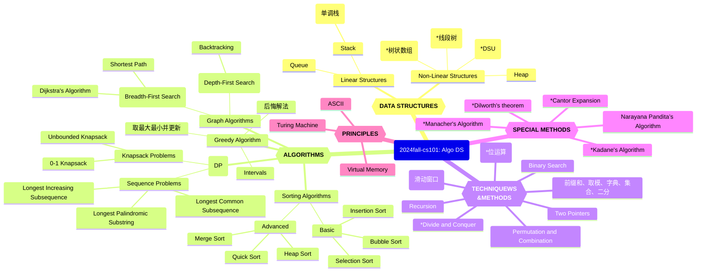

# 20241202-Week13 计概知识图谱

Updated 2250 GMT+8 Dec 01, 2024

2024 fall, Complied by Hongfei Yan




<center>Knowledge Graph of 2024fall-cs101: Algo DS</center>


# 马拉车算法

## 马拉车算法与KMP算法有异曲同工之效

马拉车算法（Manacher's Algorithm）和KMP算法（Knuth-Morris-Pratt Algorithm）都是字符串处理中的经典算法，但它们解决的问题不同，尽管在某些方面有相似之处。

### 马拉车算法
- **用途**：用于查找一个字符串中最长的回文子串。
- **核心思想**：利用已知的回文信息来避免不必要的重复计算。通过动态规划的思想，它可以在O(n)的时间复杂度内完成任务。
- **特点**：
  - 通过中心扩展法寻找回文，但巧妙地利用了已经找到的回文信息来减少不必要的比较。
  - 使用一个辅助数组来存储每个位置作为中心时的最长回文半径长度。
  - 通过对称性以及最右边界来优化查找过程，从而达到线性时间复杂度。

### KMP算法
- **用途**：用于在一个文本中查找某个模式串是否存在，并返回其起始位置。
- **核心思想**：利用模式串本身的结构信息来避免不必要的字符比较，即构建一个部分匹配表（也称为“失败函数”或“前缀函数”），这个表记录了模式串的前缀和后缀重合的信息。
- **特点**：
  - 通过预处理模式串，构建出一个能够快速跳过已知不匹配部分的表。
  - 在搜索过程中，如果遇到不匹配的情况，可以根据部分匹配表直接移动到下一个可能匹配的位置，而不是从头开始重新匹配。
  - 时间复杂度为O(n + m)，其中n是文本串的长度，m是模式串的长度。

### 异曲同工之效
- **预处理**：两者都通过某种形式的预处理来加速后续的操作。马拉车算法通过预处理辅助数组来加速回文子串的查找；KMP算法则通过预处理部分匹配表来加速模式匹配。
- **避免重复工作**：两种算法都试图利用已有信息来避免重复的工作，从而提高效率。马拉车算法利用已知的回文信息来减少不必要的中心扩展；KMP算法利用模式串的部分匹配信息来避免不必要的字符比较。
- **线性时间复杂度**：两者都可以在线性时间内完成各自的任务，这使得它们在处理大规模数据时非常高效。

虽然马拉车算法和KMP算法解决的是不同的问题，但它们都体现了利用已有信息来优化算法执行过程的思想，这是它们共有的“异曲同工之效”。


## 马拉车算法是双指针+dp

马拉车算法（Manacher's Algorithm）是一种用于寻找字符串中最长回文子串的高效算法，其时间复杂度为O(n)。这个算法巧妙地结合了双指针技术和动态规划的思想，但并不直接使用传统的动态规划表来解决问题。

### 双指针
- **中心扩展法**：基本思想是从每一个字符开始，尝试向两边扩展，检查是否构成回文。但是直接这样做会导致效率低下。
- **优化后的双指针**：马拉车算法通过一些技巧避免了重复计算。它利用已经处理过的部分信息来加速后续的查找过程。

### 动态规划的思想
- **状态定义**：在传统动态规划方法中，我们会定义一个二维数组dp[i][j]表示从i到j的子串是否为回文。但对于马拉车算法来说，我们并不直接使用这样的二维数组。
- **状态转移**：虽然没有显式地构建dp数组，但马拉车算法隐含地使用了之前计算过的信息来决定当前可以跳过多少个不需要检查的位置，这实际上是一种基于已知信息推导新信息的过程，类似于动态规划中的状态转移。

### 马拉车算法的关键点
1. **预处理**：为了处理奇数长度和偶数长度的回文问题，通常会在每个字符之间插入一个特殊符号（如#），这样所有可能的回文都会变成奇数长度。
2. **P数组**：定义一个数组P，其中P[i]表示以位置i为中心的最大回文半径。这个数组用来记录每个位置作为中心时的最长回文子串信息。
3. **中心和右边界**：维护当前找到的最远的回文子串的中心C以及对应的最右边界的R。这些信息帮助我们快速跳过不必要的检查。
4. **镜像对称性**：对于每一个新的中心，如果它位于当前右边界R内，那么我们可以利用它的对称位置的P值来减少不必要的比较。

综上所述，马拉车算法确实结合了双指针的方法来进行高效的回文判断，并且利用了之前计算的结果来避免重复工作，这体现了动态规划的核心思想之一——即通过保存并利用之前的状态来优化当前问题的解决过程。因此，描述马拉车算法为“双指针+dp”是合理的，这里的dp指的是动态规划的思想而非具体的dp数组实现。


# 单调栈和Greedy关系

单调栈（Monotonic Stack）和贪心算法（Greedy Algorithm）是两种不同的数据结构和技术，它们在解决特定类型问题时有着各自的特点和应用场景。

### 单调栈
- **定义**：单调栈是一种特殊的栈，它保持栈内的元素按照某种顺序（递增或递减）排列。当新元素入栈时，如果破坏了这种顺序，则会弹出栈顶元素，直到可以保持顺序为止。
- **用途**：单调栈常用于解决涉及数组或序列的问题，尤其是那些需要找到某个元素的下一个更大/更小元素、或者需要维护一个窗口内最大/最小值等问题。
- **特点**：通过维护一个有序的栈，可以在O(1)时间内获取某些特定的信息，从而使得整体时间复杂度降低到O(n)。

### 贪心算法
- **定义**：贪心算法是一种在每一步选择中都采取当前状态下最好或最优的选择，从而希望导致结果是全局最好或最优的算法。
- **用途**：适用于那些可以通过局部最优解来达到全局最优解的问题。例如，找零钱问题、活动选择问题等。
- **特点**：贪心算法通常简单直观，但并不总是能够保证得到全局最优解。对于某些问题，贪心算法可能只提供近似解而非精确解。

### 两者之间的关系
虽然单调栈和贪心算法都可以用来优化问题的解决方案，但它们并不是同一类技术。单调栈更多地被看作是一种数据结构，而贪心算法则是一种解决问题的策略。在某些情况下，你可能会结合使用这两种技术来解决一个问题，但它们本身代表了不同的概念：

- **单调栈**：关注的是如何高效地维护和访问一组有序的数据。
- **贪心算法**：关注的是如何通过一系列局部最优决策来尝试达到全局最优。

因此，不能简单地说单调栈就是贪心算法。它们在解决问题时扮演着不同的角色，并且有各自的适用场景。


# 树状数组和线段树关系

树状数组（Binary Indexed Tree, BIT）和线段树（Segment Tree）虽然都是用于高效处理区间查询和更新的数据结构，但它们在实现方式、空间复杂度以及某些操作的效率上有所不同。下面是对这两种数据结构的简要比较：

### 树状数组 (Binary Indexed Tree, BIT)
- **定义**：树状数组是一种可以高效地进行前缀和计算以及单点更新的数据结构。
- **用途**：主要用于解决动态范围求和问题，如区间求和、频繁的点更新等。
- **特点**：
  - 空间复杂度为O(n)，与输入数组大小相同。
  - 支持快速的单点更新和前缀和查询，时间复杂度均为O(log n)。
  - 实现相对简单，易于理解和编码。
  - 不支持区间更新（除非使用更复杂的变种）。

### 线段树 (Segment Tree)
- **定义**：线段树是一种二叉树结构，每个节点代表一个区间，通常用于处理区间查询和更新。
- **用途**：适用于多种区间操作，包括区间求和、区间最大/最小值、区间更新等。
- **特点**：
  - 空间复杂度为O(4n)或O(2n)，因为每个节点可能需要额外的空间来存储信息。
  - 支持快速的区间查询和更新，时间复杂度通常为O(log n)。
  - 可以处理更复杂的区间操作，如区间更新和延迟传播（Lazy Propagation）。
  - 实现相对复杂，需要更多的代码量。

### 区别
- **功能**：线段树比树状数组功能更强大，能够处理更多类型的区间操作。
- **空间复杂度**：树状数组的空间复杂度更低，而线段树则需要更多的空间。
- **实现难度**：树状数组的实现较为简单，而线段树的实现相对复杂，特别是当涉及到懒惰标记（Lazy Propagation）时。
- **适用场景**：如果只需要处理前缀和或者简单的点更新，树状数组是更好的选择；如果需要处理复杂的区间操作，尤其是区间更新，线段树通常是更好的选择。

总结来说，树状数组和线段树不是同一种数据结构。尽管它们都用于处理区间相关的查询和更新问题，但它们各自有其优势和适用场景。在实际应用中，根据具体需求选择合适的数据结构是很重要的。


# 递归和算法关系

递归（Recursion）本身是一种编程技术或方法，而不是一种具体的算法。它是一种解决问题的策略，通过将问题分解为更小的、相似的子问题来求解。递归通常涉及一个函数直接或间接地调用自身。

### 递归的关键特性：
1. **基准情况（Base Case）**：这是递归终止的条件，确保递归不会无限进行下去。
2. **递归步骤（Recursive Step）**：在这一部分，函数会调用自身，但每次调用都会处理规模更小的问题。

### 递归的应用
递归可以用于实现各种算法，例如：
- **排序算法**：如快速排序（Quick Sort）和归并排序（Merge Sort）。
- **搜索算法**：如深度优先搜索（DFS）、回溯算法等。
- **动态规划**：某些动态规划问题可以通过递归来解决，尽管通常会使用记忆化（Memoization）来优化性能。
- **数学问题**：计算阶乘、斐波那契数列等。

### 递归与算法的关系
虽然递归不是一种特定的算法，但它是一种强大的工具，可以用来构建算法。很多经典算法都是基于递归思想设计的。例如：

- **快速排序**：选择一个基准元素，将数组分成两部分，一部分小于基准，另一部分大于基准，然后对这两部分分别递归排序。
- **归并排序**：将数组分成两个子数组，分别对它们进行排序，然后再合并两个有序的子数组。
- **二叉树遍历**：前序遍历、中序遍历、后序遍历等都可以通过递归方式简洁地实现。

### 递归的优点
- **代码简洁**：递归可以使代码更加简洁易懂。
- **逻辑清晰**：对于一些问题，递归能够自然地表达问题的结构。

### 递归的缺点
- **性能问题**：递归可能导致大量的函数调用开销，尤其是在没有优化的情况下（如尾递归优化）。
- **栈溢出**：如果递归层次太深，可能会导致栈溢出错误。

### 递归的优化
- **尾递归优化**：在某些编程语言中，编译器或解释器可以优化尾递归，使其不占用额外的栈空间。
- **记忆化**：存储已经计算过的结果，避免重复计算，提高效率。

总之，递归是一种重要的编程技术和解决问题的方法，它可以用来实现多种高效的算法。理解递归的思想对于掌握许多高级算法和数据结构非常有帮助。


# 双指针和Greedy关系

双指针（Two Pointers）是一种编程技巧，而不是一种具体的算法。它通常用于解决数组或链表中的问题，特别是在需要同时处理两个位置的数据时。双指针方法可以有效地减少时间复杂度，提高程序的效率。

### 双指针的特点
- **定义**：双指针是指在遍历数据结构时使用两个指针来追踪不同的位置。
- **用途**：常用于数组、链表等线性数据结构中，以优化查找、排序、合并等问题。
- **优点**：
  - 可以在一次遍历中完成多个操作。
  - 通常能将时间复杂度从O(n^2)降低到O(n)。

### 常见应用场景
1. **寻找两数之和**：例如，在一个有序数组中找到两个数使它们的和等于给定的目标值。
2. **合并两个有序数组**：例如，合并两个已排序的数组。
3. **删除重复元素**：例如，在一个数组中移除重复的元素。
4. **反转字符串**：例如，反转一个字符串中的字符。
5. **滑动窗口**：例如，在一个数组中找到满足特定条件的最长子数组。

### 双指针与贪心算法的关系
虽然双指针是一种编程技巧，但它可以被用来实现某些贪心算法。贪心算法是一种在每一步选择中都采取当前状态下最好或最优的选择，从而希望导致结果是全局最好或最优的算法。双指针可以在某些情况下帮助实现这种局部最优选择，从而达到全局最优解。

### 示例
假设我们要在一个有序数组中找到两个数，使它们的和等于给定的目标值。我们可以使用双指针方法：

```python
def two_sum(nums, target):
    left, right = 0, len(nums) - 1
    while left < right:
        current_sum = nums[left] + nums[right]
        if current_sum == target:
            return [left, right]
        elif current_sum < target:
            left += 1
        else:
            right -= 1
    return [-1, -1]

# 示例
nums = [1, 2, 3, 4, 6]
target = 6
print(two_sum(nums, target))  # 输出: [1, 3]
```

在这个例子中，双指针方法通过同时移动左右指针来高效地找到目标值。

### 总结
- **双指针**是一种编程技巧，用于优化数组或链表的操作。
- **贪心算法**是一种解决问题的策略，通过局部最优选择来尝试达到全局最优解。
- 双指针可以作为一种实现贪心算法的方法，但双指针本身并不局限于贪心算法，它可以用于多种类型的算法和问题。

因此，双指针更多地被视为一种编程技巧，而不是一种具体的算法实现方式。它在很多场景下都能提高代码的效率和简洁性。


# 回溯、递归和深搜关系

回溯（Backtracking）是一种算法技术，它通常用于解决那些需要探索所有可能解空间的问题。回溯算法本质上是递归的，并且经常使用深度优先搜索（DFS, Depth-First Search）来实现。因此，回溯可以被看作是递归和搜索的一种结合。

### 回溯与递归
- **递归**：递归是一种编程技术，通过函数调用自身来解决问题。递归的关键在于定义一个基准情况（Base Case），以及如何将问题分解为更小的子问题。
- **回溯**：回溯是一种系统地搜索问题解空间的方法。它通过尝试每一种可能的选择，如果发现当前选择不能得到解，则撤销该选择（即“回溯”），并尝试下一个选择。回溯通常是通过递归来实现的，因为递归提供了一种自然的方式来处理子问题。

### 回溯与深度优先搜索（DFS）
- **深度优先搜索（DFS）**：DFS是一种用于遍历或搜索树或图的算法。它从根节点开始，尽可能深地搜索每个分支，直到无法继续为止，然后回溯到上一个节点，继续搜索其他分支。
- **回溯**：回溯算法在很多情况下使用DFS来实现，因为它需要系统地探索所有可能的解路径。回溯中的“回溯”步骤实际上就是DFS中的回溯过程。

### 归类
1. **递归**：回溯算法本质上是递归的，因为它通过递归调用来探索解空间。因此，回溯可以被视为递归的一种应用。
2. **搜索**：回溯也可以被视为一种搜索方法，特别是当它使用DFS来实现时。回溯算法通过DFS的方式系统地探索解空间，找到所有可能的解。

### 总结
- **回溯**：既可以归类为递归，也可以归类为搜索中的深度优先搜索。
- **递归**：是回溯的基础，提供了实现回溯的技术手段。
- **深度优先搜索（DFS）**：是回溯中常用的具体搜索策略，用于系统地探索解空间。

因此，回溯可以同时归类到递归和搜索中的深度优先搜索。具体归类取决于你关注的是它的实现方式（递归）还是它的搜索策略（DFS）。在实际应用中，这两种视角都是正确的，而且它们是相辅相成的。


# 并查集

并查集（Disjoint Set Union, DSU），也被称为Union-Find结构，是一种用于处理一些不相交集合的合并及查询问题的数据结构。它支持两种主要操作：查找（Find）和合并（Union）。这种数据结构在解决图论中的连通性问题时非常有用，比如判断两个节点是否属于同一个连通块、将两个连通块合并成一个等。

### 基本概念

- **集合**：并查集中的每个元素都属于某个集合。
- **代表元**：每个集合都有一个代表元素，用来唯一标识这个集合。
- **路径压缩**：一种优化手段，通过让查找路径上的所有节点直接指向根节点来减少树的高度，从而加速后续的查找操作。
- **按秩合并**：另一种优化手段，在合并两个集合时总是把较小深度的树挂到较大深度的树上，以保持树的平衡。

### 主要操作

1. **初始化**：为每个元素创建一个单独的集合，此时每个元素都是自己所在集合的代表。
2. **查找** (Find)：确定某元素所属的集合，并返回该集合的代表元素。在此过程中可以实施路径压缩。
3. **合并** (Union)：将两个元素所在的集合合并成一个新的集合。如果两个元素已经在同一个集合中，则无需执行任何操作。此过程可利用按秩合并进行优化。

### 实现细节

- 使用数组或者哈希表来存储每个元素的父节点指针以及集合的大小或秩信息。
- 初始化时，每个元素的父节点设置为其自身。
- 查找操作通常会递归地向上寻找直到找到根节点，并且可能更新路径上的每个节点使其直接指向根节点（路径压缩）。
- 合并操作先找到两者的根节点，然后根据一定的策略（如按秩合并）连接这两个根节点。

### 应用场景
- 网络连接问题：判断网络中任意两点之间是否存在路径。
- 图像处理：在某些图像分割算法中应用。
- 编译器优化：检测循环依赖关系。
- 游戏开发：实现游戏世界中的区域划分等功能。

并查集因其高效性和简洁性，在许多领域都有广泛的应用。希望以上信息对你有所帮助！如果你有更具体的问题或需要进一步的例子，请告诉我。


# Dijkstra

## Dijkstra是bfs+greedy

Dijkstra算法和广度优先搜索（BFS）确实有一些相似之处，但它们解决的问题类型和具体实现方式有所不同。Dijkstra算法用于在加权图中找到从一个起始顶点到所有其他顶点的最短路径，而BFS通常用于无权图中查找最短路径或层次遍历。

可以说Dijkstra算法结合了BFS的一些特性以及贪心算法的思想：

1. **与BFS的相似性**：就像BFS一样，Dijkstra算法也是逐步向外扩展搜索范围，从起点开始，逐步探索离起点最近的未访问节点。这种逐步扩展的方式保证了当某个节点第一次被访问时，所记录的距离就是从起点到该节点的最短距离。

2. **贪心选择**：Dijkstra算法在每一步都选择当前已知距离最小的顶点进行处理，并更新其邻居节点的距离值。这种总是选取“最优”选择来推进的方法体现了贪心算法的特点。通过这种方式，它能够确保一旦确定了一个顶点的最短路径长度，就不会再改变这个值了。

3. **优先队列/堆的应用**：为了高效地选取下一个待处理的节点（即距离最小的节点），Dijkstra算法通常使用优先队列（或者说是二叉堆）来存储待处理节点。这样可以快速获取距离最小的节点并维护数据结构的有序性。

然而，需要注意的是，虽然Dijkstra算法具有上述特点，但它并不完全等同于BFS加上贪心策略。Dijkstra算法适用于边有权重的情况，且这些权重必须是非负的；如果图中存在负权重边，则可能需要使用其他算法如Bellman-Ford算法。此外，Dijkstra算法在处理每个节点时考虑了边上的权重，这一点使得它比简单的BFS更复杂也更强大。因此，将Dijkstra简单地描述为"BFS+greedy"是对其特性的简化理解，但有助于初学者抓住其核心思想。


## "每一步....，并更新其邻居节点的距离值"，更新其邻居节点的距离值也可以理解为dp

确实，Dijkstra算法中的“更新其邻居节点的距离值”这一过程可以被看作是一种动态规划（Dynamic Programming, DP）的思想。在动态规划中，一个问题被分解成更小的子问题来解决，解决方案通常基于先前计算的结果来构建。对于Dijkstra算法而言：

- **状态定义**：每个节点的状态可以定义为从起点到该节点的最短路径长度。
- **状态转移**：当我们处理一个节点时，我们尝试通过当前节点到达它的邻居，并检查是否可以通过这条路径得到更短的总距离。如果可以，我们就更新这个邻居节点的状态（即更新其最短路径长度）。这实际上就是一种状态转移的过程，在这里，新状态是基于旧状态和边的权重计算出来的。

因此，Dijkstra算法中的这种逐步更新最短路径估计的过程体现了动态规划的核心思想——利用已知信息来优化未知信息。不过，与经典的DP方法相比，Dijkstra算法更侧重于图论中的最短路径问题，并且使用了优先队列来高效地选择下一个要处理的节点。

总结来说，虽然Dijkstra算法主要归类为贪心算法的一种应用，但其核心操作确实包含了动态规划的思想。这是因为两者都涉及到了基于已有信息做出决策以达到全局最优解的过程。将Dijkstra算法的部分机制理解为动态规划，可以帮助更好地理解算法如何保证找到最短路径。


## Dijkstra是bfs+greedy+dp。经典

Dijkstra是一种用于计算图中单源最短路径的经典算法。总结一下Dijkstra算法是如何结合BFS（广度优先搜索）、贪心选择以及动态规划思想的：

1. **BFS特性**：在无权图中，BFS可以用来找到从起点到所有其他节点的最短路径。Dijkstra算法在加权图中工作时，也采用了类似逐步扩展的方式，从起点开始逐层向外探索，确保一旦某个节点被确定为已访问状态，其最短路径就已经找到了。

2. **贪心选择**：每一步，Dijkstra算法总是选择当前距离最小且未处理过的节点进行处理，并基于这个节点更新其邻居节点的距离。这种每次都选择局部最优解以期望达到全局最优解的方法体现了贪心策略。

3. **动态规划(DP)思想**：在更新邻居节点的距离时，Dijkstra算法实际上是在执行一种形式的状态转移。每个节点的最短路径长度是基于已经计算出的较近节点的最短路径来更新的。这符合动态规划的核心思想，即通过解决子问题来构建整体问题的解决方案。

因此，说Dijkstra算法融合了BFS、贪心策略和动态规划的思想是非常恰当的。它利用了BFS的基本框架，通过贪心地选择下一步要处理的最佳节点，同时运用了类似于DP的状态更新机制来优化路径长度。不过，需要注意的是，在实际应用中，Dijkstra算法通常使用优先队列来高效管理待处理节点，从而保证算法的整体效率。

综上所述，虽然严格来说Dijkstra是一种贪心算法，但它确实巧妙地结合了上述多种算法思想的优点，使得它成为解决最短路径问题的有效工具。


## heap = queue+ greedy

将堆（Heap）描述为“队列+贪心”是一种简化的表述方式，旨在强调堆在某些算法中的角色和作用。这种说法有助于理解堆如何结合了队列的先进先出（FIFO）特性与优先级选择的概念。具体来说：

- **队列**：标准队列遵循先进先出原则，即最先加入队列的元素也是最先被处理的。这与BFS等算法中逐层扩展节点的方式相吻合。
- **贪心**：贪心算法的核心思想是在每一步都做出局部最优的选择，以期望达到全局最优解。在涉及到优先级或成本的情况下，总是选择当前最佳选项。

当我们将这两个概念结合起来时，可以这样理解堆的作用：

- **优先队列**：堆本质上是一个实现优先队列的数据结构，它允许我们根据元素的优先级来访问它们，而不是简单地按照插入顺序。在最小堆中，每次都能快速获取到具有最小值的元素；而在最大堆中，则是最大值。这种基于优先级的访问方式体现了贪心策略的思想——总是选择当前最好的选项。
- **高效管理**：堆通过其特殊的树形结构保证了插入、删除以及查找最值操作的时间复杂度为O(log n)，这使得它非常适合于需要频繁进行这些操作的应用场景，如Dijkstra算法中的距离更新过程。

因此，说“heap = queue + greedy”实际上是指堆作为优先队列的一种实现，它不仅保持了队列的基本功能，还引入了基于优先级的贪心选择机制。这种组合使得堆成为解决诸如最短路径问题、任务调度等多种问题的强大工具。不过，需要注意的是，这是一种概念上的简化表达，实际中堆有着更丰富的特性和应用范围。