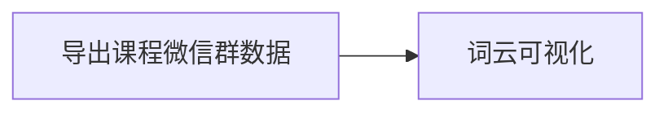

# 词云展示课程微信群内容

Updated 1700 GMT+8 Jan 10 2025

2024 fall, Complied by Hongfei Yan


导出课程微信群文本内容，并可视化为词云。展示出学期中积极参与讨论互动同学的姓名，以及课程内容关键词等信息。



<center>图. 工作流程图</center>


## 1.导出课程微信群文本数据

https://memotrace.cn，下载 MemoTrae-2.1.0.exe，143.9MB

https://github.com/LC044/WeChatMsg 提取的课程微信群文本内容。

需要在window平台中运行memoTrae软件。获得课程微信群文本数据 2024fall-cs101__Algo_DS.txt。


## 2.词云可视化

代码wechat_wordcloud.py

```python
import matplotlib.pyplot as plt
import jieba
from wordcloud import WordCloud
from collections import Counter
import random
import numpy as np #科学计算
from PIL import Image #处理图片
import os

def read_stopword(fpath):
    # 读取中文停用词表
    with open(fpath, 'r', encoding='utf-8') as file:
        stopword = file.readlines()
    return [word.replace('\n', '') for word in stopword]

#加载多个停用词表
path = './stopword'
# 前两个停用词表是网上下载的，第三个是自己设置的
name_list = ['cn_stopwords.txt', 'baidu_stopwords.txt', 'stopword.txt']

stop_word = []
for fname in name_list:
    stop_word += read_stopword(os.path.join(path, fname))
stop_word = set(stop_word)


#font_path = "/System/Library/Fonts/STHeiti Light.ttc"
font_path = "/System/Library/Fonts/STHeiti Medium.ttc"


with open('2024fall-cs101__Algo_DS.txt','r',encoding='utf8') as f:  #打开新的文本转码为gbk
        textfile= f.read()  #读取文本内容
wordlist = jieba.lcut(textfile)#切割词语
wordlist = [item.strip('\n') for item in wordlist]
space_list = ' '.join(wordlist)

# 统计词频
word_freq = Counter(wordlist)

# 打印词频结果
#for word, freq in word_freq.items():
#    print(f"{word}: {freq}")

# 随机生成词的颜色
def random_color_func(word, font_size, position, orientation, random_state=None, **kwargs):
    return f"hsl({random.randint(0, 255)}, {random.randint(60, 80)}%, {random.randint(40, 70)}%)"

mask = np.array(Image.open('blue.jpg')) 
# 创建词云对象，并设置词频作为词语大小
wordcloud = WordCloud(background_color="white",
                      #mode='RGB',
                      mask=mask,
                      stopwords = stop_word,
                      #stopwords=STOPWORDS.add('闫'),
                      #contour_width=1,
                      #contour_color='steelblue',
                      width=4000, height=4000, 
                      max_font_size=180,            #   显示字体的最大值
                      #random_state=40,             #   为每一词返回一个PIL颜色
                      #prefer_horizontal=10,        #   调整词云中字体水平和垂直的多少
                      color_func=random_color_func,
                      font_path=font_path)


# 生成词云图
#wordcloud.generate_from_frequencies(word_freq)
wordcloud.generate(space_list)

#wordcloud.fit_words(word_freq)
#image_color = ImageColorGenerator(mask)#设置生成词云的颜色，如去掉这两行则字体为默认颜色
#wordcloud.recolor(color_func=image_color)

# 显示词云图
plt.figure(figsize=(16, 16))
plt.imshow(wordcloud, interpolation='bilinear')
plt.axis('off')
plt.tight_layout(pad = 0) 
plt.show()


```


可以参照 Python制作词云图从未如此简单，https://zhuanlan.zhihu.com/p/138356932

源码中 29行 font_path，不同系统，需要做相应修改，我是mac。


outpu0.jpg,  是运行输出词云图，如图所示。


<center>图. 积极参与讨论互动的同学以及课程内容关键词</center>


### stopword 目录

stopword.txt是自己编辑，主要过滤了姓名。

容易分辨哪些同学参与了讨论，手动加在停用词表过滤了。否则词云显示出来很多同学的姓名。


其他文件下载自，https://github.com/goto456/stopwords

中文常用停用词表

| 词表名 | 词表文件 |
| - | - |
| 中文停用词表                   | cn\_stopwords.txt    |
| 哈工大停用词表                 | hit\_stopwords.txt   |
| 百度停用词表                   | baidu\_stopwords.txt |
| 四川大学机器智能实验室停用词库 | scu\_stopwords.txt   |


