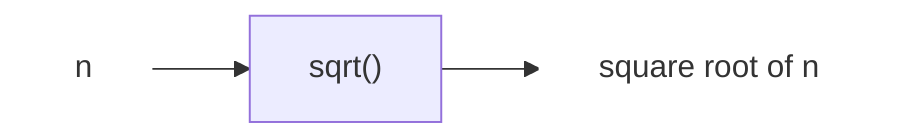

# 20240910-Week1-计算概论课程概述

Updated 1518 GMT+8 Sep 7, 2024

2024 fall, Complied by Hongfei Yan


**本周发布作业：**

assignment1, assignmentP

https://github.com/GMyhf/2024fall-cs101


作业评分标准

| 标准                                 | 等级                                             | 得分 |
| ------------------------------------ | ------------------------------------------------ | ---- |
| 按时提交                             | 1 得分提交，0.5 得分请假，0 得分未提交           | 1 分 |
| 源码、耗时（可选）、解题思路（可选） | 1 得分4或4+题目，0.5 得分2或2+题目，0 得分无源码 | 1 分 |
| AC代码截图                           | 1 得分4或4+题目，0.5 得分2或2+题目，0 得分无截图 | 1 分 |
| 清晰头像、pdf、md/doc                | 1 得分三项全，0.5 得分有二项，0 得分少于二项     | 1 分 |
| 学习总结和收获                       | 1 得分有，0 得分无                               | 1 分 |
| 总得分： 5 ，满分 5                  |                                                  |      |


# 一、课程安排

学习计算机科学与掌握其他高难度学科没什么不同。成功的唯一途径便是循序渐进地学习其中的核心思想。刚开始接触计算机科学的人，需要多多练习来加深理解，从而为学习更复杂的内容做好准备。此外，初学者需要建立起自信心。

“计算概论”，即“算法与数据结构”，通常是计算机科学专业的第一门课程，相较于第二门课程“数据结构与算法”，更强调算法。同学们已经准备好进一步探索这一领域并且进一步练习如何解决问题。

本课程旨在培养计算思维，包括数学思维和计算机思维。这种思维的培养需要结合实践过程中的思考和感悟。同学们将通过类似于阅读说明书的方法快速掌握编程语法，然后在应用算法解决实际问题的过程中深入体验计算思维的魅力。为此，我们将练习100余道习题，并提供简洁的解题思路供参考和比较。

课程知识点涵盖两部分。首先是培养学生对计算机的兴趣和学习具有重要意义的三个计算机原理。其次，重点是打牢编程基础，掌握各种算法的应用实践。具体来说：

第一部分，从计算机文化历史开始，讲到三个主要的计算机原理：图灵机、进程的虚拟地址空间和 ASCII 表。旨在激发同学的学习兴趣，对计算机建立感性和理性认识。

第二部分包括基本语法学习和编程练习。首先，学习 Python 和 C++ 语法 ，掌握与计算机进行交流的语言，侧重于讲授 Python 实现的代码，在两个编程平台上（codeforces.com, cs101.openjudge.cn）运用多种常见算法解决问题。一旦掌握了语法，会进一步练习更多的编程题目。

Python是一门非常适合于讲解算法的语言，语法干净简洁，用户环境直观，基本的数据类型十分强大和易用。

我们相信，对于初学者来说，投入时间学习与算法和数据结构相关的基本思想是非常有益的。


## 1 流水账事项

1.1 线下和线上教室

| 课程号和名: 04831410，计算概论(B)                            | 班号: 11                                                    |
| ------------------------------------------------------------ | ----------------------------------------------------------- |
| 上课时间: 1-16周 每周 周二 7-9节                             | 线下地点: 二教107                                           |
| 上机时间: 2-15周 每周 周四 7-8节<br/>期末机考时间: 2024.12.26 周四 7-8节<br/>期末笔试时间: 2025年1月7日下午 | 地点：7号机房（理科1号楼三层1339房间）和8号机房（1338房间） |
| 助教：熊江凯、罗熙佑、涂程颖、王嘉林、刘昊文                 | 助教在微信群中的名字是“TA-”开始，地点：理科1号楼1220        |

往年机考是6个题目，需要在机房完成。
往年笔试题目包括：填空15分、单选15分、计算题20分，编码应用题12分，程序阅读12分，程序填空10分，流程图与编程12分，问答4分。


主题：2024fall-cs101-ADS 计算概论（B）
时间：2024年9月～12月，每周二15:00~18:00 北京
加入Teams会议：
https://teams.microsoft.com/l/meetup-join/19%3ameeting_MGVhMWY3NmUtMGUxNi00YTM4LThkNDAtOGRhMjRkMjFiNmJl%40thread.v2/0?context=%7b%22Tid%22%3a%22cd66712e-8aa9-44ad-9e42-02ea2d037e64%22%2c%22Oid%22%3a%227fae1325-5f9b-401d-bd3f-42dd9a7d27b8%22%7d

Meeting ID: 467 329 315 882
Passcode: zSs3ve


1.2 课程安排

没有固定教材，会全面介绍在经典计算机科学问题中出现的算法和必要的数据结构。尽管在学习顺序上并无严格要求，但是许多话题之间都存在一定的依赖关系，建议顺序学习。

课程内容推进安排：首先定位是平行班，9月份以同学自主学习编程语法，10月份贪心、动态规划，11月份递归、搜索，12月份复习，1月份优秀！下表是具体16周的课程内容： 

| 1. 课程概述                     | 2. 计算机文化                   | 3. 开发环境和程序设计语言    |
| ------------------------------- | ------------------------------- | ---------------------------- |
| 4. 计算机原理                   | 5. 语法（1/2）：变量、操作符    | 6. 语法（2/2）：控制结构     |
| 7. 算法（1/6）：贪心和动态规划  | 8. 算法分析                     | 9. 信息传递和二维数组        |
| 10. 算法（2/6）：递归和动态规划 | 11. 算法（3/6）：递归和动态规划 | 12. 算法（4/6）：搜索（1/3） |
| 13. 算法（5/6）：搜索（2/3）    | 14. 算法（6/6）：搜索（3/3）    | 15~16. 课程总结（1/2、2/2）  |

### 

1.3 每周都有作业，完成时限是一周

Assignment1 和 AssignmentP已经发布。


1.4 编程平台

我们用到的编程平台主要是 http://cs101.openjudge.cn，https://codeforces.com 。


1.5 课程微信群

请同学修改课程微信群昵称为实名。

教助在自己姓名前面有 "TA-"，如：TA-熊江凯，TA-罗熙佑，TA-涂程颖，TA-王嘉林，TA-刘昊文


1.6 学生成绩评定方法上

第16周，来机考就可以。
我们采用综合评定方法对学生成绩进行评定。学生成绩分为三部分，大致占比是30%的成绩来自每周1次的作业（其中有3次作业对应3次月考）成绩，另外70%的成绩来自期末上机考试、笔试。我们注重学期中的学习过程评定，因此成绩评定不仅考虑学生的考试成绩，还综合考虑学生的平时表现和参与度。

10月、11月、12月，每个月初有一次月考（建议尽量在机房规定时间完成），月考题目也会留作当周作业。因为有月考，不安排期中考试。月考不计分，没有监考。都是周四上机时间，分别是 10月10日，11月7日，12月5日。


1.7 善用gpt

1）请善用gpt。poe.com需要翻墙。国内阿里的 通义千问也好用，https://tongyi.aliyun.com 。课程相关问题，都可以在课程微信群里面问。例如：考试时间、作业、上机、签到、大作业有否等。

2）课程网站使用 canvas, https://pku.instructure.com。学校通知canvas，在9月19日导入选课名单后启用。

3）可能需要北大学长提供的Clash，请自己取用。
https://189854.xyz/verify/
https://blog.189854.xyz/blog/walless/2023/11/04/clash.html


1.8 Canvas课程网站

教发中心通知，由于Canvas付费用户帐号数量有限（每全年仅支持3000多个师生用户），新学期Canvas用户数量将严格控制，学生名单将在补退选结束后导入（本科生9月19日，研究生9月24日）。特殊情况，请发邮件说明。

O365（含teams）账号申请链接：https://www.wjx.cn/vm/Y5XwfHD.aspx#


1.9 同学想选课，我都同意

我们班上课地点在二教107，有217个座位；上机地点7号机房学生机109台，8号102台。

选课权限在教务老师（目前看到是初设的120开课人数，提高到150，再提高到180），我这里不过滤都接收，需要手动选课签字等都没有问题。往年教务老师会根据选课情况统筹安排，比如调整到150，180或者更高到教室容量的上限。

任课教师和助教无权帮助学生选课。信息科学技术学院教务：董晓晖，地点：理科1号楼1118，电话：010-62755414，邮箱：[dxh@pku.edu.cn](mailto:dxh@pku.edu.cn)


1.10 2024 fall 上机说明

时间：2-16周每周四7-8节（15:10~17:00）。
地点：7号机房（理科1号楼三层1339房间）和8号机房（1338房间）。
使用机房电脑：打开电脑后，用学号和网关密码登陆，机房电脑有pycharm、anaconda/spyder和vscode。

同学可以选择去机房完成作业或其他编程练习，暂时没有固定座位，机房会有助教为大家答疑。
有助教因为校区较远，可能无法每次都线下参与，其余时间会以线上会议的方式参与上机课的答疑。如果学生不多，答疑有可能会集中在一个机房进行。

建议大家充分利用上机时间集中答疑，避免其他时间1对1找老师或助教debug。

另外：
1）网络问题，计算中心 62751023；
2）机房上机，账号/登录等问题，计算中心值班老师。
机房二楼值班室：理科一号楼1254W，电话：62753392
机房三楼值班室：理科一号楼1343W，电话：62753352


1.11 助教办公室答疑时间（从第2周开始），地点在理科1#1220E
涂程颖：周一，19:00-20:00
熊江凯：周二，19:00-20:00（线上）
罗熙佑：周三，19:00-20:00
王嘉林：周五，19:00-20:00


# 二、导论


## 1.1 本章目标

❏ 复习计算机科学、编程以及解决问题方面的知识。
❏ 理解抽象这一概念及其在解决问题的过程中所发挥的作用。
❏ **理解并建立抽象数据类型的概念**（这是本周课程重点）。
❏ 复习Python。


## 1.2 入门

自从第一台利用转接线和开关来传递计算指令的电子计算机诞生以来，人们对编程的认识历经了多次变化。与社会生活的其他许多方面一样，计算机技术的变革为计算机科学家提供了越来越多的工具和平台去施展他们的才能。高效的处理器、高速网络以及大容量内存等一系列新技术，要求计算机科学家掌握更多复杂的知识。然而，在这一系列快速的变革之中，仍有一些基本原则始终保持不变。计算机科学被认为是一门利用计算机来解决问题的学科。

本章会概述Python。尽管不会提供完整、详尽的Python参考资料，但是会针对阅读后续各章所需的基础知识及基本思想，给出示例以及相应的解释。


## 1.3 何谓计算机科学

要定义计算机科学，通常十分困难，这也许是因为其中的“计算机”一词。你可能已经意识到，计算机科学并不仅是研究计算机本身。尽管计算机在这一学科中是非常重要的工具，但也仅仅只是工具而已。

计算机科学的研究对象是问题、解决问题的过程，以及通过该过程得到的解决方案。给定一个问题，计算机科学家的目标是开发一个能够逐步解决该问题的**算法**。算法是具有有限步骤的过程，依照这个过程便能解决问题。因此，算法就是解决方案。

可以认为计算机科学就是研究算法的学科。但是必须注意，某些问题并没有解决方案。尽管这一话题已经超出了本书讨论的范畴，但是对于学习计算机科学的人来说，认清这一事实非常重要。结合上述两类问题，可以将计算机科学更完善地定义为：研究问题及其解决方案，以及研究目前无解的问题的学科。

在描述问题及其解决方案时，经常用到“**可计算**”一词。若存在能够解决某个问题的算法，那么该问题便是可计算的。因此，计算机科学也可以被定义为：研究可计算以及不可计算的问题，即研究算法的存在性以及不存在性。在上述任意一种定义中，“计算机”一词都没有出现。解决方案本身是独立于计算机的。

在研究问题解决过程的同时，计算机科学也研究**抽象**。抽象思维使得我们能分别从逻辑视角和物理视角来看待问题及其解决方案。举一个常见的例子。

试想你每天开车去上学或上班。作为车的使用者，你在驾驶时会与它有一系列的交互：坐进车里，插入钥匙，启动发动机，换挡，刹车，加速以及操作方向盘。从抽象的角度来看，这是从逻辑视角来看待这辆车，你在使用由汽车设计者提供的功能来将自己从某个地方运送到另一个地方。这些功能有时候也被称作**接口**。

另一方面，修车工看待车辆的角度与司机截然不同。他不仅需要知道如何驾驶，而且更需要知道实现汽车功能的所有细节：发动机如何工作，变速器如何换挡，如何控制温度，等等。这就是所谓的物理视角，即看到表面之下的实现细节。

使用计算机也是如此。大多数人用计算机来写文档、收发邮件、浏览网页、听音乐、存储图像以及打游戏，但他们并不需要了解这些功能的实现细节。大家都是从逻辑视角或者使用者的角度来看待计算机。计算机科学家、程序员、技术支持人员以及系统管理员则从另一个角度来看待计算机。他们必须知道操作系统的原理、网络协议的配置，以及如何编写各种脚本来控制计算机。他们必须能够控制用户不需要了解的底层细节。

上面两个例子的共同点在于，抽象的用户（或称客户）只需要知道接口是如何工作的，而并不需要知道实现细节。这些接口是用户用于与底层复杂的实现进行交互的方式。下面是抽象的另一个例子，来看看Python的math模块。一旦导入这一模块，便可以进行如下的计算。

```
>>> import math
>>> math.sqrt(16)
4.0
>>>
```

这是一个**过程抽象**的例子。我们并不需要知道平方根究竟是如何计算出来的，而只需要知道计算平方根的函数名是什么以及如何使用它。只要正确地导入模块，便可以认为这个函数会返回正确的结果。由于其他人已经实现了平方根问题的解决方案，因此我们只需要知道如何使用该函数即可。这有时候也被称为过程的“黑盒”视角。我们仅需要描述接口：函数名、所需参数，以及返回值。所有的计算细节都被隐藏了起来，如图1-1所示。




 图1-1 过程抽象


### 1.3.1 何谓编程

编程是指通过编程语言将算法编码以使其能被计算机执行的过程。尽管有众多的编程语言和不同类型的计算机，但是首先得有一个解决问题的算法。如果没有算法，就不会有程序。

计算机科学的研究对象并不是编程。但是，编程是计算机科学家所做工作的一个重要组成部分。通常，编程就是为解决方案创造表达方式。因此，编程语言对算法的表达以及创造程序的过程是这一学科的基础。

通过定义表达问题实例所需的数据，以及得到预期结果所需的计算步骤，算法描述出了问题的解决方案。编程语言必须提供一种标记方式，用于表达过程和数据。为此，编程语言提供了众多的控制语句和数据类型。Programming is often the way that we create a representation for our solutions. Therefore, this language representation and the process of creating it becomes a fundamental part of the discipline.

控制语句使算法步骤能够以一种方便且明确的方式表达出来。算法至少需要能够进行顺序执行、决策分支、循环迭代的控制语句。只要一种编程语言能够提供这些基本的控制语句，它就能够被用于描述算法。

计算机中的所有数据实例均由二进制字符串来表达。为了赋予这些数据实际的意义，必须要有**数据类型**。数据类型能够帮助我们解读二进制数据的含义，从而使我们能从待解决问题的角度来看待数据。这些內建的底层数据类型（又称原生数据类型）提供了算法开发的基本单元。

举例来说，大部分编程语言都为整数提供了相应的数据类型。根据整数（如23、654以及-19）的常见定义，计算机内存中的二进制字符串可以被理解成整数。除此以外，数据类型也描述了该类数据能参与的所有运算。对于整数来说，就有加减乘除等常见运算。并且，对于数值类型的数据，以上运算均成立。

我们经常遇到的困难是，问题及其解决方案都过于复杂。尽管由编程语言提供的简单的控制语句和数据类型能够表达复杂的解决方案，但它们在解决问题的过程中仍然存在不足。因此，我们需要想办法控制复杂度以利于找到解决方案。


### 1.3.2 为何学习数据结构及抽象数据类型

为了控制问题及其求解过程的复杂度，计算机科学家利用抽象来帮助自己专注于全局，从而避免迷失在众多细节中。通过对问题进行建模，可以更高效地解决问题。模型可以帮助计算机科学家更一致地描述算法要用到的数据。

如前所述，过程抽象将功能的实现细节隐藏起来，从而使用户能从更高的视角来看待功能。**数据抽象**的基本思想与此类似。**抽象数据类型**（有时简称为ADT）从逻辑上描述了如何看待数据及其对应运算而无须考虑具体实现。这意味着我们仅需要关心数据代表了什么，而可以忽略它们的构建方式。通过这样的抽象，我们对数据进行了一层封装，其基本思想是封装具体的实现细节，使它们对用户不可见，这被称为信息隐藏。

图1-2展示了抽象数据类型及其原理。用户通过利用抽象数据类型提供的操作来与接口交互。抽象数据类型是与用户交互的外壳。真正的实现则隐藏在内部。用户并不需要关心各种实现细节。


图1-2 抽象数据类型

抽象数据类型的实现常被称为**数据结构**，这需要我们通过编程语言的语法结构和原生数据类型从物理视角看待数据。正如之前讨论的，分成这两种不同的视角有助于为问题定义复杂的数据模型，而无须考虑模型的实现细节。这便提供了一个独立于实现的数据视角。由于实现抽象数据类型通常会有很多种方法，因此**独立于实现**的数据视角使程序员能够改变实现细节而不影响用户与数据的实际交互。用户能够始终专注于解决问题。


### 1.3.3 为何学习算法

计算机科学家通过经验来学习：观察他人如何解决问题，然后亲自解决问题。接触各种问题解决技巧并学习不同算法的设计方法，有助于解决新的问题。通过学习一系列不同的算法，可以举一反三，从而在遇到类似的问题时，能够快速加以解决。

各种算法之间往往差异巨大。回想前文提到的平方根的例子，完全可能有多种方法来实现计算平方根的函数。算法一可能使用了较少的资源，算法二返回结果所需的时间可能是算法一的10倍。我们需要某种方式来比较这两种算法。尽管这两种算法都能得到结果，但是其中一种可能比另一种“更好”——更高效、更快，或者使用的内存更少。随着对算法的进一步学习，你会掌握比较不同算法的分析技巧。这些技巧只依赖于算法本身的特性，而不依赖于程序或者实现算法的计算机的特性。

最坏的情况是遇到难以解决的问题，即没有算法能够在合理的时间内解决该问题。因此，至关重要的一点是，要能区分有解的问题、无解的问题，以及虽然有解但是需要过多的资源和时间来求解的问题。

在选择算法时，经常会有所权衡。除了有解决问题的能力之外，计算机科学家也需要知晓如何评估一个解决方案。总之，问题通常有很多解决方案，如何找到一个解决方案并且确定其为优秀的方案，是需要反复练习、熟能生巧的。


## 1.4 Python基础

本节将复习Python，并且为前一节提到的思想提供更详细的例子。如果你刚开始学习Python或者觉得自己需要更多的信息，建议你查看本书结尾列出的Python资源。本节的目标是帮助你复习Python并且强化一些会在后续各章中变得非常重要的概念。
Python是一门现代、易学、面向对象的编程语言。它拥有强大的內建数据类型以及简单易用的控制语句。由于Python是一门解释型语言，因此只需要查看和描述交互式会话就能进行学习。你应该记得，解释器会显示提示符>>>，然后计算你提供的Python语句。例如，以下代码显示了提示符、print函数、结果，以及下一个提示符。

```
>>> print("Algorithms and Data Structures")
>>> Algorithms and Data Structures
>>>
```




### 1.4.1 数据

前面提到，Python支持面向对象编程范式。这意味着Python认为数据是问题解决过程中的关键点。在Python以及其他所有面向对象编程语言中，类都是对数据的构成（状态）以及数据能做什么（行为）的描述。由于类的使用者只能看到数据项的状态和行为，因此类与抽象数据类型是相似的。在面向对象编程范式中，数据项被称作对象。一个对象就是类的一个实例。

#### 1．内建原子数据类型

我们首先复习原子数据类型。Python有两大內建数据类实现了整数类型和浮点数类型，相应的Python类就是int和float。标准的数学运算符，即+、-、＊、/以及＊＊（幂），可以和能够改变运算优先级的括号一起使用。其他非常有用的运算符包括取余（取模）运算符%，以及整除运算符//。注意，当两个整数相除时，其结果是一个浮点数，而整除运算符截去小数部分，只返回商的整数部分。

Python通过bool类实现对表达真值非常有用的布尔数据类型。布尔对象可能的状态值是True或者False，布尔运算符有and、or以及not。

布尔对象也被用作相等（==）、大于（>）等比较运算符的计算结果。此外，结合使用关系运算符与逻辑运算符可以表达复杂的逻辑问题。表1-1展示了关系运算符和逻辑运算符。

表1-1 关系运算符和逻辑运算符

| **Operation Name**    | **Operator** | **Explanation**                                              |
| :-------------------- | :----------- | :----------------------------------------------------------- |
| less than             | <            | Less than operator                                           |
| greater than          | >            | Greater than operator                                        |
| less than or equal    | <=           | Less than or equal to operator                               |
| greater than or equal | >=           | Greater than or equal to operator                            |
| equal                 | ==           | Equality operator                                            |
| not equal             | !=           | Not equal operator                                           |
| logical and           | $and$        | Both operands True for result to be True                     |
| logical or            | $or$         | One or the other operand is True for the result to be True   |
| logical not           | $not$        | Negates the truth value, False becomes True, True becomes False |


标识符在编程语言中被用作名字。Python中的标识符以字母或者下划线（_）开头，区分大小写，可以是任意长度。需要记住的一点是，采用能表达含义的名字是良好的编程习惯，这使程序代码更易阅读和理解。

当一个名字第一次出现在赋值语句的左边部分时，会创建对应的Python变量。赋值语句将名字与值关联起来。变量存的是指向数据的引用，而不是数据本身。

赋值语句改变了变量的引用，这体现了Python的动态特性。同样的变量可以指向许多不同类型的数据。

#### 2．内建集合数据类型

除了数值类和布尔类，Python还有众多强大的內建集合类。列表、字符串以及元组是概念上非常相似的有序集合，但是只有理解它们的差别，才能正确运用。集（set）和字典是无序集合。

**列表**是零个或多个指向Python数据对象的引用的有序集合，通过在方括号内以逗号分隔的一系列值来表达。空列表就是[ ]。列表是异构的，这意味着其指向的数据对象不需要都是同一个类，并且这一集合可以被赋值给一个变量。

由于列表是有序的，因此它支持一系列可应用于任意Python序列的运算，如表1-2所示。

表1-2 可应用于任意Python序列的运算

| **Operation Name** | **Operator** | **Explanation**                         |
| :----------------- | :----------- | :-------------------------------------- |
| indexing           | [ ]          | Access an element of a sequence         |
| concatenation      | +            | Combine sequences together              |
| repetition         | *            | Concatenate a repeated number of times  |
| membership         | in           | Ask whether an item is in a sequence    |
| length             | len          | Ask the number of items in the sequence |
| slicing            | [ : ]        | Extract a part of a sequence            |


需要注意的是，列表和序列的下标从0开始。myList[1:3]会返回一个包含下标从1到2的元素列表（并没有包含下标为3的元素）。
如果需要快速初始化列表，可以通过重复运算来实现，如下所示。

```
>>> myList = [0] ＊ 6
>>> myList 
[0, 0, 0, 0, 0, 0]
```

非常重要的一点是，重复运算返回的结果是序列中指向数据对象的引用的重复。下面的例子可以很好地说明这一点。

```
>>> myList = [1,2,3,4]
>>> A = [myList]＊3
>>> A
[[1, 2, 3, 4], [1, 2, 3, 4], [1, 2, 3, 4]]
>>> myList[2] = 45
>>> A 
[[1, 2, 45, 4], [1, 2, 45, 4], [1, 2, 45, 4]]
```

变量A包含3个指向myList的引用。myList中的一个元素发生改变，A中的3处都随即改变。
列表支持一些用于构建数据结构的方法，如表1-3所示。后面的例子展示了用法。


表1-3 Python列表提供的方法

| **Method Name** | **Use**                | **Explanation**                                     |
| :-------------- | :--------------------- | :-------------------------------------------------- |
| `append`        | `alist.append(item)`   | Adds a new item to the end of a list                |
| `insert`        | `alist.insert(i,item)` | Inserts an item at the ith position in a list       |
| `pop`           | `alist.pop()`          | Removes and returns the last item in a list         |
| `pop`           | `alist.pop(i)`         | Removes and returns the ith item in a list          |
| `sort`          | `alist.sort()`         | Modifies a list to be sorted                        |
| `reverse`       | `alist.reverse()`      | Modifies a list to be in reverse order              |
| `del`           | `del alist[i]`         | Deletes the item in the ith position                |
| `index`         | `alist.index(item)`    | Returns the index of the first occurrence of `item` |
| `count`         | `alist.count(item)`    | Returns the number of occurrences of `item`         |
| `remove`        | `alist.remove(item)`   | Removes the first occurrence of `item`              |

你会发现，像pop这样的方法在返回值的同时也会修改列表的内容，reverse等方法则仅修改列表而不返回任何值。pop默认返回并删除列表的最后一个元素，但是也可以用来返回并删除特定的元素。这些方法默认下标从0开始。你也会注意到那个熟悉的句点符号，它被用来调用某个对象的方法。

range是一个常见的Python函数，我们常把它与列表放在一起讨论。range会生成一个代表值序列的范围对象。使用list函数，能够以列表形式看到范围对象的值。

范围对象表示整数序列。默认情况下，它从0开始。如果提供更多的参数，它可以在特定的点开始和结束，并且跳过中间的值。在第一个例子中，range(10)从0开始并且一直到9为止（不包含10）；在第二个例子中，range(5,10)从5开始并且到9为止（不包含10）; range(5,10,2)的结果类似，但是元素的间隔变成了2（10还是没有包含在其中）。

**字符串**是零个或多个字母、数字和其他符号的有序集合。这些字母、数字和其他符号被称为字符。常量字符串值通过引号（单引号或者双引号均可）与标识符进行区分。

由于字符串是序列，因此之前提到的所有序列运算符都能用于字符串。此外，字符串还有一些特有的方法，表1-4列举了其中一些。

表1-4 Python字符串提供的方法

| **Method Name** | **Use**                | **Explanation**                                           |
| :-------------- | :--------------------- | :-------------------------------------------------------- |
| `center`        | `astring.center(w)`    | Returns a string centered in a field of size `w`          |
| `count`         | `astring.count(item)`  | Returns the number of occurrences of `item` in the string |
| `ljust`         | `astring.ljust(w)`     | Returns a string left-justified in a field of size `w`    |
| `lower`         | `astring.lower()`      | Returns a string in all lowercase                         |
| `rjust`         | `astring.rjust(w)`     | Returns a string right-justified in a field of size `w`   |
| `find`          | `astring.find(item)`   | Returns the index of the first occurrence of `item`       |
| `split`         | `astring.split(schar)` | Splits a string into substrings at `schar`                |

split在处理数据的时候非常有用。split接受一个字符串，并且返回一个由分隔字符作为分割点的字符串列表。

列表和字符串的主要区别在于，列表能够被修改，字符串则不能。列表的这一特性被称为可修改性。列表具有可修改性，字符串则不具有。

由于都是异构数据序列，因此元组与列表非常相似。它们的区别在于，元组和字符串一样是不可修改的。元组通常写成由括号包含并且以逗号分隔的一系列值。与序列一样，元组允许之前描述的任一操作。

集（set）是由零个或多个不可修改的Python数据对象组成的无序集合。集不允许重复元素，并且写成由花括号包含、以逗号分隔的一系列值。空集由set()来表示。集是异构的。

尽管集是无序的，但它还是支持之前提到的一些运算，如表1-5所示。

表1-5 Python集支持的运算

| **Operation Name** | **Operator**       | **Explanation**                                              |
| :----------------- | :----------------- | :----------------------------------------------------------- |
| membership         | in                 | Set membership                                               |
| length             | len                | Returns the cardinality of the set                           |
| `|`                | `aset | otherset`  | Returns a new set with all elements from both sets           |
| `&`                | `aset & otherset`  | Returns a new set with only those elements common to both sets |
| `-`                | `aset - otherset`  | Returns a new set with all items from the first set not in second |
| `<=`               | `aset <= otherset` | Asks whether all elements of the first set are in the second |

集支持一系列方法，如表1-6所示。在数学中运用过集合概念的人应该对它们非常熟悉。Note that `union`, `intersection`, `issubset`, and `difference` all have operators that can be used as well.

Note that `union`, `intersection`, `issubset`, and `difference` all have operators that can be used as well.


表1-6 Python集提供的方法

| **Method Name** | **Use**                       | **Explanation**                                              |
| :-------------- | :---------------------------- | :----------------------------------------------------------- |
| `union`         | `aset.union(otherset)`        | Returns a new set with all elements from both sets           |
| `intersection`  | `aset.intersection(otherset)` | Returns a new set with only those elements common to both sets |
| `difference`    | `aset.difference(otherset)`   | Returns a new set with all items from first set not in second |
| `issubset`      | `aset.issubset(otherset)`     | Asks whether all elements of one set are in the other        |
| `add`           | `aset.add(item)`              | Adds item to the set                                         |
| `remove`        | `aset.remove(item)`           | Removes item from the set                                    |
| `pop`           | `aset.pop()`                  | Removes an arbitrary element from the set                    |
| `clear`         | `aset.clear()`                | Removes all elements from the set                            |


字典是无序结构，由相关的元素对构成，其中每对元素都由一个键和一个值组成。这种键-值对通常写成键：值的形式。字典由花括号包含的一系列以逗号分隔的键-值对表达，

可以通过键访问其对应的值，也可以向字典添加新的键-值对。访问字典的语法与访问序列的语法十分相似，只不过是使用键来访问，而不是下标。添加新值也类似。

需要谨记，字典并不是根据键来进行有序维护的。键的位置是由散列来决定的，后续章节会详细介绍散列。len函数对字典的功能与对其他集合的功能相同。

字典既有运算符，又有方法。表1-7和表1-8分别展示了它们。keys、values和items方法均会返回包含相应值的对象。可以使用list函数将字典转换成列表。在表1-8中可以看到，get方法有两种版本。如果键没有出现在字典中，get会返回None。然而，第二个可选参数可以返回特定值。

表1-7 Python字典支持的运算

| **Operator** | **Use**          | **Explanation**                                              |
| :----------- | :--------------- | :----------------------------------------------------------- |
| `[]`         | `myDict[k]`      | Returns the value associated with `k`, otherwise its an error |
| `in`         | `key in adict`   | Returns `True` if key is in the dictionary, `False` otherwise |
| `del`        | del `adict[key]` | Removes the entry from the dictionary                        |


表1-8 Python字典提供的方法

| **Method Name** | **Use**            | **Explanation**                                              |
| :-------------- | :----------------- | :----------------------------------------------------------- |
| `keys`          | `adict.keys()`     | Returns the keys of the dictionary in a dict_keys object     |
| `values`        | `adict.values()`   | Returns the values of the dictionary in a dict_values object |
| `items`         | `adict.items()`    | Returns the key-value pairs in a dict_items object           |
| `get`           | `adict.get(k)`     | Returns the value associated with `k`, `None` otherwise      |
| `get`           | `adict.get(k,alt)` | Returns the value associated with `k`, `alt` otherwise       |


### 1.4.2 输入与输出

程序经常需要与用户进行交互，以获得数据或者提供某种结果。目前的大多数程序使用对话框作为要求用户提供某种输入的方式。尽管Python确实有方法来创建这样的对话框，但是可以利用更简单的函数。Python提供了一个函数，它使得我们可以要求用户输入数据并且返回一个字符串的引用。这个函数就是input。

input函数接受一个字符串作为参数。由于该字符串包含有用的文本来提示用户输入，因此它经常被称为提示字符串。

不论用户在提示字符串后面输入什么内容，都会被存储在aName变量中。使用input函数，可以非常简便地写出程序，让用户输入数据，然后再对这些数据进行进一步处理。

需要注意的是，input函数返回的值是一个字符串，它包含用户在提示字符串后面输入的所有字符。如果需要将这个字符串转换成其他类型，必须明确地提供类型转换。

格式化字符串
print函数为输出Python程序的值提供了一种非常简便的方法。它接受零个或者多个参数，并且将单个空格作为默认分隔符来显示结果。通过设置sep这一实际参数可以改变分隔符。此外，每一次打印都默认以换行符结尾。这一行为可以通过设置实际参数end来更改。

更多地控制程序的输出格式经常十分有用。幸运的是，Python提供了另一种叫作格式化字符串的方式。格式化字符串是一个模板，其中包含保持不变的单词或空格，以及之后插入的变量的占位符。


### 1.4.3 控制结构

算法需要两个重要的控制结构：迭代和分支。Python通过多种方式支持这两种控制结构。程序员可以根据需要选择最有效的结构。

对于迭代，Python提供了标准的while语句以及非常强大的for语句。while语句会在给定条件为真时重复执行一段代码。


分支语句允许程序员进行询问，然后根据结果，采取不同的行动。绝大多数的编程语言都提供两种有用的分支结构：if else和if。

和其他所有控制结构一样，分支结构支持嵌套，一个问题的结果能帮助决定是否需要继续问下一个问题。

另一种表达嵌套分支的语法是使用elif关键字。将else和下一个if结合起来，可以减少额外的嵌套层次。注意，最后的else仍然是必需的，它用来在所有分支条件都不满足的情况下提供默认分支。


列表可以可以不通过迭代结构和分支结构来创建，这种方式被称为列表解析式。通过列表解析式，可以根据一些处理和分支标准轻松创建列表。Returning to lists, there is an alternative method for creating a list that uses iteration and selection constructs known as a **list comprehension**. A list comprehension allows you to easily create a list based on some processing or selection criteria. 


### 1.4.4 异常处理

在编写程序时通常会遇到两种错误。第一种是语法错误，也就是说，程序员在编写语句或者表达式时出错。

第二种是逻辑错误，即程序能执行完成但返回了错误的结果。这可能是由于算法本身有错，或者程序员没有正确地实现算法。有时，逻辑错误会导致诸如除以0、越界访问列表等非常严重的情况。这些逻辑错误会导致运行时错误，进而导致程序终止运行。通常，这些运行时错误被称为异常。

许多初级程序员简单地把异常等同于引起程序终止的严重运行时错误。然而，大多数编程语言都提供了让程序员能够处理这些错误的方法。此外，程序员也可以在检测到程序执行有问题的情况下自己创建异常。
当异常发生时，我们称程序“抛出”异常。可以用try语句来“处理”被抛出的异常。


### 1.4.5 定义函数

之前的过程抽象例子调用了Python数学模块中的sqrt函数来计算平方根。通常来说，可以通过定义函数来隐藏任何计算的细节。函数的定义需要一个函数名、一系列参数以及一个函数体。函数也可以显式地返回一个值。


## 1.5 Summary

- Computer science is the study of problem solving.
- Computer science uses abstraction as a tool for representing both processes and data.
- Abstract data types allow programmers to manage the complexity of a problem domain by hiding the details of the data.
- Python is a powerful, yet easy-to-use, object-oriented language.
- Lists, tuples, and strings are built in Python sequential collections.
- Dictionaries and sets are nonsequential collections of data.
- Classes allow programmers to implement abstract data types.
- Programmers can override standard methods as well as create new methods.
- Classes can be organized into hierarchies.
- A class constructor should always invoke the constructor of its parent before continuing on with its own data and behavior.


## 1.6 Key Terms

| abstract data type         | abstraction        | algorithm              |
| -------------------------- | ------------------ | ---------------------- |
| class                      | computable         | data abstraction       |
| data structure             | data type          | deep equality          |
| dictionary                 | encapsulation      | exception              |
| format operator            | formatted strings  | HAS-A relationship     |
| implementation-independent | information hiding | inheritance            |
| inheritance hierarchy      | interface          | IS-A relationship      |
| list                       | list comprehension | method                 |
| mutability                 | object             | procedural abstraction |
| programming                | prompt             | `self`                 |
| shallow equality           | simulation         | string                 |
| subclass                   | superclass         | truth table            |


# 三、题目

27653:Fraction类

http://cs101.openjudge.cn/2024sp_routine/27653/


# 参考

Python数据结构与算法分析(第2版)，布拉德利·米勒 戴维·拉努姆/吕能,刁寿钧译，出版时间:2019-09

Brad Miller and David Ranum, Problem Solving with Algorithms and Data Structures using Python, https://runestone.academy/ns/books/published/pythonds/index.html


