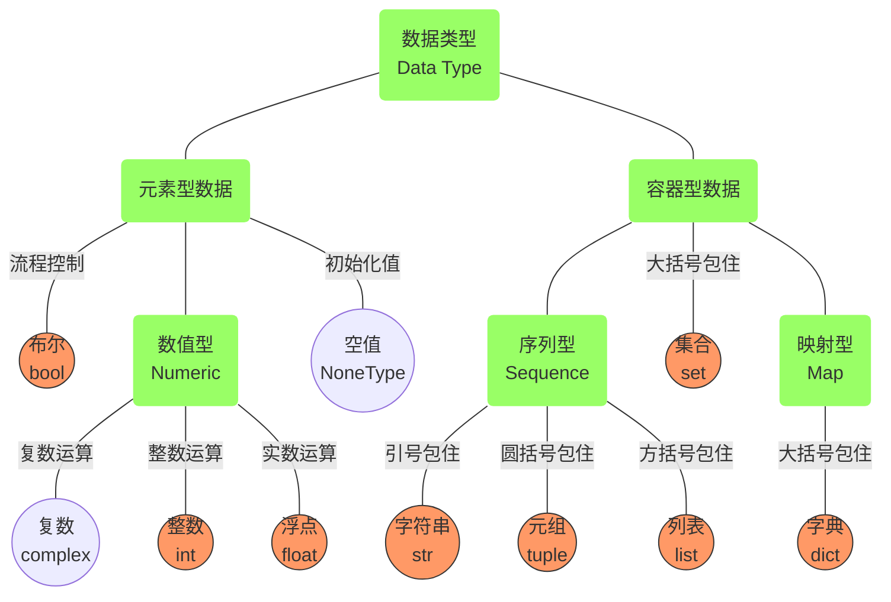

# 20241008-Week5-黎明/My flight

Updated 1105 GMT+8 Oct 8, 2024

2024 fall, Complied by Hongfei Yan


已经进入第五周了，这标志着一个学期的时间已经过去了三分之一，真是光阴似箭。

机房位置安排-20241003.xls发布，第一次月考：2024.10.10 周四 7-8节。

考试时候只有 G++,Python：OJ上面 Python的时限是10倍（因为Python程序跑的慢），C/C++是没有放宽的。洛谷 上面Python吃亏，因为没有放宽时限，拼不过C/C++。

> **2024fall 计概B 十月模考出题安排**
>
> 题目难度暂定三档，参考CF, 800~900, 1000~1100，1200～1400。
>
> 每个题目
> 1）时间限制1000ms（如需要可加大），内存限制：65536KB（如需要可加大）。时间和内存如果需要修改，请注明。
> 2）题面需要中英文双语。其中变量，给出范围。
> 3）内容包括：描述、输入、输出、两组样例数据，及输出的必要解释。
> 4）每个题目20组数据。另外，提供几组考虑边界或者特殊情况的手搓数据（可选）。
> 5）给出题目类型tags和难度，例如：sortings, strings, implementation, 1100。
> 6）可以是搬来的题目，如从 codeforces.com,  leetcode.cn, luogu.com.cn搬来，注明出处。例如给出link，或者 Leetcode 1552。


> **2023fall 题目设计考虑**
>
> Updated 0934 GMT+8 Dec 25, 2023
>
> 1. 考察知识点：题目应涵盖语法、数据结构和算法等主要知识点，以测试学生对这些知识的理解和应用能力。
>
> 2. 难度控制：Easy题目大约需要10分钟完成；Medium题目大约需要20分钟完成；Tough题目因为每个学生的能力不同，因人而异。
>
> 3. 难度水平：题目的难度低于12份月考和平时最难的几次作业，以确保大多数学生都能够应对。
>
> 4. 简洁性：在题目设计时应避免设计过于繁琐的模拟题目，尽量保持简洁明了，突出重点。
>
> 5. 可解性：题目设计时应避免设计过于困难或者难以找到思路的题目，如高级贪心题目。学生应该能够有一定的思路来解决问题。
>
> 6. 知识点整合：可以将不同的知识点进行组合，例如结合数据结构、常规的贪心算法和动态规划等，以提高题目的综合性和难度。
>
> 7. 单一问题：除非特意增加难度，题目设计时尽量避免设计一题多问的情况，让学生集中精力解决一个问题。
>
> 8. 学生掌握情况：题目设计应根据班级大多数学生的掌握情况，确保题目的难度与学生的水平相匹配，既不过于简单也不过于困难。
>
> 9. 考试2小时：在考试前，学生应保持最佳状态，==充足的睡眠和身体健康非常重要==，这样才能发挥最佳水平。


# 一、Book 计算思维算法实践ch1&ch2 

引自《 计算思维算法实践》/Book_my_flight

## 前言

### 致使用本书的学生

当我们阅读时，另一个人替我们思考：我们只是重复他的思维过程。

When we read, another person thinks for us: we merely repeat his mental process. 

——叔本华


​	计算思维离不了从数学的角度和计算机的角度考虑问题，有时候也涉及到对物理知识的应用。很多题目是对现实问题的再现、简化或变形，因此解题是训练新手解决现实问题的一种有效手段。在解题过程中，学习者需要保持清晰的思路缜密的逻辑，形成思考问题的方式方法，如此日积月累，自然而然就会养成计算思维。下面摘录两位初学者在培养计算思维的过程中给出的心得体会。

​	掌握了编程语言的语法后，学习的重点就转移到结合具体的题目体会解题中的思维方式。本书为练习题目选择了两个主要的编程平台，https://codeforces.com/（记为 CF），和 http://openjudge.cn/ （记为 OJ）。Codeforces 是国外著名的编程竞赛平台。题目种类丰富、分为不同的难度等级，还提供测试数据。很多题目非常有意思，有不少陷阱，很能训练思维。该平台最为友好的地方是代码和解题思路是公开的，能看到很多高水平的代码。题目页面右下角可以看到题目的 tags 和 tutorial 解题思路提示。如果想查看某个题目其他人提交的代码，替换链接中数字和最后一个字母，例如查看580C 可以访问

http://codeforces.com/problemset/status/580/problem/C。

​	Openjudge是北京大学研制的 ACM 训练和相关程序课程在线练习、考试系统，国内有很多高校和兴趣社区在其中开设了自己的小组，用户可以加到各个小组中做题。本书涉及到的中文题目都在 cs101 小组，所以文中出现的 OJ 通常指 http://cs101.openjudge.cn。OJ 上面的题目没有给出难度分类，因此本书特意给出了部分题目的难度分类作为示例，便于初学者从简单题目开始练习。在 OJ 上找到题目的方法是，访问 http://cs101.openjudge.cn/, 登录后，点击“加入”按钮（ 表示加入"cs101"组，只需要初次访问时候加入 1 次），然后点击 “题库（包括计概、数算题目）。 其中编号小于等于04152的题目是从“百练”小组 http://bailian.openjudge.cn/ 引入到 cs101 小组的，因此题目 ID 尽量保持末四位一致。如"装箱问题"的题目 ID 是 01017，对应百练小组中的 1017 题目。

​	在这些平台上编程所用的语言主要选择 Python。个别题目超时不能 AC 时选择 C++。选用 Python 语言对于学习编程的人来说有个特别大的好处：有的题目用 C++ 写就直接 AC 了，但是用 Python 写会超时，这种情况下，学习者会琢磨**如何优化，比如分析时间复杂度、更换算法**等，这对于理解计算机相关原理特别有帮助。问题求解的关键在于算法，因此如何想到解决问题的办法是思维训练的重点，相比而言，语言之间的可移植性、代码的模块化程度和执行效率等方面的差异已经变得不那么重要了。

​	各个知识点对应的题目难度怎么定呢？本书采用多个平台横向比较，按照经验进行了对应。如图P-1所示，是国内比较知名的算法和程序设计类题库洛谷（http://luogu.com.cn/），其中的 “普及/提高-” 级别大致对应CF 中题目难度范围为 “1200~1600”；“入门” 级别大致对应CF中 “800~1000”的范畴。学习者可以通过了解编程语法入门，而后通过有适配难度的题目进行思维训练，将解决问题的能力上升到更高的高度。


<center>图P-1. 洛谷网站的题目难度分级（截止 2021 年 12 月）</center>


### 致使用本书的教师

​	本书的编写初衷是想将《计算概论》教学中积累的内容进行系统整理，使之成为以培养计算思维算法实践为目标的合适教材。因此本节在表P-1附上笔者 2021 年秋季学期《计算概论》课程安排，供阅读本书的教学工作者参考。第3章的附录 3A 初学编程常见问题，附录 3B 是 课程作业和两位选课学生提供的答案。一学期有 16 周，每周 3 学时，练习到的题目约为100~120 个。实践题目分布在 CF 和 OJ 两个编程平台上，在OJ平台的课程小组中有作者教学团队贡献的题目。

​	为了避免编程平台偶尔的访问故障、题目网址的变化，并确保本书的完整性，书中对题目给出了描述信息，及访问链接。所有题目均给出我们的题解以及简单明了的解题思路，下载地址是 https://github.com/GMyhf/2020fall-cs101。这些内容来自教师、助教，甚至选课学生的贡献，也包括从网上或者其他书籍整理借鉴的部分内容，对于这类内容，本书已尽可能详细地列出了参考来源，如有遗漏将尽量及时更正。

​	简明的解题思路在启发思考、激活联想中非常重要，如果能用一两句话说明的，就尽量避免冗长叙述。本着这一原则，本书有些题目的解题思路会甄选学习亲历者给出的言简意赅、具有点睛效果的解题思路。


表P-1 北京大学2021年秋季学期《计算概论》课程安排

| 1. 课程介绍和概述      | 2. Python语法                |
| ---------------------- | ---------------------------- |
| 3. 计算机发展简史      | 4. 开发环境、程序语言        |
| 5. 月考、习题总结      | 6. 数据类型                  |
| 7. 控制结构（1/2）     | 8. 控制结构（2/2）           |
| 9. 月考、二维数组      | 10. 递归、动态规划（1/2）    |
| 11. 动态规划（2/2）    | 12. DFS搜索                  |
| 13. 月考、算法分析     | 14. BFS搜索                  |
| 15. 课程总结、习题总结 | 16. 课时允许情况下的拓展项目 |


​	本书精心选择了难度在“普及/提高-”级别的120个题目，分门别类组织到如图P-2所示的编程题目类型框架中，供有需要的学习者和教学者参考。其中非算法类题目 69 个，算法类题目 51 个，如表P-2 所示。算法类题目重点学习①贪心、②动态规划和③图搜索，学习者可以参照这个划分选择自己先从哪里入手。


<center>图P-2 编程题目类型框架</center>


表P-2 每种题目类型需要练习的数目

| 题目类型 | 题目数                         |
| -------- | ------------------------------ |
| 语法     | 44（至少需要练习其中的 30 个） |
| 数学     | 18（其中 10 个是矩阵相关）     |
| 数据结构 | 7                              |
| 贪心     | 18                             |
| 动态规划 | 13                             |
| 递归     | 3                              |
| 二分查找 | 3                              |
| 图搜索   | 14                             |


​	编程题目中的非算法题是基础，侧重从计算机的工作模式来解决问题。算法题则通常既要了解计算机工作模式，又要结合数学的思考方法，并使用恰当的数据结构。算法是一步一步解决问题的过程，一个好的算法在时间或空间方面具有优势，不同类型的题目需要不同的算法来解决，同一个题目可能用不同的算法来解决。基本算法包括`穷举`（brute force）、`贪心`（greedy）、`动态规划`（Dynamic Programming, DP）、`深度优先搜索`（Depth First Search, DFS，是一种回溯法）、`广度优先搜索`（Breath First Search, BFS）、`二分查找` （binary search）和`递归`（recursive）。其中尤为重要的三类算法是：贪心、动态规划和回溯法。非算法题目包括：`语法`类、`数学`类和`数据结构`类。它们主要侧重语法的掌握以及对数据结构的熟悉和运用。因为 Python 等高级语言通常已将排序函数进行了很好的包装并提供调用，所以本章不单独列出排序算法一类，但冒泡排序稍有例外，它的本质是贪心法，因此在书中贪心算法一节会带出这个知识点。此外，虽然高级语言也经常会提供二分查找的现成函数，但是往往不满足需求，多数还需要自己实现。博弈和并查集算法也是现实中常见的问题，本书把博弈归入了数学类，并查集归入了数据结构部分。加入这两种问题的相关算法也是为了拓展读者的解题思路。

​	计算思维算法实践学习建议：

1）初学者可以从非算法题目中的语法部分开始，以熟练掌握编程语言的数据类型和两种控制结构为主要目标，对应3.2节。鉴于 CF 平台提供测试数据，所以推荐在 CF 上找难度为 800~1000 的题目开始练习，如果对英文题面有畏难情绪，也可以在 OJ 平台进行。语法题目通常涉及到简单计算、 排序、字符串、穷举和模拟实现等类型。语法题目至少需要练习其中的 30 个，有基础或者进展快的读者可以相应减少本部分的练习数目。另外，穷举是很直观的算法，因此本书把穷举型题目归入了语法类；排序题目可直接使用 Python 编程语言提供的函数来实现就可以。

2）`数学`类题目对应3.2节，主要是考察用数学知识解决计算问题，包括`矩阵`型、`几何`、`数论`和`博弈`等类型。本书所选的数学类题目难度级别对应中级或者难题。

① 其中， 矩阵型题目是必须掌握的，因为很多算法的实现离不开对矩阵的理解。有时题干较长但题目不难，通常需要双重循环，行列要分清楚，另外注意行号、列号访问不要越界。需要练习 10 个矩阵题目。

② 几何题目需要能够推导出数学公式，或者找到现成的计算公式，如`CF270A: Fancy Fence`。

③ 在稍微复杂一点的数论和博弈题目求解过程中，本书想特别谈一下超时的问题。首先，做题阶段遇到运行超时并不一定就是坏事。虽然编程历来要考虑计算效率，时间是程序可行性的一个重要考虑因素，但初学者遇到解题超时可以“倒逼”他们想解决办法。以数论题目`CF230B: T-primes`为例，这道题如果按常规的除余法来解，用 Python 编写的代码运行就容易超时，提交不通过。网上可以找到时间复杂度更低的筛法，如果学习者能不断设法优化，就能既掌握时间复杂度原理，又体会到筛法的动态规划思想。这个题目如果用 C++ 来解，则失去了“倒逼”的意义，因为用简单的除余法就可以 AC，也就不会让人想到要改进筛法。

​	其次，遇到超时如何排查？通常是先考虑换用时间复杂度低的数据结构、算法，如果仍超时，再考虑使用 PyPy、 C++ 或者 C 语言提交。以博弈题目 `CF1425A: Arena of Greed` 为例，这一题即使思路正确也容易超时。但如果提交时选择 PyPy 解释器来解释代码就可以AC，这是因为PyPy的解释速度比较高，只是考虑兼容性问题，通常都是选择 Python。

3）`数据结构`类题目对应3.4节，重点是分清楚每种数据结构（包括：`字典`、`集合`、`序列`、`栈`、`队列`、`堆`、`图`、`树`）的定义及时间复杂度，可以结合 2.6 节算法分析来理解。不少高级语言已经很好地封装了常用的数据结构，如 Python 中对字典、集合等数据类型的实现就已经在时间复杂度上做了优化考虑，可以方便的以数据类型方式直接使用。程序是数据结构加算法，算法题目的练习会大量结合数据结构使用，如深度优先搜索会用到栈，宽度优先搜索会用到队列。数组更是几乎每一个题目都要用到。鉴于算法部分会练习到数据结构，本章3.4节只安排了 7 个题目的练习。

4）`贪心`算法类包括`常规`和`非常规`两种，对应3.5节。常规的贪心算法类似于中规中矩的穷举法，根据题干描述容易确定贪心策略，只是需要注意逻辑清晰。读者可以结合 `OJ01017：装箱问题`来体会。非常规的贪心算法包括`双指针`、`冒泡排序`和`哈夫曼编码`等典型问题。这些题目的贪心策略不拘一格，不容易想到，需要先在纸上规划。有的属于难题级别，如双指针策略的`OJ022287：田忌赛马`。哈夫曼编码策略的`OJ18164：剪绳子`，如果使用堆这种数据结构，可以简化寻找最短绳子的过程。`OJ12559：最大最小整数 v0.3`一题对于初学也是难题，是冒泡排序使用了贪心策略。其他的题目如`OJ01852: Ants`涉及到物理知识，如果能想到弹性碰撞就比较容易找出解法。另外因为只是编程序而不需要证明，有时候想到一个贪心策略即使拿不准能够保证全局最优，也可以直接编程提交测试。本书中的贪心类题目练习达到 18个。

5）第3.6节进入具有挑战性的部分——`动态规划`。这类题目乍一看可以用`穷举法`来实现，但是会超时。可以先考虑更换`数据结构`，比如把顺序访问的数组更换为时间复杂度低的字典或者集合。如果依然超时，还可以考虑采用类似于归纳法的动态规划，以空间换时间，对搜索过的路径或者子问题保存结果，避免之后遇到相同的子问题再重复计算。这类算法需要计算思维上的一个悟的过程，如果想不清楚可以在纸上或者利用 pythontutor.com 辅助规划。从相对简单的`序列`型动态规划题目开始，进而练习`矩阵`型。本书中的动态规划题目练习有13 个。

6）`递归`类题目对应3.7节，递归的特点是一个函数直接或间接地调用自己。所有的递归算法都有一个基础案例，递归算法必须改变其状态，并向着基础案例的方向发展。典型的递归题目是 `OJ02694：波兰表达式`和`OJ04147：汉诺塔问题`。本书有递归练习题目3个，递归法是回溯法的基础。

7）`二分查找`类的题目对应3.8节，二分查找是按照计算机的工作方式考虑问题的典型，即对于规模有限的问题，讲究先完成、再完美，用逻辑简单的“尝试”的思路来解决问题。虽然 Python 编程语言提供了二分查找函数，但是最好要自己实现二分查找来解决形形色色的实际问题。典型的二分查找题目是`OJ4135：月度开销`和`OJ08210：河中跳房子`。本书中二分查找题目练习3个。

8）`图搜索`对应3.9节，DFS（深度优先搜索）和BFS（广度优先搜索）都是图搜索算法。它们的目标都是在图中寻找特定的节点或遍历整个图。DFS是一种通过沿着图的深度进行搜索的算法。它从起始节点开始，沿着一条路径一直深入直到无法再继续深入为止，然后回溯到前序节点，继续探索下一条路径。DFS通常使用递归或栈数据结构实现。BFS则是一种通过按照距离起始节点的距离逐层进行搜索的算法。它从起始节点开始，首先访问其所有的直接邻居节点，然后再逐层访问它们的邻居节点，直到找到目标节点或遍历完整个图。BFS通常使用队列数据结构实现。

回溯法可以看作是一种利用深度优先搜索策略的、在解空间树中搜索解的算法。它是一种通过不断地尝试可能的解决方案，并在不满足条件时进行回退的算法。它按深度优先搜索策略，从根结点出发深入搜索解空间树。当探索到某一结点时，要先判断该结点是否包含问题的解，如果包含，就从该结点出发继续探索，如果该结点不包含问题的解，则撤销该选择并回溯到上一级节点。若用回溯法的所有可能的搜索路径都搜索不到解，则问题的解不存在。

典型的深度优先搜索题目，如`OJ05585：晶矿的个数`，`OJ2754：八皇后`。典型的宽度优先搜索题目，如`OJ21608：你和你比较熟悉的同学`，`CF580C: Kefa and Park`。

​	DFS类的题目可以结合`动态规划`、`图`、`矩阵`等知识形成更难的题目，如`OJ01088：滑雪`和`OJ01661: Help Jimmy`就比较难；还可以结合剪枝技术，如`OJ04129：变换的迷宫`。但是图搜索题目通常遵循一定的套路，一旦掌握，会感觉比`动态规划`题目简单。

​	本书中图搜索题目练习达到14个。


### 题目类型

​	为了感悟和提高计算思维，需要在简单、中等、困难三个层次的题目上，结合不同的算法或数据结构来考虑如何解决问题。本书配套的题目通过 标签（tag）来指明题目的类型，即主要考察的算法或数据结构，再按照不同难度层次给出相应题目的解答。

#### 算法标签

​	沿用 Codeforces.com 习惯，每个题目主要考察的算法或者数据结构用tag标明，初学编程的人需要练习的题目，主要涉及到的tag包括：

​	bfs（breadth-first search，宽度优先遍历，记为 bfs）, binary search, brute force, 

​	dfs（depth-first search深度优先遍历，记为 dfs）,  data structures, dict , dp（dynamic programming，动态规划，记为 dp）, 

​	graph, greedy, implementation, math, matrices, number theory, physics, recursion, 

​	sorting, stack, strings, tree, two pointers。


​	在理解 bfs和dfs 之前，先介绍图遍历（ graph traversal, also known as graph search ）概念。图的遍历是指访问图中每个顶点的过程，这种遍历是按照访问顶点的顺序来分类的。一个问题的求解过程是从最开始的状态，利用已经存在的规则和条件改变当前状态，直到把当前状态变为最终目的状态。遍历是把中间出现的状态全部连接起来，形成一条遍历路径的过程。通过图的遍历，可以找到这条径。图的遍历算法主要有两种，一种是按照深度优先的顺序展开遍历的算法，也就是dfs；另一种是按照宽度优先的顺序展开遍历的算法，也就是bfs。bfs和dfs都是盲目的遍历方法，也就是说，遍历算法并不使用经验法则算法， 并不考虑结果的可能地址，只是彻底地遍历整张图，直到找到结果为止。

​	数论（ number theory ）主要研究整数的性质。初等数论是用初等方法研究的数论，它的研究方法本质上说，就是利用整数环的整除性质，主要包括整除理论、同余理论、连分数理论。


> 我学算法的时候感觉也并没有多难。因为每一种算法都会有它独特的地方，即使最开始接触的时候不能理解，做几道例题并把题解看懂完全可以踏进新算法的大门。而学到最后，我发现同一个算法即使隐藏在不同的题目中，代码的核心部分也都极为相似。例如dp 的核心是状态转移方程，搜索的核心是用列表储存访问过的点，再将新点不断加入待访问列表中（不同搜索方法会以不同的顺序），理解了算法的核心操作那么算法就不再是一件难事了。 【学习者 和沛淼，2021年秋】


#### 难度分级

​	openjudge.cn 编程平台中题目没有难度指示，而codeforces.com 平台有提供题目难度指示，用整数表示，数字越大题目难度越大。针对零基础的初学者，本书把 两个编程平台中需要练习的题目，按照简单、中等、困难（Easy, Medium, Hard）分为三个层次，每层进一步给出两级难度。难度依次升高的顺序是 Easy_Level1 -> Easy_Level2 -> Medium_Level1 -> Medium_Level2 -> Hard_Level1 -> Hard_Level2。针对每一级难度，给出相应题目的ID （ OJ 开始的 ID 表示题目在 cs101.openjudge.cn 平台，CF 开始的 ID 表示题目在 codeforces.com 平台 ）、标题、tag。根据题目ID，可以在相应平台上找到题目。题目ID前面有*号的，表示该题目对于初学编程者较难。

​	书中给出了两个编程平台的部分题目的难度级别，而没有涵盖本书中所有题目。因为熟悉这些题目后，学习者就能够逐渐自行判断出其他题目的难度。两个平台都运行了多年，很多题目是经典题目，CF 平台本身提供答案、解题思路和测试数据，cs101.openjudge.cn 通常可以通过搜索引擎获得答案。鉴于 CF 提供信息多，编程开始推荐使用 CF 平台，练习题目过半时候，可以考虑开始并行使用 OJ 平台。

​	OJ 的题目列表如图P-3所示。在CF上的题目有一列表示难度，如图P-4所示主表格右数第二列的整数是难度级别指示。CF题目难度从800开始，800表示最简单的题目。800～1000难度的题目适合练习编程语法，1000～1600适合计算思维实践。有些读者对英文题目不太适应，可以先借助一些在线翻译工具帮助理解，题目读多了就会慢慢熟悉 。


<center>图P-3 cs101.openjudge.cn 题目列表，以中文为主、没有难度指示，不提供答案和解题思路</center>


<center>图P-4 codeforces.com 题目列表，以英文为主、提供答案、解题思路和测试数据</center>


​	有的题目标题后面有 v0.x 字眼，说明题目有 bug，修改过。有的题目可以利用不同的算法或者数据结构求解，在 tag 中并列给出。初学者可以先不看有星号标识的题目，这些题目相对较难。


**Easy_Level1**

​	给出 4 个题目，Tags包括：brute force, math, number theory, strings。

OJ02733：判断闰年, math

OJ02981：大整数加法, math/strings

OJ03143：验证“哥德巴赫猜想”, math

CF122A: Lucky Division, brute force, number theory, 1000


**Easy_Level2**

​	给出 9 个题目，Tags包括：binary search, brute force, greedy, implementation, matrices, math, number theory, strings, sorting。

OJ02808：校门外的树，implementation

*OJ19943：图的拉普拉斯矩阵，matrices

*OJ19944：这一天星期几v0.2，math

OJ19949：提取实体v0.2，strings

OJ03670：计算鞍点，matrice

OJ04110：圣诞老人的礼物，greedy

OJ18223：24点，brute force/implementation

OJ21532：数学密码，brute force/implementation/number theory

CF492B: Vanya and Lanterns, binary search/implementation/math/sortings, 1200


**Medium_Level1**

​	给出 17 个题目，Tags包括：dp, geometry, greedy, implementation, matrices, physics, recursion, stack, strings

OJ01852: Ants, physics/greedy

*OJ02694：波兰表达式，recursion/strings/stack

*OJ02746：约斯夫问题，implementation

OJ02757：最长上升子序列，dp

OJ02760：数字三角形，dp

OJ02806：公共子序列，dp

OJ04015：邮箱验证，strings

OJ03532：最大上升子序列和，dp

OJ12558：岛屿周长，matrice

OJ12560：生存游戏，matrices

*OJ18106：螺旋矩阵，matrice

OJ18161：矩阵运算，matrices

OJ19942：二维矩阵上的卷积运算v0.2，matrices

OJ21554：排队做实验v0.2，greedy

CF270A: Fancy Fence, geometry/implementation/math, 1100

CF313B: Ilya and Queries, dp/implementation, 1100

CF545C: Woodcutters, dp/greedy, 1500


**Medium_Level2**

​	给出 15 个题目，Tags包括：dfs, dict, dp, greedy, implementation, number theory, stack , strings, two pointers

*OJ01017：装箱问题，greedy

OJ02773：采药，dp

OJ03704：括号匹配，stack

OJ05585：晶矿的个数，dfs

OJ12559：最大最小整数v0.3，strings

*OJ12757：阿尔法星人翻译官，implementation

OJ16528：充实的寒假生活，greedy

OJ18108：池塘数目，dfs

OJ18182：打怪兽，dict

OJ18160：最大连通域面积，dfs

OJ18211：军备竞赛，greedy/two pointers

OJ23421：小偷背包，dp

*CF189A: Cut Ribbon, brute force/dp, 1300

*CF230B: T-Primes, binary search/implementation/math/number theory, 1300

CF368B: Sereja and Suffixes, data structures/dp, 1100


**Hard_Level1**

​	给出 15 个题目，Tags包括：binary search, brute force, data structures, dfs, dp, implementation, matrices, two pointers

*OJ01088：滑雪，dfs/dp

OJ02698：八皇后问题解输出，dfs

*OJ02754：八皇后，dfs

OJ02995：登山，dp

*OJ04123：马走日，dfs

*OJ04135：月度开销，binary search

*OJ08210：河中跳房子，binary search

*OJ16531：上机考试，matrices

OJ19930：寻宝，bfs

OJ19948：因材施教，greedy

*OJ21577：护林员盖房子，matrix/implementation

OJ21608：你和你比较熟悉的同学，bfs/dfs

CF455A: Boredom, dp, 1500

CF466C: Number of Ways, binary search/brute force/data structures/dp/two pointers, 1700

CF1443C: The Delivery Dilemma, binary search/greedy/sortings, 1400


**Hard_Level2**

​	给出 6 个题目，Tags包括：bfs, dfs, dp, graph, greedy , tree

OJ01011: Sticks, dfs

*OJ01661: Help Jimmy, dfs/dp

*OJ02287: Tian Ji -- The Horse Racing, greedy

OJ04129：变换的迷宫，bfs

*OJ18164：剪绳子，greedy

*CF580C: Kefa and Park, bfs/dfs


### 编程题目逐行讲解

​	对于初次编程的同学，如果看不懂代码，可以参考编程题目逐行讲解视频，如图P-5所示，主要是2021年秋课程助教录制的。这些有逐行代码讲解的视频，是一学期中的作业题目，放在 https://space.bilibili.com/502167099/channel/collectiondetail?sid=454037。

​	本书中涉及题目的代码是笔者整理的，放在 https://github.com/GMyhf/2020fall-cs101。


<center>图 P-5 逐行讲解题目合集</center>


## 第1章计算机文化历史和原理

### 1.1 计算机文化历史

#### 1.1.1 计算机科学

​	在当今世界，几乎所有专业都与计算机息息相关。但是，只有某些特定职业和学科才会深入研究计算机本身的制造、编程和使用技术。用来诠释计算机学科内不同研究领域的各个学术名词的涵义不断发生变化，同时新学科也层出不穷。六个主要的计算机学科（discipline of computing）包括^[1][2]^： 

- 计算机工程学（Computer Engineering），是电子工程的一个分支，主要研究计算机软硬件和二者间的彼此联系。
- **计算机科学（Computer Science，记为 CS），是对计算机进行学术研究的传统称谓。主要研究计算技术和执行特定任务的高效算法。该门学科为我们解决确定一个问题在计算机领域内是否可解，如可解其效率如何，以及如何实现更加高效率的程序。时至今日，在计算机科学内已经派生了许多分支，每一个分支都针对不同类别的问题进行深入研究。**

- 网络安全（Cybersecurity），涉及八个方面的安全，包括数据、软件、组件、连接、系统、人、组织和社会。
- 信息系统（Information Systems），研究计算机在一个广泛的有组织环境中的应用。
- 信息技术（Information Technology），指计算机相关的管理和维护。
- 软件工程学（Software Engineering），着重于研究开发高质量软件系统的方法学和实践方式，并试图压缩并预测开发成本及开发周期。
- 数据科学（Data Science），是一个新的计算领域，与数据分析和数据工程领域密切相关。它的一个定义是 "一套指导从数据中提取知识的基本原则。并涉及通过（自动）分析数据来理解现象的原则、过程和技术"。

​	本书关注的是计算机科学。较大规模的致力于计算机科学的主要国际化组织有：美国计算机协会（Association of Computing Machinery，记为 ACM）；美国电气电子工程师协会（Institute of Electrical and Electronics Engineers，记为 IEEE）。

​	计算机科学是系统性研究信息与计算的理论基础以及它们在计算机系统中如何实现与应用的实用技术的学科。它通常被形容为对那些创造、描述以及转换信息的算法处理的系统研究。计算机科学包含很多分支领域；有些强调特定结果的计算，比如计算机图形学；而有些是探讨计算问题的性质，比如计算复杂性理论；还有一些领域专著于怎样实现计算，比如程序语言理论是研究描述计算的方法，而程序设计是应用特定的程序语言解决特定的计算问题，人机交互则是专注于怎样使计算机和计算变得有用、好用，以及随时随地为人所用。

​	**现有的各种计算设备虽然可能在计算的时间、空间效率上有所差异，但在计算的能力上是等同的。**尽管这个理论通常被认为是计算机科学的基础，可是科学家也研究其它种类的机器，如在已进入实际应用的并行计算机，以及目前主要还在理论设计阶段的概率计算机和量子计算机。在这个层面上来讲，计算机只是一种计算的工具。然而不要忘记著名的计算机科学家艾兹赫尔·韦伯·戴克斯特拉（荷兰语：Edsger Wybe Dijkstra）有一句名言：“计算机科学并不只是关于计算机，就像天文学并不只是关于望远镜一样。”（"Computer science is no more about computers than astronomy is about telescopes."）

​	计算机科学根植于电子工程、数学和语言学，是科学、工程和艺术的结晶。它在 20 世纪最后的三十年间兴起成为一门独立的学科，并发展出自己的方法与术语。

​	早期，虽然英国的剑桥大学和其他大学已经开始教授计算机科学课程，但它只被视为数学或工程学的一个分支，并非独立的学科。剑桥大学声称有世界上第一个传授计算的资格。世界上第一个计算机科学系是在 1962 年由美国的普渡大学设立，第一个计算机学院于 1980 年在美国的东北大学设立。现在，多数大学都把计算机科学系列为独立的院系，还有些学校会根据学校的学科特色和师资队伍情况将它与工程系、应用数学系或其他学科联合。

​	**计算机科学领域的最高荣誉是 ACM 设立的图灵奖，被誉为是计算机科学的诺贝尔奖。它的获得者都是某一领域最为出色的科学家和先驱。华人中首位图灵奖获得者是姚期智教授，他以对计算理论做出诸多根本性的、意义重大的贡献而获得2000年度的图灵奖。**


##### 1.1.2 摩尔定律

​	摩尔定律（Moore's law）是由英特尔（Intel）创始人之一戈登·摩尔（Gordon Moore）提出的，被称为计算机第一定律。它是指集成电路上可容纳的晶体管数目，约每隔两年便会增加一倍。而后来被英特尔首席执行官大卫·豪斯（David House）修正为，预计18个月芯片的性能将会提高一倍，也就是说集成电路上晶体管集成度越高，将使造出的芯片的处理速度越快，性能大约以集成度的倍数增长。


<center>图1-1 电脑处理器中晶体管数目的指数增长曲线符合摩尔定律（A semi-log plot of transistor counts for microprocessors against dates of introduction, nearly doubling every two years）（注：图片来源为 wikipedia.org，2022年1月）</center>


​	半导体行业大致按照摩尔定律发展了半个多世纪，对二十世纪后半叶的世界经济增长做出了贡献，并驱动了一系列科技创新、社会改革、生产效率的提高和经济增长。几乎所有衡量数字电子设备能力的标准都与摩尔定律有关：处理速度、内存容量，甚至数字相机的像素数量和大小。个人电脑、因特网、智能手机等技术改善和创新都离不开摩尔定律的延续。所有这些也都在以大致指数级的速度提升。这极大地提高了数字电子产品在世界经济几乎每一个领域的实用性。摩尔定律描述了 20 世纪末和 21 世纪初技术和社会变革的驱动力。

​	戈登·摩尔是CPU 生产商 Intel 公司的创始人之一。1965 年提出“摩尔定律”， 1968 年创办 Intel 公司。摩尔 1929 年 1 月 3 日出生在美国加州的旧金山，曾获得加州大学伯克利分校的化学学士学位，并且在加州理工大学（CIT）获得物理和化学两个博士学位。50 年代中期他和集成电路的发明者罗伯特·诺伊斯（Robert Noyce，1927 年 12 月 12 日－ 1990 年 6 月 3 日）一起，在威廉·肖克利半导体公司工作。后来，诺伊斯和摩尔等 8 人集体辞职创办了半导体工业史上有名的仙童半导体公司（Fairchild Semiconductor）。仙童成为现在的  Intel 和 AMD 之父。 1968年，摩尔和诺伊斯一起退出仙童公司，创办了 Intel。Intel 初期致力于开发当时计算机工业尚未开发的数据存储领域，后来，Intel 进行战略转移，专攻微型计算机的核心部件 CPU。

##### 1.1.3、1.1.4 skip

##### 1.1.5 计算机发展简史

​	硬件是计算机中固态可见的部分，看得见，摸得到。计算机械有着很长的历史，然而最初的计算设备是为特殊用途而设计的。大约公元前 100 年出现的安提凯希拉装置（Antikythera mechanism），1901 年于希腊安提凯希拉岛上的一艘古船残骸中被发现的随船沉没的钟形装置。该装置由一系列可以被控制的铜质齿轮（超过30个）、曲柄和刻度盘组成。百余年后，科学家终于在现代先进技术辅助下，揭开它惊人谜底——这座名为“安提凯希拉装置”的装置竟然是一台两千年前的超级天文“计算机”，天文学家计算天体运行周期的工具，它的先进性在其制成后千年间无人超越。算盘之类的算术工具，尤其是在亚洲地区已经有上千年的使用历史。在约翰·纳皮耶描述了对数之后不久，计算尺于17世纪早期被发明了出来。和现代计算机最接近的先驱是雅各提花织机，在 19 世纪左右由法国的约瑟夫·马里·雅各发明，通过多行打孔的矩形卡片来确定特定的编织图案。这种提花织机是“可编程的”，可以通过改变打孔卡片发出的指令来改变编织的图案。这种可节省人力的纺织机械的发明，导致很多编织工人失去了工作，并因此造成了社会混乱。1811~1816 年在英国发生的卢德运动就是一个针对机械化的暴力抗议。现代的计算机技术同样会对一些传统工作带来冲击。

​	今天的计算机来源于 20 世纪中期的英国，从**查尔斯·巴贝奇**（Charles Babbage，1791 年 12 月 26 日－1871 年 10 月 18 日）的作品发展而来。巴贝奇是一个对导航和天文学有兴趣的科学家，这两个领域都需要有数值表以计算位置。他的毕生心血花在建筑计算机械上，希望能建造一个可以将枯燥易错的手工计算过程机械化的机器。由于很多原因，未能实现这个雄心壮志，其中一个原因是财政赞助人。即使这样，他的设计还是很完美的。借助那个时代的材料和工具，他的一些机器在现代得以实现。在伦敦的科学博物馆可以看见差分机。**"差分"的含义是把函数表的复杂算式转化为差分运算，用简单的加法代替平方运算。**差分机使用有限差分方法来机器计算多项式函数的值。有限差分方法是个简单但功能强大的技巧，它用重复加减的过程来避免需要的乘法和除法。

​	查尔斯·巴贝奇激励了奥古斯塔·艾达·拜伦对数学和他的计算设备的兴趣。艾达是诗人乔治·拜伦的女儿。她被认为是世界上第一个程序员，Ada 编程语言也以她的名字命名。

​	19 世纪晚期，赫尔曼·何乐礼（Herman HollerithHerman Hollerith，1860 年 2 月 29 日－1929 年 11 月 17 日）为美国人口普查局工作，他设计并制造出了和人工操作相比可以更快地将普查数据列成表格的机器。采用雅各提花机的灵感，何乐礼通过在卡纸上打孔以将普查数据编码成可以利用他的机器处理的格式。1880 年的普查结果利用 8 年时间才全部录入表格，而借助何乐礼的打孔卡片和打孔卡片制表机（Tabulation Machine），1890 年的普查结果只用了一年时间便得以完成。何乐礼在 1896 年，创办了制表机器公司（Tabulating Machine Company），它是IBM的前身。

​	被誉为自然科学史上的三大计划是阿波罗登月计划、曼哈顿原子弹计划、和人类基因组计划。**1942 年开始的美国的原子弹计划核爆计算促成了计算机的诞生。**第一代（1946 ~1958 年）计算机，其主要逻辑元件是电子管。电子管是和圆柱形电灯泡大小形状类似的电子设备，它们不仅贵，而且笨重、脆弱，能耗也很高。第一代计算机体积很大，通常要占用好几个房间，运算速度为每秒几千次 。这个时候的计算机主要用于科学计算。第一个完全由电器组成的计算机是 ENIAC（Electronic Numerical Integrator and Computer，电子数值积分器计算机）于 20 世纪 40 年代由宾夕法尼亚大学的埃克特（Presper Eckert）和莫克利（John Mauchly）于费城建造，它占据了一个很大的房间，并且需要大量的电力支持。它可以每秒做 5,000 次加法。ENIAC 最初计划用于弹道计算等领域，但是直到 1946 年，二战结束很久之后才建造出来。计算设备可以将操作指令和数据以相同的方式存储，但是 ENIAC 并没有将指令和数据都保存在内存里。第一个真正可以将程序和数据存储在一起的计算机 EDSAC（Electronic Delay Storage Automatic Calculator，电子延时存储自动计算器）于 1949 年在英国制造。


​	1961 年到 1972 年的阿波罗登月计划，参加的有两万家企业、200 多所大学、80 多个科研机构，总人数超过 40 万人。由于阿波罗计划的出现，导致了上世纪 60~70 年代 20 多年包括火箭、雷达、无线电制导、合成材料、计算机等一大批高科技工业群体的诞生。所有这些技术又应用到民用方面，带动了整个科技发展和工业的繁荣。

​	1947 年晶体管的发明，以及 1958 年集成电路的发明，现代计算机时代正式开始。这些技术使电子系统有可能变得更小，更便宜，同时也更快。第二代（1958~1964年）计算机，其主要逻辑元件是晶体管，运算速度可达每秒几十万次。出现了高级程序设计语言，极大地简化了编程工作，应用领域也增至数据处理。

​	随着时间的推移，集成电路的研究发展壮大了硅谷的芯片产业，计算机时代也随着英特尔 1971 年推出了世界上第一款微处理器（CPU）4004 拉开序幕。CPU 将计算机的能力带到了新的高度，创造了革命性的生产生活方式。第三代（1964~1971年）计算机，其主要逻辑元件是中小规模集成电路，运算速度达每秒几十万次到几百万（10^6^）次。操作系统、高级程序设计语言、编译系统等基本软件在这一时期初步成型。计算机应用到各个领域。

​	第四代（1971~至今）计算机，主要逻辑元件是大规模和超大规模集成电路，运算速度达到了每秒上亿次，甚至上千万亿（10^15^）次，操作系统不断完善；微型机在家庭得到了普及，并开始了计算机网络时代。

### 1.2 计算机原理

硬件和软件的组合形成可用的计算系统。硬件通常由软件指示以执行任何命令或指令。计算机硬件包括计算机的物理，有形部件或组件，例如主板（Main Board） 、中央处理器（Central Processing Unit, CPU）、显示器、键盘和鼠标。计算机软件包括系统软件和应用软件。系统软件负责管理计算机系统中各种独立的硬件，使得它们可以协调工作。系统软件中常用的操作系统有 Linux、macOS、Unix、Windows等。应用软件是为了某种特定的用途而被开发的软件。常见的应用软件有文字处理、程序设计、网页浏览器、输入法和媒体播放器等。

​	本节先对主要的计算机硬件进行感性认识，然后介绍本书认为对计算机设计具有重要意义的三个原理：图灵机、进程的虚拟地址空间和 ASCII 表。因为课时有限，练习题目偏多，其他涉及到的原理知识，会在题解中有体现，比如：时间复杂度，深度优先搜索和宽度优先搜索哪个快，浅拷贝和深拷贝，全局变量和局部变量，二进制位操作等。这样一个好处是大家在接触了与计算机相关的最重要的硬件和原理后，在不过度纠结于细节的情况下，可以更早的接触编程语言，开始计算思维的编程实践，在实践中加深对计算机原理的理解。


#### 1.2.1 对计算机的感性认识

​	为了让零基础的同学，产生感性认识，先给出使用 Windows 操作系统的计算机和部件 ，然后展示使用 macOS 系统的 Mac mini 和 MacBook Pro 笔记本。

​	张以宁助教在2021年9月录制了自己组装的计算机介绍，如图1-2所示是整机外观，21 分钟视频讲解在 https://www.bilibili.com/video/BV1D5411D7by?spm_id_from=333.999.0.0。


<center>图1-2 一台助教同学 DIY 组装计算机的外观</center>


表1-1 2021 年装机选型方案

| 配件   | 型号                                       | 官方价（京东） |
| ------ | ------------------------------------------ | -------------- |
| CPU    | AMD 锐龙Ryzen7 5800X                       | ￥2269         |
| 主板   | 华硕  TUF GAMING B550M-PLUS (WI-FI) 重炮手 | ￥799          |
| 散热器 | 九州风神 堡垒360V2 一体式水冷              | ￥699          |
| 内存   | 影驰 星曜16G*2 DDR4 3200                   | ￥1038         |
| 显卡   | 影驰  RTX3070Ti 星耀  OC                   | ￥6499 (?)     |
| 硬盘   | 西数  WD_BLACK SN850 1T SSD固态            | ￥1499         |
| 机箱   | 影驰 超新星 绝白版                         | ￥339          |
| 电源   | 鑫谷  GP850G 750W金牌全模组                | ￥499          |

官方价总计：￥13641

选型说明：受比特币价位猛涨（“狂潮”）和芯片产能不足的双重影响，2021年的显卡市场价格非常魔幻，各厂商的显卡首发价都成了一个“理论数字”。例如表1-1中的显卡影驰星曜 RTX3070Ti，首发价 6499，实际价位可能在 7500 以上，还严重缺货。在这种形势下反而通过购买整机，其实就是搭购其他配件能获得较高的性价比。2021年8月份在价位相对较低的时候整机购入，实际价格￥12046。


​	一些其他装机选型知识：

1） CPU 的成产厂商主要是 Intel 和 AMD 两家做，他们的 CPU 底部脚位设计不同。主板厂商有多个，如华硕、微星、技嘉等，要按照 CPU 来选择适配的主板。除了分别购买CPU和主板，也可以在网上买到“板U套装”，其价格通常比单买便宜一些。

2）关于显卡。与 CPU 不同，一个完整的独立显卡除了核心的处理器之外，还要兼顾显存、供电、散热等设计。英伟达 (NVIDIA) 和 AMD 自己会设计一套完整的产品，称为“公版”（Founders Edition），如图1-3所示。然而公版卡的产量一般很少，更多的是，英伟达和AMD 会把核心的显卡处理器和显存卖给其他硬件厂商，再由各厂商自己做供电、散热，当然还有外观等设计，这种称为非公版卡，如图1-4所示，也是市面上能买到的绝大部分显卡。同一型号的显卡，各厂家还可能在供电等设计上“用料”质量不同，推出从低端到高端多个产品，市场上俗称“丐版卡”和“旗舰卡”。 2021年9月英伟达推出的显卡为30系列，性能从低到高为 3060, 3060Ti, 3070, 3070Ti, 3080, 3080Ti, 3090。AMD 最新为 RX6000 系列，性能从低到高为 6600XT, 6700XT, 6800XT, 6900XT。


<center>图1-3 3060Ti 公版卡外观（注：图片来源为 mydrivers.com，2020年12月）</center>


<center>图1-4 七彩虹(Colorful) iGame Bilibili联名卡外观（注：图片来源为 colorful.cn，2023年1月）</center>


​	接下来，我们介绍计算机中主要部件，这些部件可能与我们组装机器用到的部件外观不一样，但是功能类似。图1-5是 microATX 主板 MS-6390 的照片，在 Socket 462 插槽中装有 AMD Athlon 2.10 Ghz 处理器。它有一个威盛VT8235芯片组。芯片组（Chipset）是一组共同工作的集成电路“芯片”，它负责将计算机的核心——处理器和机器的其它部分相连接，是决定主板级别的重要部件。芯片组一词通常指主板上两个主要的芯片：北桥和南桥。主板集成多个部件、适配器，提供它们（处理器、显示卡、硬盘、内存和对外设备等）之间的互联。图中从上到下，左到右依次为：白色 PCI 槽：能接显卡、 网卡、声卡等；棕色 AGP 槽：只能接显卡；CPU；芯片组；内存条；磁盘、光驱等的数据线接口。


<center>图1-5 microATX主板（A microATX Mother board)（注：图片来源为 wikipedia.org，2022年1月)</center>

​		

​	图1-6是 Intel 的 80486DX2 CPU。


<center>图1-6 从正面和反面看 Intel 80486DX2 CPU（注：图片来源为 wikipedia.org，2023年1月)</center>

​		

​	DigiTimes 报告显示，2020 年第三季度 MacBook 的销量比去年同期增长了五分之一，跟一些重要市场有关，比如中国市场，这里的用户对苹果笔记本的需求提高。苹果的每一款机型，在其支持服务网站上，都可以找到相应的硬件配置。2021款的Mac mini 台式机外观如图1-7所示，配置如图1-8所示，技术规范在，https://support.apple.com/kb/SP823?viewlocale=zh_CN&locale=zh_CN


<center>图 1-7 Mac mini (M1, 2020)外观</center>


<center>图 1-8 Mac mini (M1, 2020) 配置M1芯片，16GB内存，系统是Monterey</center>


​	2015款的MacBook Pro 如图1-9、1-10所示。图1-10是笔记本内部的硬件布置，可以看到上面是两个圆形风扇样子的散热片（明显有灰的地方，可以用毛刷清理），是为了给 CPU 散热；左侧风扇下面是固态硬盘（Solid State Disk）；下面一排鼓包的是电池，需要更换。新购买的电池 298元，如图1-11所示。拆苹果笔记本底部需要五角螺丝刀、内部主要部件需要六角螺丝刀更换电池后，开机显示如图1-12所示的系统配置。


<center>图 1-9 MacBook Pro (Retina, 15-inch, Mid 2015) 背面序列号，及包装盒上配置说明</center>


<center>图 1-10 MacBook Pro (Retina, 15-inch, Mid 2015) 背面打开后盖，电池鼓起，说明需要更换</center>


<center>图 1-11 适合MacBook Pro (Retina, 15-inch, Mid 2015) 的电池</center>


<center>图 1-12 MacBook Pro (Retina, 15-inch, Mid 2015) 配置四核CPU，16GB内存，系统是Monterey</center>


#### 1.2.2 、1.2.3 skip

#### 1.2.4 ASCII 表

​	在《 计算机科学导论》[6]第三章中讲到，计算机外部的不同数据类型（Text, Number, Image, Audio, Video）的数据都采用统一的数据表示法转换后存入计算机中，输出时再还原回来，这种通用的格式称为位模式（bit pattern）。不同数据类型的存储如图1-16所示。


<center>图1-16 不同数据类型的存储（注：图片来源为 Behrouz Forouzan[6]，2008年12月）</center>


​	位（bit）是存储在计算机中的最小数据单位，它是0或1。位代表设备的某一状态，例如：用1表示开关合上，0表示断开。为了表示数据的不同类型，使用位模式，它是一个序列，是0和1组和。通常长度位8的位模式称为1个字节（byte）。

​	接下来我们来看文本（Text）是如何存储的。在任何语言中, 文本都是由一些符号组成。位模式可以表示任何一个符号。需要多少位来表示一个符号取决于该语言使用的符号的数量，如表1-2所示。


表1-2 符号数量和位模式长度

| 符号数目 | 位模式的长度 |
| -------- | ------------ |
| 2        | 1            |
| 4        | 2            |
| 8        | 3            |
| 16       | 4            |
| 256      | 8            |
| 65536    | 16           |

​		

​	不同的位模式集合被设计用于表示文本符号，每个集合被称为代码表, 表示符号的过程称为编码。美国国家标准协会（American National Standards Institute，记为 ANSI）发布了美国信息交换标准码（American Standard Code for Information Interchange，记为 ASCII）的代码表。该代码使用一串 7位二进制数表示每个符号，可以定义 2^7^=128 种不同的符号，包括英语中常用的 26 个大写字母，26 个小写字母，9 个字符，以及标点符号等。如图1-17所示，展示了四个大写字母对应的二进制位模式表示。


<center>图1-17 大写字母的二进制位模式表示</center>


​	编程语言，如果注释也写成英文，使用ASCII中包含的字符就够用了。ASCII 为控制字符保留了前 32个代码，这些代码最初的目的不是为了携带可打印信息，而是为了控制使用 ASCII 的设备（如打印机）。例如，十进制字符 10 代表 "换行 "功能（使打印机推进纸张），字符 27 代表 "转义 "键，经常出现在普通[键盘]的左上角。代码 127（全部七位开启），另一个特殊字符，相当于 "删除 "或 "擦除"。需要掌握的是图1-18中划线标识的代码，10 换行，13 回车，48-57 表示数字 0-9，65-90 表示大写字母，97-122 表示小写字母。如果记不住确切的对应十进制字符，记住大写字母在小写字母之前也可以。


<center>图1-18 ASCII代码表（注：图片来源为 lookuptables.com。增加了两条横线和三个矩形框，用来突出重点部分）</center>


​	如果有 Python 环境，可以在命令行中，输出 ASCII 表内容。

```python
In[1]: import string
In[2]: string.printable

Out[2]: '0123456789abcdefghijklmnopqrstuvwxyzABCDEFGHIJKLMNOPQRSTUVWXYZ!"#$%&\'()*+,-./:;<=>?@[\\]^_`{|}~ \t\n\r\x0b\x0c'
```


​	第 2 行的 string.printable 是调用了 string 类中的 printable 函数。如果想知道 string 中包含哪些函数，可以 dir。

```python
In[3]: dir(string)
Out[3]: 
['Formatter',
 'Template',
 '_ChainMap',
 '_TemplateMetaclass',
 '__all__',
 '__builtins__',
 '__cached__',
 '__doc__',
 '__file__',
 '__loader__',
 '__name__',
 '__package__',
 '__spec__',
 '_re',
 '_sentinel_dict',
 '_string',
 'ascii_letters',
 'ascii_lowercase',
 'ascii_uppercase',
 'capwords',
 'digits',
 'hexdigits',
 'octdigits',
 'printable',
 'punctuation',
 'whitespace']
```


​	ASCII 有结构特点。数字 0-9 以二进制的方式表示，其数值前缀为 0011。小写字母和大写字母在位模式上只有一位的差别，这就把大小写转换简化为一个范围测试（以避免转换不是字母的字符）和一个单一的比特操作。快速的大小写转换很重要，因为它经常被用于大小写搜索算法中。

​	例子: 将任何 ASCII 字母变成小写字母。

​	在 ASCII 中，大写字母和小写字母的区别在于位 00100000（十六进制表示是 20h）的值，该位在小写字母中被打开。如果 "打开 "这个位，大写字母就会变成小写字母。(如果该字母已经是小写字母，20h位已经打开；打开它没有任何区别)。 "打开 " 20h 位，被称为 ORing-in 位，因为使用的是位布尔 OR 操作符（bitwise Boolean OR operator，http://teaching.idallen.com/cst8214/08w/notes/bit_operations.txt）。


```python
'''
				01000001 = 41h = ASCII upper-case letter 'A'

OR			00100000 = 20h <-- this is the bit we want turned on

				--------

EQUALS	01100001 = 61h = ASCII lower-case letter 'a'
'''

uppera = ord('A')
lowera = uppera | 0x20    # bitwise OR with 20h 
print(chr(lowera))

lowera = uppera  |  (1<<5)
print(chr(lowera))


lowera = ord('a')
uppera = lowera  &  ~0x20    # bitwise AND with 10111111
print(chr(uppera))

uppera = lowera  &  ~(1<<5)
print(chr(uppera))

#a
#a
#A
#A
```


## 第2章 编程语法

​	在开启计算思维实践之前，需要先掌握一门编程语法。本书以 Python 语言为主，因为它容易上手、功能丰富，是一种极受欢迎的解释型高级编程语言，目前被广泛使用。它支持结构化编程和面向对象编程，拥有动态类型系统和垃圾回收功能，能够自动管理内存使用，并且其本身拥有标准库。Python 语法简洁，使用空格缩进划分代码块。在 1991 年 2 月，吉多·范罗苏姆（荷兰語：Guido van Rossum，1956 年 1 月 31 日－）发布 Python，截止 2022 年 6 月，python.org 推出的最新版本是 3.10.4。

​	学习者做练习时，应注意题目不但要求正确性，还要求效率。在编程平台上提交的程序运行通过时，反馈信息一般为 Accepted，本文将其简称为 AC。如果遇到个别题目因运行时间超时而不被AC，就需要考虑选择 C++ 语言。不过用 Python 学习编程，有个特别大的好处。因为有的题目用 C++语言提交就直接 AC 了，但是用 Python 编写会超时，这时学生会琢磨如何优化，例如更换数据结构、改进算法等。这对于学习者理解相关原理、形成计算思维特别有帮助。问题求解的关键在于算法，如果这个能力练好了，那么语言之间的可移植性、程序的模块化程度、甚至效率等方面的差异就容易解决了。

​	需要说明的是，本书不会在编程语言的语法知识上花费太多篇幅，因为市面上有大量的编程语言书籍可以参考，网上也有组织得很系统的参考手册。2.1和2.2节只是简单介绍一些概念并提供编程语言的学习指引。


### 2.1 Python基础

​	本节对 Python 重要的基本语法给出总结，包括基本数据类型，控制结构和函数。其他细节可以参考 https://docs.python.org/3/tutorial/index.html，https://www.runoob.com/python3/python3-tutorial.html，Goodrich 等人在2013年出版的《Data Structures and Algorithms in Python》 [9] 或者 Matthes 在2019年出版的《Python编程：从入门到实践》 [10]。

​	Python的编程环境有多种，推荐 Anaconda ( https://www.anaconda.com ) 自带的 spyder集成开发环境（Integrated development environment, IDE），spyder 启动方法详见 2.5.2 节；同学们经常用到的开发环境还有 PyCharm；另外，在线运行的程序使用 https://leetcode-cn.com/playground/new/empty/ 也方便，它可以接收矩阵形式的输入数据。

​	为了熟悉和掌握基本语法，需要完成 30~40 个简单的实践题目，难度级别相当于于3.1节中给出的 Easy_Level1 和 Easy_Level2。学习 Python 语法，及之后进阶的学习，如果需要纸质书，可以参考附录3B中“有同学希望推荐纸质书”。


### 2.1.1 基本数据类型

​	在编程语言中，变量（variable）用于存储信息，以便被引用或操作。在 Python 中，每个变量都是一个对象（ object），基于变量的数据类型（data type，也称为 类 class），解释器会为变量分配内存。变量可以通过变量名访问， 变量命名规定，必须是大小写英文，数字和下划线的组合，并且不能用数字开头。

​	Python 的基本数据类型如表2-1所示。如果一个类的每个对象在实例化时有一个固定的值（immutable），并且随后不能被改变，那么这个类就是不可变的。例如，float 类是不可变的。


表2-1 Python语言基本数据类型

| Class     | Description                        | Immutable |
| --------- | ---------------------------------- | --------- |
| bool      | Boolean value                      | &check;   |
| int       | integer (arbitrary magnitude)      | &check;   |
| float     | floating-point number              | &check;   |
| list      | mutable sequence of objects        |           |
| tuple     | immutable sequence of objects      | &check;   |
| str       | character string                   | &check;   |
| set       | unordered set of distinct objects  |           |
| frozenset | immutable form of set class        | &check;   |
| dict      | Associate mapping (aka dictionary) |           |

​	把基本数据类型结构化表示出来，如图2-1所示。



图2-1 Python语言基本数据类型


​	程序中离不了按自己需要的功能定义函数，函数（function，或者 method）就是一段代码，包括函数名和组成函数体的多行语句。在程序的其他部分可以通过函数名调用这段代码。Python 的每个类都提供了很多常用的函数，例如图2-2中的 list.append(x), list.sort()分 别是对列表进行元素追加和排序。对于 Python 的基本数据类型可以通过运算符（operator）或者函数进行操作，对基本数据类型的操作总结如图2-2所示。 


<center>图2-2 Python语言基本数据类型操作（注：图片来源为 sixthresearcher.com，2022年5月）</center>


### 2.1.2 控制结构

​	通过操作符如加减乘除，把基本数据类型构造成表达式，再结合控制结构（Control structures），就可以实现结构化编程。控制结构包括条件分支（conditionals）和循环结构（loops），如图2-3，2-4所示。


```flow
st=>start: Initialization
cond=>condition: Condition
statTrue=>operation: Statements
statFalse=>operation: Alternate Statements
e=>end: Rest of Code

st->cond
cond(yes)->statTrue->e
cond(no)->statFalse->e
```

图2-3 条件分支控制结构


```flow
st=>start: Initialization
cond=>condition: Conditon
op=>operation: Increment/Decrement

stats=>operation: Statements
e=>end: Rest of Code
st->cond
cond(yes)->stats->op(left)->cond
cond(no)->e
```

图2-4 循环控制结构


### 2.2 C++ 基础

​	当你遇到不会的题目时，通常在网上能搜索到的是C/C++代码，因此就需要大家能了解一些C/C++语言。另外，编程平台上有的题目对运行效率有要求，当用 Python编写的代码 超时不被接受时，可以尝试改写为 C++或者 C 语言的代码提交。由于C 语言是 C++ 的子集，因此本节不单独介绍 C 语言。

 		C++ 是一种高级语言，它是由贝尔实验室 的Bjarne Stroustrup 于 1979 年开始设计开发的。C++ 扩充和完善了 C 语言，是一种面向对象的程序设计语言。C++ 语言的学习与 Python 语言学习要求一样，读者可以先掌握基本语法，包括基本数据类型，控制结构和函数。其他细节请参考 https://www.cplusplus.com/doc/tutorial/，或者 runoob.com 网站中 C++ 部分。
 	
 		C++ 程序可以使用 Leecode 在线运行（https://leetcode-cn.com/playground/new/empty/）。如果你使用的是 macOS 系统，可以用操作系统自带的 g++ 编译器在终端窗口中编译生成可执行文件，还可以使用 Xcode，这是一个运行在Mac OS X上的集成开发工具。如果你是在 Windows系统中，可以使用 CodeBlocks 集成开发环境（https://www.codeblocks.org）。	

​	C++ 语言的基本数据类型有整型（Integer），字符型（Character），布尔型（Boolean），浮点型（Floating Point），双浮点型（Double Floating Point），无类型（Void），宽字符型（Wide Character）。C++中可用的数据类型修改器有 Signed，Unsigned，Short，Long。表2-4总结了内置数据类型与类型修饰符结合时的表示范围，其中 $2^8 = 256,\ 2^{16} = 65,536,\  2^{32} = 4,294,967,296,\ 2^{64} = 18,446,744,073,709,551,615 $。


表2-4 C++ 语言基本数据类型

| 数据类型               | 占用字节 | 可表示的数值范围           |
| ---------------------- | -------- | -------------------------- |
| short int              | 2        | $- 2^{15}$ to $2^{15} - 1$ |
| unsigned short int     | 2        | $0$ to $2^{16} - 1$        |
| unsigned int           | 4        | $0$ to $2^{32} - 1$        |
| int                    | 4        | $- 2^{31}$ to $2^{31} - 1$ |
| long int               | 4        | $- 2^{31}$ to $2^{31} - 1$ |
| unsigned long int      | 4        | $0$ to $2^{32} - 1$        |
| long long int          | 8        | $- 2^{63}$ to $2^{63} - 1$ |
| unsigned long long int | 8        | $0$ to $2^{64} - 1$        |
| signed char            | 1        | $- 2^{7}$ to $2^{7} - 1$   |
| unsigned char          | 1        | $- 2^{7}$ to $2^{7} - 1$   |
| float                  | 4        | $0$ to $2^{8} - 1$         |
| double                 | 8        |                            |
| long double            | 16       |                            |


​	C++ 语言的基本数据类型及操作总结如图2-8, 2-9所示。 


<center>图2-8 C++ 语言基本数据类型操作（1）（注：图片来源为 cheatography.com/leupi/，2022年6月）</center>


<center>图2-9 C++ 语言基本数据类型操作（2/2）（注：图片来源为 cheatography.com/leupi/，2022年6月）</center>


​	编程语言的控制结构是相通的，C++ 的控制结构包括条件分支和循环结构，与 Python 语言的一致。因此不再赘述。


### 2.3 把 C++ 程序翻译为 Python

​	当有题目做不出来时，借助搜索引擎在网上通常可以找到经典题目的 C++ 程序解法，但是可能没有现成的 Python 代码，因此需要我们能看懂 C++ 程序，并翻译到 Python 语言。我们来看两个把 C++ 翻译到 Python 的题目。考虑到版权问题，本书不重复描述题面，而是给出出处。请读者按照链接访问，并对照本书给出的详细题解来思考。

​	下面两个举例的题目对于初学编程的同学来说比较难，这也再次印证了翻译的必要性。因为简单题目同学自己就可以实现，难的题目如果写不出Python程序，可以参考C++程序，然后翻译为Python程序。


**OJ04129：变换的迷宫**

bfs, http://cs101.openjudge.cn/practice/04129


这个题目容易想到广度优先搜索，但是它的数据搜索规模大、容易超时，因此需要用剪枝策略。由于每经过 k 单位时间，石头就会消失一次，那么当站在某点 (x,y) 时，时间为 t+k 和 t 时，之后行走面临的情境是完全一样的，那就意味着，对于某个状态的时间，可以取模后作为 $visited[x][y][time]$ 的第三个变量，如果取模后的值代入发现已经访问过，那说明之前已经有更优越的情况出现过，不必再继续搜索了。思路参考如下，该程序是用 C++ 代码所写，原始出处为 https://blog.csdn.net/dhc65376/article/details/101555903

```c++
/* Bailian4129 变换的迷宫 */
#include <bits/stdc++.h>
using namespace std;
const int N = 100, K = 10;
char maze[N][N + 1];
bool vis[N][N][K];
struct Node {
    int row, col, time;
    Node(int r, int c, int t):row(r), col(c),time(t){}
};
int dr[] = {-1, 1, 0, 0};
int dc[] = {0, 0, -1, 1};
const int DL = sizeof(dr) / sizeof(int);
int main()
{
    int t, r, c, k;
    scanf("%d", &t);
    while(t--) {
        queue<Node> q;
        scanf("%d%d%d", &r, &c, &k);
        for(int i = 0; i < r; i++)
            scanf("%s", maze[i]);
        memset(vis, false, sizeof(vis));
        int tr, tc, cnt = 0;
        for(int i = 0; i < r; i++)
            for(int j = 0; j < c; j++)
                if(maze[i][j] == 'S') {
                    q.push(Node(i, j, 0));
                    vis[i][j][0] = true;
                    if(++cnt == 2) break;
                } else if(maze[i][j] == 'E') {
                     tr = i;
                     tc = j;
                     if(++cnt == 2) break;
                }
         while(!q.empty()) {
             Node t = q.front();
             if(t.row == tr && t.col == tc) break;
             q.pop();
             for(int i = 0; i < DL; i++) {
                 int nrow = t.row + dr[i];
                 int ncol = t.col + dc[i];
                 if(nrow < 0 || nrow >= r || ncol < 0 || ncol >= c)
                     continue;
                 if(vis[nrow][ncol][(t.time + 1) % k])
                     continue;
                 if((t.time + 1) % k && maze[nrow][ncol] == '#') // 时间是K 的倍数时，迷宫中的⽯头就会消失
                     continue;
                 vis[nrow][ncol][(t.time + 1) % k] = true;
                 q.push(Node(nrow, ncol, t.time + 1));
             }
         }
         if(q.empty())
             printf("Oop!\n");
         else
             printf("%d\n", q.front().time);
 }
 return 0;
}
```


​	我们将上述代码翻译为 Python 语言，请读者注意不同数据组之间的初始化。

```python
arr2 = lambda m,n : [ [' ' for j in range(n)] for i in range(m) ]
arr3 = lambda m,n,l : [ [ [False for k in range(l)] for j in range(n)] for i in range(m) ]

N = 100
K = 10

class Node:
    def __init__(self, r=0, c=0, t=0):
        self.row = r
        self.col = c
        self.time = t
        
dr = [-1, 1, 0, 0]
dc = [0, 0, -1, 1]

for _ in range(int(input())):
    maze = arr2(N, N)       # 注意不同数据组之间的初始化
    vis = arr3(N, N, K)
    q = []
    r,c,k = map(int, input().split())
    for i in range(r):
        maze[i][:c] = list(input())

    tr = tc = cnt = 0;
    for i in range(r):
        for j in range(c):
            if maze[i][j] == 'S':
                q.append(Node(i, j))
                vis[i][j][0] = True
                cnt += 1
                if cnt == 2: break
            elif maze[i][j] == 'E':
                tr = i
                tc = j
                cnt += 1
                if cnt == 2: break
            
    while(len(q)):
        t = q[0] # t : Node
        if t.row == tr and t.col == tc: break
        q.pop(0)
        for i in range(4):
            nrow = t.row + dr[i]
            ncol = t.col + dc[i]

            if nrow < 0 or nrow >= r or ncol < 0 or ncol >= c:
                 continue
                    
            # 剪枝很容易能知道，由于每过k单位时间，石头就会消失一次，那么当我们站在某点 (x,y) 时，
            # 时间为 t+k 和  t  时，它们之后行走面临的情境是完全一样的，那就意味着，
            # 对于某个状态的时间，我们可以取模后作为 visited[x][y][time] 的第三个变量，
            # 如果取模后的值代入发现已经访问过，那说明之前已经有更优越的情况出现过，不必再继续搜索了. 
            if vis[nrow][ncol][(t.time + 1) % k]:
                 continue
             
            # 时间是K 的倍数时，迷宫中的石头就会消失
            if (t.time + 1) % k and maze[nrow][ncol] == '#': 
                 continue;
            vis[nrow][ncol][(t.time + 1) % k] = True
            q.append(Node(nrow, ncol, t.time + 1))

    if len(q) == 0:
        print("Oop!")
    else:
        print(q[0].time)
```


**1427B. 国际象棋作弊器 Chess Cheater**

greedy/implementation/sortings, 1400, https://codeforces.com/problemset/problem/1427/B


**思路：**https://www.bbsmax.com/A/WpdKEVpmJV/

请注意，分数等于 \[score =2⋅＃\{wins\} −＃\{winning\_streaks\}\]，连胜是连续获胜的最大顺序。

在下面的说明中，变量\(＃\{wins\}，＃\{winning\_streaks\}\) 始终与初始情况相关。

如果 \(k +＃\{wins\}≥n\)，则有可能赢得所有比赛，因此答案为 \(2n-1\) 。

否则，很明显，要转换 k 获胜中的 k 损失。因此，作弊后，获胜次数将为\(k +＃\{wins\}\)。考虑到以上公式，仍然仅是要减少获胜间隔的数量。

如何才能减少获胜间隔的数量？非常直观的是，将从长度最短的差距开始，以“填补”连续的获胜间隔之间的差距。可以证明，如果没有填补 g 个缺口（即在作弊之后，g个缺口仍然至少包含一个损失），则至少有g + 1个获胜间隔。  

实现过程如下。通过线性扫描，可以找到间隙的长度，然后对它们进行排序。最后，计算可以选择的总和 \(≤k\) 的数量。答案是

\[2⋅（k +＃\{wins\}）−＃\{winning\_streaks\} +＃\{gaps\_we\_can\_fill\}\]

解决方案的复杂度为 $O(log(n))$。


```c++
#include<bits/stdc++.h>
#define ms(a,b) memset(a,b);
using namespace std;
typedef long long ll;
int main() {
	//freopen("in.txt", "r", stdin);
	ios_base::sync_with_stdio(false), cin.tie(0), cout.tie(0);
	int T;
	cin >> T;
	for (int t = 1; t <= T; t++) {
		int N, K;
		cin >> N >> K;
		string S;
		cin >> S;
		int winning_streaks_cnt = 0;
		int wins = 0;
		int losses = 0;
		vector<int> losing_streaks;
		for (int i = 0; i < N; i++) {
			if (S[i] == 'W') {
				wins++;
				if (i == 0 or S[i - 1] == 'L') winning_streaks_cnt++;
			}
			if (S[i] == 'L') {
				losses++;
				if (i == 0 or S[i - 1] == 'W') losing_streaks.push_back(0);
				losing_streaks.back()++;
			}
		}
		if (K >= losses) {
			cout << 2 * N - 1 << "\n";
			continue;
		}
		if (wins == 0) {
			if (K == 0) cout << 0 << "\n";
			else cout << 2 * K - 1 << "\n";
			continue;
		}
		if (S[0] == 'L') losing_streaks[0] = 1e8;
		if (S[N - 1] == 'L') losing_streaks.back() = 1e8;
		sort(losing_streaks.begin(), losing_streaks.end());
		wins += K;
		for (int ls : losing_streaks) {
			if (ls > K) break;
			K -= ls;
			winning_streaks_cnt--;
		}
		cout << 2 * wins - winning_streaks_cnt << "\n";
	}
}
```


​	我们将上述代码翻译为 Python 语言。

```python
# ref: https://www.bbsmax.com/A/WpdKEVpmJV/
for _ in range(int(input())):
    N,K = map(int, input().split())
    S = input()
    winning_steaks_cnt = wins = losses = 0
	losing_steaks = []

	for i in range(N):
    	if S[i] == 'W':
        	wins += 1
        	if i==0 or S[i-1]=='L':
            	winning_steaks_cnt += 1

    	if S[i]=='L':
        	losses += 1
        	if i==0 or S[i-1]=='W':
            	losing_steaks.append(0)
        	losing_steaks[-1] = losing_steaks[-1] + 1

    if K >= losses:
        print(2*N-1)
        continue

    if wins == 0:
        if K == 0:
            print(0)
        else:
            print(2*K-1)
        continue

    if S[0]=='L':
        losing_steaks[0] = 1e8
    if S[-1]=='L':
        losing_steaks[-1] = 1e8

    losing_steaks.sort()
    wins += K
    for ls in losing_steaks:
        if ls > K:
            break

        K -= ls
        winning_steaks_cnt -= 1

    print(2*wins - winning_steaks_cnt)
```


### 2.4 终端窗口命令

​	有时候需要在命令行方式执行或者调试程序，因此需要掌握终端窗口命令。两种常用操作系统是 macOS 和 Windows。终端窗口的开启，在 Windows 中是打开 cmd 窗口，在 macOS 中是打开 terminal 窗口。 

#### 2.4.1 Windows 中的 cmd 窗口

​	在 Windows 系统中，点击任务栏左下角窗口图标 “开始” 按钮；在弹窗中输入 “cmd”，点击“打开”；则 “命令提示符”应用 的黑窗口就打开了，如图2-10所示。这个窗口，称为 cmd 窗口或者 dos 窗口。在 cmd 窗口中运行 help 指令，可以列出常用命令，如表2-5所示。


<center>图2-10 Windows 的 cmd 窗口</center>


表2-5 常用 cmd 窗口命令

| 命令   | 描述                                       |
| ------ | ------------------------------------------ |
| CD     | 显示当前目录的名称或将其更改               |
| CHDIR  | 显示当前目录的名称或将其更改               |
| CLS    | 清除屏幕                                   |
| COMP   | 比较两个或两套文件的内容                   |
| COPY   | 将至少一个文件复制到另一个位置             |
| DIR    | 显示一个目录中的文件和子目录               |
| EXIT   | 退出 CMD.EXE 程序（命令解释程序）          |
| HELP   | 提供 Windows 命令的帮助信息                |
| MD     | 创建一个目录                               |
| MKDIR  | 创建一个目录                               |
| MORE   | 逐屏显示输出                               |
| MOVE   | 将一个或多个文件从一个目录移动到另一个目录 |
| PATH   | 为可执行文件显示或设置搜索路径             |
| REN    | 重命名文件                                 |
| RENAME | 重命名文件                                 |
| SET    | 显示、设置或删除 Windows 环境变量          |


到cmd窗口。dir看看文件是否都在。


#### 2.4.2 macOS 中的 terminal 终端

​	在 macOS 系统中，开启终端窗口的方法是：点击 Dock 中的 Launchpad 图标  ，在搜索栏中输入 “terminal”，然后点击 Terminal，如图2-11所示。常用 terminal 命令，如表2-6所示。


<center>图2-11 macOS 的 terminal 窗口</center>


表2-6 常用 Terminal命令

| 命令          | 描述                         |
| ------------- | ---------------------------- |
| cd            | 进入到某个文件路径下         |
| cd ~/Desktop/ | 进入桌面位置                 |
| pwd           | 当前文件路径                 |
| cd ..         | 返回上一级目录               |
| find *.py     | 查找当前目录下所有的 py 文件 |
| cd -          | 返回上一个访问的目录         |
| rmdir         | 删除空目录                   |
| mv dir1 dir2  | 移动或重命名一个目录         |
| ctrl + c      | 终止                         |
| ls            | 查看当前目录下的文件夹和目录 |
| mkdir         | 新建文件夹                   |
| touch         | 新建文件                     |
| cp            | 拷贝文件                     |
| clear         | 清除屏幕                     |
| file          | 显示文件类型                 |


### 2.5 调试代码

​	写出来的程序通常要经过多次调试（debug），不会一次提交就被编程平台 AC。当问题稍微复杂时，代码也会变长一些，比如超过 20 行，可以用 print 输出变量状态信息，对 Python 代码的进行调试；还可以采用下面几种方法，本小节将依次直观的可视化调试工具 Pythontutor， Spyder 集成环境自带的调试工具，以及用题目的测试数据来调试的方法。

#### 2.5.1 Pythontutor可视化

​	Pythontutor（ https://pythontutor.com）,是在线的代码执行可视化工具。它可以 Next 前进执行程序，也可以 Prev 后退执行，帮助我们了解计算机运行每一行代码时会发生什么。即对于抽象的计算机原理，如内存结构，能够直观的呈现出来，如图2-12所示。它简单易用，点击“Start writting and visualizing code now”开始使用即可，但是它的缺点是不能调试长代码及迭代次数多的代码。


<center>图2-12 pythontutor 网站</center>


#### 2.5.2 集成开发环境

##### PyCharm

集成Copilot的Pycharm IDE。


##### **Spyder**

​	先启动 Anaconda Navigator，如图2-13所示，其中 Spyder 是我们使用的 Python 集成开发环境。点击“Launch”，启动 Spyder，如图2-14所示。


<center>图2-13 启动 Anaconda Navigator</center>


<center>图2-14 启动 Spyder</center>


​	Spyder 有三个工作区，左侧是代码编辑器（editor）， ，支持语法加亮（syntax highlighting），自省（introspection）和代码补全（code completion）；右上方是变量查看器（variable explorer）；右下方是控制台（Python console），它是命令行执行窗口，同时也是程序执行输出结果的窗口。菜单中的 Debug是调试功能，可以设置断点（breakpoint），单步执行程序，及跟踪进函数。


#### 2.5.3 使用题目的测试数据

​	在 Windows 的cmd 窗口中，先要找到 python 能运行，然后才能导入测试数据文件。

​	如果 anaconda 的安装目录是 c:\Anconda3，那么输入  c:\Anaconda3\python.exe，如图2-15所示。


<center>图2-15 在cmd窗口中运行python解释程序</center>


​	本书提供了一些题目的测试数据，请见 https://github.com/GMyhf/2021fall-cs101/tree/main/cs101_test_data。

​	读者可以下载并解开一个题目测试数据文件，里面可能包含多组文件，例如 0.in, 0.out。将数据与程序文件都放在一个目录下。在cmd/terminal窗口 ，命令行输入“程序名 < 0.in”表示把“0.in”作为测试数据输入。在命令行输入“程序名 > 0my.out”表示程序的输入写入 “0my.out”。当输入命令 

```
python 4A.py < 0.in > 0my.out 
```

时，意味着用python程序 4A.py读入数据文件0.in后，得到的结果0my.out可以与真正答案数据0.out对比，其中的差异即为 bug 所在。

​	在 macOS 中同样先需要确认 python 的位置。在 macOS 和 Windows 机器使用测试数据的视频讲解分别在下面的链接中：

offline_judge_at_mac，https://www.bilibili.com/video/BV15341137sg?share_source=copy_web

offline_judge_at_win， https://www.bilibili.com/video/BV1jT4y1B7eU?share_source=copy_web


### 2.6 算法分析

​	数据结构是组织和访问数据的方式，算法是顺序执行任务的过程。要区分数据结构和算法的性能，需要算法分析。

#### 2.6.1 重要的基本函数

​	在算法分析中重要的7个基本函数是：

常数 constant 函数 $f(n) = c$，常数 $c$ 与输入 $n$ 无关；

对数 logarithmic 函数 $f(n) = log\ n$，以 $2$ 为底的对数；

线性 linear 函数 $f(n) = n$；

log-linear 函数 $f(n) = n\ log\ n$，函数是 $n$ 倍的以 $2$ 为底的对数；

二次 quadratic 函数 $f(n) = n^2$；

三次 cubic 函数 $f(n) = n^3$ 及多项式 $f(n) = \displaystyle \sum _{k=0}^{i}a_{k}n^{k}$（$a_k$ 是常数，$i$ 表示多项式中的最高幂次）；

指数 exponential 函数 $f(n) = a^n$，$a$ 是一个正的常数。


​	基本函数的增长率，如图2-16所示，通过执行下面程序获得。https://github.com/GMyhf/2021fall-cs101/blob/main/algorithm_analysis.py

```python
"""
algorithm_analysis.py

updated on Jun. 15, 2022 by Hongfei Yan


Description:

A utility program to plot algorithmic time complexity of a function.

Author: Mahesh Venkitachalam

Website: electronut.in
http://electronut.in/plotting-algorithmic-time-complexity-of-a-function-using-python/
"""
 
import matplotlib.pyplot as plt
#import numpy as np
import timeit
import math
from functools import partial
import random
 

def Constant(N):
    """
    O(1) function
    """
    _ = 1

def Logarithmic(N):
    _ = [i for i in range( int(math.log2(N)) )]
 
def Linear(N):
    """
    O(n) function
    """
    _ = [i for i in range(N)]

def N_Log_N(N):
	_ = [i for i in range(N* int(math.log2(N)))]
    #for i in range(N)
    #    for i in range( int(math.log2(N)) )
    #        x = 1
 
def Quadratic(N):
	"""
	O(n^2) function
	"""
	_ = [i for i in range(int(math.pow(N, 2)))]
    #for i in range(N):
	#	for j in range(N):
	#		x = 1
 
def Cubic(N):
	"""
	O(n^3) function
	"""
	_ = [i for i in range(int(math.pow(N, 3)))]
    
	#for i in range(N):
	#	for j in range(N):
	#		for k in range(N):
	#			x = 1


def Exponential(N):
	_ = [i for i in range(int(math.pow(2, N)))]

def fshuffle(N):
    # O(N)
    random.shuffle(list(range(N)))
 
def fsort(N):
    x = list(range(N))
    random.shuffle(x)
    x.sort()
 
def plotTC(fn, nMin, nMax, nInc, nTests):
    """
    Run timer and plot time complexity
    """
    x = []
    y = []
    for i in range(nMin, nMax, nInc):
        N = i
        testNTimer = timeit.Timer(partial(fn, N))
        t = testNTimer.timeit(number=nTests)
        x.append(i)
        y.append(math.log2(t))

    #plt.plot(x, y, 'o', label=fn.__name__)
    plt.plot(x, y, label=fn.__name__)
    #plt.scatter(x, y)
    #plt.text(x, y, fn.__name__)

    #plt.scatter(x, y, label=fn.__name__)
    plt.legend(loc='best')
 

def main():
    print('Analyzing Algorithms...')
 
    upbound = 100
    step = 1
    seven_functions = [Constant,Logarithmic,Linear,N_Log_N,Quadratic,Cubic,Exponential]
    for i in seven_functions[:-1]:  # skip Exponential due to too expensive
        plotTC(i, 10, upbound, step, 10)
    
    '''
    plotTC(Constant, 10, upbound, step, 10)
    plotTC(Logarithmic, 10, upbound, step, 10)
    plotTC(Linear, 10, upbound, step, 10)
    plotTC(N_Log_N, 10, upbound, step, 10)
    plotTC(Quadratic, 10, upbound, step, 10)
    plotTC(Cubic, 10, upbound, step, 10)
    plotTC(Exponential, 10, upbound, step, 10)
    '''
    #plotTC(fshuffle, 10, 1000, 1000, 10)
    #plotTC(fsort, 10, 1000, 10, 10)
 
    plt.title("Seven Important Functions")
    plt.show()
 
# call main
if __name__ == '__main__':
    main()
```


<center>图2-16 基本函数的增长率（y 轴是运行时间取了对数，x轴是问题规模 n；缺少指数函数 Exponential，是因为耗时太多去掉了）</center>


#### 2.6.2 时间复杂度

​	在设计满足问题要求的算法时，时间复杂度（Time complexity）是非常重要的考虑因素。因为不可能把每个想到的算法都去实现一遍看看是否足够快，应当估算一个算法的运行时间。时间复杂度是一个函数，它定性描述算法的运行时间，是一个代表算法输入规模的函数。一般使用大 $O$ 符号表述时间复杂度，不包括这个函数的低阶项和常数项。使用这种方式时，时间复杂度可被称为是渐近的，即考察输入值大小趋近无穷时的情况。例如，程序执行了二重循环，每重 $n$ 次，运行时间与 $n^2$ 成正比，那么它的渐近时间复杂度是 $O(n^2)$ 。

​	当问题输入规模 $n=1000$时，$O(n^3)$ 时间的算法和 $O(n^2)$ 时间的算法的差距就是$1000$ 倍。因此要缩短程序的运行时间，主要应该从复杂度人手。估算出算法的时间复杂度后，只要将数值可能的最大值代入复杂度的渐近式中，就能简单地判断算法是否能够满足运行时间限制的要求。例如，一个算法的时间复杂度是 $O(n^2)$ 时间的算法，假设题目描述中的限制条件为 $n \leq 1000$, 将 $n=1000$ 代入 $n^2$ 就得到了 $10^6$。在这个数值的基础上，就可以结合表2-7进行经验判断了。


表2-7 时间复杂度和运算规模的经验评估							

|        | 假设程序运行的时间限制为1秒  |
| ------ | ---------------------------- |
| $10^6$ | 游刃有余                     |
| $10^7$ | 勉勉强强                     |
| $10^8$ | 很难保证，除非循环体非常简单 |


​	在编写代码的过程，除了要考虑使用算法的时间复杂度，还要考虑使用数据结构的时间复杂度，尽量采用时间复杂度低的数据结构，例如：字典 dict，集合 set，它们的时间复杂度是 $O(1)$，比列表 list 的 $O(n)$ 快很多。数据结构时间复杂度可以参阅  https://www.ics.uci.edu/~pattis/ICS-33/lectures/complexitypython.txt 。


> CF508A. Pasha and pixels，https://codeforces.com/contest/508/problem/A
>
> 能否问下这个题用字典为啥会这么慢呢（虽然AC了），就是说什么时候列表快，什么时候字典快呢？
> 
> ```python
> from collections import defaultdict
> 
> # 读取输入
> m, n, k = map(int, input().split())
> 
> # 初始化字典
> dict = defaultdict(list)
> ans = False
> 
>    # 处理每一对 (a, b)
>     for i in range(k):
>     a, b = map(int, input().split())
>    
>     # 如果 b 不在 dict[a] 中，则添加
>     if b not in dict[a]:
>         dict[a].append(b)
>      else:
>         continue
>    
>     # 检查条件
>     if (b - 1 in dict[a] and b in dict[a - 1] and b - 1 in dict[a - 1]) or \
>        (b + 1 in dict[a] and b in dict[a - 1] and b + 1 in dict[a - 1]) or \
>        (b - 1 in dict[a] and b in dict[a + 1] and b - 1 in dict[a + 1]) or \
>        (b + 1 in dict[a] and b in dict[a + 1] and b + 1 in dict[a + 1]):
>         print(i + 1)
>      ans = True
>      break
> 
>    # 如果没有找到符合条件的情况，输出 0
> if not ans:
> print(0)
> ```
>
> 
>
> 你这个相当于判断 item in alist，自然是慢的。O(1)时候都快。
>


> 02792: 集合加法, http://cs101.openjudge.cn/practice/02792/
>
> 参考答案似乎是直接暴力遍历，最坏情况复杂度应该是在O(ab)量级吧，但是a,b可以达到10E4量级，再考虑到有多组测试数据，为什么能不超时反而只用了48ms呢？答案相当于对每一个集合A的字典的键key，去找s-key是否in集合B的字典，那复杂度为啥不是a乘b呢？
> 
> 
> 
> Counter 是一个非常有用的工具，特别适用于需要统计元素出现次数的场景。**它继承自字典**，但提供了更多专门用于计数的功能。
> 
> ```python
> from collections import Counter
> 
> def calculate_pairs(arr1, arr2, target_sum):
>     counter1 = Counter(arr1)
>     counter2 = Counter(arr2)
>    
>         ans = 0
>        for item in counter1:
>            if target_sum - item in counter2:
>                ans += counter1[item] * counter2[target_sum - item]
>    
>        return ans
>     
>    
>    for _ in range(int(input())):
>        s = int(input())
>        input()
>        l1 = list(map(int, input().split()))
>        input()
>        l2 = list(map(int, input().split()))
>    
>     ans = calculate_pairs(l1, l2, s)
>     print(ans)
> ```
>    
> 
>
> > **程序主要逻辑**
>>
> > 这个程序的主要逻辑是在 `calculate_pairs` 函数中实现的。该函数接收两个列表 `arr1` 和 `arr2` 以及一个目标和 `target_sum`。函数的具体步骤如下：
>>
> > 1. **统计元素出现次数**：
>>   - 使用 `Counter` 分别统计两个列表中各元素出现的次数。
> > 
>>2. **遍历并查找**：
> >    - 遍历 `counter1` 中的每一个元素，检查 `target_sum - item` 是否存在于 `counter2` 中。
>>    - 如果存在，则将两者出现次数的乘积累加到答案中。
> >
>> **时间复杂度分析**
> > 
> > 1. **创建 `Counter` 对象**：
> >   - 对于 `arr1` 和 `arr2` 创建 `Counter` 对象的时间复杂度分别是 O(a)和 O(b)，其中 a 和 b分别是 `arr1` 和 `arr2` 的长度。这是因为 `Counter` 在创建时需要遍历整个列表来统计每个元素的出现次数。
> > 
> >2. **遍历 `counter1` 并查找 `counter2`**：
> >    - 这部分的核心操作是对 `counter1` 的每个元素执行一次 `counter2` 的查找操作。由于 ==`Counter` 是基于字典实现的，查找操作的平均时间复杂度为 O(1)==。
> >    - 因此，遍历 `counter1` 并进行查找的总时间复杂度为 O(a)。
> >
> > 综合以上两部分，对于单组测试数据，程序的时间复杂度为 O(a + b)。
> > 
> > **多组测试数据的时间复杂度**
> >
> > 考虑到输入中可能有多组测试数据，假设最多有 n 组测试数据，每组数据的 a 和 b 的最大值都是 10000，那么最坏情况下的总时间复杂度为 $O(n \cdot (a + b))$。
> >
> > 
> >
> > 
> 
> 
> 
> 


# 二、CF Tags 题目类型


说明：常用解题步骤/技巧/算法，在codeforces.com中记为Tag，功能是帮助用户找到一类特定的问题。下面是一些常见的标记及其解释：
1) dp (Dynamic Programming): 这是一种算法设计策略，主要用于需要考虑预计结果和当前情境的复杂问题；它将问题分解为更小的子问题，并存储这些子问题的解，以避免重复计算。
2) greedy: 贪婪算法是一种寻找工作最优解的算法，它总是选取当前状态下最好的选项，不考虑结果对未来的影响。
3) math: 这个标签用于那些需要一定数学知识来解答的问题，如概率、组合数学、数论或几何等。
4) ds (Data Structures): 对于需要使用到数据结构（例如数组、链表、队列、栈、哈希表、树、图等）的题目，会使用这个标签。
5) graphs: 这个标签用于图论相关的题目，如最短路径、最小生成树、网络流等问题。
6) sortings：这个标签用于涉及各种排序方法（比如冒泡排序，选择排序，插入排序，快速排序等）的题目。
7) binary search: 对于涉及到二分查找的题目，会使用这个标签。
8) constructive algorithms: 这个标签用于那些需要构造性地找出解的问题，即不仅要找出一个解，还需要构造出解的策略或过程。
9) strings: 这个标签用于字符串相关的课题，如字符串匹配、操作等。
10) combinatorics: 组合数学问题，主要涉及到计数，排列，组合等问题。
11) number theory：可能涉及到一些主题。质数与因数：题目可能要求找到一个数的所有因数，判断一个数是否为质数，或者计算一个区间内的质数数量等。
最大公约数与最小公倍数：题目可能要求计算两个数的最大公约数（GCD）或最小公倍数（LCM），或者需要利用最大公约数解决其他问题。
同余与模运算：题目可能要求计算整数除以一个模数的余数，或者判断两个数是否是同余的，也可能涉及到欧拉定理、费马小定理等相关知识。
数字运算：题目可能涉及到对整数进行各种运算，比如数字和、数字位数之和、数字重排等。
整数序列：题目可能涉及到寻找某种规律的整数序列，比如斐波那契数列、卡塔兰数列等。
12) two pointers: 双指针法通常用于解决一些需要通过对数组或链表进行两个位置的遍历、对比或查找的问题。例如，在一个有序数组中查找两个数之和等于给定目标值的问题，可以使用两个指针从数组的两端向中间靠拢进行查找。这样可以减少不必要的遍历和比较。


# 三、Considerations 编程注意事项

2022-2023 计算概论B，TA: 李畅 戴舒羽，2022.12.13

**debug通用方法**

•分析报错提示

•Print中间结果，检查是否符合手动计算/推理的预期

•也可以打断点

•构造多组不同于样例的数据投入检查，最好有一些corner case


**常见情况（1/2）**

•各种报错和解决方案：

1) CE 2) WA 3) TLE 4) MLE 5) RTE 6) PE……

•RTE: 很可能是数组越界/除0

•TLE/MLE:

1) 程序错误，e.g.递归边界忘记设置导致一直递归，数组开得过大
2) 很大把握程序是正确的：时间复杂度/空间复杂度过高

   Solution:

   a.尝试使用更高效的数据结构 e.g. list换成dict

   b.尝试使用更高效的算法 e.g. 进行复杂度分析/设计dp/greedy etc.

   c.时间空间复杂度的平衡：用时间换空间，空间换时间


**常见情况（2/2）**

•不要忘记初始化变量和内存

•一道题有多组数据，不同组别之间不能相互影响 

  e.g.每次循环之后涉及一些变量的刷新

•dfs回溯时候要记得清空一些状态

•list的运用中，最好不要一边改一边遍历

•注意数据类型：排序时字符串按照字典序，整数型按照数的大小

•Python 里面的格式(tab)能决定一些逻辑

•复制时候浅拷贝深拷贝不分


**心态调整**

•考前发现环境炸了

•上来就不会做了

•认为不太难的题目怎么都AC不了

•发现考题难度激增，毫无思路

•平时没会的题型被出题助教踩了个遍

•考试过程中忍不住刷榜(理智刷榜!)

•同考场的大佬提前AC走人了


# 四、implementation 模拟

模拟题是一类“题目怎么说，就怎么做”的题目。这类题目通常不涉及复杂的算法，而是要求根据题目的描述进行代码的编写。考查的是代码的逻辑性和正确性，确保每一步都符合题目的要求。

下面是对这类题目的一些详细解释和示例。


## 02746: 约瑟夫问题

implementation, http://cs101.openjudge.cn/practice/02746

约瑟夫问题：有ｎ只猴子，按顺时针方向围成一圈选大王（编号从１到ｎ），从第１号开始报数，一直数到ｍ，数到ｍ的猴子退出圈外，剩下的猴子再接着从1开始报数。就这样，直到圈内只剩下一只猴子时，这个猴子就是猴王，编程求输入ｎ，ｍ后，输出最后猴王的编号。


> 模拟的方法直接按照题目描述的步骤进行操作，逐步移除报数到 \( m \) 的猴子，直到只剩下一个猴子为止。
>
> **模拟解法**
>
> 1. 初始化：
>    - 创建一个包含所有猴子编号的列表。
>    - 设置起始位置为 0（即第 1 号猴子）。
>
> 2. 模拟过程：
>    - 每次从当前起始位置开始报数，数到 \( m \) 的猴子出圈。
>    - `pop` 操作会自动调整列表的索引，因此不需要显式地重置 `pos`。
>
> 3. 输出结果：
>    - 输出最后剩下的猴子的编号。
>
> **代码实现**
>
> 以下是使用模拟方法解决约瑟夫问题的代码实现：
>
> ```python
> def josephus(n, m):
>     if n == 0:
>         return 0
> 
>     monkeys = list(range(1, n + 1))  # 猴子的编号列表
>     pos = 0  # 当前起始位置
> 
>     while len(monkeys) > 1:
>         # 计算当前出圈的猴子的位置
>         pos = (pos + m - 1) % len(monkeys)
>         # 移除出圈的猴子
>         monkeys.pop(pos)
> 
>     return monkeys[0]  # 返回最后剩下的猴子的编号
> 
> while True:
>     n, m = map(int, input().split())
>     if n + m == 0:
>         break
>     result = josephus(n, m)
>     print(result)
> ```
>
> **代码解释**
>
> 1. 初始化：
>    - `monkeys = list(range(1, n + 1))`：创建一个包含所有猴子编号的列表。
>    - `pos = 0`：设置起始位置为 0（即第 1 号猴子）。
> 2. 模拟过程：
>    - `pos = (pos + m - 1) % len(monkeys)`：计算当前出圈的猴子的位置。这里减1是因为我们从1开始报数，而列表索引是从0开始的。
> 3. 输出结果：
>    - `print(result)`：输出最后剩下的猴子的编号。
>
> 


## 03253:约瑟夫问题No.2

http://cs101.openjudge.cn/practice/03253/

n 个小孩围坐成一圈，并按顺时针编号为1,2,…,n，从编号为 p 的小孩顺时针依次报数，由1报到m ，当报到 m 时，该小孩从圈中出去，然后下一个再从1报数，当报到 m 时再出去。如此反复，直至所有的小孩都从圈中出去。请按出去的先后顺序输出小孩的编号。


> 直接模拟这个过程，使用一个列表来表示小孩的编号，每次报数时移除对应的小孩。
>
> ```python
> def josephus(n, p, m):
>  if n == 0:
>      return []
> 
>  kids = list(range(1, n + 1))  # 孩子们的编号列表
>  pos = p - 1  # 将起始位置调整为0-based索引
>  out_order = []  # 记录出圈的顺序
> 
>  while kids:
>      pos = (pos + m - 1) % len(kids)  # 计算当前出圈的孩子的位置
>      out_order.append(kids.pop(pos))  # 将出圈的孩子添加到结果列表中
> 
>  return out_order
> 
> while True:
>  n, p, m = map(int, input().split())
>  if n + p + m == 0:
>      break
>  result = josephus(n, p, m)
>  print(','.join(map(str, result)))
> ```
>
> **代码解释**
>
> 1. 初始化：
>    - `kids = list(range(1, n + 1))`：创建一个包含所有孩子编号的列表。
>    - `pos = p - 1`：将起始位置调整为0-based索引。
>    - `out_order = []`：用于记录出圈的顺序。
>
> 2. 模拟过程：
>    - `pos = (pos + m - 1) % len(kids)`：计算当前出圈的孩子的位置。这里减1是因为我们从1开始报数，而列表索引是从0开始的。
>    - `out_order.append(kids.pop(pos))`：将出圈的孩子添加到结果列表中，并从孩子列表中移除。
>
> 3. 输出结果：
>    - `print(','.join(map(str, result)))`：将结果列表中的编号用逗号连接成字符串并输出。
>
> **其他模拟题的例子**
>
> 1. 字符串操作：如字符串反转、字符串替换等。
> 2. 数组操作：如数组排序、数组旋转等。
>


# 五、Common 知识点

## 浅拷贝

在 Python 中声明二维数组时，需要注意避免浅拷贝问题。浅拷贝会导致所有行引用同一个列表，从而在修改一个元素时影响到其他行。为了避免这个问题，可以使用嵌套的列表推导式或循环来创建独立的子列表

> **避免浅拷贝问题**：
>
> - 如果使用 `[[0] * n] * m` 这种方式创建二维数组，会导致所有行引用同一个列表，修改一个元素会影响所有行。例如：
>
> ```python
> matrix = [[0] * n] * m
> matrix[0][0] = 1
> print(matrix)
> # 输出: [[1, 0, 0, 0], [1, 0, 0, 0], [1, 0, 0, 0]]
> ```
>
> - 因此，推荐使用列表推导式或嵌套循环来创建独立的子列表。
>
> **使用列表推导式**
>
> ```python
> # 创建一个 m x n 的二维数组，所有元素初始化为 0
> m = 3
> n = 4
> matrix = [[0 for _ in range(n)] for _ in range(m)]
> print(matrix)
> # 输出: [[0, 0, 0, 0], [0, 0, 0, 0], [0, 0, 0, 0]]
> ```
>
> **使用嵌套循环**
>
> ```python
> # 创建一个 m x n 的二维数组，所有元素初始化为 0
> m = 3
> n = 4
> matrix = []
> for i in range(m):
>     row = []
>     for j in range(n):
>         row.append(0)
>     matrix.append(row)
> print(matrix)
> # 输出: [[0, 0, 0, 0], [0, 0, 0, 0], [0, 0, 0, 0]]
> ```
>
> ### 解释
> 1. **使用列表推导式**：
>    - `[[0 for _ in range(n)] for _ in range(m)]`：
>      - 外层的 `for _ in range(m)` 生成 `m` 个子列表。
>      - 内层的 `for _ in range(n)` 生成每个子列表中的 `n` 个元素，每个元素初始化为 `0`。
>    - 这种方法简洁且易于理解，适合快速创建多维数组。
>
> 2. **使用嵌套循环**：
>    - 外层的 `for i in range(m)` 循环 `m` 次，每次创建一个新的子列表 `row`。
>    - 内层的 `for j in range(n)` 循环 `n` 次，每次向 `row` 中添加一个 `0`。
>    - 最后将 `row` 添加到 `matrix` 中。
>    - 这种方法虽然代码稍长，但逻辑清晰，适合需要更复杂初始化的情况。
>
> 


请问一下完美立方为什么从a开始循环会少答案？

浮点数精度问题

python开三次方根的误差特别大

确实，处理浮点数时很容易因为精度问题而出现错误。因此，如果可以通过乘法实现的话，应尽量避免使用除法。这样可以减少由于浮点数运算带来的误差，提高计算的准确性。


## 无穷大

### 浮点数无穷大

> 在 Python 中，处理无穷大的概念时，浮点数和整数的行为有所不同。
>
> **浮点数无穷大**
>
> 对于浮点数，Python 支持表示正无穷大和负无穷大。可以使用 `float("inf")` 表示正无穷大，`float("-inf")` 表示负无穷大。例如：
>
> ```python
> positive_infinity = float("inf")
> negative_infinity = float("-inf")
> 
> print(positive_infinity)  # 输出: inf
> print(negative_infinity)  # 输出: -inf
> 
> # 使用 math.inf
> import math
> 
> positive_infinity_float = math.inf
> negative_infinity_float = -math.inf
> print(positive_infinity_float)	# 输出: inf
> print(negative_infinity_float)	# 输出: -inf
> ```
>
> **整数无穷大**
>
> 对于整数，Python 并没有直接支持表示无穷大的整数。整数类型 `int` 在 Python 中是没有固定大小限制的，可以表示任意大的整数，但仍然不是无穷大。如果你尝试将 `"inf"` 转换为整数，会引发一个 `ValueError`：
>
> ```python
> try:
>     int("inf")
> except ValueError as e:
>     print(e)  # 输出: invalid literal for int() with base 10: 'inf'
> ```
>
> 
>
> 

### 整数无穷大

> 在 Python 中，由于整数类型 `int` 没有固定的大小限制，理论上可以表示任意大的整数。但是，Python 并没有直接提供表示整数无穷大的语法或内置常量。如果你需要在程序中表示整数无穷大，可以考虑以下几种方法：
>
> **使用一个非常大的整数**
>
> 你可以选择一个足够大的整数来表示无穷大。这种方法简单直接，但需要注意选择的数值要足够大，以避免在实际计算中被误认为是一个普通的有限值。
>
> ```python
> INFINITY = 10**1000  # 选择一个非常大的整数
> NEGATIVE_INFINITY = -10**1000  # 选择一个非常小的整数
> ```
>
> 


## 常用函数

问一个初学者的问题:为什么在列表的方法中，有的方法可以连同列表本身作为一个“变量”，比如print(list1.pop())可以输出list1中最后一个元素，而有的方法却不行，比如print(list1.sort())会输出None（而不是排序后的list1）?区别这两种方法是只能靠记忆吗?

> 这是一个很好的问题，涉及到 Python 中列表方法的行为差异。实际上，这些方法之间的区别并不是只能靠记忆，而是可以通过理解它们的工作方式来掌握。
>
> 1. **返回值**：
>    - 一些列表方法，如 `pop()`，执行操作后会返回一个值。`pop()` 方法从列表中移除并返回指定位置的元素，默认情况下是最后一个元素。因此，当你调用 `print(list1.pop())` 时，你会看到被移除的元素被打印出来。
>    - 另一些方法，如 `sort()`，则是在原地对列表进行修改，并不返回任何值（或者更准确地说，返回 `None`）。这是因为 `sort()` 方法直接改变了列表本身的顺序，没有必要再返回整个列表。所以当你尝试 `print(list1.sort())` 时，实际上打印的是 `None`。
>
> 2. **原地操作 vs. 返回新对象**：
>    - 像 `sort()` 这样的方法是对列表进行原地修改的，即它们改变的是原始列表，而不是创建一个新的已排序列表。
>    - 相反，如果一个方法返回了一个新的对象，比如 `sorted(list1)`，它会返回一个新的排序后的列表，而原始列表 `list1` 不会发生变化。
>
> 3. **如何判断**：
>    - 要判断一个方法是否返回值，最好的办法是查阅官方文档或使用帮助功能（如 `help(list.sort)`）。文档通常会明确指出一个方法的行为，包括它是否修改了列表以及是否返回了值。
>    - 经验上，很多修改数据结构的方法（如 `append()`, `remove()`, `reverse()` 等）都是原地操作，而那些用于查询或生成新数据的方法（如 `count()`, `index()`, `copy()` 等）则会返回值。
>


需要熟悉常用函数的返回值。常用的函数有限的，刷30个CF题目基本就都知道了。例如：input,split map,join,enumerate, print,append,sort,remove, index,find,.......

想用的时候先在交互式窗口试一下，help(函数名)。


> 对于在Codeforces上写Python代码的程序，以下是一些常用的函数和功能：
>
> 1. 输入和输出：
>     - `input()`：从标准输入（键盘）获取一行输入
>     - `print()`：输出一个或多个表达式
>     - `map(func, *iterables)`：将函数应用于传入的每个可迭代对象的各个元素
>
> 2. 数学计算：
>     - `abs()`：计算绝对值
>     - `max()` 和 `min()`：分别获取最大值和最小值
>     - `sum()`：计算所有元素的总和
>     - `pow(x, y)`：计算x的y次方
>     - `math.floor()`：向下取整
>     - `math.ceil()`：向上取整
>
> 3. 列表操作：
>     - `len()`：返回列表长度
>     - `append()`：在列表末尾添加新的对象
>     - `extend()`：在列表末尾一次性追加另一个序列中的多个值
>     - `insert()`：将对象插入列表
>     - `sort()`：对列表进行排序
>     - `list()`：生成列表
>
> 4. 字符串操作：
>     - `str.replace()`：字符串替换
>     - `str.split()`：字符串分割
>     - `str.strip()`：移除字符串头尾指定的字符（默认为空格或换行符）或字符序列
>     - `str.join()`：用于将序列中的元素以指定的字符连接生成一个新的字符串
>
> 5. 组合数据类型操作：
>     - `set()`：创建一个无序不重复元素集，可进行关系测试，删除重复数据，还可以计算交集、差集、并集等
>     - `dict()`：创建一个字典
>     
> 6. 控制流：
>     - `if..elif..else`：条件判断
>     - `for...in`：循环
>     - `while`：循环
>     
> 7. 其他有用的内置函数：
>     - `range()`：生成一个数字序列
>     - `enumerate()`：为迭代器增加索引标签，常用于获取列表的元素及其索引
>     
>
> 以上是一些基础的Python函数，另外根据题目需要，可能需要用到其他Python标准库如`itertools`（作用于迭代器的函数），`collections`（高性能容器datatypes），`heapq`（提供堆数据结构的函数）等。


# 六、Optimize and improve算法

Python 是一种高级编程语言，具有丰富的库和简洁的语法。然而，在处理大规模数据或高性能要求的应用时，优化代码是非常重要的。以下是一些常见的 Python 优化的技巧：


> 1. **使用内置函数和库**
>
> Python 内置了许多高效的数据结构和函数，尽量利用这些内置功能可以提高性能。
>
> 示例：****
>
> - **列表推导式**：比传统的 `for` 循环更快。
>   
>   ```python
>   # 传统方式
>   squares = []
>   for x in range(10):
>       squares.append(x ** 2)
>   
>   # 列表推导式
>   squares = [x ** 2 for x in range(10)]
>   ```
>   
> - **`map()` 和 `filter()`**：比列表推导式稍慢，但在某些情况下更清晰。
>   ```python
>   # 传统方式
>   numbers = [1, 2, 3, 4, 5]
>   squares = list(map(lambda x: x ** 2, numbers))
>           
>   # 列表推导式
>   squares = [x ** 2 for x in numbers]
>   ```
>
> 2. **使用生成器**
>
> 生成器可以在需要时生成值，而不是一次性生成所有值，从而节省内存。
>
> #### 示例：
> ```python
> # 生成器表达式
> squares = (x ** 2 for x in range(10))
> 
> # 生成器函数
> def generate_squares(n):
>     for x in range(n):
>         yield x ** 2
> 
> # 使用生成器
> for square in generate_squares(10):
>     print(square)
> ```
>
> 3. 使用 `set` 和 `dict` **进行成员测试**
>
> `set` 和 `dict` 的成员测试时间复杂度为 O(1)，而 `list` 和 `tuple` 的成员测试时间复杂度为 O(n)。
>
> **示例**：
>
> ```python
> # 使用 list
> numbers = list(range(1000000))
> print(999999 in numbers)  # 较慢
> 
> # 使用 set
> numbers_set = set(numbers)
> print(999999 in numbers_set)  # 快速
> ```
>
> 4. **避免全局变量**
>
> 访问全局变量比访问局部变量慢，尽量将变量放在局部作用域内。
>
> 示例：****
>
> ```python
> global_var = 1000000
> 
> def function_with_global():
>     global global_var
>     for _ in range(1000000):
>         global_var += 1
> 
> def function_with_local():
>     local_var = 1000000
>     for _ in range(1000000):
>         local_var += 1
> 
> # 测量时间
> import time
> 
> start = time.time()
> function_with_global()
> print("Global variable:", time.time() - start)
> 
> start = time.time()
> function_with_local()
> print("Local variable:", time.time() - start)
> ```
>
> **5. 使用 `functools.lru_cache` 缓存结果**
>
> 对于耗时的函数调用，可以使用 `functools.lru_cache` 来缓存结果，避免重复计算。
>
> **示例**：
>
> ```python
> from functools import lru_cache
> 
> @lru_cache(maxsize=128)
> def fibonacci(n):
>     if n < 2:
>         return n
>     return fibonacci(n - 1) + fibonacci(n - 2)
> 
> # 测量时间
> import time
> 
> start = time.time()
> print(fibonacci(30))
> print("Time taken:", time.time() - start)
> ```
>
> ~~**6. 使用 `numpy` 和 `pandas` 处理数值数据**~~
>
> ~~`numpy` 和 `pandas` 是专门为数值计算优化的库，可以显著提高性能。~~
>
> ~~**示例**：~~
>
> ```python
> import numpy as np
> 
> # 传统方式
> a = [i for i in range(1000000)]
> b = [i * 2 for i in a]
> 
> # 使用 numpy
> a_np = np.arange(1000000)
> b_np = a_np * 2
> 
> # 测量时间
> import time
> 
> start = time.time()
> c = [x + y for x, y in zip(a, b)]
> print("List time:", time.time() - start)
> 
> start = time.time()
> c_np = a_np + b_np
> print("NumPy time:", time.time() - start)
> ```
>
> ~~**7. 使用多线程或多进程**~~
>
> ~~对于 CPU 密集型任务，可以使用多进程；对于 I/O 密集型任务，可以使用多线程。~~
>
> ~~**示例**：~~
>
> ```python
> import concurrent.futures
> 
> def process_data(data):
>     # 模拟耗时操作
>     return data * 2
> 
> data_list = list(range(1000000))
> 
> # 单线程
> start = time.time()
> results = [process_data(data) for data in data_list]
> print("Single thread time:", time.time() - start)
> 
> # 多线程
> with concurrent.futures.ThreadPoolExecutor() as executor:
>     start = time.time()
>     results = list(executor.map(process_data, data_list))
>     print("Multi-thread time:", time.time() - start)
> 
> # 多进程
> with concurrent.futures.ProcessPoolExecutor() as executor:
>     start = time.time()
>     results = list(executor.map(process_data, data_list))
>     print("Multi-process time:", time.time() - start)
> ```
>
> ~~**8. 使用 `Cython` 或 `Numba` 进行 JIT 编译**~~
>
> ~~`Cython` 和 `Numba` 可以将 Python 代码编译成 C 代码，从而提高性能。~~
>
> #### ~~示例：~~
> ```python
> # 使用 Numba
> import numba
> 
> @numba.jit(nopython=True)
> def sum_of_squares(n):
>     result = 0
>     for i in range(n):
>         result += i ** 2
>     return result
> 
> # 测量时间
> import time
> 
> start = time.time()
> result = sum_of_squares(10000000)
> print("Numba time:", time.time() - start)
> ```
>
> ~~**9. 使用 `PyPy` 作为解释器**~~
>
> ~~`PyPy` 是一个兼容 Python 的解释器，使用 JIT 编译技术，可以显著提高某些类型程序的性能。~~
>
> ~~**10. 代码分析和优化**~~
>
> ~~使用 `cProfile` 和 `line_profiler` 等工具进行性能分析，找出瓶颈并进行优化。~~
>
> #### ~~示例：~~
> ```python
> import cProfile
> import pstats
> 
> def my_function():
>     # 模拟耗时操作
>     for _ in range(1000000):
>         pass
> 
> cProfile.run('my_function()', 'profile_stats')
> 
> # 分析结果
> with open('profile_stats', 'r') as f:
>     stats = pstats.Stats(f)
>     stats.sort_stats('cumulative').print_stats(10)
> ```
>
> 
>
> 通过这些优化技巧，可以显著提高 Python 代码的性能。选择合适的优化方法取决于具体的使用场景和需求。


## 230B. T-primes

binary search/implementation/math/number theory, 1300, http://codeforces.com/problemset/problem/230/B

We know that prime numbers are positive integers that have exactly two distinct positive divisors. Similarly, we'll call a positive integer *t* Т-prime, if *t* has exactly three distinct positive divisors.

You are given an array of *n* positive integers. For each of them determine whether it is Т-prime or not.

**Input**

The first line contains a single positive integer, *n* (1 ≤ *n* ≤ 10^5^), showing how many numbers are in the array. The next line contains *n* space-separated integers *x~i~* (1 ≤ *x~i~* ≤ 10^12^).

Please, do not use the %lld specifier to read or write 64-bit integers in С++. It is advised to use the cin, cout streams or the %I64d specifier.

**Output**

Print *n* lines: the *i*-th line should contain "YES" (without the quotes), if number *x~i~* is Т-prime, and "NO" (without the quotes), if it isn't.

Examples

input

```
3
4 5 6
```

output

```
YES
NO
NO
```

Note

The given test has three numbers. The first number 4 has exactly three divisors — 1, 2 and 4, thus the answer for this number is "YES". The second number 5 has two divisors (1 and 5), and the third number 6 has four divisors (1, 2, 3, 6), hence the answer for them is "NO".


与这个题目类似，都是找平方数优化。01218:THE DRUNK JAILER，http://cs101.openjudge.cn/practice/01218/

这个题目实际上是DP思路。

数论是有趣和优美的数学分支。欧几里得对于素数无穷性的证明在今天看来仍和两千年前一样清晰和优雅。长久以来，计算机都被用来辅助数论研究，有很多精妙的算法能够帮上忙。

求解素数的三种方法，包括：试除法（trial division）、埃氏筛（Sieve of Eratosthenes）、欧拉筛（Sieve of Euler，线性法），https://blog.dotcpp.com/a/69737

优化的埃式筛法、或者欧拉筛，可以到 1秒以下。


Python3, Accepted, 748ms。用到了埃式筛法，内置函数math.sqrt, math.isqrt，set，第8行循环从i*i开始，使用 sys.stdin.read() 一次性读取所有输入，缓存一次性输出。

```python
import math

def sieve(limit):
    is_prime = [True] * (limit + 1)
    is_prime[0] = is_prime[1] = False
    for i in range(2, int(math.sqrt(limit)) + 1):
        if is_prime[i]:
            for j in range(i * i, limit + 1, i):
                is_prime[j] = False
    return [i for i in range(limit + 1) if is_prime[i]]

def is_t_prime(x, primes_set):
    if x < 2:
        return False
    root = int(math.isqrt(x))
    return root * root == x and root in primes_set

def main():
    import sys
    input = sys.stdin.read
    data = input().split()
    
    n = int(data[0])
    numbers = list(map(int, data[1:n+1]))
    
    limit = 10**6
    primes = sieve(limit)
    primes_set = set(primes)
    
    results = []
    for number in numbers:
        if is_t_prime(number, primes_set):
            results.append("YES")
        else:
            results.append("NO")
    
    print("\n".join(results))

if __name__ == "__main__":
    main()
```


可以进一步优化，直接用is_prim列表。Python3, Accepted, 654ms。

```python
import math

def sieve(limit):
    is_prime = [True] * (limit + 1)
    is_prime[0] = is_prime[1] = False
    for i in range(2, int(math.sqrt(limit)) + 1):
        if is_prime[i]:
            for j in range(i * i, limit + 1, i):
                is_prime[j] = False
    #return [i for i in range(limit + 1) if is_prime[i]]
    return is_prime

#def is_t_prime(x, primes_set):
def is_t_prime(x, primes_list):
    if x < 2:
        return False
    root = int(math.isqrt(x))
    #return root * root == x and root in primes_set
    return root * root == x and primes_list[root]

def main():
    import sys
    input = sys.stdin.read
    data = input().split()

    n = int(data[0])
    numbers = list(map(int, data[1:n+1]))

    limit = 10**6
    primes = sieve(limit)
    #primes_set = set(primes)

    results = []
    for number in numbers:
        #if is_t_prime(number, primes_set):
        if is_t_prime(number, primes):
            results.append("YES")
        else:
            results.append("NO")

    print("\n".join(results))

if __name__ == "__main__":
    main()
```


# 参考

通义千问，https://tongyi.aliyun.com
