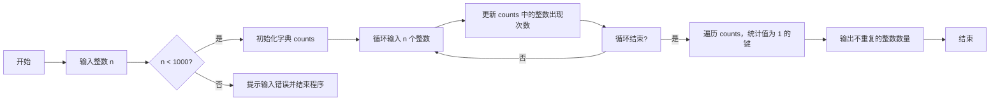

# 20241210 计算概论B笔试资料

*Updated 2025-12-05 16:05 GMT+8*  
 *Compiled by Hongfei Yan (2024 fall)*  


说明：

> 从网上公开的4年笔试题目看：1）里面涉及到的编程，相对简单。例如：筛法、哥德巴赫猜想、回文、Dijkstra。2）有的题目背景知识非cs，可能是生物、物理、数学，乍一看有点懵，多读两遍，就会发现其中cs原理。3）计算题、编码应用题，需要加强训练。
>
> 2022年计概课程基本大纲，提到“数据结构初步：结构，链表及其应用“。笔试中有stack题目，没看到链表、queue、heap的题目。没看到补码、浮点数题目。
>
> 我们重点讲解了三个计算机原理：1）ASCII编码，2）虚拟地址空间（对于理解操作系统和内存管理至关重要），3）图灵机（对深入理解算法和可计算性有着不可替代的作用）。后两个没有看到考题。第一个在考试中占据了相当大的比重。应熟悉大写字母、小写字母及数字所对应的十进制和十六进制编号，并掌握Python中的 ord() 和 chr() 等函数，以及位运算的相关知识。
>


# 20240109笔试（Python）


##  一、填空题（每空1分，共15分）

1. 一个地区的车牌号共包含 5位，第一位是大写字母(A~Z)，后 4 位是十进制数(8~9)，最多可以有 <mark> $26*10^4$</mark> 种不同的车牌。

   

2. 在计算机中表示图像的 <mark>矢量</mark> 表示方法中，图像分解为几何图形的组合。

   

3. 如果数组元素 a[0]被访问，那么近期 `a[i](i>0)`也可能被访问，这体现了 CPU 访问数据时的 <mark>空间</mark> 局部性。

   

4. 总线是连接计算机各部件的一簇公共信号线，由 <mark>数据总线、地址总线</mark> 和控制总线组成。

   

5. 程序控制器在每条指令执行完毕后都会检测是否出现 <mark>中断信号</mark>，以能够处理紧急事件。

   

6. 在 Python 语言中声明一个字符串sz="abcd",则 len(sz)的值是 <mark>4</mark> ,sz.upper()的值是 <mark>“ABCD”</mark>。

   

7. 如果 38 +1=40，这说明使用的是 <mark>9</mark> 进制。

   

8. 在 Python 程序中，列表和字典都可以用来存储一系列数据，其中，列表使用 <mark>数字下标</mark> 来检索数据，字典采用 <mark>键</mark> 检索数据。

   

9. 个人计算机机箱内部最核心的一块印刷电路板称为 <mark>主板</mark> ，微处理器、存储器、接口卡等都安插在该电路板上。

   

10. 一幅 1024x1024 的点阵图像，其颜色为 24 位真彩色，如果不压缩，该图像至少需要 <mark>3</mark> MB存储空间；假设该图像的颜色数为280种，为了压缩存储空间，对每种颜色编号，则200 种颜色至少需要 <mark>1</mark> 字节表示；这时所需存储空间降低至 <mark>1</mark> MB。

    

> 首先，我们来计算不压缩情况下1024x1024点阵图像所需的存储空间。对于一个24位真彩色图像，每个像素需要3个字节（每种颜色通道红、绿、蓝各1个字节）。
>
> 因此，图像的总大小为：
> $ 1024 \times 1024 \times 3 \, \text{bytes} = 3,145,728 \, \text{bytes} $
>
> 将其转换为MB（1 MB = 1,048,576 bytes），我们得到：
> $ 3,145,728 \, \text{bytes} / 1,048,576 = 3 \, \text{MB} $
>
> 接下来，假设该图像的颜色数减少到200种，并对每种颜色编号以节省空间。为了确定表示200种不同颜色所需的最小字节数，我们需要找到最小的2的幂次，它大于或等于200。
>
> \(2^7 = 128\) 不足以表示200种颜色，而 \(2^8 = 256\) 足够了。因此，需要8位二进制数来唯一地标识200种颜色中的每一种。这意味着我们可以使用1个字节（8位）来表示这些颜色。
>
> 如果采用1个字节来表示200种颜色，那么每个像素占用1个字节，而不是原来的3个字节。那么，新的图像大小将为：
>
> $ 1024 \times 1024 \times 1 \, \text{byte} = 1,048,576 \, \text{bytes} $
>
> 转换为MB，我们得到：
> $ 1,048,576 \, \text{bytes} / 1,048,576 = 1 \, \text{MB} $
>
> 综上所述：
>
> - 如果不压缩，该图像至少需要 3 MB 存储空间。
> - 为了压缩存储空间，对每种颜色编号，则200种颜色至少需要 1 字节表示。
> - 这时所需存储空间降低至 1 MB。

 

## 二、单项选择题（每题1分，共15分)

 1.如果年份不能被4整除，或者能被 100 整除而不能被 400 整除就不是闰年。假设 year 为年份，下面哪个表达式为真时，表示 year 不是闰年:

```python
(year%4 == 0 and year%100 != 0) or (year%400 == 0)
year%4 != 0 or (year%100 == 0 and year%400 != 0)				# this
year%4 != 0 or (year%100 != 0 and year%400 != 0)
(year%4 != 0 and year%100 == 0)or(year%400 != 0)
```


2.整数有不同进制的表示法，通常可以把整数放在括号()中，括号()后跟一下标表示其进制，以下关于整数的哪种表示是错误的?
	A) $(110)_2$	B) $(367)_8$	<mark>C) $(9EH)_{16}$</mark>	D) $(221)_4$

3.以下说法正确的是:
	A) 表达式 n = -9/5 的值是-2
	B) 计算机内用二进制来表示数据，任何一个十进数都可以转化为完全相等的对应的二进制数
	C) 10位二进制数能表示的最大正整数是 $2^{10}$
	<mark>D) Python 语言中变量可以存储的值的大小范围与类型相关</mark>

4.下列哪个表达式的值为“假”(其中整型变量x的值为 1):
	A) x==1	B) x!=0	C) x+1	<mark>D) x-1</mark>	

5.将空格字符赋给字符变量 a，正确的赋值语句是:
	A) a='\0'	B) a=NULL	C) a=0	<mark>D) a=' '</mark>

6.以下说法错误的是:
	A) 硬盘的读写速度比主存的读写速度要慢。
	<mark>B) MIPS是 CPU 工作主频的单位。</mark>
	C) 寄存器的生产成本很高，但对其访问速度极快
	D) 为了缓和 CPU 与主存储器之间的速度矛盾，在 CPU和主存储器之间设置一个缓冲性的高速存储部件(硬件)，依据的是局部性原理。

7.如果计算机断电，下列哪个设备中的数据将被擦除:
	A) U盘	B)光盘	<mark>C)内存</mark>	D)机械硬盘

8.当音乐被数字化存储到计算机中时，声音信号必须经过:
	A) 采样	B) 离散化	C) 编码	<mark>D) 以上A、B、C都要</mark>

9.以下哪个编码字符集，为世界上绝大部分语言设定了统一并且唯一的二进制编码，以满足跨语言、跨平台的文本交换需求?目前该编码字符集中已经收录了超过十万个不同字符。
	A) ASCII	<mark>B) Unicode</mark>	C)GBK 2312	D)BIG5

10.以下哪项不属于现代操作系统的功能范畴?
	A) 控制、调度和管理计算机的软件和硬件资源
	B) 协调计算机的运行，以增强计算机的处理能力
	<mark>C) 处理计算机中潜在的威胁和冲突，保证计算机的正确运行</mark>
	D) 提供人机交互界面

11.以下说法中，正确的是:
	<mark>A) 防火墙是一种隔离技术</mark>
	B) 有些厂商宣称的“启发式杀毒可以对付未知病毒”是肯定可靠的
	C) 一个企业/组织的内部网肯定是局域网(LAN)
	D) IPv6 是下一代的 IP 协议，用于代替 IPv4，其地址用 64 位二进制数表示

> A) 防火墙通过充当网络流量的检查点，根据预定的安全规则允许或阻止数据包通过，从而作为内部网络与外部网络（如互联网）之间的屏障。
> B) 虽然启发式分析可以在没有具体病毒定义的情况下识别潜在的恶意软件，但它的检测结果可能不如基于特征码的检测方法那么准确，并且可能会有误报的情况。因此，不能说它是“肯定可靠的”。
> C) 企业或组织的内部网可能是局域网（LAN），也可能是广域网（WAN），或者其他类型的网络，取决于其规模和网络架构。例如，大型跨国企业的内部网络通常会跨越多个地理位置，这样的网络更符合广域网（WAN）的定义。
> D) IPv6 地址实际上是由128位二进制数构成的，而不是64位。这大大增加了可用地址的数量，解决了IPv4地址枯竭的问题。


12.根据存储程序原理，对于现代计算机，被存放在主存储器中:
	A)只有数据	B) 只有程序	<mark>C) 数据和程序</mark>	D)以上都不是

13.下面哪个是 Pyhton 语言中合法的变量名:
	A)12ab	<mark>B)ab_12</mark>	C)!ab12	D)ab12!

14.以下关于信息编码的说法不正确的是:
	A) ASCII 编码了所有的英文字母和常用的标点符号
	B) 中文字符总是可以用2个字节的二进制数来表示
	C) 分辨率为 1024 * 768 的 256 色的图片最少需要占用 786,432 字节的内存来存储
	<mark>D)十六进制的 1A 和十五进制的 1A 表示的是同一个数值</mark>

> 对于分辨率为1024*768的256色图片，每个像素的颜色可以通过8位（1字节）来表示，因为2的8次方等于256，正好可以表示256种不同的颜色。
> 为了计算这种图像所需的存储空间，可以使用以下公式：
> $ \text{存储空间} = \text{宽度} \times \text{高度} \times \text{每个像素的字节数} $
> 将给定的值代入公式中：
> $ \text{存储空间} = 1024 \times 768 \times 1 \, \text{byte} $
> $ \text{存储空间} = 786,432 \, \text{bytes} $

15.在最新的个人电脑中，某个存储器的容量是 16MB，它最有可能是哪一种存储器。
	A) 硬盘	B) 内存	<mark>C) 高速缓存</mark>	D) 寄存器   

 

 

## 三、计算题（共20分)

### 1.数制转换运算（6分，每空2分）	

注：等号右侧是待填写的答案。

$ (2023)_{10} = (111 1110 0111)_2$

$(5.375)_{10} = (101.011)_2$

$(3D8A)_{16} = (11 1101 1000 1010)_2$

> **1. 十进制转二进制**
>
> 对于整数部分，我们使用除2取余法，直到商为0。然后将所有余数倒序排列。
>
> 对于小数部分，我们使用乘2取整法，直到小数部分为0或达到所需的精度。然后将所有整数顺序排列。
>
> #### $(2023)_{10} = (?)_2$
>
> - **整数部分：**
>
> 不断除以2并记录余数：
>
> - $2023 ÷ 2 = 1011...1$
> - $1011 ÷ 2 = 505...1$
> - $505 ÷ 2 = 252...1$
> - $252 ÷ 2 = 126...0$
> - $126 ÷ 2 = 63...0$
> - $63 ÷ 2 = 31...1$
> - $31 ÷ 2 = 15...1$
> - $15 ÷ 2 = 7...1$
> - $7 ÷ 2 = 3...1$
> - $3 ÷ 2 = 1...1$
> - $1 ÷ 2 = 0...1$
>
> 将余数倒序排列得到二进制表示：$11111100111_2$
>
> 因此，$(2023)_{10} = (11111100111)_2$
>
> **2. 十进制转二进制（含小数）**
>
> #### $(5.375)_{10} = (?)_2$
>
> - **整数部分**：如上所述，5转换为二进制是$101_2$。
>
> - **小数部分**：
>
> 不断乘以2并记录整数部分：
>
> - $0.375 * 2 = 0.750...0$
> - $0.750 * 2 = 1.500...1$
> - $0.500 * 2 = 1.000...1$
>
> 所以小数部分转换为$011_2$。
>
> 合并整数和小数部分：$(5.375)_{10} = (101.011)_2$
>
> **3. 十六进制转二进制**
>
> 每个十六进制数字可以转换成4位二进制数。
>
> #### $(3D8A)_{16} = (?)_2$
>
> - $3_{16} = 0011_2$
> - $D_{16} = 1101_2$
> - $8_{16} = 1000_2$
> - $A_{16} = 1010_2$
>
> 连接这些二进制数：$(3D8A)_{16} = (0011110110001010)_2$
>
> 去掉前导零：$(3D8A)_{16} = (11110110001010)_2$


### 2.二进制算术运算与逻辑运算（6分，每空2分）

100101 * 101001 = $(101 1110 1101)_2$

1110 0111 - 1001 1010 =  $(100 1101)_2$

0110 0101 | (~0101 0011) = $(1110 1101)2$

> 1. 二进制乘法
>
> 将这两个二进制数转换为十进制，进行乘法运算，然后再将结果转换回二进制。
>
> - $ 100101_2 = 37_{10} $
> - $101001_2 = 41_{10} $
>
> 进行乘法：
> $37 * 41 = 1517_{10} $
>
> 再将 $ 1517_{10} $ 转换为二进制：
> $ 1517_{10} = 10111101101_2 $
>
> 2. 二进制减法
>
> 将这两个二进制数转换为十进制，进行减法运算，然后再将结果转换回二进制。
>
> - $ 11100111_2 = 231_{10} $
> - $ 10011010_2 = 154_{10} $
>
> 进行减法：
> $ 231 - 154 = 77_{10} $
>
> 再将 $ 77_{10} $ 转换为二进制：
> $ 77_{10} = 1001101_2 $
>
> 3. 二进制逻辑或运算（|）和按位取反（~）
>
> 给定：
>  01100101_2 | (~01010011_2) = $(11101101)_2 $
>
> 首先计算按位取反：
>
> - $ 01010011_2 $ 的按位取反是 $ 10101100_2 $
>
> 然后进行逻辑或运算：
>  $01100101_2 | 10101100_2 = 11101101_2 $

 

### 3.二进制信息查看（4分）

小北学习了信息编码原理后，有一天从网上看到可以通过某些编辑软件来查看文件的二进制编码信息。网页上说，在软件中安装十六进制编辑插件，打开文件后选择十六进制方式查看，可以看到文件中具体存放的二进制信息。于是小北立刻进行了尝试，他新建了一个空的文本文件，在其中输入了一段文本: "Welcome to Peking University!"，然后按上述模式进行观看，屏幕上显示如下：


(注:字符W的ASCII码的十六进制表示为57，字符e的ASCII码的十六进制表示为65，以此类推)

 小北发现了其中的规律，感觉像是打开了一扇通往新世界的大门。他兴奋地在文件中输入了一条新的消息，并截图发给他的室友(文本已屏蔽)。请帮小北的室友判断一下，小北输入的是什么内容?


文本内容：<mark>Happy New Year!</mark> (2分)

（2）小北的室友也决定试一把，他在文件中输入"Hello World!"，屏幕上显示的数据会是什么样？

请把表格中的信息补全。表格中"-"表示无数据。（2分）

| Address  | 0    | 1    | 2    | 3    | 4    | 5    | 6    | 7    | 8    | 9    | A    | B    | C    | D    | E    | F    |
| -------- | ---- | ---- | ---- | ---- | ---- | ---- | ---- | ---- | ---- | ---- | ---- | ---- | ---- | ---- | ---- | ---- |
| 00000000 | 48   | 65   | 6C   | 6C   | 6F   | 20   | 57   | 6F   | 72   | 6C   | 64   | 21   | -    | -    | -    | -    |

 

### 4.给出表达式（4分）

 （1）已知变量c存储了一个字母的ASCII码，请写一个表达式判断其值是否为大写英文字母(如果是，得到True；否则，得到False)

​	表达式：<mark>c >= 65 and c <= 90</mark> (2分)

（2）已知i是一个整数（取值范围：0 到4294967295）表示一个北大学生的学号。已知小明所在年级的同专业同学的学号都是2310305XXX这种形式，而与他同专业的在校高年级学生的学号只能是2010305XXX，2110305XXX，2210305XXX这种形式。请写一个表达式判断具有学号i的学生是否是小明的同专业同学或师兄师姐(如果是，得到True；否则，得到False)

​	表达式：(2分)

​	<mark>(i // 100000000) >= 20 and (i // 100000000) <= 23 and ((i / 1000) % 100000) == 10305</mark>

 题意为：最高两位在20~23的范围，中间五位为10305，末尾三位不限。写对(i//100000000)>=20 and (i//100000000)<=23给1分，写对 ((i//1000)%100000)==10305给1分。答案不唯一，其他符合题意的正确表达式也应给分。

 

## 四、编码应用题（共12分）

1.（6分）802.11b无线局域网的数据传输速率为11Mbps（1Mbps=$10^6$比特/秒），假设连续传输长度为64字节的帧时（1字节=8比特），线路的传输差错率为$10^{-7}$（传输差错率是一段时间内传输出错的比特数与传输的总比特数的比率）。请回答以下问题：

（1）一帧的长度是（  <mark>512</mark>   ）比特；

（2）该网络传输数据时以帧为单位，一帧数据有任何传输差错，都会引起重传。请问该网络发送一帧数据时，需要重传的概率是（  <mark>B</mark>   ）；【在答题纸上写下正确选项的编号 A/B/C/D;下同】

（A）$5 * 10^{-4}$；（B）$5*10^{-5}$；（C）$6*10^{-4}$；（D）$6*10^{-5}$

（3）一秒钟可发送帧的数量为（  <mark>B</mark>   ）；

（A）$1.3*10^4$；（B）$2.1*10^4$；（C）$1.3*10^5$；（D）$2.1*10^5$

（4）每秒可能出现差错的帧的数量（  <mark>A</mark>   ）；

（A）1；（B）5；（C）10；（D）11

（5）如果一段视频大小为110MB，需要（ <mark>80</mark>    ）秒传输；

（6）这段视频在传输过程中，可能出现差错的帧的数量是（  <mark>B</mark>   ）。

（A）55；（B）88；（C）110；（D）176

> 逐一解答这些问题。
>
> （1）一帧的长度是 64 字节，而 1 字节= 8 比特，
>
> ​	 $64 \times 8 = 512$比特。
>
> （2）要计算一帧数据需要重传的概率，需要考虑该帧中至少有一个比特出错的概率。传输差错率为 $10^{-7}$，对于一个 512 比特长的帧，没有错误传输的概率是：
>
> $P_{\text{no error}} = (1 - 10^{-7})^{512} \approx 1 - 512 \times 10^{-7}$
>
>  <mark>两边取对数有$\ln P = 512\times ln (1-10^{-7})$，$10^{-7}$较小，有近似关系$ln(1-10^{-7}) \approx -10^{-7}$成立。因此$P=e^{-512\times10^{-7}}$。使用近似公式 $e^{x} \approx 1+x$ 当 x 很小时（$e^x$   在 
> x
> =
> 0
> 处的泰勒展开式）来简化计算，得到：$P_{\text{no error}} =1 - 512 \times 10^{-7}$</mark>
>
> 一帧中有任何比特出错并导致重传的概率则是：
>
> $P_{\text{error}} = 1 - P_{\text{no error}} \approx 512 \times 10^{-7} = 5.12 \times 10^{-5}$
>
> 接近选项 $5 \times 10^{-5}$。	**答案：B**
>
> （3）要计算一秒钟可以发送多少帧，我们首先要知道传输一帧所需的时间。以 11 Mbps 的速率，传输 512 比特需要 $512 / (11 * 10^6)$秒。这等于 $4.6545 * 10^{-5}$ 秒。因此，一秒内可以发送的帧数为 $1 / (4.6545 * 10^{-5}) ≈ 21483.7$。最接近的答案是 $2.1*10^4$，即选项 B。
>
> （4）每秒可能出现差错的帧的数量可以通过将每秒发送的帧数量乘以每个帧出错的概率来估算。从上一个问题我们知道每秒大约可以发送 $2.1*10^4$ 帧，而每一帧出错的概率大约是 $5*10^{-5}$。相乘得到的结果是 $2.1*10^4 * 5*10^{-5} = 0.105$。这意味着平均来说，每秒可能会出现 0.105 个有差错的帧。由于实际操作中不能有分数个帧出错，我们将这个值四舍五入到最接近的整数，即 1。所以正确答案是 A。
>
> （5）一段视频大小为 110MB，即 $110 * 10^6$ 字节或 $880 * 10^6$ 比特。以 11 Mbps 的速率，传输这段视频需要的时间是 $880 * 10^6 / (11 * 10^6) = 80$ 秒。所以这个答案也是正确的。
>
> （6）要计算在这段视频传输过程中可能出现差错的帧的数量，我们先确定总共传输了多少帧。整个视频包含 $880 * 10^6$ 比特，每帧 512 比特，所以总共有 $880 * 10^6 / 512 ≈ 1718750$ 帧。用这个数目乘以每个帧出错的概率 $5*10^{-5}$，我们得到 $1718750 * 5*10^{-5} = 85.9375$。取最接近的整数值，我们得到 86。给出的选项中最接近的是 88，即选项 B。

 

2.数据在网络传输的过程中，用到了许多编码技术，如ASCII码、校验码等等，请回答以下问题：

(1)（1分）在网络传输中，每个字符都由ASCII码表示并转换为二进制数据。假设你需要发送字符'B'，已知'A'的ASCII码为65。请写出'B'的ASCII码对应的八进制表示是

​	<mark>102</mark>

(2)（2分）在计算机网络中，子网掩码用于区分一个IP地址的网络部分和主机部分。一个常见的私有IP地址是192.168.1.1，其二进制形式为11000000.10101000.00000001.00000001。如果一个子网的网络掩码是255.255.255.0，它的二进制表示是11111111.11111111.11111111.00000000，这表明网络部分占据前24位。网络地址（全0的主机部分）和广播地址（全1的主机部分）是不能用于主机的地址。在这个子网中，计算并填写以下两个问题：

a)  这个子网可以有_____________个有效的主机地址。（1分）

​	<mark>254</mark>

b)  假设你需要设计一个新的子网掩码，使得每个子网可以容纳最多30个主机。请写出你设计的子网掩码十进制表示__________________________。（1分）__

​	<mark>255.255.255.224</mark>

(3)（1分）你有一个字符的ASCII码为1000001（字母'A'），需要使用密钥1100110进行按位异或加密。加密后的结果是一个二进制数，然后在此基础上在最后一位添加一个奇偶校验位。如果加密结果中1的个数为奇数，则校验位为1；偶数则为0。因此最后计算结果是_________________________。

​	<mark>01001110</mark>

(4)（1分）数据在网络中传输时会形成数据包，每个数据包中包含“数据”和“校验和”两部分。“校验和”用于确保数据在传输过程中的完整性。如果你有一个数据段10101010，它的简单“校验和”可以通过将所有位的二进制相加并取最后一位来计算。请计算这个数据段的“校验和”是

​	<mark>0</mark>

(5)（1分）有一种新的“校验和”，其规则是：先将已知的二进制数转换为十进制，然后模4取余，余数的两位二进制数即为“校验和”。例如：1001的校验和计算方法是$1×2^3 + 1×2^0 = 9$，模4得到01，即1001的“校验和”为01。假设你收到了一个含有错误的8位二进制数据段，数据为10101?1?，其中“?”表示失效的位。这个数据段使用了奇偶校验码和新的校验码两种方法来确保数据的完整性。已知该数据段的奇偶校验码为1（表示数据中1的个数为奇数），并且该数据段的新的“校验和”为10（二进制表示，使用模4运算）。请根据这些信息修复数据段，填写完整的、修复后的8位二进制数据是____________________________________。

​	<mark>10101110</mark>

 

> 让我们一步步解决这些问题。
>
> **(3) 按位异或加密和奇偶校验**
>
> 首先，我们对字符'A'的ASCII码1000001与密钥1100110进行按位异或（XOR）操作：
>
> ```
> 1000001
> ⊕ 1100110
> -----------
> 0100111
> ```
>
> 结果是0100111。接下来，我们需要添加一个奇偶校验位。检查这个结果中1的数量：有四个1，这是一个偶数。因此，奇偶校验位应该为0以保持整体的1数量为偶数（因为题目要求的是奇数个1时校验位为1）。所以最终结果应该是：
>
> ```
> 01001110
> ```
>
> **(4) 校验和计算**
>
> 对于数据段10101010，要计算简单“校验和”，我们只需要将所有位相加并取最后一位：
>
> ```
> 1 + 0 + 1 + 0 + 1 + 0 + 1 + 0 = 4
> ```
>
> 4的最后一位是0，所以校验和为0。
>
> 答案正确。
>
> **(5) 奇偶校验码和新的校验码修复数据段**
>
> 已知信息：
>
> - 数据段包含两个失效位：10101?1?
> - 奇偶校验码为1，意味着整个数据段中1的总数应为奇数。
> - 新的校验码为10（模4运算后的二进制表示），即十进制2。
>
> 为了修复数据段，我们需要找到两个未知位的值使得：
>
> 1. 整个数据段中的1的个数为奇数。
> 2. 数据段转换为十进制后模4的结果为2。
>
> 原始数据段中有四个1（不包括未知位）。如果我们要满足奇偶校验条件，则需要使总1的数量变成奇数，这意味着我们需要选择一个未知位为1，另一个为0。所以尝试让其中一个未知位为1，另一个为0。
>
> 现在，有两个选项来设置未知位：`10101110` 或 `10101011`。我们需要检查哪个选项能给出正确的模4校验和。
>
> - 对于`10101110`，转换为十进制是174，模4等于2，符合新的校验和要求。
> - 对于`10101011`，转换为十进制是171，模4等于3，不符合新的校验和要求。
>
> 因此，修复后的8位二进制数据是`10101110`。

 

## 五、程序阅读题（3题，共12分)

 阅读下面的程序，说明该程序实现的功能是什么；并对给定的输入，写出程序执行后的输出。

### 第1题

```python
def main():
    n = sum1 = sum2 = i = 0
    n = int(input())
    while n > 0:
        r = n % 10
        if i % 2 == 0:
            sum1 += r;
        else:
            sum2 += r;
        i += 1
        n //= 10
    if sum1 > sum2:
        print("%d\n" % sum1)
    else:
        print("%d\n" % sum2)
main()
```

程序功能（2分）：

<mark>对于一个正整数，输出其奇数位之和与偶数位之和的较大者</mark>

 

当输入为：1325498 时，程序输出为（2分）：

<mark>17</mark>

 

###  第2题

```python
def main():
    stack = []
    inp = input()
    result = ""
    for c in inp:
        stack.append(c)
    while len(stack) > 0:
        result += stack.pop()
    print(result)
    return 0


if __name__ == "__main__":
    main()

```

 程序功能（2分）：

 <mark>将输入字符串按照倒序输出</mark>

 

当输入为："PKU" 时，程序输出为（2分）：   

<mark>UKP</mark>

 

### 第3题

```python
def interchange1(x, y):
    temp = x
    x = y
    y = temp


def interchange2():
    global x, y
    temp = x
    x = y
    y = temp


x = 5
y = 10
print("x=%d,y=%d\n" % (x, y))

interchange1(x, y)
print("x=%d,y=%d\n" % (x, y))

interchange2();
print("x=%d,y=%d\n" % (x, y))

```

程序功能（2分）：

 <mark>对两个整型数字，交换两个数值 但是第一个函数不成功</mark>


程序输出为（2分）：  

<mark>x=5,y=10</mark>

<mark>x=5,y=10</mark>

<mark>x=10,y=5</mark>

 

 

## 六、程序填空题（2题，共10分，每空1分)

###  1.回文质数

对于某个整数，如果既是质数也是回文数，则该整数是一“回文质数”，如313。请完成下列“回文质数”的判断函数isHuiwen(int n)，其中，参数n是一个整数（大于10），判断n是否为“回文质数”。函数返回：如果n是一个“回文质数”，返回‘Y’，否则返回‘N’。

```python
import math

def isHuiwen(n: int):
    k = int(math.sqrt(n))
    for i in range(2, k + 1):
        if n % i == 0:  # 【1】
            return 'N'
    k = 0
    t = n  # 【2】
    while t > 0:
        k = k * 10 + t % 10  # 【3】
        t //= 10  # 【4】
    if k == n:  # 【5】
        return "Y"
    else:
        return "N"

if __name__ == '__main__':
    n = int(input())
    for i in range(n):
        num = int(input())
        print(isHuiwen(num))
```


【1】：n % i 

【2】： t = n;

【3】：k\*10 + t%10

【4】：t //= 10

【5】：k == n 

 

###  2.字符串转换整数

请完成下列字符串转换成整数的函数myAtoi(s)，输入为一个字符串，输出为字符串对应的整数，在转换过程中避免使用Python原生的int函数。函数的算法如下：

1）读入字符串并丢弃无用的前导空格

2）检查下一个字符（假设还未到字符末尾）为正还是负号，读取该字符（如果有）,确定最终结果是负数还是正数。如果两者都不存在，则假定结果为正。

3）读入下一个字符，直到到达下一个非数字字符或到达输入的结尾。字符串的其余部分将被忽略。

**4）将前面步骤读入的这些数字转换为整数（即，"123" -> 123， "+123" -> 123， "-123" -> -123， "0032" -> 32）。如果没有读入数字，则整数为0。**

5）返回整数作为最终结果。


```python
def myAtoi(s):
    s = s.strip()  # 【1】
    if s[0] == '-':  # 【2】
        sign = -1
    else:
        sign = 1
    while s[0] in {'-', '+', '0'}:
        s = s[1:]  # 【3】
    r = 0
    for c in s:
        r = r * 10
        r += ord(c) - 48  # 【4】
    return sign * r  # 【5】


if __name__ == '__main__':
    s = input()
    print(myAtoi(s))

```


## 七、算法流程图及编程题（2题，共12分）

 流程图例：


例如：对于一个具有5个整数的数组 [1，2，3，4，-3]，如果窗口的大小为3，则在滑动过程中会得到3组数 [1，2，3]、[2，3，4]、[3，4，-3]，对应3个数的和分别为6、9、4；因此，3个数的和的最大值为9。

请编写一个程序实现上述功能。具体而言，该程序首先从控制台接收正整数n和k（满足 n >= k），然后从控制台接收n个整数（整数之间以空格间隔），最后，程序向控制台打印出k个数的和的最大值。**其他要求：程序在执行中应避免不必要的重复计算。**

 

1）画出算法流程图（3分）

<mark>说明：1.正确答案显然不唯一；2.请根据学生答题情况，酌情给分</mark>


2）写出程序的代码（3分）

<mark>代码：</mark>

```python
inp = input().split()
n = int(inp[0])
k = int(inp[1])

a = list(map(int, input().split()))
max_v = 0
for i in range(n - k + 1):
    v = sum(a[i:i + k])
    if v > max_v:
        max_v = v

print(max_v)

```

 

 

 2、判断一个UTF-8编码字符串中包含多少个Unicode字符。

Unicode是一个字符集合，它几乎包含了世界上目前所有已知的字符。UTF-8是Unicode字符的一种编码方式。与ASCII编码中所有字符都具有相同的编码长度（1个字节）不同，不同的Unicode字符的UTF-8编码的长度在1-4个字节之间。具体而言，Unicode字符的UTF-8编码具有如下四种二进制形式：

```
A. 0XXXXXXX
B. 110XXXXX 10XXXXXX
C. 1110XXXX 10XXXXXX 10XXXXXX
D. 11110XXX 10XXXXXX 10XXXXXX 10XXXXXX
```

也就是说：

A. 如果一个Unicode字符的UTF-8编码的长度是1个字节，那么，这个字节中的第一位一定是0；

B. 如果一个Unicode字符的UTF-8编码的长度是2个字节，那么，第一个字节中的前三位一定是110，且第二个字节中的前两位一定10；

C. 如果一个Unicode字符的UTF-8编码的长度是3个字节，那么，第一个字节中的前四位一定是1110，且其他字节中的前两位一定10；

D. 如果一个Unicode字符的UTF-8编码的长度是4个字节，那么，第一个字节中的前五位一定是11110，且其他字节中的前两位一定10。

提醒：在上述B、C、D三种情况中，两个字节之间的空格仅仅是为了方便人类阅读；实际编码中不存在这种空格。

给定一串合法的UTF-8编码字符串，请你编写一个程序，计算其中包含了多少个Unicode字符。例如，UTF-8编码字符串 110111111011111101111111 中包含2个Unicode字符。具体而言，该程序接收用户从控制台输入的一个合法的UTF-8编码字符串（长度小于10000），然后在控制台打印出其中包含的Unicode字符的数量。


1）画出算法流程图（3分）

略

 

2）写出程序的代码（3分）

<mark>代码：</mark>

```python
inp = input()
i = 0
cnt = 0
while (i < len(inp)):
    if inp[i] == '0':
        i += 8
    elif inp[i + 2] == '0':
        i += 16
    elif inp[i + 3] == '0':
        i += 24
    else:
        i += 32
    cnt += 1
print(cnt)

```

 


## 八、问答题（4分）

近来，以ChatGPT为代表的人工智能技术给整个社会带来了巨大的影响，请结合自身专业，谈谈人工智能技术可能对你未来的工作和生活带来哪些影响？

只要正常作答就给满分。


# 20221227笔试（Python）

## 一、填空题（每空1分，共15分）

1. 以下设备中，属于输入设备的有（<mark>A、B、D、F</mark>），属于输出设备的有（<mark>C、D、E</mark>）。

   - A、键盘 B、鼠标 C、打印机 D、智能手机触控显示屏 E、喇叭 F、摄像头

2. 计算机软件系统中最重要的软件是（<mark>操作系统 或 OS</mark>），主要负责资源管理、任务调度等。

3. 主存（内存）管理是以8个二进制位（一个Byte）作为一个管理单元的，并且每个单元都编有一个唯一的地址，内存的访问是通过其地址进行的。我们称主存(内存)是随机存储器，这是因为：（<mark>CPU可以直接通过地址访问任意单元，无需按顺序扫描。</mark>）

   > 主存（内存）被称为随机存储器（Random Access Memory，RAM）的原因是**内存中的每个存储单元都可以通过其地址直接访问，访问时间与存储单元的位置无关**。这意味着，无论访问的是哪一个存储单元，访问速度基本上是相同的，而无需像顺序存储设备（如磁带）那样必须按顺序查找。
   >
   > 以下是主要原因的总结：
   >
   > 1. **随机访问**：
   >     内存中的每个存储单元都有唯一的地址，CPU可以直接通过地址访问任意单元，无需按顺序扫描。
   > 2. **访问时间一致**：
   >     无论访问的是首地址还是尾地址，内存的访问时间在理论上是固定的，不依赖于物理位置。
   > 3. **对比顺序存储设备**：
   >     顺序存储设备（如硬盘、磁带）在访问数据时需要按顺序查找，而内存无需这样，因此被称为“随机存储器”。
   >
   > 这种随机访问特性是内存速度快的关键，也是它区别于其他存储介质的重要特征。
   >
   > 
   >
   > 原答案是这句“每个地址的访问时间与地址无关（或访问每个地址的时间相同等意思）”，感觉有点别扭。

4. 如果一个数据项正在被访问，那么在近期它很可能还会被再次访问，这说的是程序执行时，CPU访问数据的（<mark>时间局部性（或局部性）</mark>）。

5. 要反转二进制数01001001的高4位，保留低4位不变，应将它与11110000进行（<mark>异或</mark>）运算。

6. 在ASCII编码表中，数字字符和大小写字母都是按顺序编码的，大写字母A的二进制ASCII码为01000001，大写字母D的二进制ASCII码为（<mark>01000100</mark>）；对于一个保存了小写字母的字符串变量x，请给出其对应大写字母的表达式（<mark>x.upper()或者 char(ord(x)+ord(‘A’)-ord(‘a’))</mark>）。

7. 在Python语言中，表达式7/2.0的类型和值分别是（<mark>float</mark>）和（<mark>3.5</mark>）。

8. 已知x=200，那么表达式1<x<100的值是（<mark>False</mark>）。

9. 在Python语言中，字符串`s="你好,@_pku"`的长度是（<mark>8</mark>），其中"_"表示一个英文空格；对s的切片操作s[1::-1]结果是（<mark>“好你”</mark>）。

   > 在Python中，字符串切片的基本语法是 `string[start:stop:step]`，其中：
   >
   > - `start` 表示开始索引，默认为0（即从字符串的第一个字符开始）。
   > - `stop` 表示结束索引（不包含），默认为空（即直到字符串的末尾）。
   > - `step` 表示步长，默认为1（即逐个字符取）。如果步长为负数，则表示逆序取字符。
   >
   > 对于给定的操作 `s[1::-1]`：
   >
   > - `start` 是 1，意味着我们从索引1处开始，也就是从第二个字符开始。
   > - `stop` 是空，意味着我们要一直走到字符串的开头，但因为步长是负数，所以实际上是在向字符串的前面走，直到索引0处。
   > - `step` 是 -1，这意味着以逆序的方式取字符。
   >
   > 请注意，中文字符和英文字符一样，在Python中每个都被视为单个字符，所以在进行切片操作时，它们的处理方式是一致的。

   > **2022年计概（B）C语言版，填空第9题**
   >
   > 在C语言中，字符串`s="你好,@_pku"`的长度是 <mark>11</mark> ，其中"_"表示一个英文空格；在 32 位机器上，一个整型指针变量 (如 `int *p`)占用 4个字节的内存空间，一个双精度浮点型指针变量(如 `double *g`)占用 <mark>4</mark> 个字节的内存空间。
   >
   > 这个题目有bug，没有说明汉字编码，如果是GBK编码，可以如下：
   >
   > <mark>在Mac上复现</mark>
   >
   > ```
   > echo "你好,@_pku" > input.txt
   > ```
   >
   > 使用 `iconv` 将文件的编码从 UTF-8 转换为 GBK
   >
   > ```
   > iconv -f UTF-8 -t GBK input.txt > input_gbk.txt
   > ```
   >
   > 编译C程序 gcc str_len.c
   >
   > ⚠️：不要忘记末尾'\0'。
   >
   > ```c
   > #include <stdio.h>
   > #include <string.h>
   > 
   > char str[100];
   > int main() {
   >         //memset(str, 0, 100);
   >         scanf("%s", str);
   >         int len = strlen(str);
   >         printf("%d\n", len + 1);
   >         return 0;
   > }
   > 
   > ```
   >
   > 
   >
   > ```
   > ./a.out < input_gbk.txt
   > 11
   > ```
   >
   > 

10. 程序

   ```python
i, j = 0, 1
while i < 100:
    print(i)
    i += 1
    j += 1
    i += j
   ```

   输出的最后一个数字是（<mark>88</mark>），其中输出语句执行了（<mark>12</mark>）次。

> 由于`i`在循环体内两次被增加（一次是`i += 1`，另一次是`i += j`），这意味着`i`每次循环实际上增加了`1 + j`。随着`j`的递增，`i`的增长速度会越来越快，最终超过或等于100，从而终止循环。
>
> ```python
> i, j = 0, 1
> count = 0  # 记录print语句执行次数
> 
> while i < 100:
> 	count += 1
> 	print(i)  # 假设这里只用于计数，实际运行时可注释掉以避免大量输出
> 	i += 1
> 	j += 1
> 	i += j
> 
> print("最后一次打印的i值为:", i - j - 1)  # 因为最后一次增加使i>=100，所以我们需要减去这次增加
> print("print语句执行次数:", count)
> ```
>
> 0
> 3
> 7
> 12
> 18
> 25
> 33
> 42
> 52
> 63
> 75
> 88
> 最后一次打印的i值为: 88
> print语句执行次数: 12


## 二、单项选择题（每题1分，共15分）

根据图片中的内容，以下是提取的文字：

1. 一个 CPU 能够在 8 个时钟周期/时钟节拍内完成一个指令周期。如果这个 CPU 的时钟频率/主频是 4GHz，那么这个 CPU 的运算速度是 ______ MIPS。

   A) 5	B) 50	<mark>C) 500</mark>	D) 5000

   > 为了计算CPU的运算速度（以每秒百万条指令，即MIPS为单位），我们可以使用以下公式：
   >
   > $ \text{MIPS} = \frac{\text{时钟频率}}{\text{每个指令周期的时钟周期数}} $
   >
   > 给定条件是：
   >
   > - 时钟频率（主频）是4GHz，也就是4,000,000,000 Hz。
   > - 每个指令周期需要8个时钟周期。
   >
   > 将这些值代入上述公式中：
   >
   > $ \text{MIPS} = \frac{4,000,000,000}{8} = 500,000,000 $
   >
   > 然后，我们需要将结果转换成MIPS（每秒百万条指令）。由于1 MIPS等于1,000,000条指令/秒，因此：
   >
   > $ \text{MIPS} = \frac{500,000,000}{1,000,000} = 500 $

2. 下面哪个人物不是计算机发展史上的重要人物：

   A) 阿兰·图灵 A.M Turing	B) 冯·诺依曼 John Von Neumann

   C) 史提芬·库克 Stephen A.Cook	<mark>D) 冯·布劳恩 Wernher Von Braun</mark>

3. 请按照访问一次所需时间由短到长（即速度由快到慢）对下列存储硬件进行排序：

   ①高速缓存	②主存储器	③寄存器	④外部存储设备

   A) ①②③④	B) ①③②④	<mark>C) ③①②④</mark>	D) ②①③④

4. 下面哪个选项不是 Python 语言中合法的标识符：

   <mark>A) 123abc</mark>	B) abc123	C) __abc__	D) abc_123

5. 使用 2 个字节表示整数，则表示的范围可能是：

   A) -2 ~ 1	B) -128 ~ 127	<mark>C) -32768 ~ 32767</mark>	D) -65536 ~ 65537

6. Python 语言的整数类型中，逻辑“真”等价于：

   A) 大于零的整数	B) 小于零的整数	<mark>C) 非零的整数</mark>	D) 等于 0 的整数

7. 上网时，经常需要使用验证码，下面有关其功能的描述，正确的是：

   A) 验证码与用户名和密码密切相关，因此需要牢记，并保证每次都输入相同的验证码。

   B) 验证码通常都是英文字母和数字的变形，其目的是让旁边其他人不容易看清楚。

   <mark>C) 验证码主要是让计算机程序（机器人）难以自动识别，防止自动登录或破解账户。</mark>

   D) 验证码主要是减少用户登录次数，防止用户沉迷网络。

8. 以下和收发邮件最相关的计算机网络协议为：

   <mark>A) POP/SMTP</mark>	B) UDP	C) VoIP	D) TCP/IP

9. 在 CPU 的内部结构中，负责处理紧急情况的部件是：

   A) 算术逻辑运算器	B) 寄存器	<mark>C) 中断处理器</mark>	D) 程序控制器

10. 以下说法中，不正确的是：

    A) 采用位图图像表示方法在计算机中表示图像，图像放大时，通常会产生锯齿、颗粒状等失真现象。

    B) 计算机中存储的电影资料是以二进制方式存储的。

    <mark>C) 计算机内用二进制来表示数据，任何一个十进数，都可以转化为完全相等的对应的二进制数。</mark>

    D) 在计算机中表示图像的矢量图像方法中，图像分解为几何图形的组合。

11. 如果计算机断电，那么下列设备中，哪里的数据将会丢失：

​	A) 硬盘	<mark>B) 内存</mark>	C) 光盘	D) 磁带

12. 在 Python 语言中，已知字符“2”的 ASCII 编码为 50，执行以下语句后，输出是：

   ```python
c = "0"
c = c + 10
print(c)
   ```

​	A) 010	B) 58	C) 10	<mark>D) 类型错误</mark>

13. 关于循环结构，以下选项中描述错误的是：

​	<mark>A) 每个 `continue` 语句有能力跳出当前层次的循环。</mark>

​	B) `break` 可以用来跳出当前层次 `for` 或者 `while` 循环，脱离该循环后程序从循环代码后继续执行。

​	C) 通过 `for`、`while` 等关键字描述循环结构。

​	D) `while` 循环和 `for` 循环可以互相转换。

14. 以下关于计算机系统的说法正确的是：

​	A) 现代计算机通常为冯·诺伊曼结构，即由中央处理器、控制器、存储器、输入设备和输出设备五大功能模块构成。

​	<mark>B) 主板是计算机主机箱中的主要部件，计算机的其他硬件设备通过各种接口与主板相连并发挥作用。</mark>

​	C) 现代计算机中的许多存储器都是易失的，即断电后数据会丢失，只有磁性介质构成的存储器才能保证断电后数据依然存在。

​	D) 不同存储器的速度存在较大不同，其中内存与外存（硬盘）的速度常有几个数量级的差距。为了提高运行速度，在内存和外存之间通常设置一个缓冲性的部件，被称为高速缓存。

> 在这四个选项中，最准确的描述是：
>
> A) 的描述不完全正确，控制器实际上是中央处理器（CPU）的一部分，不应该被单独列出作为与CPU并列的功能模块。
>
> C) 虽然许多现代计算机中的主存储器（例如RAM）确实是易失性的，即断电后数据会丢失，但并不是只有磁性介质构成的存储器才能保证断电后数据依然存在。实际上，现在有许多非易失性存储技术，比如固态硬盘（SSD），它使用闪存技术，即使在断电情况下也能保存数据。此外，还有ROM（只读存储器）、EPROM、EEPROM等类型的存储器，在断电后同样可以保持数据。
>
> D) 的描述基本正确，不同存储器的速度确实存在较大差异，并且为了提高运行速度，在内存和外存之间设置高速缓存（Cache）是很常见的做法。然而，高速缓存通常是指位于CPU内部或紧邻CPU的一种快速存储器，用来临时存储频繁访问的数据副本，以减少对较慢的主存访问次数。因此，尽管D选项描述的现象是真实的，但“缓冲性的部件”这一表述可能不够精确，容易让人误解为一种更通用的缓冲机制而非特指的高速缓存。
>
> A) 的描述不够准确，**中央处理器（CPU）**：这是执行程序指令的核心部件。它包含了算术逻辑单元（ALU），用于进行算术和逻辑运算；以及控制单元（CU），负责从内存中取出指令、解码并执行它们。
>
> “中央处理器”一词已经涵盖了执行单元（即算术逻辑单元）和控制单元，所以再次提及“控制器”会导致重复且混淆概念。
>
> 冯·诺伊曼结构计算机的5个主要部件分别是：
>
> 1. **运算器（Arithmetic and Logic Unit, ALU）**
>    - 负责执行计算和逻辑运算，比如加法、减法、逻辑与、或等操作。
> 2. **控制器（Control Unit, CU）**
>    - 负责解释和执行指令，协调计算机其他部件的工作。它从内存中读取指令并将其转换为具体操作。
> 3. **存储器（Memory）**
>    - 用于存储程序、数据以及中间结果，通常分为主存储器（如RAM）和辅助存储器（如硬盘）。
> 4. **输入设备（Input Devices）**
>    - 用于向计算机输入数据和指令，例如键盘、鼠标、扫描仪等。
> 5. **输出设备（Output Devices）**
>    - 用于将计算结果和信息输出给用户，例如显示器、打印机、扬声器等。
>
> 这五大部件通过**总线（Bus）**相互连接，构成一个完整的计算机系统。冯·诺伊曼结构的核心思想是存储程序，即将指令和数据以相同的形式存储在内存中，并依次执行。

15. 以下关于 IPv6 的说法不正确的是：

​	A) IPv6 是下一代的 IP 协议，用于代替 IPv4。

​	<mark>B) IPv6 地址由 64 位二进制数表示，通常每 8 位一段写成 16 进制数表示以便于使用。</mark>

​	C) 域名服务器（缩写为 DNS）的可以将一个合法域名（如 www.pku.edu.cn）转换成对应主机的 IPv6 地址。

​	D) IPv6 的地址资源非常充足，可以为现在地球上的所有计算机、手机甚至家用电器分配独立的地址。

>  IPv6 地址实际上是由128位二进制数构成的，而不是64位。这大大增加了可用地址的数量，解决了IPv4地址枯竭的问题。


## 三、计算题（共20分）

### 1.数制转换运算 (4分，前2空1分，第3空2分)

$(2022)_{10} = ( 111 1110 0110 )_2 = ( 3746 )_8$

$(42.625)_{10} = ( 101010.101 )_2$


### 2.二进制算术运算 (4分)

10001 * 1010 = ( <mark>10101010</mark> )

10100101 / 1111 = ( <mark>1011</mark> )


### 3.二进制逻辑运算 (4分）

与: &, 或: |, 非: ~, 异或: ^ ; >>为二进制数右移运算符，右侧整数为左侧二进制数要右移的位数，移出去的位丢弃，左侧则补0)

10110110 & (00110001 >> 1) = ( <mark>00010000 或 10000</mark> )

11101101 ^ 00110101 = ( <mark>11011000</mark> )


### 4.ASCII编码

又称美国信息交换标准码，是国际上使用最广泛的字符编码。在计算机中，每个字符的ASCII码用一个字节存储。已知ASCII码中A的编码为01000001，A - Z在码表中是连续的。现在计算机里有三段编码10101111，10110100，10101010，将它们取反求对应的英文字母串 (2分)

<mark>10101111 取反 -> 01010000 -> 十进制80，对应P</mark>
<mark>10110100 取反 -> 01001011 -> 十进制75，对应K</mark>
<mark>10101010 取反 -> 01010101 -> 十进制85，对应U</mark>


### 5.图像编码

采用不同分辨率、不同颜色编码的图像，其图像质量差别非常大。对于同样一幅原始图像，分辨率越高，则图像越精细，质量越好，当然所需要的存储空间也是非常大的。一幅分辨率为4096*2048的真彩色(24位，3Bytes)图像，如果不做压缩，其所需的存储空间为？(结果单位采用MB) (2分)

<mark>4096 x 2048 x 24 / (8 x 1024 x 1024) = 24MB</mark>


### 6.编码计算

假设视频的帧率为30FPS（即每秒包含30帧图像）。对于8K的电影而言，每帧图像包含7680 x 4320个像素，其中每个像素包含RGB三种颜色，每种颜色采用1个字节进行记录。（计算中7680 x 4320可近似为33,000,000，以下计算中1GB=1000MB，其余进制同理。请写出计算过程） (4分，每小题2分)

（1）一块1000GB的移动硬盘能存储多少秒这样的8K视频？（保留整数即可）

> 33,000,000 x 3 x 1 Byte x 30 = 2,970,000,000 字节/秒
> 1000 x 1000 x 1000 / 2,970,000,000 ≈  <mark>337 秒</mark>


（2）在实际应用中，视频在存储与传输中会经过编码压缩。如果经过编码后，上述1000GB的移动硬盘能够存储56小时的8K视频，请问所采用的视频编码方法的压缩率为多少？（压缩率为x:1表示每x个字节的信息被压缩为1个字节，x保留到整十即可）

> **计算压缩后的数据量**：
>
> - 压缩后能存储56小时的视频
> - 56小时 = 56 x 3600 = 201,600 秒
> - 压缩后的每秒数据量：1,000,000,000,000 / 201,600 ≈ 4,960,000 字节
>
> **计算压缩率**：
>
> - 原始每秒数据量：2,970,000,000 字节
> - 压缩后每秒数据量：4,960,000 字节
> - 压缩率：2,970,000,000 / 4,960,000 ≈ <mark>600</mark>


## 四、编码应用题（共12分）

1. (6分) X教授开设的《计算概论》共有183名同学选修。X教授认为用学校分配的10位十进制学号来标识班上的同学过于冗余。他决定用8位二进制数给同学们重新分配编号，并保证每位同学被分到的编号都是唯一的。

（1）(2分) 某位同学的编号为10011101，对应的十六进制表示为<mark>0x9D</mark>。被分配的编号是从00000000开始的连续二进制数，那么该班级同学中最大的编号为<mark>10110110</mark>（用二进制表示）。

（2）(2分) 由于X教授开的课越来越受欢迎，选课人数越来越多，X教授不得不扩展他的二进制数表示方法来容纳更多同学选修。原有的8位二进制数最多能表示 <mark>256</mark> 位同学的编号，为了表示666位同学的编号，至少需要把二进制数扩展到 <mark>10</mark>位。

（3）(2分) 期末考试时，X教授希望把同学们分到4个考场进行考试，他希望根据编号的二进制表示的第3位和第2位来给同学们区分考场，如果第183位同学需要在3号考场考试，第3位同学的考场需要在考场1考试。那么第64位同学需要在 <mark>3</mark> 号考场考试，第100位同学需要在  <mark>1</mark>  号考场考试。

> ​										128 + 32 + 16 + 4 + 2 +1
>
> 因为被分配的编号是从00000000开始，最大编号是182，对应二进制是 10110110
>
> 3     二进制是 00000010
>
> 根据答案判断，题面的第3位和第2位是从右数过来。
>
> 已知
>
> ​	11->3
>
> ​	01->1
>
> 所以
>
> 64   二进制是 00111111 -> 3
>
> 100 二进制是 01100011 -> 1


2. (6分) 在互联网中，主机都配有IP地址；主机之间通过发送数据分组来传输数据。

（1）(1分) IP地址为32位二进制无符号整数，可以用“点分十进制”的字符串来表示，例如IP地址00000000 00000000 00000000 00000010（二进制表示中，前缀0要保留；为了表示清晰，我们将每8个位一组用空格分隔开）的点分十进制为字符串“0.0.0.2”。IP地址11000000 00110101 00111000 00000111的点分十进制为 <mark>192.53.56.7</mark>。

（2）(2分) 通常，一个互联网IP地址的前半段为网络地址，后半段为主机地址。现有一类特殊的IP地址，称为T类地址，其前20位为网络地址，后12位为主机地址。一个T类地址段（指网络地址相同的所有IP地址）中有一个特殊IP地址，叫做“广播地址”（通过它可以发送消息给所有主机），其编址方法是网络地址不变，其余表示主机地址的位全部设置为1。请给出T类地址220.139.160.0所在的T类地址段的广播地址 <mark>220.139.175.255</mark>。

> 要找到T类地址220.139.160.0所在的地址段的广播地址，我们需要先理解给定的信息。根据题目描述，T类地址的前20位是网络地址，后12位是主机地址。对于广播地址来说，其主机部分的所有位都设置为1。
>
> 首先，将给定的IP地址220.139.160.0转换为二进制形式：
>
> 220 = 11011100
> 139 = 10001011
> 160 = 10100000
> 0   = 00000000
>
> 因此，该IP地址的二进制表示为：11011100.10001011.10100000.00000000
>
> 根据题目，前20位是网络地址，所以我们将保留这20位不变，然后将剩下的12位全部置为1来得到广播地址。该IP地址的前20位是“11011100.10001011.1010”，所以我们需要保持这部分不变，然后将后面的12位置为1：
>
> 11011100.10001011.10101111.11111111
>
> 现在我们将其转换回十进制：
>
> 11011100 = 220
> 10001011 = 139
> 10101111 = 175
> 11111111 = 255
>
> 所以，T类地址220.139.160.0所在的地址段的广播地址是220.139.175.255。

（3）(2分) 网络中的数据分组使用一个三元组<源地址，目的地址，数据>来表示。路由器在网络中负责转发数据分组，为此，每个路由器都配有一个转发规则表，表中有多条规则，每条规则也是一个三元组<地址，掩码，下一跳>。路由器的转发行为如下：1、接收数据分组，2、在规则表中逐条匹配，发现第一条成功匹配的规则时，转发到该规则中描述的下一跳。

**数据分组和一条规则的匹配运算如下**：如果`数据分组的目的地址 & 规则中的掩码 == 规则中的地址`，则匹配成功；否则，匹配失败。（& 是二进制数按位与运算符）

假设某台路由器的转发规则表如下，数据分组A <135.46.57.14，135.46.63.10，data>的下一跳是<mark>接口2</mark>；数据分组B <192.53.40.7，135.46.52.2，dataB> 的下一跳是<mark>路由器2</mark>。

| 规则序号 | 地址        | 掩码          | 下一跳  |
| -------- | ----------- | ------------- | ------- |
| 1        | 135.46.56.0 | 255.255.252.0 | 接口1   |
| 2        | 135.46.60.0 | 255.255.252.0 | 接口2   |
| 3        | 192.53.40.0 | 255.255.254.0 | 路由器1 |
| 4        | 0.0.0.0     | 0.0.0.0       | 路由器2 |

> 为了确定数据分组A和B的下一跳，需要根据给定的转发规则表，使用目的地址与每条规则中的掩码进行按位与运算（&），然后比较结果是否等于规则中的地址。如果相等，则匹配成功，且该规则定义了数据分组的下一跳。
>
> **数据分组A**
>
> 数据分组A的目的地址是135.46.63.10，我们用它来尝试匹配规则：
>
> **规则1**
>
> - 目的地址 & 掩码 = 135.46.63.10 & 255.255.252.0 = 135.46.60.0
> - 地址 = 135.46.56.0     不匹配，因为135.46.60.0 != 135.46.56.0
>
> **规则2**
>
> - 目的地址 & 掩码 = 135.46.63.10 & 255.255.252.0 = 135.46.60.0
> - 地址 = 135.46.60.0
> - 匹配成功，因此<mark>数据分组A的下一跳是接口2</mark>。
>
> 既然已经找到了第一条匹配的规则，我们可以停止搜索。
>
> **数据分组B**
>
> 数据分组B的目的地址是135.46.52.2，我们用它来尝试匹配规则：
>
> **规则1**
>
> - 目的地址 & 掩码 = 135.46.52.2 & 255.255.252.0 = 135.46.52.0
> - 地址 = 135.46.56.0     不匹配，因为135.46.52.0 != 135.46.56.0
>
> **规则2**
>
> - 目的地址 & 掩码 = 135.46.52.2 & 255.255.252.0 = 135.46.52.0
> - 地址 = 135.46.60.0    不匹配，因为135.46.52.0 != 135.46.60.0
>
> **规则3**
>
> - 目的地址 & 掩码 = 135.46.52.2 & 255.255.254.0 = 135.46.52.0
> - 地址 = 192.53.40.0   不匹配，因为135.46.52.0 != 192.53.40.0
>
> **规则4**
>
> - 这是一个默认路由，因为它使用的是0.0.0.0/0的掩码，它可以匹配任何地址。
> - 因此，数据分组<mark>B的下一跳是路由器2</mark>。
>
> 综上所述：
>
> - 数据分组A <135.46.57.14，135.46.63.10，data> 的下一跳是**接口2**。
> - 数据分组B <192.53.40.7，135.46.52.2，dataB> 的下一跳是**路由器2**。


(4) (1分) 最短路径算法是计算机网络里一个常用的路由算法，该算法可以找出网络中从一个节点到另一个节点的最短路径。假设有一个网络，其拓扑如下距离描述，图中一共有8个节点，为节点A到节点H，相邻节点间的距离标注在边上，如节点A到节点B的距离为2。现在，假如从节点A出发，要到达节点H，请给出一条最短路径。

图中的节点和边的距离如下：

A-B: 2, A-C: 4, B-D: 3, B-E: 1, C-D: 1, C-G: 1, D-F: 2, E-F: 5, E-H: 6, G-H: 1


<mark>A-C-G-H</mark>


> 为了找到从节点A到节点H的最短路径，我们可以使用Dijkstra算法，这是一个经典的最短路径算法。它适用于边权重非负的情况，能够有效地计算出单源最短路径问题，即从一个给定的起点到所有其他节点的最短路径。
>
> 根据你提供的网络拓扑信息，我们来构建这个图并找出最短路径：
>
> 1. A-B: 2
> 2. A-C: 4
> 3. B-D: 3
> 4. B-E: 1
> 5. C-D: 1
> 6. C-G: 1
> 7. D-F: 2
> 8. E-F: 5
> 9. E-H: 6
> 10. G-H: 1
>
> 现在我们将使用Dijkstra算法来确定从A到H的最短路径。不过，这里我们可以直观地分析一下可能的路径和它们的距离：
>
> - 通过B可以到达E然后到H：A->B->E->H = 2 + 1 + 6 = 9
> - 通过C可以到达G然后到H：A->C->G->H = 4 + 1 + 1 = 6
> - 通过C到达D再到F这条路不会是最短路，因为没有直接从F到H的路径，并且绕行会增加距离。
> - 通过B到达D这条路也不会比直接从C到G更短，所以也不考虑。
>
> 从上述直观分析中，我们可以看出最短路径可能是A->C->G->H，总长度为6。这是目前看来从A到H的最短路径。
>
> 如果我们严格按照Dijkstra算法进行计算，我们也会得到相同的结果。因此，从节点A出发到达节点H的一条最短路径是 `A -> C -> G -> H`，路径的总长度是6。


## 五、程序阅读题（共12分）

阅读下面的程序，说明该程序实现的功能是什么;并对给定的输入，写出程序执行后的输出。

### 第1题

```python
# s 大于等于 100，小于 1000。e 大于等于 100，小于 1000, e 大于 s。
s, e = [int(x) for x in input().split()]
sum = 0
for i in range(s, e + 1):
    a = 0
    b = i
    while b:
        a = a * 10 + b % 10
        b //= 10
    if a == i:
        sum += 1
print(sum)
```

程序功能(2分)：

<mark>输出大于等于 s，小于等于 e 的回文数的个数。回文数指倒着读和正着读都一样的数。</mark>


当输入为：100 130 时，程序输出为(2分)：

<mark>3</mark>。在这个范围内，回文数有101、111、121。


### 第2题

```python
# 读入两个整数k, 正整数n，n是下面待输入数据的数量（小于 100）
k, n = map(int, input().split())

# 读入n个整数，放在数组nums之中
nums = [int(i) for i in input().split()]

# 初始化三个整数变量left, sum和minLength
left = 0
sum = 0
minLength = n + 1

# 算法主体部分
for right in range(n):
    sum += nums[right]
    while left <= right and sum >= k:
        if minLength > right - left + 1:
            minLength = right - left + 1
        sum -= nums[left]
        left += 1

# 根据minLength值的大小情况分别进行输出
if minLength == n + 1:
    print(0)
else:
    print(minLength)
```

程序功能（2分）：
<mark>求给定数组中和大于等于 k 的子数组的最短长度(如果没有则输出 0)。子数组指的是数组中占据连续位置的一个或多个整数组成的数组。</mark>

当输入的数为：

```
7 4
5 1 4 3
```

程序的输出为（2分）：<mark>2</mark>

> 输入 `7 4` 表示 `k = 7` 和数组长度 `n = 4`。
>
> 输入 `5 1 4 3` 是数组的具体值。
>
> 程序会找到和大于等于 `7` 的最短子数组，这里是 `[4, 3]`，长度为 `2`。


### 第3题

```python
top = -1

def push(a, elem):
    global top
    top += 1
    a[top] = elem

def pop(a):
    global top
    if top == -1:
        return
    top -= 1

def visit(a):
    if top != -1:
        return a[top]
    else:
        return ' '

if __name__ == '__main__':
    a = [0]*100
    s = input()
    length = len(s)

    for i in range(length):
        if s[i] == '(':
            push(a, s[i])
        else:
            if s[i] == ')':
                if visit(a) == '(':
                    pop(a)
                else:
                    print("False at %d" % i)
                    exit(0)

    if top == -1:
        print("True")
    else:
        print("False at %d" % i)
```

程序功能（2分）：

<mark>检查一个字符串内的小括号是否匹配，如果不匹配，输出不匹配的位置</mark>

> 定义栈的相关操作：
>
> - `push(a, elem)`：将元素 `elem` 压入栈 `a`。
> - `pop(a)`：从栈 `a` 中弹出一个元素。
> - `visit(a)`：访问栈顶元素，如果栈为空则返回一个空格。


当输入为：(1+2))*(3/(5+6) 时，输出为（2 分）： 

<mark>False at 5</mark>。


## 六、程序填空（2题，每空1分，共10分）


1、如果一个正整数从高位开始，奇数位为奇数，偶数位为偶数，则称该数为一个特殊的数，如 5，14，121，1234 等。请完成下列函数，其功能为判断 n 是否是特殊的数，是：返回 1，否：返回 0。

```python
def isSpecial(n):
    flag = cnt = length = 0
    b = n
    while n > 0:	# 【1】
        n //= 10	#	【2】
        length += 1

    if length % 2 == 0:
        flag = 1

    for i in range(length):
        temp = b % 10
        if flag and temp % 2 == 1:
            return 0
        if not flag and temp % 2 == 0:	#【3】
            return 0
        b //= 10				#【4】
        flag = not flag	#【5】

    return 1
```

17,18 行次序可换


2、下面程序功能：在主串 s 中检索子串 p，打印输出各子串的第 1 个字符在主串中的下标。例如，主串 s="abc123abc123"，子串 p="123"，输出：3 9。

需要说明的是：主串中每个子串的字符不重叠。例如，s = "abc111111"，p = "111"，则输出：3 6，而不是 3 4 5 6。主串 s 的长度不超 1024，子串长度不超 32。

```python
# 函数 match 的功能：返回子串 p 的第 1 个字符在主串 s 中的下标，如果 p 不是 s 的子串，则返回-1
def match(s, p):
    n1 = len(s)
    n2 = len(p)
    i = 0
    while i <= n1 - n2:
        j = 0
        while j < n2 and s[i+j] == p[j]:   # 【1】
            j += 1
        if j == n2:     # 【2】
            return i
        i += 1
    return -1

s = input()
p = input()
lenp = len(p)
i = 0
j = match(s, p)   # 【3】
while j >= 0:
    print(i + j, end=" ") # 【4】
    i += j + lenp    # 【5】
    j = match(s[i:], p)
```

> 这段代码的目的是在主串 `s` 中查找所有子串 `p` 的出现位置，并打印出每个匹配的子串在主串中的起始下标。下面是对代码的解读：
>
> **函数 `match(s, p)` 解读**
>
> 2. **参数**：
>    - `s`：主串，字符串类型。
>    - `p`：子串，字符串类型。
>
> 3. **逻辑**：
>    - 获取主串 `s` 和子串 `p` 的长度 `n1` 和 `n2`。
>    - 使用变量 `i` 作为主串 `s` 的索引，从0开始遍历到 `n1 - n2`。这是因为如果剩余的字符数量少于子串 `p` 的长度，那么就不可能再有匹配了。
>    - 内层循环使用变量 `j` 来逐个比较子串 `p` 和主串 `s` 中从索引 `i` 开始的连续部分是否相等【1】。
>      - 如果对应字符相同，则增加 `j` 继续比较下一个字符。
>      - 如果 `j` 达到了 `n2`【2】，说明找到了一个完整的匹配，于是返回当前的索引 `i`。
>    - 如果内层循环因为不匹配而中断，外层循环会将 `i` 增加1，继续检查下一个可能的位置。
>    - 如果遍历完所有可能的位置后仍未找到匹配，函数返回 `-1`。
>
> **主程序部分解读**
>
> - 从标准输入读取主串 `s` 和子串 `p`。
> - 调用 `match(s, p)` 函数来寻找第一个匹配的子串 `p` 的位置【3】。
> - 进入 `while` 循环，只要 `j` 不为 `-1`（即只要找到了匹配），就执行循环体内的操作。
>   - 打印出匹配子串在原字符串 `s` 中的起始位置【4】。这里 `i + j` 是因为在后续步骤中我们对 `s` 切片并调整了 `i` 的值，所以需要加上原始的偏移量 `i`。
>   - 更新 `i` 的值为当前匹配位置之后的位置，加上子串 `p` 的长度 `lenp`【5】，以确保不会重复匹配同一个子串。
>   - 再次调用 `match` 函数，但这次是在更新后的主串切片 `s[i:]` 上查找下一个匹配。
> - 当 `match` 函数找不到更多的匹配时，它会返回 `-1`，此时 `while` 循环结束。
>
> 


## 七、流程图与编程题（2题，共12分）

流程图例：


**1. 给定一个由若干整数形成的序列，求这个序列中不重复的整数的数量。**

例如：对于整数序列 `[5 3 1 2 4 6 3 2 4 4 7 2]`，其中存在的不重复的整数是 `[5 1 6 7]`，因此，不重复的整数的数量是 `4`。

请你编写一个程序，实现上述功能。具体而言，该程序：首先，接收用户从控制台输入的一个整数 n（n < 1000），表示即将输入的整数序列中包含的整数的数量；然后，依次接收用户从控制台输入的 n 个整数（每行一个整数）；最后，在控制台输出计算结果（一个整数）。

1）画出算法流程图（3分）

<mark>（对照其程序符合流程，以及流程图规范即可）</mark>



2）写出程序的代码（3分）

**[说明：无需考虑程序的执行效率，程序中不可 import 任何模块]**

```python
# 开始
n = int(input("请输入整数 n（n < 1000）："))

# 判断 n 的范围
if n >= 1000:
    print("输入错误，n 必须小于 1000")
else:
    # 初始化一个字典用于记录每个整数的出现次数
    counts = {}
    print(f"请依次输入 {n} 个整数：")
    for _ in range(n):
        num = int(input())
        if num in counts:
            counts[num] += 1
        else:
            counts[num] = 1

    # 统计不重复的整数数量
    unique_count = 0
    for key in counts:
        if counts[key] == 1:
            unique_count += 1

    # 输出不重复的整数数量
    print("不重复的整数数量是：", unique_count)

```


**2. 给定一个由若干整数形成的序列，求这个序列中出现次数大于 `m` 次的整数的数量。**

例如：令 `m = 2`，对于整数序列 `[5 3 1 2 4 6 3 2 4 4 7 2]`，其中出现次数大于 `2` 的整数是 `[2 4]`，因此，输出的结果是 `2`。

请你编写一个程序，实现上述功能。具体而言，该程序：首先，接收用户从控制台输入的空格分隔的两个整数 n（n < 1000）和 m（前者表示即将输入的整数序列中包含的整数的数量；后者即前文中给出的 m 的含义）；然后，依次接收用户从控制台输入的 n 个整数（每行一个整数）；最后，在控制台输出计算结果（一个整数）。

1）画出算法流程图（3分）

<mark>（略，对照其程序符合流程，以及流程图规范即可）</mark>


2）写出程序的代码（3分）

**[说明：无需考虑程序的执行效率，程序中不可 import 任何模块]**

### 

```python
# 出现次数大于 m 的整数的数量
def count_numbers_greater_than_m():
    n, m = map(int, input().split())
    numbers = []
    for _ in range(n):
        num = int(input())
        numbers.append(num)
    
    frequency = {}
    for num in numbers:
        if num in frequency:
            frequency[num] += 1
        else:
            frequency[num] = 1
    
    count = 0
    for freq in frequency.values():
        if freq > m:
            count += 1
    
    print(count)

count_numbers_greater_than_m()
```


## 八、问答题（4分）

请结合自身情况，简要阐述计算机技术如何能在未来帮助你更好地完成专业课的学习和胜任未来工作？

<mark>只要正常写了就可以给满分</mark>

可运用相关统计软件或编写代码(如R studio等)处理心理学相关实验数据，通过将教据可规化得到更为直观的结论，方便后读研究。


# 20211121笔试（Python）

## 一、填空题（每空1分，共15分）

1. 根据<mark>（空间）局部性</mark>原理，在程序执行时，如果一个信息项正在被访问，那么近期它很可能也会被再次访问，存储在它附近的信息也很可能被访问到。

2. 表达式 `(((ord('A')+1)<50) or (5*(ord('a')>90)))+1` 的值是<mark>6</mark>，类型是<mark>int整数</mark>。（字符 A 的 ASCII 码数值是 65）

   > 
   >
   > 字符'A'的ASCII码值是65。因此，`ord('A')`返回65。
   >
   > 1. `(ord('A')+1)`：
   >    - 这里我们将字符'A'的ASCII码值（65）加1，得到66。
   >
   > 2. `(ord('A')+1)<50`：
   >    - 检查66是否小于50，显然不是，所以这部分表达式的值为False。
   >
   > 3. `ord('a')`：
   >    - 字符'a'的ASCII码值是97。
   >
   > 4. `(ord('a')>90)`：
   >    - 检查97是否大于90，显然是的，所以这部分表达式的值为True。
   >
   > 5. `5*(ord('a')>90)`：
   >    - 由于`(ord('a')>90)`的结果是True，在Python中True等价于1，所以我们有`5*1`，结果为5。
   >
   > 6. `(False or 5)`：
   >    - 在Python中，`or`操作符会在第一个真值表达式处短路并返回它。因为5是一个非零数字，它被视为真值，所以整个表达式的值是5。
   >
   > 7. `((False or 5))+1`：
   >    - 最后我们将5加上1，得到最终结果6。
   >
   > 综上所述，表达式的值是`6`，类型是`int`（整数）。

   > ```python
   > print((((ord('A')+1)<50) or (5*(ord('a')>90)))+1)   # 6
   > print((ord('A')+1)<50)  # False
   > print((ord('a')>90))    # True
   > print((5*(ord('a')>90)))    # 5
   > print(False or 5)   # 5
   > print(1 or 5)   # 1 or先判断前面的，短路原因，前面为真，后面不再判断
   > print(5 or 1)   # 5
   > ```

3. 在登录 12306 网站购票时，除了要求输入用户名、密码之外，还需要购票者按要求点击网页上的图片，这实际上就是要用户输入验证码，它的作用是比较好的解决了对<mark>用户密码</mark>的暴力破解问题。

4. 一幅 1024×1024 的图像，其颜色为 24 位真彩色，如果不压缩，该图像至少需要<mark>3</mark>MB 存储空间；假设该图像的颜色数为 200 种，为了压缩存储空间，对每种颜色编号，则 200 种颜色至少需要<mark>1</mark>个字节表示；这时所需存储空间降低至<mark>1</mark>MB；32 位的 CPU 通过 32 位地址总线所能访问的内存空间能存储如此压缩后的图片<mark>4096</mark>张。

   > - 图像的原始大小：
   >
   >   一幅1024×1024像素的图像，每个像素使用24位（即3字节）来表示颜色，那么整个图像的大小为：
   >
   >   $1024 \times 1024 \times 3 = 3,145,728$字节，也就是大约3MB（更准确地说是3.145728MB）。
   >
   > - 压缩后的图像大小：
   >
   >   如果该图像的颜色数减少到200种，并且每种颜色用1个字节（即8位）表示，那么每个像素只需要1个字节。所以，压缩后的图像大小为：
   >
   >   $1024 \times 1024 \times 1 = 1,048,576$ 字节，也就是大约1MB（更准确地说是1.048576MB）。
   >
   > - 32位CPU访问的内存空间：
   >
   >   32位地址总线可以访问的最大内存空间是$2^{32}$字节，也即是4GB（Gigabytes）。这是因为32位二进制数能表示的最大值是$2^{32}-1$，但是为了简化计算我们通常说它能够访问4GB的地址空间。
   >
   > 现在要计算4GB的内存空间能存储多少张这样的压缩后图片：
   >
   > - 一张压缩后的图片需要1MB的空间。
   > - 因此，4GB的内存空间可以存储 \(4GB / 1MB = 4096\) 张这样的图片。
   >
   > 综上所述，32位的CPU通过32位地址总线所能访问的内存空间能存储如此压缩后的图片共4096张。

   > 两种不同的度量单位系统，它们用来表示计算机存储容量或信息量。这两个术语经常被混淆，但实际上它们代表不同的值：
   >
   > - **Kilobyte (KB)**: 在国际单位制（SI）中，前缀 "kilo-" 表示1000。因此，在这种情况下，1 Kilobyte 等于 1000 字节。这个定义通常用于硬盘制造商和某些网络传输速度的描述中。
   >
   > - **Kibibyte (KiB)**: 这是一个二进制前缀，由国际电工委员会（IEC）提出，用来更准确地表示基于2的幂次方的数值。1 Kibibyte 等于 1024 字节，即 \(2^{10}\) 字节。这个定义在计算机科学中更为常见，因为它反映了计算机内存地址空间是以2的幂来组织的事实。
   >
   > 因此，当我们谈论计算机存储时，使用 KiB 更为精确，尤其是在涉及操作系统报告文件大小或RAM容量的时候。而 KB 则更多地出现在需要与十进制标准兼容的情况下，比如硬盘驱动器的标注。
   >
   > 总结：
   > - $1 \, \text{KB (kilobyte)} = 1000 \, \text{bytes}$
   > - $1 \, \text{KiB (kibibyte)} = 1024 \, \text{bytes}$
   >
   > 

5. 已知二进制数 a 是 00101101，如果想通过整型变量 b 与 a 做异或运算，使变量 a 的高 4 位取反，低 4 位不变，则 b 的二进制数值应是<mark>11110000</mark>。

   > 异或运算的规则是：
   >
   > - 如果两个相对的位相同，则结果为0；
   > - 如果两个相对的位不同，则结果为1。
   >
   > 所以，要让 a 的高 4 位取反，b 的高 4 位应该全部为 1，因为 1 和 a 中的任何一位进行异或都会导致该位被取反。同时，为了让 a 的低 4 位保持不变，b 的低 4 位应该全部为 0，因为 0 和 a 中的任何一位进行异或都不会改变该位的值。
   >
   > 因此，对于一个8位的二进制数 a = 00101101，你想要的 b 的二进制数值应该是：
   >
   > ```
   > a = 00101101
   > b = 11110000
   > ```
   >
   > 这样，当你对 a 和 b 进行异或运算时，你会得到：
   >
   > ```
   > a ^ b = 00101101 ^ 11110000 = 11011101
   > ```
   >
   > 

6. 微型计算机的 CPU 由寄存器，中断处理器，算术逻辑运算器和<mark>程序控制器</mark>四个部件组成。根据冯·诺伊曼结构，计算机由运算器，<mark>控制器</mark>，存储器，输入设备和输出设备五个部分相互连接组成。

7. CPU 通过数据总线，<mark>控制</mark>总线以及地址总线和其它部件进行各种信息的传递。为了保证性能，数据总线的宽度应该与 CPU 字长一致。

   > 数据总线的宽度通常与CPU的字长（Word Size）一致是为了保证性能和效率。这里有几个关键点：
   >
   > 1. **CPU 字长**：指的是CPU一次能够处理的数据量大小，它决定了CPU内部寄存器、算术逻辑单元（ALU）等组件的操作数宽度。比如32位CPU的一次操作可以处理32位的数据，而64位CPU则可以处理64位的数据。
   >
   > 2. **数据总线宽度**：是指数据总线一次能传输的数据量，它直接影响到CPU与内存或其他外部设备之间数据交换的速度。如果数据总线的宽度与CPU字长相同，那么在进行数据读写时，就不需要分多次传输，从而提高了数据传输的效率。
   >
   > 3. **地址总线宽度**：决定了CPU可以直接寻址的地址空间大小。例如，32位地址总线可以访问\(2^{32}\)个不同的地址，即4GB的物理地址空间；而64位地址总线理论上可以访问\(2^{64}\)个地址，这远远超过了目前大多数系统的实际需求。
   >
   > 4. **控制总线**：它不直接与性能或数据量相关，而是用于传递控制信号，如读/写命令、中断信号等，以协调CPU与其他系统组件之间的操作。
   >
   > 为了最大化性能，理想情况下，数据总线的宽度应该匹配CPU的字长，这样每次内存访问都可以最有效地利用CPU的能力。不过，在实际设计中，也会考虑到成本、功耗等因素来决定总线宽度。有时，为了降低成本或出于其他考虑，可能会选择较窄的数据总线，但这通常会导致性能上的妥协。

8. 如果 38+1=40，这说明使用的是<mark>9</mark>进制数。

9. 在计算机分层存储体系的设计中，对于寄存器、外存、内存、Cache 高速缓存，一般情况下价格最低的是外存，存储容量最小的是<mark>寄存器</mark>。

10. 对于按如下定义的数组 `a = [-1, 2, 5, 1, 8]+[0]*5; a[7]-a[4]` 的值是 <mark>-8</mark>。


## 二、单选题（每小题1分，共15分）

1. 下列关于存储设备说法中正确的是：

   <mark>A)</mark> CPU 寄存器的数据存取速度高于高速缓存

   B) 主存储器属于 ROM（只读存储器）

   C) 外存储器的容量一定高于主存储器

   D) 外存储器是具有易失性的存储设备

2. 计算机界的最高荣誉是：

   A) 诺贝尔奖

   <mark>B) 图灵奖</mark>

   C) 冯·诺依曼奖

   D) 斯隆奖

3. 下列关于信息表示错误的说法是：

   <mark>A)</mark> N 位二进制原码序列能表示最大有符号整数是 $2^N-1$

   B) 英文字母的编码表示只需占用一个字节

   C) 在 ASCII 字符集中，所有数字字符 0~9 连续编码

   D) 对于声音的编码，采样频率会直接影响声音的质量

4. 判断字符变量 c 的值不是数字也不是字母时，应采用下述哪个表达式。注：关系运算的优先级高于逻辑运算。

   A) `(c<=0 or c>=9) and (c<='A' or c>='Z') and (c<='a' or c>='z')`

   B) `not((c<='0' or c>='9') and (c<='A' or c>='Z') and (c<='a' or c>='z'))`

   <mark>C)</mark> `not((c>='0' and c<='9') or (c>='A' and c<='Z') or (c>='a' and c<='z'))`

   D) `(c>='0' and c<='9') or (c>='A' and c<='Z') or (c>='a' and c<='z')`

5. 以下有关摩尔定律的描述中，错误的是：

   A) 每 18 个月，集成电路芯片上集成的晶体管数将翻一番

   B) 每 18 个月，集成电路芯片的速度将提高一倍

   C) 每 18 个月，集成电路芯片的价格将降低一半

   <mark>D)</mark> 集成电路技术一直会遵循摩尔定律发展

6. 一台笔记本电脑的配置写着“8G”，“2T”，“8 核”。这三个数字分别对应电脑的什么部件？

   A) CPU，硬盘，内存	B) 硬盘，内存，CPU

   C) CPU，内存，硬盘	<mark>D)</mark> 内存，硬盘，CPU

7. 以下哪一项决定 CPU 能直接访问的主存地址空间大小？

   A) CPU 数据总线的宽度	B) CPU 的主频

   <mark>C)</mark> CPU 地址总线的宽度	D) CPU 的指令周期

8. 操作系统的主要功能是：

   <mark>A)</mark> 控制和管理计算机系统软硬件资源和信息资源

   B) 对汇编语言程序和高级语言程序进行翻译

   C) 管理用各种语言编写的源程序

   D) 管理数据库文件

9. 关于信息安全，下面说法正确的是：

   A) 验证码与用户名和密码密切相关，因此需要牢记，并保证每次都输入相同验证码

   <mark>B</mark>) 防火墙是一种内外网的隔离技术

   C) 有些厂商宣称的启发式杀毒可以对付未知病毒是肯定可靠的

   D) 加密和解密所用的密码必须是一样的

10. 以下关于互联网的说法中不正确的是：

​	A) 互联网是计算机科学与通信科学紧密结合的产物，其结构是一幅图。

​	<mark>B)</mark> IPv4 协议用 32 位 2 进制数表示一个 IP 地址，通常每 8 位一段写成 10 进制数表示，如 `20.168.302.12` 是一个合法的 IPv4 地址

​	C) 域名服务器（缩写 DNS）的功能是将一个合法域名（如 pku.edu.cn）转换成对应主机的 IP 地址。

​	D) 通信协议栈保证了互联网上的电脑间能够正确的交流，它通常由定义在应用层、传输层、网络层、数据链路层以及物理层上的一系列协议构成。

11. 下列选项中，不是 C 语言中合法的变量名称的是：

​	A) iphone12	B) _9mate	<mark>C)</mark> 8oppo	D) xiaomi_11

12. 下面几个选项中不是操作系统的是：

​	A) Linux	B) Windows 10	C) IOS	<mark>D)</mark> Chrome

13. 下面有关程序变量说法错误的是：

​	A) 变量是程序运行过程中可以变化的量	B) 变量的值存储于内存之中

​	<mark>C)</mark> 变量的值存储于如硬盘、U 盘等外存之中	D) 变量可以存储值的范围大小与类型相关

14. 在 ASCII 编码表中，数字和大小写字母都是按顺序编码的，大写字母 A 的二进制 ASCII 码为 01000001，大写字母 F 的二进制 ASCII 码为：

​	A) 01000010	B) 01000100	<mark>C)</mark> 01000110	D) 01000011

15. 下面四个无符号整数中，（ ）超出了一个字节的表数范围。

​	A) $(231)_{10}$	B) $(257)_8$	<mark>C)</mark> $(102)_{16}$	D) $(111)_2$


## 三、计算题（共20分）

1. 数制转换运算（4分）

   $(15068)_{10} = (3ADC)_{16} = (35334)_8$

   

> - **从十进制到十六进制**：$(15068)_{10}$ 转换为十六进制。
>
> 要将十进制数转换为十六进制，我们可以不断地用该数除以16并记录余数。计算过程如下：
>
> \(15068 ÷ 16 = 941\) 余 \(12(C)\)
>
> \(941 ÷ 16 = 58\) 余 \(13(D)\)
>
> \(58 ÷ 16 = 3\) 余 \(10(A)\)
>
> \(3 ÷ 16 = 0\) 余 \(3\)
>
> 所以，$(15068)_{10} = (3ADC)_{16}$ 是正确的。
>
> - **从十六进制到八进制**：$(3ADC)_{16}$ 转换为八进制。
>
> 首先将十六进制转换为二进制，然后将二进制转换为八进制。每个十六进制位可以表示为四个二进制位，而每个八进制位则由三个二进制位表示。
>
> $3_{16} = 0011_2$, $A_{16} = 1010_2$, $D_{16} = 1101_2$, $C_{16} = 1100_2$
>
> 连接这些二进制值，我们得到 $0011101011011100_2$。现在我们将这个二进制字符串分组为每三个二进制位一组（从右向左）：
>
> \(000 011 101 011 011 100_2\)
>
> 转换为八进制：$0_8, 3_8, 5_8, 3_8, 3_8, 4_8$
>
> 因此，$(3ADC)_{16} = (35334)_8$ 也是正确的。


$(365.625)_{10} = (101101101.101)_2$

> - **从十进制到二进制**：整数部分通过不断除以2并记录余数来转换，小数部分通过不断乘以2并记录整数部分来转换。
>
> 对于整数部分 \(365\)：
> \(365 ÷ 2 = 182\) 余 \(1\)
> \(182 ÷ 2 = 91\) 余 \(0\)
> \(91 ÷ 2 = 45\) 余 \(1\)
> \(45 ÷ 2 = 22\) 余 \(1\)
> \(22 ÷ 2 = 11\) 余 \(0\)
> \(11 ÷ 2 = 5\) 余 \(1\)
> \(5 ÷ 2 = 2\) 余 \(1\)
> \(2 ÷ 2 = 1\) 余 \(0\)
> \(1 ÷ 2 = 0\) 余 \(1\)
>
> 所以整数部分的二进制表示是 $101101101_2$。
>
> 对于小数部分 \(0.625\)：
> \(0.625 × 2 = 1.25\) 整数部分 \(1\)
> \(0.25 × 2 = 0.5\) 整数部分 \(0\)
> \(0.5 × 2 = 1.0\) 整数部分 \(1\)
>
> 所以小数部分的二进制表示是 $.101_2$。
>
> 


1. 二进制算术运算（4分）

   110100 * 1100 = (<mark>1001110000</mark>)

   10101011 / 1001 = (<mark>10011</mark>)

> 运算 1: $110100×1100$
>
> 转换为十进制：
>
> - $110100_2 = 52_{10}$
> - $1100_2 = 12_{10}$
>
> 计算乘积：
>
> - $52×12 = 624_{10}$
>
> #### 转换回二进制：
>
> - $624_{10} = 1001110000_2$
>
> 
>
> 运算 2: 10101011÷1001
>
> #### 转换为十进制：
>
> - $10101011_2 = 171_{10}$
> - $1001_2 = 9_{10}$
>
> #### 计算商：
>
> - $171 \div 9 = 19_{10}$
>
> #### 转换回二进制：
>
> - $19_{10} = 10011_2$
>
> 


1. 二进制逻辑运算（4分，与：&，或：|，非：~，异或：^）

   - 1010 1001 & (~ 0101 0011) = (<mark>1010 1000</mark>)
   - 1100 0110 ^ 1001 0101 = (<mark>0101 0011</mark>)

2. 数据的加密处理在日常生活中处处可见，收发双方通过约定好的方式对信息进行一定的加密处理。（4分，每小题各2分）

   (1) 现在已知用于加密的密钥为 0000 1001，一种简单的加密方式是使用密钥对每个需要加密的 ASCII 字符进行异或操作。假设一封秘文原始内容为 HELLO，请计算加密后的秘文内容。（A 的 ASCII 码为 0100 0001，其余字母顺序递增）（2分）

   <mark>ALEEF</mark>

   > ASCII 字符 'H' 到 'L' 的二进制表示如下：
   >
   > - H: 0100 1000
   > - E: 0100 0101
   > - L: 0100 1100
   > - L: 0100 1100
   > - O: 0100 1111
   >
   > 计算每个字母的加密结果：
   >
   > 1. H (0100 1000) XOR 0000 1001 = 0100 0001 (A)
   > 2. E (0100 0101) XOR 0000 1001 = 0100 1100 (L)
   > 3. L (0100 1100) XOR 0000 1001 = 0100 0101 (E)
   > 4. L (0100 1100) XOR 0000 1001 = 0100 0101 (E)
   > 5. O (0100 1111) XOR 0000 1001 = 0100 0110 (F)
   >
   > 因此，原始文本 "HELLO" 加密后的秘文内容为 "ALEEF"。请注意，这种简单的加密方法并不安全，因为它很容易被破解，特别是当密钥较短或者重复使用时。

   

   (2) 对于纯字母的信息，另一种常见的方法是分组处理。比如将原本使用 8 位存储的 ASCII 码两两分为一组。首先将第一个待加密字符的最高位强制置为 1，得到第一个加密字符，再用这个加密字符减去第二个待加密字符作差得到第二个加密字符。假设需要加密的 ASCII 字符串是 DK，请写出使用该方法加密后对应的十六进制数据（2分）

   <mark>C479</mark>

   > 字符 D 的 ASCII 值：`68` (十进制)
   >
   > 字符 K 的 ASCII 值：`75` (十进制)
   >
   > **设置第一个字符的最高位为 1**
   >
   > 将字符 `D` 的 ASCII 值 `68` 转换为二进制表示，结果是 `01000100`。
   >
   > 将最高位设置为 `1`：
   >
   > - 修改后为：`11000100` (二进制)
   > - 转换回十进制为：`196`。此值是第一个加密字符。
   >
   > **计算第二个加密字符**
   >
   > 根据题目要求，用第一个加密字符减去第二个待加密字符，得到第二个加密字符：
   >
   > - 计算：`196 - 75 = 121`。此值是第二个加密字符。
   >
   > **将结果转换为十六进制**
   >
   > 1. 第一个加密字符：`196` 转换为十六进制为 `C4`
   > 2. 第二个加密字符：`121` 转换为十六进制为 `79`
   >
   > 

3. 视频编码中“帧率”是指单位时间内包含的图像帧数，一般使用 FPS（帧/秒）为单位。50 FPS 即每秒钟播放 50 帧图像。常见的 1080P 原始视频每帧图像包含 1920×1080 个像素点，每个像素点使用 8 位进行存储。（计算时 1920×1080 可以算作 2,000,000；1 GB = 1000 MB，其余进制同理）

   (1) 一段 5 分钟的 1080P 50FPS 的原始视频约占多少 GB 的存储空间？（结果仅保留整数）（ 3 分）
   	`2MB*5*60*50 = 30000MB = 30GB`

   (2) 视频压缩技术可以通过压缩算法用减少视频占用的存储空间。我国自主研发的 AVS3 视频编码标准实现的视频压缩比可达 600:1，即视频存储时仅需要原始视频大小的 1/600。假设手机的存储空间大小为 128GB，不考虑其他因素，这部手机最多可以存储多长小时的 1080P 50FPS 的视频。
   （结果仅保留整数）（ 1 分）
   	`128GB*600*1000/(2MB*3600*50) = 213 小时`


## 四、编码应用题（共12分）

1. (6分) 当今世界，计算机在医学、生物学方面有着很广阔的应用。在外访问的郭教授观测到了一段DNA序列，他希望通过互联网将观测到的这段序列传回自己的电脑上。DNA序列是由四种不同的脱氧核糖核酸（A, G, C, T）排列构成的，郭教授使用两位二进制数对它们编码，得到的编码表如下：

| A    | 00   |
| ---- | ---- |
| G    | 01   |
| C    | 10   |
| T    | 11   |

(1) (2分) 根据郭教授的编码规则，对核酸序列“ACCA”的二进制编码为____<mark>00101000</mark>____。一段编码的16进制表示为ACCA，则这段编码表示的核酸序列为____<mark>CCTATACC</mark>____。

> 16进制的ACCA转换成二进制是：1010110011001010。
>
> 由于郭教授使用两位二进制数对A, G, C, T进行编码，我们将上述二进制串每两位分为一组：
>
> 10 -> C
> 10 -> C
> 11 -> T
> 00 -> A
> 11 -> T
> 00 -> A
> 10 -> C
> 10 -> C
> 因此，16进制ACCA表示的核酸序列为“CCTATACC”。

(2) (2分) 郭教授使用的传输协议是将传输的数据打成数据包来传输的，每个数据包的大小为128Byte，那么，每个数据包最多可以传输长度为____<mark>512</mark>____的核酸序列。郭教授发现的核酸序列的长度为10086，那么郭教授最少需要____<mark>20</mark>____个数据包来传输他发现的核酸序列。

> 为了计算每个数据包最多可以传输的核酸序列长度，首先需要知道用郭教授的编码规则，每个核酸（A, G, C, T）占用多少位。根据编码规则，每个核酸使用2位二进制数表示。
>
> 1 Byte = 8 bits。因此，一个128 Byte的数据包共有：
>
> 128 Bytes * 8 bits/Byte = 1024 bits
>
> 既然每个核酸占用2位，那么一个数据包可以传输的核苷酸数量为：
>
> 1024 bits / 2 bits/nucleotide = 512 nucleotides
>
> 所以，每个数据包最多可以传输长度为512的核酸序列。
>
> 计算传输长度为10086的核酸序列所需要的最少数据包数量。可以将总长度除以每个数据包可以传输的最大序列长度，然后向上取整，因为即使最后一个数据包没有被完全填满，也需要一个完整的数据包来传输剩余的数据。
>
> 所需数据包数量 = ceil(10086 nucleotides / 512 nucleotides/packet)
>
> 计算结果：
>
> 10086 / 512 ≈ 19.697
>
> 由于我们需要的是最小的整数个数据包，所以我们需要向上取整到20。
>
> 

(3) (2分) 在实际传输中，经常会因为各种原因导致传输的数据包出错，具体表现为某一比特由1变为0或由0变为1。在本题中，假设数据包中最多只会有一位发生0/1翻转。为了检查传输到的数据包是否有问题，常常采用奇偶校验的方式。即在数据包末尾添加一位，表示数据包中之前的位中1的个数为奇数或偶数。若为奇数，则该位为1，否则为0。假设郭教授的一个数据包中编码的核酸序列内容为“AGCGCGGGT”，则校验位应为____<mark>1</mark>____。郭教授收到的一个数据包编码的核酸序列为“AACGTTG”，收到的校验位为0，则郭教授收到的这段序列____<mark>有</mark>____（有/无）问题。

> 首先，根据郭教授的编码规则将核酸序列转换为二进制形式：
>
> A: 00	G: 01	C: 10	T: 11
>
> 对于核酸序列“AGCGCGGGT”，我们将其转换为二进制：
>
> A -> 00	G -> 01	C -> 10	G -> 01
>
> C -> 10	G -> 01	G -> 01	G -> 01
>
> T -> 11
>
> 连起来就是：00011001 10010101 11
>
> 由于1的数量是奇数（9个），为了使整个数据包（包括校验位）中的1的总数保持偶数，校验位应该设置为1。
>
> 
>
> 现在我们来检查郭教授收到的数据包“AACGTTG”和其校验位0是否有问题。首先转换为二进制：
>
> A -> 00	A -> 00	C -> 10	G -> 01
>
> T -> 11	T -> 11	G -> 01
>
> 连起来就是：00001001 111101
>
> 计算1的数量有7。因为7是奇数，并且收到的校验位是0，说明有问题。
>
> 奇偶校验只能检测到奇数个错误，如果发生了偶数个错误，它们会互相抵消，导致奇偶校验无法检测到错误。奇偶校验不是完全可靠的错误检测方法，因为它不能检测所有类型的错误。


2. IP地址是连接在互联网上的主机或路由器的唯一身份标识。在目前最广泛使用的IPv4协议中，IP地址是一个32位无符号整数。例如，北京大学主页的IP地址为1010010011010011000011101010000。显然，这样的表示是不便于记忆和使用的，程序员通常使用点分制，即将IP以8位一组分成四组，将其转化为十进制，以点分隔。北京大学主页IP地址的点分制表示为162.105.131.160。

(1) (1分) 百度的IP地址为10110110001111011100100000000111，其点分制表示为____<mark>182.61.200.7</mark>____。

(2) 为加强校园网络安全防护，为广大学生营造健康文明的网络环境，北京大学计算中心拟屏蔽部分存在违法内容的网站，部分代码逻辑如下：

```python
# fetchIPAddress() 是一个自定义函数，用来输入一个
# 点分制表示的 IP 地址，并将其转换成二进制 IP 地址
def fetchIPAddress():

    a = b = c = d = 0

    【1】读入点分制 IP 地址
    return (a << 24) | (b << 16) | (c << 8) | d;
    # “<<” 是二进制数左移操作，“>>” 是二进制数右移操作
    # 其后的整数表示该二进制数向左或向右移动多少位。
    # 如 10010111<<2， 表示二进制数左移 2 位得到 01011100
    # 如 10010111>>2， 表示二进制数右移 2 位得到 00100101。
    # "|" 是二进制数按位操作


def main():
    # 读入 blacklistsize 个黑名单地址，将其存储在 blacklist 数组中
    blacklist_size = int(input())
    blacklist = [0] * 1000
    # 读入黑名单中的IP地址
    for i in range(blacklist_size):
        blacklist[i] = fetchIPAddress()

    # 读入发送地址和接收地址
    sender_ip = fetchIPAddress()
    receiver_ip = fetchIPAddress()

    # 检查数据包的接收地址是否为北京大学局域网地址，不是则丢弃
    【2】提取局域网编号
    if subnetID != 0x2269:
        ...丢弃
        return 0

    # 检查数据包的发送地址是否在黑名单中，是则屏蔽，否则转发
    for i in range(blacklist_size):     # 【3】
        if sender_ip == blacklist[i]:
            ...屏蔽
            return 0
        else:
            ...转发
    
    return 0


main()

```

(i) (1 分) 在【1】处需要读入点分制的 IP 地址，并依次存入整型变量 a, b, c, d 中，下列读入方法正确的是 ______ <mark>A</mark> ______。

A. a, b, c, d = map(int, input().split("."))

B. a, b, c, d = map(int, input().split())

C. a, b, c, d = map(int, input().split(" "))

D. 以上方法均不对


(ii) (2分) 北京大学网络的32位IP地址的编码规则如下：


最高的两位10表示北京大学网络属于B类地址，接下来的14位表示局域网编号（北大的局域网编号是10 0010 0110 1001，十六进制表示为0x2269），最后16位表示局域网内的主机编号。在【2】处，提取接收地址的局域网编号代码为（“>>”是二进制数右移操作）：

​	subnetID = (receiverIP & <mark>0x3FFF0000 或 二进制表示</mark> ) >> <mark>16</mark>


(iii) (2分) 在实际运行过程中，发现很多黑名单网站没有被成功屏蔽，原因是【3】处的循环内存在错误，请指出并给出改正方案：

<mark>错误：必须将发送地址与完整的黑名单比较，与任何一个黑名单地址都不同才能被转发。原代码中只要与某一个黑名单地址不同即被转发。（意思对即可）</mark>

<mark>修改：使用一个标记变量，初始时为0，当发送地址与黑名单地址相同时标记变量修改为1，在循环结束后判断标记变量的值决定是屏蔽还是转发。或将i设为全局变量，通过比较i是否等于blacklistsize进行判断（意思对即可）。</mark>

> else缩进往前提，与for对齐
>
> ```python
>     for i in range(blacklist_size):     # 【3】
>         if sender_ip == blacklist[i]:
>             ...屏蔽
>             return 0
>     else:
>         ...转发
> ```
>
> 


## 五、程序阅读题（共12分）

阅读下面的程序，说明该程序实现的功能是什么；并对给定的输入，写出程序执行后的输出。

### 第1题

```python
m = [float(x) for x in input().split()]

a = b = c = d = 0
n = int(m[0])
for i in range(1, n + 1):
    c += m[i]
    if i == 1:
        a = b = m[i]
    else:
        if a < m[i]:
            a = m[i]
        if b > m[i]:
            b = m[i]
c /= n
for i in range(1, n + 1):
    d += (m[i] - c) * (m[i] - c)
d /= n

print(f"{a:.2f} {b:.2f} {c:.2f} {d:.2f}")
```

程序功能（2分）：
<mark>计算输入数组的最大值、最小值、均值和方差，并依次输出，保留两位小数。</mark>

输入为：5 5.0 3.0 1.0 4.0 2.0
程序输出为（2分）：<mark>5.00 1.00 3.00 2.00</mark>


### 第2题

```python
n = int(input())    # n在1-30之间
alist = [True for i in range(n + 1)]
k = 0
for i in range(2, n + 1):
    if alist[i]:
        j = 2
        while i * j <= n:
            alist[i * j] = False
            j += 1
        k += 1
print(k)
```

程序功能（2 分） ：
<mark>输出 n 以内的素数的个数</mark>

当输入的数为： 30， 输出为（2 分） ： <mark>10</mark>


### 第3题

```c
def issth(x):
    d = 3
    while d * d <= x:
        if x % d == 0:
            return False
        d += 2
    return True

n = int(input())
if (n > 4) and (n % 2 == 0):
    i = 3
    while i < n:
        if issth(i) and issth(n - i):
            print(f"{n}={i}+{n - i}")
            break
        i += 2
    else:
        print("WOO")
else:
    print("BYE")
```

程序功能（2 分） ：
<mark>对大于 4 的偶数验证哥德巴赫猜想，输出两个素数的和。其它整数则输出 BYE</mark>

当输入的数分别为： 4， 5， 6， 7， 8 时， 输出分别为（2 分） ：
<mark>输如为 4 时: BYE</mark>
<mark>输如为 5 时: BYE</mark>
<mark>输如为 6 时: 6=3+3</mark>
<mark>输如为 7 时: BYE</mark>
<mark>输如为 8 时: 8=3+5</mark>


## 六、程序填空（每空1分，共10分）

### 1、下面的程序是一个简易计算器：

如果输入是“* 2 3”则输出： 2 * 3 = 6
如果输入“/ 2 0”则输出为： The variable b can NOT be zero!
如果输入“/ 4 5”则输出： 4 / 5 = 0
如果输入“+ 4 5”则输出： 4 + 5 = 9
如果输入“% 4 5”则输出： Invalid operator!
请完成程序中空白的部分

```c
op, a, b = input().split()  # 【1】
a, b = int(a), int(b)  # 【2】

if op == "+":
    print(f"{a} + {b} = {a + b}")
elif op == "-":
    print(f"{a} - {b} = {a - b}")
elif op == "*":
    print(f"{a} * {b} = {a * b}")
elif op == "/":
    if b == 0:  # 【3】
        print("The variable b can NOT be zero!")
    else:
        print(f"{a} / {b} = {a // b}")  # 【4】 使用浮点除法
else:  # 【5】
    print("Invalid operator!")
```


### 2、长整数整除问题：

以字符串形式输入一个不超过 10000 位的正整数（超出 int 表示范围），判断其是否能被 22 整除， 能则输出"YES”，否则输出“NO”。如果字符串中出现非数字字符，输出“Invalid input!”。请补充完善程序。
提示：
1: 语句 s = input() 表示读入字符串 s
2: 函数 len(s) 返回值为字符串 s 的长度
3: 字符 '0'~'9' 的 ASCII 码分别为 48 ~ 57
4: 整数被 11 整除当且仅当奇数位之和与偶数位之和的差被 11 整除。例如：
	13915 = 11 * 1265 --> (1+9+5)-(3+1)=11 --> 能被 11 整除
	465362 = 11 * 42305 + 7 --> (4+5+6)-(6+3+2)=4 --> 不能被 11 整除
5: 整数被 22 整除当且仅当同时被 2 和 11 整除


```python
def main():
    s = input()
    n = len(s)
    a = []
    for i in range(n):
        if not ('0' <= s[i] <= '9'):  # 【1】
            print("Invalid input!")
            return 0
        else:
            a.append(ord(s[i]) - 48)

    feature_11 = 0
    for i in range(n):
        if i % 2 == 0:  # 【2】
            feature_11 += a[i]
        else:
            feature_11 -= a[i]  # 【3】

    if (a[n - 1] % 2 == 0) and (feature_11 % 11 == 0): #【4】【5】
        print("YES")
    else:
        print("NO")


main()
```


## 七、流程图与编程题（共12分）

流程图例：


1、 给定至少由两个整数形成的一个序列，称这个整数序列是一个陡峭的序列，当且仅当如下条件成立：
对于这个序列中的每一个元素 a 而言，如果 a 的前面存在其他元素，那么， a 前面所有元素的和小于 a。
例如： [1,2]是一个陡峭的整数序列， [1,2,3]不是一个陡峭的整数序列， [1,2,4]是一个陡峭的整数序列，
[1,2,4,8]也是一个陡峭的整数序列。
请你编写一个程序，判断用户从控制台输入的一个整数序列是否是陡峭的。
具体而言，该程序首先接收用户从控制台输入的一个整数 n（假设 n >= 2），表示即将输入的整数序列中
包含的整数的数量；然后，程序依次接收用户从控制台输入的 n 个整数；最后，程序在控制台输出计算结
果（如果输入的整数序列是陡峭的，则输出字符串 true；否则，输出字符串 false）。
1）画出算法流程图（ 3 分）


2）写出程序的代码（ 3 分）


```python
n = int(input())  # n>=2
lst = []
for i in range(n):
    lst.append(int(input()))

s = lst[0]  # s是累计和
for i in range(1, n):
    if s >= lst[i]:  # 如果不陡峭
        print("false")
        break
    s += lst[i]  # 继续累计
else:
    print("true")
```


2、对于一个整数序列，其中连续的 0 到多个元素形成该序列的一个子段。一个子段中所有元素的和称为“子
段和”。一个包含 0 个元素的子段，其“子段和”定义为 0。给定一个整数序列，求这个整数序列的最大子
段和（所谓最大子段和，就是一个整数序列的所有子段和中，最大的那个）。
例如：[-1,-2]的最大子段和是 0；[1,2]的最大子段和是 3；[1,2,-2]的最大子段和是 3；[1,2,-2,3]的最大子段和是 4；[1,2,-2,3,-4,5,6,-11]的最大子段和是 11；[3,1,-4,-1,1,2,-1]的最大子段和是 4。
请你编写一个程序，计算用户从控制台输入的一个整数序列的最大子段和。
具体而言，该程序首先接收用户从控制台输入的一个非负整数 n，表示即将输入的整数序列中包含的整数
的数量；然后，程序依次接收用户从控制台输入的 n 个整数；最后，程序在控制台输出这个整数序列的最
大子段和。
1）画出算法流程图（3 分）
2）写出程序的代码（3 分）
[提示:该题是上一题“陡峭序列判断”的扩展版本。想一想,需要在哪里扩展呢?回顾一下，在上一题中你是不是用了一个变量累加到目前为止遍历到的数值的和。这个累加变量在这个题目中也是需要用到的。同时，想一想，为什么允许“一个子段可以包含0个元素”且规定“一个包含0个元素的子段，其子段和定义为0”，这给我们解题带来了什么便利?】


```python
n = int(input())  # n>=2
lst = []
for i in range(n):
    lst.append(input())
# 方法1：直接求子段和
smax = 0
for i in range(n):
    for j in range(i, n):
        s = sum(lst[i : j + 1]) # 子段和[i, j]
        if smax <= s:
            smax = s
print(smax)

# 方法2：累计子段和
smax = 0
for i in range(n):
    s = 0
    for j in range(i, n):
        s += lst[j] # 累计子段和[i, j]
        if smax <= s:
            smax = s
print(smax)

# 方法3：动态规划
smax = 0
s = 0
for i in range(n):
    s = max(lst[i], s + lst[i])
    if smax <= s:
        smax = s
print(smax)
```


## 八、问答题（4分）

(以下三个题目，选做一题即可)

（1）从你的角度出发，阐述计算机是如何影响人类的职业分工？
（2）现代计算机开始大量使用非冯架构芯片，例如：专门用于矩阵运算的芯片。这种芯片功能单一，只能进行矩阵乘法计算，但是计算速度是普通 CPU 的 1000 多倍。专用芯片不能单独使用，必须和通用 CPU 联合使用，由 CPU 来驱动专用芯片的运行。请论述专用芯片的发展会给计算机各个方面带来哪些变化？
（3）假设未来人类发明了一种 3-bit，可以用一个 bit 来表示一位 3 进制数，并提出了电路构造方法，实现了 3 进制计算机，你认为这种 3 进制计算机可能在哪些方面优于现有 2 进制计算机？

​	只要正常写了就可以给满分


# 20111104笔试（C）

## 一、填空题（每空1分，共10分）

1. CPU内部结构由哪四部分组成：<mark>寄存器、算术逻辑运算器(ALU)、程序控制器和中断处理器</mark>。
2. 根据计算机信息的<mark>分层</mark>存储原理，在存储器硬件的金字塔结构中，从上到下，容量越来越大，速度
   越来越慢。
3. 在计算机系统中，是通过<mark>文件</mark>和<mark>文件系统</mark>来组织和管理存储在外存储设备(硬件)上的信息的。
4. 现已声明浮点类型的变量x，从控制台接收用户输入的浮点数值、对x进行赋值的程序语句为<mark>x = float(input())</mark>
5. 现有整型变量x，判断"x大于1，且小于100这个条件是否成立的条件表达式为 <mark> x > 1 and x < 100</mark>

6. for i in range(6)这个语句中，控制的循环次数为 <mark>6</mark>


## 二、单项选择题（每题2分，共20分）

1.下列模块哪一个不属于“冯·诺依曼”结构?
	A) 存储器	B) 运算器	<mark>C) 连接器</mark>	D) 控制器

2.第一代电子计算机是基于什么电子技术制成的?
	<mark>A) 电子管</mark>	B) 晶体管	C) 二极管	D) 硅片

3.著名的“摩尔定律”是指，芯片的零件密度每<mark>18</mark>个月增加<mark>1</mark>倍?

4.当你在浏览器里面打开www.pku.edu.cn主页时，是什么服务器把"www.pku.edu.cn”这个URL解析为具体的IP地址--162.105.203.104?
	A) WWW	B) WEB	<mark>C) DNS</mark>	D) HTTP

5.下面说法正确的是: 
	A) 一个Python程序是由若干个名称为__main__的主函数和若干个自定义函数(可缺省)组成。
	B) Python语言对字母的大小写不敏感。
	<mark>C)</mark> 在 Python 中，str 是 Unicode 码点（code point）的序列，每个元素是一个码点。大多数用户可见的字符（称为字形簇，grapheme cluster）由单个码点构成，但有些则由多个码点组合而成。
	D) 计算机病毒是指通过计算机传播的危害人体健康的一种病毒。

> 原题是针对C语言描述。在UTF-8编码下，一个汉字可能占用3个或更多字节；而在GBK等编码下，一个汉字占用2个字节。
>
> 在2012年11月23日计概试卷中，有下面一个选择，目前看来是没有正确的答案。
>
> 
>
> 下面说法正确的是
> A) 一个C程序是由若干个名称为main的主函数和若干个自定义函数（可缺省）组成。
> B) C语言对字母的大小写不敏感。
> C) 对于汉字字符，C语言中需要将2个char数据当作一个整体。
> D) 计算机病毒是指通过计算机传播的危害人体健康的一种病毒

> 对于汉字字符，C语言中需要将2个char数据当作一个整体。python也是这样吗？
>
> 在C语言和Python中处理汉字字符的方式有所不同。
>
> **C语言**
>
> 在C语言中，`char`类型通常用于表示单个字节（8位），因此它适合存储ASCII字符集中的字符。然而，对于多字节字符如汉字，一个汉字通常需要多个字节来表示（例如，在UTF-8编码下，一个汉字可能占用3个或更多字节；而在GBK等编码下，一个汉字占用2个字节）。为了正确地处理汉字，你不能简单地将两个`char`当作一个整体，而是应该使用能够容纳多字节字符的数据类型或者结构体，并且按照特定的字符编码规则进行操作。
>
> **Python**
>
> Python 3.x 对字符串的处理与C语言有很大不同。Python 3.x 中的字符串类型`str`是基于Unicode的，这意味着每个字符（包括汉字）都被看作是一个单独的字符，而不管它实际上由多少字节组成。Python会自动处理底层的字节表示，使得开发者无需关心单个字符的具体字节数。例如：
>
> ```python
> # 定义一个包含汉字的字符串
> s = "你好，世界"
> 
> # 遍历字符串中的每个字符
> for char in s:
>     print(char)  # 每次迭代都会输出一个完整的汉字或符号，而不是字节的一部分
> 
> # 获取字符串长度，这里返回的是字符数量，而不是字节数
> length = len(s)
> ```
>
> 如果你确实需要访问字符串的字节表示（例如为了网络传输或文件保存），你可以使用`encode()`方法将`str`对象转换为字节类型的对象（`bytes`），然后根据需要处理这些字节数据。同样地，可以使用`decode()`方法从字节数据还原成`str`对象。
>
> 总结来说，在Python中你不需要特别将两个`char`数据当作一个整体来处理汉字字符，因为Python已经提供了更高层次的抽象来简化这种操作。

> 

6.下列关于信息存储的说法不正确的是?
	A) 一般而言，硬盘存储的数据量比内存大。	B) 硬盘的读取速度比内存要慢。
	<mark>C)</mark>  存有数据的硬盘比空硬盘重。			D) 内存里的数据断电之后丢失。

7.下列函数定义哪一个语法完全正确? 
	A) `int a; scanf("Please input A:%d", a); printf("A is %d", a);`
	<mark>B)</mark> `int a; scanf("Please input A: %d", &a); printf("A is %d", a);`
	C) `int a; scanf("Please input A:%d”, a); printf(“A is %d”,&a);`
	D)`int a; scanf("Please input A:%d", &a); printf("A is %d", &a);`


8.请问程序

```c
#include <stdio.h>

int main() {
    int x = 2011;
    if (x++ == 2012) {
        printf("THE END,%d", x);
    } else {
        printf("NOT YET,%d", x);
    }
    return 0;
}
```

的输出是什么? 
	A) THE END, 2011	<mark>B)</mark> NOT YET, 2012
	C) THE END, 2012	D) NOT YET, 2011

9.请问程序

```c
#include <stdio.h>

int main() {
    int x = 1;
    if( x = 0 )
        x = x + 2;
    
    printf("%d", x);
    return 0;
}
```

执行之后 x的值是多少? <mark>0</mark>

10.下列程序运行后，输出为 <mark>12</mark>

```c
#include <stdio.h>

int main() {
    int k=5;
    if(k > 5)
        k = k * 2;
        k = k + 1;
    if(k > 3)
        k = k + k,
    printf("%d", k);
    return 0;
}
```


## 三、计算题（共15分）

### 1.数制转换运算（4分）

$(58.493)_{10}=(2011.1110)_3$ 要求精确到小数点后4位

> **整数部分**: $58_{10}$ 转三进制。通过不断除以 3 取余数的逆序得到。
>
> ```
> 58 ÷ 3 = 19 ... 1
> 19 ÷ 3 = 6  ... 1
> 6  ÷ 3 = 2  ... 0
> 2  ÷ 3 = 0  ... 2
> ```
>
> **小数部分**: $0.493_{10}$ 转三进制。
>
> 不断乘以3并记录整数部分，直到达到所需的精度或小数部分变为零。

$(110111100010101001)_2=(674251 )_8$

> 将二进制数分为每 3 位一组，从最低位开始补零： $110\ 111\ 100\ 010\ 101\ 001$
>
> 每组按八进制规则计算。
>
> - $110 = 6, \ 111 = 7, \ 100 = 4, \ 010 = 2, \ 101 = 5, \ 001 = 1$


### 2.二进制算术运算(4分)

11100.0101+1010.01111= 100110.11001

> 将两个二进制数对齐小数点，逐位相加，进位处理

1001110*11.010 = 11111101.10

> 二进制乘法遵循与十进制乘法相同的规则，只是更简单，因为每个位上只能是0或1。
>
> 直接用二进制进行乘法运算。下面是如何一步一步完成这个计算的：
>
> ```
>       1001110
>    ×    11.010
>   ___________
>       0000000     (1001110 * 0)
>      1001110      (1001110 * 1, 向左移一位)
>     0000000       (1001110 * 0, 向左移两位)
>    1001110        (1001110 * 1, 向左移三位)
> + 1001110         (1001110 * 1, 向左移四位)
> ______________
>  11111101.100
> ```
>
> 所以，$1001110_2 \times 11.010_2 = 11111101.10_2$。最后一位是0，通常我们会省略它
>
> 这里的关键点在于理解如何处理小数点的位置。在二进制乘法中，你只需要像平时一样做乘法，然后根据两个因数中小数点后的总位数来确定最终结果中的小数点位置。在这个例子中，$11.010_2$ 小数点后有3位，因此结果也必须有3位小数（最后一位是0，通常我们会省略它）。


### 3.二进制按位逻辑运算(3分)

按位逻辑或: 1100101 | 1010101 = 1110101

> **规则**: 对应位中，只要有一个为 1，则结果为 1。

按位逻辑异或: 1010111 ^ 1001110 = 0011001

> **规则**: 对应位中，两位不同则结果为 1，相同则为 0。


### 4.表达式(4分)

计算表达式的值:
`((4/2==2 &&5/3==1) & (2011%2==0)) ^ (1111<=10001)`

<mark>1</mark>

给出一个条件表达式，表示某个小于1000的整数(x)不能被5整除，且各位数字都不等于5时为真。
<mark>(x%5!=0) && (x/100!=5) && (x%100/10!=5) && (x%10!=5)</mark>


## 四、程序阅读题（3题，共15分）

1.阅读下面的程序，说明这个程序实现的功能是什么；并对给定的输入，写出程序执行后的输出。(4分)

```C
#include <stdio.h>

int main() {
    int x, y, z;
    int tmp;
    scanf("%d %d %d", &x, &y, &z);
    if (x >y){
        tmp = x;
        x = y;
        y = tmp;
    }
    if (y > z){
        tmp = y;
        y = z;
        z = tmp;
    }
    if (x > y){
        tmp = x;
        x = y;
        y = tmp;
    }
    printf("%d %d %d", x, y, z);
    return 0;
}
// 输入：12 45 31
```


<mark>程序功能：接收从控制台输入的三个整数，然后按照从小到大的顺序输出这三个数。</mark>

<mark>对于“12 45 31”这个输入，程序的输出是“12 31 45”。</mark>


2.阅读下面的程序，计算这个程序的输出值是多少。（ 5分）

```c
#include <stdio.h>

int main() {
    int i, t;
    int a = 2, b = 1;
    double s = 0;
    
    for(i=1; i<=10; i++){
        s += a/b;
        t = a;
        a = a + b;
        b = t;
    }
    
    printf("%1f\n", s);
    return 0;
}
```

<mark>11.000000</mark>

如果学生给出的是11，或者带小数点的11，无论小数点后跟了几个零，仍然给满分5分


> **程序运行过程**
>
> 在每次循环中，程序执行以下操作：
>
> 1. **初始化：**
>    - `a = 2`
>    - `b = 1`
>    - `s = 0`
>
> 2. **循环10次，每次执行：**
>    - 计算 `a / b` 并将结果累加到 `s` 中（注意这里是整数除法）
>    - 更新 `a` 和 `b` 的值，类似于斐波那契数列的生成方式
>
> 3. **具体步骤：**
>
> | 循环次数 | a (初始) | b (初始) | a/b (整数除法) | s += a/b (累计) | 更新后的 a | 更新后的 b |
> | -------- | -------- | -------- | -------------- | --------------- | ---------- | ---------- |
> | 1        | 2        | 1        | 2              | 0 + 2 = 2       | 3          | 2          |
> | 2        | 3        | 2        | 1              | 2 + 1 = 3       | 5          | 3          |
> | 3        | 5        | 3        | 1              | 3 + 1 = 4       | 8          | 5          |
> | 4        | 8        | 5        | 1              | 4 + 1 = 5       | 13         | 8          |
> | 5        | 13       | 8        | 1              | 5 + 1 = 6       | 21         | 13         |
> | 6        | 21       | 13       | 1              | 6 + 1 = 7       | 34         | 21         |
> | 7        | 34       | 21       | 1              | 7 + 1 = 8       | 55         | 34         |
> | 8        | 55       | 34       | 1              | 8 + 1 = 9       | 89         | 55         |
> | 9        | 89       | 55       | 1              | 9 + 1 = 10      | 144        | 89         |
> | 10       | 144      | 89       | 1              | 10 + 1 = 11     | 233        | 144        |
>
> **结果解释**
>
> 从表格可以看出，除了第一次循环外，所有其他的 `a / b` 都是 `1`（因为 `a` 和 `b` 是连续的斐波那契数，而较大的斐波那契数除以较小的斐波那契数总是接近于1）。因此，`s` 的值在每次循环中几乎都增加了1（除了第一次增加了2）。
>
> 最终，经过10次循环后，`s` 的总和为 `11`，这就是为什么输出结果是 `11.000000`。
>
> 使用 `%lf` 来正确打印双精度浮点数：
>
> 


3.阅读下面的程序，说明这个程序实现的功能是什么；并对给定的输入，写出程序执行后的输出。（ 6分）

```c
#include <stdio.h>

int main() {
    int num, s1 = 0, s2 = 0;
    scanf("%d", &num);
    if (num < 0){
        num = - num;
    }
    while (num != 0) {
        s1 += ((num%10)%2 == 0) ? 0 : (num%10);
        s2 += ((num%10)%2 != 0) ? 0 : (num%10);
        num /= 10;
    }
    printf("%lf\n", 1.0*s1/s2);
    return 0;
}
```

参考答案：

- 程序功能：接收用户从控制台输入的一个整数，计算并输出这个数的各个数位中 奇数数字之和 与 偶数数字之和 的比值。

- 对于输入“1234”，程序的输出是“0.666667”；对于输入“－233”, 程序的输出是“3.000000”

{如果学生给出的输出数字小数点后的位数不为6，或者小数点后的第6位数字没有四舍五入，则应该扣除1分}


## 五、程序填空题（每空1分，共10分）

1.对某些带电感L和电阻R的电路，其自然衰减频率由公式：频率 = $f = \sqrt{\frac{1}{LC} - \frac{R^2}{4C^2}}$ 给定。希望研究频率随电容C的波动情况。下面的程序，用于计算从0.01到0.1、步长为0.01的不同C值时的频率（保留3位小数），请在空白处填写缺失的程序代码。


```c
#include <stdio.h>
#include <math.h>  

int main() {
    float i, C, L, R, f;
    scanf("%f %f", &L, &R);

    for (i = 1; i <= 10; i++) {
        C = 0.01 * i;
        f = sqrt(1 / (L * C) - R * R / (4 * C * C));
        printf("%.3f\n", f);
    }

    return 0;
}
```


需要填空的地方是：

第2行 <math.h>

第10行 R * R / (4 * C * C)

第11行 %3.f


2.下面的程序给出了2006年指定月份天数，请在空白处填写缺失的程序代码。


```c
#include <stdio.h>

int main() {
    int m, d;  /* 定义月份及天数变量 */
    scanf("%d", &m);  /* 输入月份 */
    if (m == 4 || m == 6 || m == 9 || m == 11) {  /* 判断是否4、6、9或11月 */
        d = 30;  /* 是则当月30天 */
    } else if (m == 2) {  /* 否则，是否为2月 */
        d = 28;  /* 是则当月28天 */
    } else {  /* 其余月份31天 */
        d = 31;
    }

    printf("%d", d);  /* 输出月份天数 */
    return 0;
}
```


需要填空的地方是：

第3行 &m

第4行 m == 4 || m == 6 || m == 9 || m == 11

第8行 else if (m == 2)

第10行 else


3.下面的程序，对于给定一个正整数k（1 < k < 10），求1到k的立方和m。即 $ m = 1 + 2^3 + 3^3 + \cdots + k^3 $。


```c
#include <stdio.h>

int main() {
    int i, k;  /* 循环相关的变量 */
    int m = 0;  /* 累加变量，初值为0 */
    scanf("%d", &k);  /* 读入循环次数k */

    for (i = 1; i <= k; i++) {  /* 循环k次，递推计算m(i) */
        m += i * i * i;  /* m(i) = m(i-1) + i*i*i */
    }

    printf("%d", m);  /* 输出最终结果 */

    return 0;
}
```

需要填空的地方是：

第5行 m = 0

第8行 i = 1; i <= k; i++

第9行 +=


## 六、程序设计题（4题，共25分）

### 1.求加速度。（5分）

**描述**

在物理学中，我们知道速度和加速度之间的关系为：$ V_t = V_0 + a \cdot t $，其中 $ V_0 $ 是起始速度（米/秒），$ a $ 是加速度（米/秒²），$ t $ 是时间（秒），$ V_t $ 是经过 $ t $ 秒后的速度（米/秒）。已知 $ V_0 $，$ V_t $ 和 $ t $，求加速度 $ a $。

**关于输入**

一行，有3个数，均为浮点数（float），分别是 $ V_0 $，$ V_t $ 和 $ t $，用空格隔开。

**关于输出**

一行，输出加速度 $ a $ 的值。


```c
#include <stdio.h>

int main() {
    float vt, v0, a, t;
    scanf("%f%f%f", &v0, &vt, &t);

    a = (vt - v0) / t;

    printf("%.2f", a);

    return 0;
}
```

以上是参考，任何正确的程序，均可给满分。其他情况，酌情给分。


### 2.计算上机成绩。（5分）

**描述**
编程网络上布置给大家的上机题目既有练习，也有作业。计算上机成绩时，练习和作业的完成情况都会计入总成绩中。作业占总成绩的80%，练习占总成绩的20%。现请根据学生A的做题情况给出他的成绩。若练习总题数为m、作业总题数为n，学生A完成的练习题数为a、作业题数为b，则学生A的上机成绩（百分制）g为：`(100*a/m)*0.2 + (100*b/n)*0.8`。若`g>=85`，则学生A的上机成绩为“优”，若`85>g>=75`，则学生A的上机成绩为“良”，若`75>g>=60`，则学生A的上机成绩为“中”，若`g<60`，则学生A的上机成绩为“差”。

**关于输入**

4个整数，分别是练习总题数m、作业总题数n、学生A完成的练习题数a、作业题数b

**关于输出**

学生A的上机成绩：优、良、中、差


```c
#include <stdio.h>

int main() {
    int m, n, a, b;
    double g;
    scanf("%d%d%d%d", &m, &n, &a, &b);

    g = (100.0 * a / m) * 0.2 + (100.0 * b / n) * 0.8;

    if (g >= 85) {
        printf("优");
    } else if (g >= 75) {
        printf("良");
    } else if (g >= 60) {
        printf("中");
    } else {
        printf("差");
    }

    return 0;
}
```

以上是参考，任何正确的程序，均可给满分。其他情况，酌情给分。


### 3.甲流病人初筛。（ 7分）

**描述**
在甲流盛行时期，为了更好地进行分流治疗，医院在挂号时要求对病人的体温和咳嗽情况进行检查，对于体温超过37.5度（含等于37.5度）并且咳嗽的病人初步判定为甲流病人（初筛）。现需要统计某天前来挂号就诊的病人中有多少人被初筛为甲流病人。
**关于输入**
第一行是某天前来挂号就诊的病人数n，
其后有n行，每行是病人的信息，包括2个信息：1<体温（ float）<100、是否咳嗽（整数， 1表示咳嗽， 0表示不咳嗽）
**关于输出**
一行，是一个整数m，表示被初筛为甲流的病人数
**例子输入**

```
5
38.3 0
37.5 1
37.1 1
39.0 1
38.2 1
```

**例子输出**

```
3
```


```c
#include <stdio.h>

int main() {
    int n, m = 0, i, isCough;
    float t;

    scanf("%d", &n);

    for (i = 0; i < n; i++) {
        scanf("%f%d", &t, &isCough);
        if (t >= 37.5 && isCough) {
            m++;
        }
    }

    printf("%d", m);

    return 0;
}
```

以上是参考，任何正确的程序，均可给满分。其他情况，酌情给分。


### 4.最大值和最小值的差。（ 8分）

**描述**
输出一个整数序列中最大的数和最小的数的差。
**关于输入**
输入分为两行：
第一行为n，表示整数个数， 1<n<100
第二行为n个整数，以空格隔开，每个整数不会大于1000
**关于输出**
输出n个数中最大值和最小值的差
**例子输入**
5
2 5 7 4 2
**例子输出**
5


```c
#include <stdio.h>

int main() {
    int n, t, i, max, min;

    // 读取输入的整数个数
    scanf("%d", &n);

    // 循环读取每个整数，并确定最大值和最小值
    for (i = 0; i < n; i++) {
        scanf("%d", &t);

        if (i == 0) {
            // 初始化 max 和 min 为第一个输入的值
            max = t;
            min = t;
        } else {
            // 更新 max 和 min
            if (t > max) {
                max = t;
            }
            if (t < min) {
                min = t;
            }
        }
    }

    // 输出最大值与最小值的差
    printf("%d\n", max - min);

    return 0;
}
```

以上是参考，任何正确的程序，均可给满分。其他情况，酌情给分。


## 七、问答题（5分）

**谈谈你对计算机的理解及对本课程的建议**。

回答，就满分。


# 20081116笔试（C）

## 一、填空题（共 10 分，每空0.5分）

1. 为现代电子计算机的出现作出了重要贡献的两位科学家分别是（）和（）。
   - 阿兰·图灵（Alan Turing）和冯·诺伊曼（John von Neumann）是计算机科学领域的两位重要人物。

2. 冯·诺伊曼结构计算机的5个主要部件分别是：<mark>运算器、控制器、存储器、输入设备和输出设备</mark>。
   > 冯·诺伊曼结构计算机的5个主要部件分别是：
   >
   > **运算器（Arithmetic and Logic Unit, ALU）**
   >
   > - 负责执行计算和逻辑运算，比如加法、减法、逻辑与、或等操作。
   >
   > **控制器（Control Unit, CU）**
   >
   > - 负责解释和执行指令，协调计算机其他部件的工作。它从内存中读取指令并将其转换为具体操作。
   >
   > **存储器（Memory）**
   >
   > - 用于存储程序、数据以及中间结果，通常分为主存储器（如RAM）和辅助存储器（如硬盘）。
   >
   > **输入设备（Input Devices）**
   >
   > - 用于向计算机输入数据和指令，例如键盘、鼠标、扫描仪等。
   >
   > **输出设备（Output Devices）**
   >
   > - 用于将计算结果和信息输出给用户，例如显示器、打印机、扬声器等。
   >
   > 这五大部件通过**总线（Bus）**相互连接，构成一个完整的计算机系统。冯·诺伊曼结构的核心思想是存储程序，即将指令和数据以相同的形式存储在内存中，并依次执行。
   
3. 请列举出你所知道的三种互联网通讯协议的名称：<mark>TCP，UDP和HTTP</mark>。
   > TCP（Transmission Control Protocol）：传输控制协议
   >
   > UDP（User Datagram Protocol）：用户数据报协议
   >
   > HTTP（Hypertext Transfer Protocol）：超文本传输协议
   
4. 计算机程序中的3种基本控制结构是：<mark>顺序结构、分支结构和循环结构</mark>。
   
5. CPU内部包含的四个主要部件是：<mark>算术逻辑运算器（ALU）、寄存器组、中断处理器、和程序控制器</mark>。
   > 算术逻辑运算器（ALU）：执行算术和逻辑运算
   >
   > 寄存器组：临时存储数据
   >
   > 中断处理器：处理中断请求
   >
   > 程序控制器：控制程序执行
   
6. 在C语言中，使用标准输入函数scanf接收用户输入的int、char和double型变量时，所用到的输入修饰符分别是：<mark>%d，%c和%lf</mark>。
   > `%d`：用于整数（int）
   >
   > `%c`：用于字符（char）
   >
   > `%lf`：用于双精度浮点数（double）


## 二、单选题（每题 2 分，共 20 分）

1. 在一个局域网内，把各台计算机连接在一起的设备是
   
    <mark>A</mark>) 集线器	B) 防火墙	C) 调制解调器	D) 以上均不是
   
   > 如果答案写 交换机 就没有歧义了。集线器确实能连，但是淘汰买不到了。
   >
   > 
   >
   > Which device is used to connect multiple computers in a LAN? 2 POINTS 
   >
   > A Firewall B Switch C Modem D Router
   >
   > https://www.gauthmath.com/solution/1803567712329734/Which-device-is-used-to-connect-multiple-computers-in-a-LAN-2-POINTS-A-Firewall-
   >
   > Answer	B) Switch.
   >
   > Explanation
   >
   > The device used to connect multiple computers in a LAN is a Switch.
   >
   > 
   >
   > **What is a device that connects multiple devices on a LAN?**
   >
   > https://www.quora.com/What-is-a-device-that-connects-multiple-devices-on-a-LAN
   >
   > There are several choices, but the one most commonly used that is both practical and cheap for the home is a small router. It is more capable than the other options, and theoretically more expensive, but because they are so common and widely manufactured, small routers for home use are actually pretty cheap. In addition to store-and-forwarding packets, it is common for a router to include security functions and often a WiFi access point.
   >
   > The nominally cheaper option is a switch. A switch has less capability but does the basic job of storing-and-forwarding packets on each of the connected ports according to the destination address. Over time, “switches” have added functionality, and the line between a router and a switch is somewhat blurred. Since its takes so little additional effort to make a switch into a router, most consumer device manufacturers don’t bother making switches. In high-volume commercial environments, a switch can be faster.
   >
   > An older device which is rarely used anymore is the hub. A hub is little more that a connection sharing device. A bit like a power strip for electric power. The problem is that each device connected to a hub *shares* the same link. This allows collisions, which is how Ethernet was originally designed to work. But using switches and routers keeps all the traffic separate and enables each device to get the full bandwidth the media allows - so nearly everyone changed to switches and routers.
   
2. 在计算机软件系统中，最基础、最核心的软件是
   
   A) 数据库	B) 办公软件	<mark>C</mark>) 操作系统	D) 设备驱动程序
   
3. 在计算机硬件系统中，连接主板和外部设备之间的硬件设备是
   
   A) 总线	B) 芯片组	C) 内存	<mark>D</mark>) 适配器
   
   > 适配器（如网卡、声卡等）用于连接主板和外部设备。
   
4. 下列选项中，哪一个是有效的IPv4地址
   
   A) 8.200.256.3	<mark>B</mark>) 12.34.56.78	C) 162.-105.3.1	D) 123.458.789.0
   
5. 下列存储器中，存取速度最快的是
   
   A) 硬盘	B) 内存	C) U盘	<mark>D</mark>) 高速缓存
   
6. 下列存储器中，切断电源后，其中存储的信息会丢失的是
   
   A) 硬盘	<mark>B</mark>) 内存	C) 光盘	D) 软盘
   
7. 下列选项中，不是C语言中合法的变量名称的是
   
   <mark>A</mark>) 3com	B) _3com	C) com3	D) com_3
   
8. 假设x，y是两个整型变量，则执行完语句“y = x++;”后，
   
   A) x与y的值相等	<mark>B</mark>) x的值大于y的值
   
   C) x的值小于y的值	D) 以上三种情况皆有可能

   > `x++`是后置递增运算符，先赋值后递增。
   
9. 1GB代表的字节数量是
   
   A) $2^{10}$	B) $2^{20}$	<mark>C</mark>) $2^{30}$	D) $2^{40}$
   
10. 表达式5/2的类型是
    
    <mark>A</mark>) int	B) float	C) double	D) char


## 三、计算题（共 20 分）

**1. 数制转换（6分）（每小题2分）**

$(12.321)_{10} = (20.153)_{6}$ 要求精确到小数点后3位。

> 当创建了足够的位数后停止。
>
> 
>
> 分别处理整数部分和小数部分。
>
> **整数部分转换**
>
> 对于整数部分12，用短除法来转换：
>
> ```
> 12 / 6 = 2 余 0
>  2 / 6 = 0 余 2
> ```
>
> 所以，$12_{10} = 20_6$。
>
> **小数部分转换**
>
> 对于小数部分0.321，采用乘以基数（6）的方法，每次取整数部分作为结果的一部分，直到达到所需的精度或循环为止。我们将进行四次转换以确保能够舍入到第三位小数。
>
> 1. $0.321 \times 6 = 1.926$，取整数部分1；
> 2. $0.926 \times 6 = 5.556$，取整数部分5；
> 3. $0.556 \times 6 = 3.336$，取整数部分3；
>
> 因此，$0.321_{10}$ 约等于 $0.153_6$（精确到小数点后三位）。
>
> **结合整数部分和小数部分**
>
> 结合整数部分和小数部分的结果，得到：
>
> $(12.321)_{10} = (20.153)_6$
>
> 


$(32)_{5} = (122)_{3}$

将2进制数（符号：0、1）转换为32进制数（符号：0、1、…、9、A、B、…、U、V）

$(1001101110001101101110110100)_{2} = (4RHMTK)_{32}$


**2. 二进制数算术运算（2.5分）**

(1001001 / 101 = 1110.10\) 或者 \(1110.1001\) (循环)


**3. 二进制数逻辑运算（4.5分）（每小题1.5分）**

1. 逻辑与：
   `11 1011 1001 0111 & 01 0110 1110 1011 = 01 0010 1000 0011`

2. 逻辑或：
   `11 1011 1001 0111 | 01 0110 1110 1011 = 11 1111 1111 1111`

3. 逻辑异或：
   `11 1011 1001 0111 ^ 01 0110 1110 1011 = 10 1101 0111 1100`


**4. 小明购买了一台新的计算机，该计算机的CPU和内存之间的地址总线宽度是42位（bit），请问，小明的这台计算机最多可以使用多大的内存？（2分）**

$
2^{42} \text{Byte} = 2^{12} \text{GB} = 4 \text{TB}
$

> 地址总线宽度确实直接决定了能够寻址的内存空间大小，并且通常是以字节为单位进行寻址的。
>
> 对于一个具有42位地址总线的系统来说，它理论上可以寻址 $2^{42}$ 个不同的地址，每个地址对应一个字节（Byte）。
>
> 为了转换成更常见的单位，需要知道：
>
> - $1 \text{ KB (千字节)} = 2^{10} \text{ Bytes}$
> - $1 \text{ MB (兆字节)} = 2^{20} \text{ Bytes}$
> - $1 \text{ GB (吉字节)} = 2^{30} \text{ Bytes}$
> - $1 \text{ TB (太字节)} = 2^{40} \text{ Bytes}$


**5. 有一种影像，人们对它的要求很高：影像的播放速度是每秒32帧图像，每帧图像的分辨率为2048×1536像素，其颜色系统是512色；而声音的采样频率则要达到65536Hz，采用双声道，每声道用4字节（Byte）存储采样值。请问，要保存10分钟这种原始影像，需要多大的存储空间？（5分）**

每秒钟影像：

- 颜色编码：
  $
  2^5 * 2^{11} * 3 * 2^9 * 9/8B = 4 * 3 * 9 \text{ MB} = 108 \text{ MB}
  $

- 每秒钟声音：


​	$2^{16} * 2 * 4B = 0.5 \text{ MB}$

10分钟：

​	$10 * 60 * (108 + 0.5) \text{ MB} = 65100 \text{ MB} \approx 63.6 \text{ GB}$

列出正确的计算式子，即可给满分，其余视具体情况酌情给分，不超过3分。

> 如果考虑对512种颜色进行编码需要2进制的9位，8位一个字节，9位必须用到第二个字节，所以每个像素用两字节存储。颜色编码 
>
> $2^5 * 2^{11} * 3 * 2^9 * 2B = 4 * 3 * 9 \text{ MB} = 108 \text{ MB}$


## 四、问答题（共30分）

1. 列举出至少3种计算机在医学上的应用。（6分）

   - **医疗信息管理：** 计算机用于管理患者的医疗记录、病历、处方等信息。
   - **医学专家系统：** 计算机系统用于辅助医生进行诊断和治疗决策。
   - **医学信息处理：** 计算机用于处理医学图像、信号等数据，辅助医生进行分析和诊断。

   随便列举3个都可以，不限于课程上讲授的那些应用。（答对1个给2分）


2.计算机刚刚发明的时候程序员直接使用机器语言编写程序，后来人们发明了汇编语言，再后来随着技术的进步，又发明了高级语言（如：C、C++、Java等）。请思考并解释，到底是什么动力推动人们不断的改进编程语言？换言之，编程语言的不断进化带来了什么好处？（6 分）


编程语言是程序员与计算机之间交流的语言，既要为程序员掌握，以描述需要计算机处理的问题，同时又要能够被计算机识别（或者能够转换成计算机能够识别的形式）从而被计算机执行。早期的编程语言（如：机器语言、汇编语言）更贴近计算机的认知方式，更容易被计算机处理，但不易于被人所掌握；随着技术的发展，软件的规模和复杂度日益增长，对程序开发维护的效率要求更高，因此出现了一些更加适应人类思维方式的编程语言。

编程语言的不断进化使得程序员能够以人类更加熟悉的思维方式编写程序，从而提高程序开发的效率和质量。

（此题两个要点： 1，从机器语言到汇编再到高级语言，语言越来越接近人类思维方式； 2，这种演变是为了提高软件开发的效率和质量。建议这两个要点答对一个就给 4～5 分，两个都答对给满分。）


3.简要描述 CPU 的中断处理过程，并且解释为什么 CPU 需要设置中断处理的功能？（6 分）

CPU 的中断处理部件用于处理临时出现的紧急事情，如鼠标移动。

中断处理过程：发现中断信号，程序控制部件暂停正在运行的程序，保存该程序的运行现场（当前所有执行状态信息），以便其恢复执行；根据中断信号从特定位置启动中断处理程序（操作系统提供）处理中断。中断处理完毕后，回到原来的程序工作轨道继续工作。

（此题两个要点： 1，中断处理是用来做什么的； 2，中断处理的过程。答对要点 1给 2 分，要点 2 给 4 分）

> 在处理 CPU 中断时，实际上涉及了 中断处理器 和 程序控制器 两者的协同工作。具体来说：
>
> 中断处理器：当中断信号发生时，中断处理器负责检测到这个中断请求，并将控制权转移到操作系统提供的中断服务程序（ISR）。它还负责确定中断的优先级，确保高优先级的中断可以先被处理。
>
> 程序控制器（通常指 CPU 的控制单元）：在中断发生时，程序控制器的任务是 暂停当前程序的执行，保存当前程序的状态（如寄存器的值），然后 跳转到中断服务程序（ISR）。当中断服务程序完成后，程序控制器会负责恢复中断前的状态，继续执行原来的程序。
>
> 简而言之，中断处理的过程离不开 中断处理器 来识别和管理中断，但实际的中断处理过程（包括保存现场、跳转到 ISR、恢复现场等）主要依赖于 程序控制器 来完成。因此，在老师提出的问题中， 中断处理涉及到程序控制器，因为它主要负责程序状态的保存和恢复、执行中断服务程序等核心步骤。


4.大多数计算机中都装备有硬盘、内存和寄存器三种数据存储设备。（12 分）

1）按存储容量从大到小的顺序排列这三种存储设备；（3 分）

​	<mark>硬盘、内存、寄存器</mark>

2）按数据访问速度从快到慢的顺序排列这三种存储设备；（3 分）

​	<mark>寄存器、内存、硬盘</mark>

3）既然三种数据存储设备的功能相同——都是存储数据，那么为什么大多数计算机需要同时装备这三种设备，而不是干脆使用一种设备呢？给出你的解释。（6 分）

<mark>三种不同的存储设备，有的容量大，却速度慢，有的速度快，却容量小。计算机将那些常用的、或者当前需要使用的数据、程序放到速度较快的存储设备中，以提高计算机整体的计算速度；而那些不常用的或者当前不需要立刻使用的数据、程序则可以存储在速度较慢的大容量存储设备中；另外，操作系统制定了专门的策略实现不同存储设备中数据的互换。计算机采用分级的存储结构，使得不同类型的存储设备可以实现性能上的互补。</mark>
（此题前两问是客观题，每个 3 分；第三问 6 分，主要是想考核学生是否理解“分级存储”的含义，请酌情给分）


## 五、程序题（共 20 分）

### 1.求 1 到 100 的平方和

请补充下面的程序，完成计算 1 到 100 的平方和。（4 分）

```c
#include <stdio.h>

int main() {
    int i, sum = 0; // 1分【1】
    for (i = 1; i <= 100; i++) { // 3分【2】
        sum += i * i;
    }
    printf("%d", sum);
    return 0;
}
```


其他正确形式也可以。“ ;”写成“ ,”（扣 1 分）。边界条件不完全正确（扣 1 分）


### 2.交换两个整数变量的值

下面的程序把输入的两个整数交换顺序后输出（例如，输入的两个整数为 23 43，则输出的两个整数为 43 23），请补充缺失的完成变量 a 和变量 b 交换的 3 行程序。（3 分）

```c
#include <stdio.h>

int main() {
    int a, b, t;
    scanf("%d%d", &a, &b);
    t = a; // 1分【1】
    a = b; // 1分【2】
    b = t; // 1分【3】
    printf("%d %d", a, b);
    return 0;
}
```


### 3.说明程序的含义

请阅读下面的程序，简要说明程序的含义，并对下面两组给定的输入，分别写出程序执行后的输出。（4 分）

```c
#include <stdio.h>

int main() {
    double input, sum = 0;
    for (int i = 0; i < 5; i++) {
        scanf("%lf", &input);
        sum += input;
    }
    printf("%.2lf", sum / 5);
    return 0;
}
```

输入一： 7 8 9 10 11
输入二： 3.1 5.3 2.1 2.8 9.12


含义：<mark>求五个数的均值</mark>（ 2 分）
输入一的输出： <mark>9.00</mark>（ 1 分）（小数点位数不正确，扣 0.5 分）
输入一的输出： <mark>4.48</mark>（ 1 分）（小数点位数不正确，扣 0.5 分）


### 4.说明程序的含义

请阅读下面的程序，简单说明这个程序的含义，并对下面两组给定的输入，分别写出程序执行后的输出。（4 分）

```c
#include <stdio.h>

int main() {
    int s, x, i, n;
    scanf("%d", &n);
    s = 0;
    for (i = 0; i < n; i++) {
        scanf("%d", &x);
        if (x > s) {
            s = x;
        } else if (-x > s) {
            s = -x;
        }
    }
    printf("%d", s);
    return 0;
}
```


输入一： 5 76 2345 -223 24 -87
输入二： 10 6 2 -2 4 -7 5 -3 -2 8 -9


含义：<mark>读入 n 个整数，输出绝对值最大的数的绝对值。</mark>（ 2 分）
输入一的输出： <mark>2345</mark>（ 1 分）
输入一的输出： <mark>9</mark>（ 1 分）


### 5.编程题

请按题面要求写一段简单的完整的 Python 程序代码（5 分）
编写一个完整的 Python 程序，求三个数中的最大值（仅使用比较和分支判断）。
输入：3 个整数，整数之间以一个空格分隔；
输出：一个整数，即 3 个整数中数值最大的整数值。
例子输入：
23 25 17
例子输出：
25


```python
def find_max_of_three():
    # 定义三个变量存储输入的整数（1 分）
    num1, num2, num3 = map(int, input().split())

    # 使用了正确的输入输出形式（1 分）
    
    # 比较并找出最大值（使用了 if-elif-else）（1 分）
    if num1 >= num2 and num1 >= num3:
        max_num = num1
    elif num2 >= num1 and num2 >= num3:
        max_num = num2
    else:
        max_num = num3

    # 输出最大值（结果正确）（2 分）
    print(max_num)

# 调用函数执行代码
find_max_of_three()
```

定义了三个或四个变量（1 分）
使用了正确的输入输出形式（1 分）
使用了 if-else if-else（1 分）
结果正确（2 分），其中结果不完全正确（扣 1 分）


